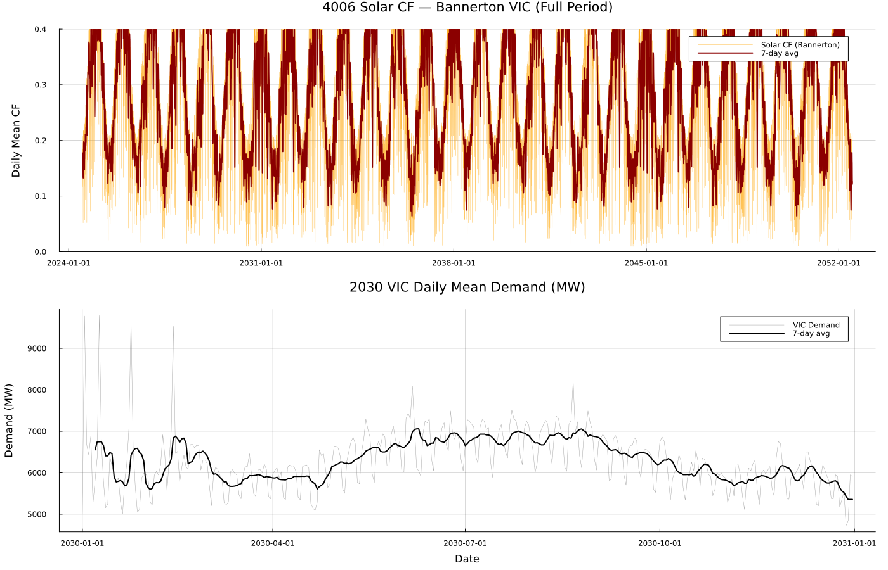
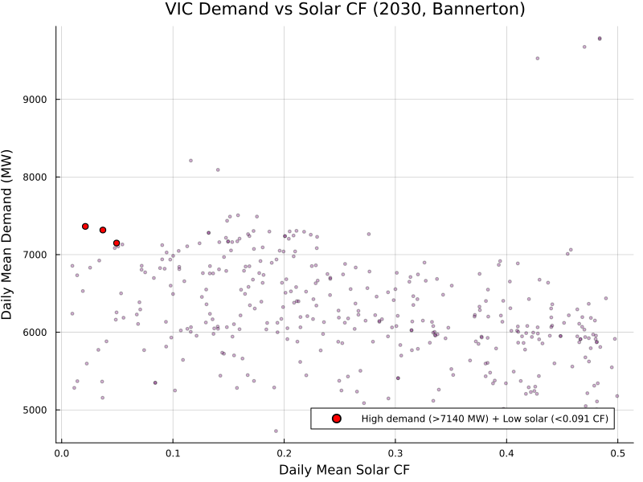
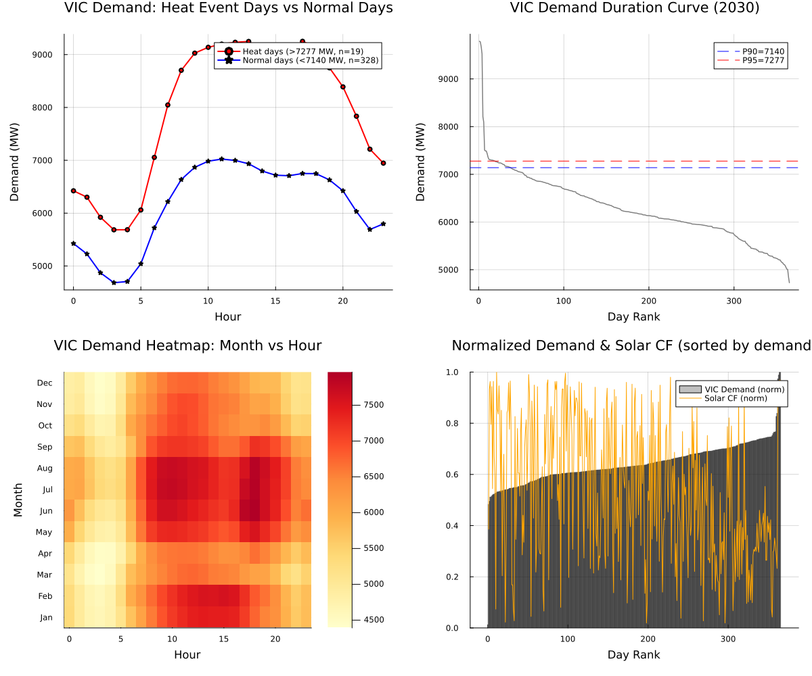

```@meta
EditURL = "../../../literate/analysis/demand_stress_low_solar.jl"
```

# Demand stress and low-solar coincidence

High demand can coincide with low renewable availability, but that relationship depends on aligned dates, explicit thresholds, and the event definition. This page loads the Victorian demand schedule and the Bannerton 4006 solar trace directly, then builds the demand distributions, demand-defined stress days, hourly demand profiles, and solar-availability-on-stress-days summaries live.

Here, `heat event` is an operational label for days at or above the 95th percentile of demand. It does not use air temperature, an excess-heat factor, or a meteorological heatwave definition.

```@raw html
<details class="source-code"><summary>Show source code</summary>
```

````julia
ENV["GKSwstype"] = "100"

using CSV
using DataFrames
using Dates
using Printf
using Statistics
using Plots

gr();

const REPO_ROOT = normpath(get(
    ENV,
    "PISP_DOCS_REPO_ROOT",
    joinpath(@__DIR__, "..", "..", ".."),
))

include(joinpath(REPO_ROOT, "eda", "eda_support.jl"))
using .EdaSupport

EdaSupport.snapshot_metadata_line(REPO_ROOT; context = "VIC demand schedule from the schedule-2030 generated PISP output; Bannerton 4006 solar reference trace from the 2024 ISP raw trace downloads")

const SCRIPT_STEM = "07_demand_heat_events"
const TRACES = joinpath("data", "2024", "pisp-downloads", "Traces")  # kept relative: this is the path form recorded in the tables below
const OUT = joinpath("data", "2024", "pisp-datasets", "out-ref4006-poe10", "csv")  # kept relative, same reason

abs_path(relative_path) = joinpath(REPO_ROOT, relative_path)  # resolves a TRACES/OUT-relative path to an absolute file location for reading

const HH_COLS_SOL = string.(1:48)

function daily_cf(df::DataFrame, half_hour_cols)
    return [mean(Float64(row[col]) for col in half_hour_cols) for row in eachrow(df)]
end

function load_solar_4006(loc)
    file = joinpath(TRACES, "solar_4006", "$(loc)_RefYear4006.csv")
    isfile(abs_path(file)) || return nothing
    df = CSV.read(abs_path(file), DataFrame)
    df.datetime = Date.(df.Year, df.Month, df.Day)
    return df
end

"""
    solar_cf_by_date(df)

Maps each exact calendar date in a composite RefYear4006 trace to its
half-hourly-mean solar capacity factor for that date.
"""
function solar_cf_by_date(df::DataFrame)
    cfs = daily_cf(df, HH_COLS_SOL)
    return Dict(zip(df.datetime, cfs))
end
````

```@raw html
</details>
```

````
Snapshot: PISP.jl commit fb28c62+dirty, generated 2026-07-17 — VIC demand schedule from the schedule-2030 generated PISP output; Bannerton 4006 solar reference trace from the 2024 ISP raw trace downloads

````

## Step 1 — demand trace inventory

The demand trace family stores one POE10 operational-schedule file per network node under a state/scenario directory; this step lists every such file as the input inventory.

```@raw html
<details class="source-code"><summary>Show source code</summary>
```

````julia
dem_dir = joinpath(TRACES, "demand_VIC_Step Change")
dem_files = sort(filter(name -> endswith(name, "_POE10_OPSO_MODELLING.csv"), readdir(abs_path(dem_dir))))
println("Found $(length(dem_files)) demand trace files")

demand_trace_inventory = DataFrame(file = dem_files)
write_table(demand_trace_inventory, SCRIPT_STEM, "demand_trace_inventory")
demand_trace_inventory
````

```@raw html
</details>
```

```@raw html
<div><div style = "float: left;"><span>13×1 DataFrame</span></div><div style = "clear: both;"></div></div><div class = "data-frame" style = "overflow-x: scroll;"><table class = "data-frame" style = "margin-bottom: 6px;"><thead><tr class = "columnLabelRow"><th class = "stubheadLabel" style = "font-weight: bold; text-align: right;">Row</th><th style = "text-align: left;">file</th></tr><tr class = "columnLabelRow"><th class = "stubheadLabel" style = "font-weight: bold; text-align: right;"></th><th title = "String" style = "text-align: left;">String</th></tr></thead><tbody><tr class = "dataRow"><td class = "rowLabel" style = "font-weight: bold; text-align: right;">1</td><td style = "text-align: left;">VIC_RefYear_2011_STEP_CHANGE_POE10_OPSO_MODELLING.csv</td></tr><tr class = "dataRow"><td class = "rowLabel" style = "font-weight: bold; text-align: right;">2</td><td style = "text-align: left;">VIC_RefYear_2012_STEP_CHANGE_POE10_OPSO_MODELLING.csv</td></tr><tr class = "dataRow"><td class = "rowLabel" style = "font-weight: bold; text-align: right;">3</td><td style = "text-align: left;">VIC_RefYear_2013_STEP_CHANGE_POE10_OPSO_MODELLING.csv</td></tr><tr class = "dataRow"><td class = "rowLabel" style = "font-weight: bold; text-align: right;">4</td><td style = "text-align: left;">VIC_RefYear_2014_STEP_CHANGE_POE10_OPSO_MODELLING.csv</td></tr><tr class = "dataRow"><td class = "rowLabel" style = "font-weight: bold; text-align: right;">5</td><td style = "text-align: left;">VIC_RefYear_2015_STEP_CHANGE_POE10_OPSO_MODELLING.csv</td></tr><tr class = "dataRow"><td class = "rowLabel" style = "font-weight: bold; text-align: right;">6</td><td style = "text-align: left;">VIC_RefYear_2016_STEP_CHANGE_POE10_OPSO_MODELLING.csv</td></tr><tr class = "dataRow"><td class = "rowLabel" style = "font-weight: bold; text-align: right;">7</td><td style = "text-align: left;">VIC_RefYear_2017_STEP_CHANGE_POE10_OPSO_MODELLING.csv</td></tr><tr class = "dataRow"><td class = "rowLabel" style = "font-weight: bold; text-align: right;">8</td><td style = "text-align: left;">VIC_RefYear_2018_STEP_CHANGE_POE10_OPSO_MODELLING.csv</td></tr><tr class = "dataRow"><td class = "rowLabel" style = "font-weight: bold; text-align: right;">9</td><td style = "text-align: left;">VIC_RefYear_2019_STEP_CHANGE_POE10_OPSO_MODELLING.csv</td></tr><tr class = "dataRow"><td class = "rowLabel" style = "font-weight: bold; text-align: right;">10</td><td style = "text-align: left;">VIC_RefYear_2020_STEP_CHANGE_POE10_OPSO_MODELLING.csv</td></tr><tr class = "dataRow"><td class = "rowLabel" style = "font-weight: bold; text-align: right;">11</td><td style = "text-align: left;">VIC_RefYear_2021_STEP_CHANGE_POE10_OPSO_MODELLING.csv</td></tr><tr class = "dataRow"><td class = "rowLabel" style = "font-weight: bold; text-align: right;">12</td><td style = "text-align: left;">VIC_RefYear_2022_STEP_CHANGE_POE10_OPSO_MODELLING.csv</td></tr><tr class = "dataRow"><td class = "rowLabel" style = "font-weight: bold; text-align: right;">13</td><td style = "text-align: left;">VIC_RefYear_2023_STEP_CHANGE_POE10_OPSO_MODELLING.csv</td></tr></tbody></table></div>
```

## Step 2 — load the demand schedule and aggregate daily demand by area

The PISP model output records each network node's half-hourly demand schedule and its bus, and each bus's NEM area; joining these mappings lets the schedule be aggregated to a daily mean demand per area. The full daily-by-area table (one row per area per calendar date) is written in full below for regression evidence; the page displays one summary row per area instead of every row.

```@raw html
<details class="source-code"><summary>Show source code</summary>
```

````julia
dem_load = CSV.read(abs_path(joinpath(OUT, "schedule-2030", "Demand_load_sched.csv")), DataFrame)
dem_df = CSV.read(abs_path(joinpath(OUT, "Demand.csv")), DataFrame)
bus_df = CSV.read(abs_path(joinpath(OUT, "Bus.csv")), DataFrame)

area_map = Dict(row.id_bus => row.id_area for row in eachrow(bus_df))
bus_of_dem = Dict(row.id_dem => row.id_bus for row in eachrow(dem_df))

dem_load.area = [area_map[bus_of_dem[d]] for d in dem_load.id_dem]
dem_load.date_only = Date.(dem_load.date)

dem_daily = combine(groupby(dem_load, [:date_only, :area]), :value => mean => :demand_mw)
rename!(dem_daily, :date_only => :date)
write_table(dem_daily, SCRIPT_STEM, "demand_by_area_daily")

area_demand_summary = combine(
    groupby(dem_daily, :area),
    :demand_mw => mean => :mean_demand_mw,
    :demand_mw => minimum => :min_demand_mw,
    :demand_mw => maximum => :max_demand_mw,
    nrow => :n_days,
)
sort!(area_demand_summary, :area)
area_demand_summary
````

```@raw html
</details>
```

```@raw html
<div><div style = "float: left;"><span>5×5 DataFrame</span></div><div style = "clear: both;"></div></div><div class = "data-frame" style = "overflow-x: scroll;"><table class = "data-frame" style = "margin-bottom: 6px;"><thead><tr class = "columnLabelRow"><th class = "stubheadLabel" style = "font-weight: bold; text-align: right;">Row</th><th style = "text-align: left;">area</th><th style = "text-align: left;">mean_demand_mw</th><th style = "text-align: left;">min_demand_mw</th><th style = "text-align: left;">max_demand_mw</th><th style = "text-align: left;">n_days</th></tr><tr class = "columnLabelRow"><th class = "stubheadLabel" style = "font-weight: bold; text-align: right;"></th><th title = "Int64" style = "text-align: left;">Int64</th><th title = "Float64" style = "text-align: left;">Float64</th><th title = "Float64" style = "text-align: left;">Float64</th><th title = "Float64" style = "text-align: left;">Float64</th><th title = "Int64" style = "text-align: left;">Int64</th></tr></thead><tbody><tr class = "dataRow"><td class = "rowLabel" style = "font-weight: bold; text-align: right;">1</td><td style = "text-align: right;">1</td><td style = "text-align: right;">1971.82</td><td style = "text-align: right;">1720.08</td><td style = "text-align: right;">2601.81</td><td style = "text-align: right;">365</td></tr><tr class = "dataRow"><td class = "rowLabel" style = "font-weight: bold; text-align: right;">2</td><td style = "text-align: right;">2</td><td style = "text-align: right;">2439.4</td><td style = "text-align: right;">2044.34</td><td style = "text-align: right;">3528.19</td><td style = "text-align: right;">365</td></tr><tr class = "dataRow"><td class = "rowLabel" style = "font-weight: bold; text-align: right;">3</td><td style = "text-align: right;">3</td><td style = "text-align: right;">6295.69</td><td style = "text-align: right;">4727.52</td><td style = "text-align: right;">9789.05</td><td style = "text-align: right;">365</td></tr><tr class = "dataRow"><td class = "rowLabel" style = "font-weight: bold; text-align: right;">4</td><td style = "text-align: right;">4</td><td style = "text-align: right;">1335.16</td><td style = "text-align: right;">1115.71</td><td style = "text-align: right;">1625.82</td><td style = "text-align: right;">365</td></tr><tr class = "dataRow"><td class = "rowLabel" style = "font-weight: bold; text-align: right;">5</td><td style = "text-align: right;">5</td><td style = "text-align: right;">1038.86</td><td style = "text-align: right;">822.857</td><td style = "text-align: right;">1659.72</td><td style = "text-align: right;">365</td></tr></tbody></table></div>
```

## Step 3 — load the solar 4006 reference traces for candidate VIC solar sites

`Bannerton_SAT` is the representative VIC solar site used throughout this analysis; `Darlington_Point_SAT` is also checked as a candidate even though only Bannerton is used downstream.

```@raw html
<details class="source-code"><summary>Show source code</summary>
```

````julia
locations = ["Bannerton_SAT", "Darlington_Point_SAT"]
sol_4006 = Dict{String, DataFrame}()
for loc in locations
    df = load_solar_4006(loc)
    df === nothing || (sol_4006[loc] = df)
end
println("Loaded $(length(sol_4006)) solar locations for 4006")
````

```@raw html
</details>
```

````
Loaded 2 solar locations for 4006

````

## Step 4 — aggregate Victorian daily demand from the raw schedule

Area `3` is the Victorian NEM region in this bus-to-area mapping; the half-hourly schedule for that area is averaged to one daily mean demand value per calendar date.

```@raw html
<details class="source-code"><summary>Show source code</summary>
```

````julia
vic_dem = dem_load[dem_load.area .== 3, :]
vic_daily = combine(groupby(vic_dem, :date_only), :value => mean => :demand)
sort!(vic_daily, :date_only)
````

```@raw html
</details>
```

## Step 5 — merge VIC demand with the Bannerton solar capacity factor by date

Only calendar dates present in both the VIC demand schedule and the Bannerton 4006 solar trace are kept, so the merged sample can be smaller than either input series. The full merged series is written in full below for regression evidence; the page displays a single summary row describing its coverage and range instead of every day.

```@raw html
<details class="source-code"><summary>Show source code</summary>
```

````julia
merged = DataFrame(date = Date[], demand = Float64[], solar_cf = Float64[])
if haskey(sol_4006, "Bannerton_SAT")
    cf_of_date = solar_cf_by_date(sol_4006["Bannerton_SAT"])
    for row in eachrow(vic_daily)
        haskey(cf_of_date, row.date_only) || continue
        push!(merged, (date = row.date_only, demand = row.demand, solar_cf = cf_of_date[row.date_only]))
    end
    write_table(merged, SCRIPT_STEM, "vic_demand_solar_merged")
end

merged_summary = DataFrame(
    matched_days = nrow(merged),
    date_min = isempty(merged.date) ? missing : minimum(merged.date),
    date_max = isempty(merged.date) ? missing : maximum(merged.date),
    demand_mean_mw = isempty(merged.demand) ? missing : mean(merged.demand),
    demand_min_mw = isempty(merged.demand) ? missing : minimum(merged.demand),
    demand_max_mw = isempty(merged.demand) ? missing : maximum(merged.demand),
    solar_cf_mean = isempty(merged.solar_cf) ? missing : mean(merged.solar_cf),
    solar_cf_min = isempty(merged.solar_cf) ? missing : minimum(merged.solar_cf),
    solar_cf_max = isempty(merged.solar_cf) ? missing : maximum(merged.solar_cf),
)
merged_summary
````

```@raw html
</details>
```

```@raw html
<div><div style = "float: left;"><span>1×9 DataFrame</span></div><div style = "clear: both;"></div></div><div class = "data-frame" style = "overflow-x: scroll;"><table class = "data-frame" style = "margin-bottom: 6px;"><thead><tr class = "columnLabelRow"><th class = "stubheadLabel" style = "font-weight: bold; text-align: right;">Row</th><th style = "text-align: left;">matched_days</th><th style = "text-align: left;">date_min</th><th style = "text-align: left;">date_max</th><th style = "text-align: left;">demand_mean_mw</th><th style = "text-align: left;">demand_min_mw</th><th style = "text-align: left;">demand_max_mw</th><th style = "text-align: left;">solar_cf_mean</th><th style = "text-align: left;">solar_cf_min</th><th style = "text-align: left;">solar_cf_max</th></tr><tr class = "columnLabelRow"><th class = "stubheadLabel" style = "font-weight: bold; text-align: right;"></th><th title = "Int64" style = "text-align: left;">Int64</th><th title = "Dates.Date" style = "text-align: left;">Date</th><th title = "Dates.Date" style = "text-align: left;">Date</th><th title = "Float64" style = "text-align: left;">Float64</th><th title = "Float64" style = "text-align: left;">Float64</th><th title = "Float64" style = "text-align: left;">Float64</th><th title = "Float64" style = "text-align: left;">Float64</th><th title = "Float64" style = "text-align: left;">Float64</th><th title = "Float64" style = "text-align: left;">Float64</th></tr></thead><tbody><tr class = "dataRow"><td class = "rowLabel" style = "font-weight: bold; text-align: right;">1</td><td style = "text-align: right;">365</td><td style = "text-align: left;">2030-01-01</td><td style = "text-align: left;">2030-12-31</td><td style = "text-align: right;">6295.69</td><td style = "text-align: right;">4727.52</td><td style = "text-align: right;">9789.05</td><td style = "text-align: right;">0.26346</td><td style = "text-align: right;">0.0095789</td><td style = "text-align: right;">0.499403</td></tr></tbody></table></div>
```

## Step 6 — high-demand and low-solar threshold screen

The screen flags days above the 90th demand percentile that also fall below the 10th solar-capacity-factor percentile, within the merged sample above.

```@raw html
<details class="source-code"><summary>Show source code</summary>
```

````julia
if haskey(sol_4006, "Bannerton_SAT")
    threshold_demand = quantile(merged.demand, 0.9)
    threshold_solar = quantile(merged.solar_cf, 0.1)
    bad_days = merged[(merged.demand .> threshold_demand) .& (merged.solar_cf .< threshold_solar), :]
    @printf("\nHigh-demand + Low-solar days: %d\n", nrow(bad_days))
    @printf("  Threshold: demand > %.0f MW, solar CF < %.3f\n", threshold_demand, threshold_solar)

    high_demand_low_solar_summary = DataFrame(
        demand_quantile = 0.9,
        solar_quantile = 0.1,
        threshold_demand_mw = threshold_demand,
        threshold_solar_cf = threshold_solar,
        bad_day_count = nrow(bad_days),
        total_day_count = nrow(merged),
    )
    write_table(high_demand_low_solar_summary, SCRIPT_STEM, "high_demand_low_solar_summary")
    high_demand_low_solar_summary
end
````

```@raw html
</details>
```

```@raw html
<div><div style = "float: left;"><span>1×6 DataFrame</span></div><div style = "clear: both;"></div></div><div class = "data-frame" style = "overflow-x: scroll;"><table class = "data-frame" style = "margin-bottom: 6px;"><thead><tr class = "columnLabelRow"><th class = "stubheadLabel" style = "font-weight: bold; text-align: right;">Row</th><th style = "text-align: left;">demand_quantile</th><th style = "text-align: left;">solar_quantile</th><th style = "text-align: left;">threshold_demand_mw</th><th style = "text-align: left;">threshold_solar_cf</th><th style = "text-align: left;">bad_day_count</th><th style = "text-align: left;">total_day_count</th></tr><tr class = "columnLabelRow"><th class = "stubheadLabel" style = "font-weight: bold; text-align: right;"></th><th title = "Float64" style = "text-align: left;">Float64</th><th title = "Float64" style = "text-align: left;">Float64</th><th title = "Float64" style = "text-align: left;">Float64</th><th title = "Float64" style = "text-align: left;">Float64</th><th title = "Int64" style = "text-align: left;">Int64</th><th title = "Int64" style = "text-align: left;">Int64</th></tr></thead><tbody><tr class = "dataRow"><td class = "rowLabel" style = "font-weight: bold; text-align: right;">1</td><td style = "text-align: right;">0.9</td><td style = "text-align: right;">0.1</td><td style = "text-align: right;">7139.93</td><td style = "text-align: right;">0.0912422</td><td style = "text-align: right;">3</td><td style = "text-align: right;">365</td></tr></tbody></table></div>
```

## Step 7 — heat-event and normal-day demand thresholds

`Heat event` days sit at or above the 95th demand percentile; `normal` days sit below the 90th percentile. Days between P90 and P95 are excluded from both groups.

```@raw html
<details class="source-code"><summary>Show source code</summary>
```

````julia
demand_p90 = quantile(vic_daily.demand, 0.9)
demand_p95 = quantile(vic_daily.demand, 0.95)

heat_days = vic_daily[vic_daily.demand .>= demand_p95, :date_only]
normal_days = Set(vic_daily[vic_daily.demand .< demand_p90, :date_only])
heat_days_set = Set(heat_days)

@printf("\nDemand thresholds: P90=%.0f MW, P95=%.0f MW\n", demand_p90, demand_p95)
println("Heat event days (>P95): ", length(heat_days))
println("Normal days (<P90): ", length(normal_days))
````

```@raw html
</details>
```

````

Demand thresholds: P90=7140 MW, P95=7277 MW
Heat event days (>P95): 19
Normal days (<P90): 328

````

## Step 8 — hourly demand profile for heat days vs normal days

Half-hourly demand observations on heat-event days and on normal days are each averaged by hour of day, to compare the shape of the demand profile between the two groups.

```@raw html
<details class="source-code"><summary>Show source code</summary>
```

````julia
heat_df = vic_dem[in.(vic_dem.date_only, Ref(heat_days_set)), :]
normal_df = vic_dem[in.(vic_dem.date_only, Ref(normal_days)), :]
heat_df = transform(heat_df, :date => ByRow(hour) => :hour)
normal_df = transform(normal_df, :date => ByRow(hour) => :hour)

heat_hourly = Dict(row.hour => row.value_mean for row in eachrow(combine(groupby(heat_df, :hour), :value => mean => :value_mean)))
normal_hourly = Dict(row.hour => row.value_mean for row in eachrow(combine(groupby(normal_df, :hour), :value => mean => :value_mean)))

heat_normal_hourly_profile = DataFrame(
    hour = 0:23,
    heat_mean_demand_mw = [get(heat_hourly, h, missing) for h in 0:23],
    normal_mean_demand_mw = [get(normal_hourly, h, missing) for h in 0:23],
)
write_table(heat_normal_hourly_profile, SCRIPT_STEM, "heat_normal_hourly_profile")
heat_normal_hourly_profile
````

```@raw html
</details>
```

```@raw html
<div><div style = "float: left;"><span>24×3 DataFrame</span></div><div style = "clear: both;"></div></div><div class = "data-frame" style = "overflow-x: scroll;"><table class = "data-frame" style = "margin-bottom: 6px;"><thead><tr class = "columnLabelRow"><th class = "stubheadLabel" style = "font-weight: bold; text-align: right;">Row</th><th style = "text-align: left;">hour</th><th style = "text-align: left;">heat_mean_demand_mw</th><th style = "text-align: left;">normal_mean_demand_mw</th></tr><tr class = "columnLabelRow"><th class = "stubheadLabel" style = "font-weight: bold; text-align: right;"></th><th title = "Int64" style = "text-align: left;">Int64</th><th title = "Float64" style = "text-align: left;">Float64</th><th title = "Float64" style = "text-align: left;">Float64</th></tr></thead><tbody><tr class = "dataRow"><td class = "rowLabel" style = "font-weight: bold; text-align: right;">1</td><td style = "text-align: right;">0</td><td style = "text-align: right;">6422.62</td><td style = "text-align: right;">5424.77</td></tr><tr class = "dataRow"><td class = "rowLabel" style = "font-weight: bold; text-align: right;">2</td><td style = "text-align: right;">1</td><td style = "text-align: right;">6301.45</td><td style = "text-align: right;">5226.55</td></tr><tr class = "dataRow"><td class = "rowLabel" style = "font-weight: bold; text-align: right;">3</td><td style = "text-align: right;">2</td><td style = "text-align: right;">5921.9</td><td style = "text-align: right;">4870.9</td></tr><tr class = "dataRow"><td class = "rowLabel" style = "font-weight: bold; text-align: right;">4</td><td style = "text-align: right;">3</td><td style = "text-align: right;">5684.41</td><td style = "text-align: right;">4683.32</td></tr><tr class = "dataRow"><td class = "rowLabel" style = "font-weight: bold; text-align: right;">5</td><td style = "text-align: right;">4</td><td style = "text-align: right;">5686.27</td><td style = "text-align: right;">4705.25</td></tr><tr class = "dataRow"><td class = "rowLabel" style = "font-weight: bold; text-align: right;">6</td><td style = "text-align: right;">5</td><td style = "text-align: right;">6059.81</td><td style = "text-align: right;">5041.43</td></tr><tr class = "dataRow"><td class = "rowLabel" style = "font-weight: bold; text-align: right;">7</td><td style = "text-align: right;">6</td><td style = "text-align: right;">7054.82</td><td style = "text-align: right;">5721.08</td></tr><tr class = "dataRow"><td class = "rowLabel" style = "font-weight: bold; text-align: right;">8</td><td style = "text-align: right;">7</td><td style = "text-align: right;">8047.01</td><td style = "text-align: right;">6217.16</td></tr><tr class = "dataRow"><td class = "rowLabel" style = "font-weight: bold; text-align: right;">9</td><td style = "text-align: right;">8</td><td style = "text-align: right;">8703.03</td><td style = "text-align: right;">6635.65</td></tr><tr class = "dataRow"><td class = "rowLabel" style = "font-weight: bold; text-align: right;">10</td><td style = "text-align: right;">9</td><td style = "text-align: right;">9027.88</td><td style = "text-align: right;">6867.61</td></tr><tr class = "dataRow"><td class = "rowLabel" style = "font-weight: bold; text-align: right;">11</td><td style = "text-align: right;">10</td><td style = "text-align: right;">9138.19</td><td style = "text-align: right;">6982.72</td></tr><tr class = "dataRow"><td class = "rowLabel" style = "font-weight: bold; text-align: right;">12</td><td style = "text-align: right;">11</td><td style = "text-align: right;">9198.58</td><td style = "text-align: right;">7023.56</td></tr><tr class = "dataRow"><td class = "rowLabel" style = "font-weight: bold; text-align: right;">13</td><td style = "text-align: right;">12</td><td style = "text-align: right;">9233.39</td><td style = "text-align: right;">6997.17</td></tr><tr class = "dataRow"><td class = "rowLabel" style = "font-weight: bold; text-align: right;">14</td><td style = "text-align: right;">13</td><td style = "text-align: right;">9248.78</td><td style = "text-align: right;">6933.84</td></tr><tr class = "dataRow"><td class = "rowLabel" style = "font-weight: bold; text-align: right;">15</td><td style = "text-align: right;">14</td><td style = "text-align: right;">9094.69</td><td style = "text-align: right;">6796.92</td></tr><tr class = "dataRow"><td class = "rowLabel" style = "font-weight: bold; text-align: right;">16</td><td style = "text-align: right;">15</td><td style = "text-align: right;">8991.5</td><td style = "text-align: right;">6717.16</td></tr><tr class = "dataRow"><td class = "rowLabel" style = "font-weight: bold; text-align: right;">17</td><td style = "text-align: right;">16</td><td style = "text-align: right;">9076.8</td><td style = "text-align: right;">6708.16</td></tr><tr class = "dataRow"><td class = "rowLabel" style = "font-weight: bold; text-align: right;">18</td><td style = "text-align: right;">17</td><td style = "text-align: right;">9251.63</td><td style = "text-align: right;">6750.31</td></tr><tr class = "dataRow"><td class = "rowLabel" style = "font-weight: bold; text-align: right;">19</td><td style = "text-align: right;">18</td><td style = "text-align: right;">9136.51</td><td style = "text-align: right;">6747.13</td></tr><tr class = "dataRow"><td class = "rowLabel" style = "font-weight: bold; text-align: right;">20</td><td style = "text-align: right;">19</td><td style = "text-align: right;">8749.59</td><td style = "text-align: right;">6628.25</td></tr><tr class = "dataRow"><td class = "rowLabel" style = "font-weight: bold; text-align: right;">21</td><td style = "text-align: right;">20</td><td style = "text-align: right;">8389.32</td><td style = "text-align: right;">6422.13</td></tr><tr class = "dataRow"><td class = "rowLabel" style = "font-weight: bold; text-align: right;">22</td><td style = "text-align: right;">21</td><td style = "text-align: right;">7834.15</td><td style = "text-align: right;">6030.69</td></tr><tr class = "dataRow"><td class = "rowLabel" style = "font-weight: bold; text-align: right;">23</td><td style = "text-align: right;">22</td><td style = "text-align: right;">7209.96</td><td style = "text-align: right;">5690.17</td></tr><tr class = "dataRow"><td class = "rowLabel" style = "font-weight: bold; text-align: right;">24</td><td style = "text-align: right;">23</td><td style = "text-align: right;">6945.96</td><td style = "text-align: right;">5797.04</td></tr></tbody></table></div>
```

## Step 9 — demand duration curve

Sorting daily VIC demand from highest to lowest gives the demand duration curve, independent of chronology. The full 365-day curve is written in full below for regression evidence and shown as a figure in Step 16; the page displays the curve's value at a handful of quantile marks instead.

```@raw html
<details class="source-code"><summary>Show source code</summary>
```

````julia
sorted_demand = sort(vic_daily.demand; rev = true)
demand_duration_curve = DataFrame(day_rank = 1:length(sorted_demand), demand_mw = sorted_demand)
write_table(demand_duration_curve, SCRIPT_STEM, "demand_duration_curve")

duration_curve_quantile_marks = DataFrame(
    quantile_label = ["max", "p95", "p90", "p75", "median", "p25", "min"],
    demand_mw = [
        maximum(vic_daily.demand),
        demand_p95,
        demand_p90,
        quantile(vic_daily.demand, 0.75),
        quantile(vic_daily.demand, 0.5),
        quantile(vic_daily.demand, 0.25),
        minimum(vic_daily.demand),
    ],
)
duration_curve_quantile_marks
````

```@raw html
</details>
```

```@raw html
<div><div style = "float: left;"><span>7×2 DataFrame</span></div><div style = "clear: both;"></div></div><div class = "data-frame" style = "overflow-x: scroll;"><table class = "data-frame" style = "margin-bottom: 6px;"><thead><tr class = "columnLabelRow"><th class = "stubheadLabel" style = "font-weight: bold; text-align: right;">Row</th><th style = "text-align: left;">quantile_label</th><th style = "text-align: left;">demand_mw</th></tr><tr class = "columnLabelRow"><th class = "stubheadLabel" style = "font-weight: bold; text-align: right;"></th><th title = "String" style = "text-align: left;">String</th><th title = "Float64" style = "text-align: left;">Float64</th></tr></thead><tbody><tr class = "dataRow"><td class = "rowLabel" style = "font-weight: bold; text-align: right;">1</td><td style = "text-align: left;">max</td><td style = "text-align: right;">9789.05</td></tr><tr class = "dataRow"><td class = "rowLabel" style = "font-weight: bold; text-align: right;">2</td><td style = "text-align: left;">p95</td><td style = "text-align: right;">7277.23</td></tr><tr class = "dataRow"><td class = "rowLabel" style = "font-weight: bold; text-align: right;">3</td><td style = "text-align: left;">p90</td><td style = "text-align: right;">7139.93</td></tr><tr class = "dataRow"><td class = "rowLabel" style = "font-weight: bold; text-align: right;">4</td><td style = "text-align: left;">p75</td><td style = "text-align: right;">6752.21</td></tr><tr class = "dataRow"><td class = "rowLabel" style = "font-weight: bold; text-align: right;">5</td><td style = "text-align: left;">median</td><td style = "text-align: right;">6191.03</td></tr><tr class = "dataRow"><td class = "rowLabel" style = "font-weight: bold; text-align: right;">6</td><td style = "text-align: left;">p25</td><td style = "text-align: right;">5908.9</td></tr><tr class = "dataRow"><td class = "rowLabel" style = "font-weight: bold; text-align: right;">7</td><td style = "text-align: left;">min</td><td style = "text-align: right;">4727.52</td></tr></tbody></table></div>
```

## Step 10 — normalized VRE vs demand summary, sorted by demand

Demand and Bannerton solar capacity factor from the merged sample are each normalized by their own maximum and ranked by ascending demand, so their relative shapes can be compared on the same 0-to-1 scale. The full 365-day normalized series is written in full below for regression evidence and shown as a figure in Step 16; the page instead reports how closely the two normalized series track each other.

```@raw html
<details class="source-code"><summary>Show source code</summary>
```

````julia
if nrow(merged) > 0
    merged_sorted = sort(merged, :demand)
    normalized_vre_demand_summary = DataFrame(
        day_rank = 1:nrow(merged_sorted),
        demand_norm = merged_sorted.demand ./ maximum(merged_sorted.demand),
        solar_norm = merged_sorted.solar_cf ./ maximum(merged_sorted.solar_cf),
    )
    write_table(normalized_vre_demand_summary, SCRIPT_STEM, "normalized_vre_demand_summary")

    normalized_demand_solar_correlation = DataFrame(
        day_count = nrow(normalized_vre_demand_summary),
        demand_solar_correlation = cor(normalized_vre_demand_summary.demand_norm, normalized_vre_demand_summary.solar_norm),
    )
    normalized_demand_solar_correlation
end
````

```@raw html
</details>
```

```@raw html
<div><div style = "float: left;"><span>1×2 DataFrame</span></div><div style = "clear: both;"></div></div><div class = "data-frame" style = "overflow-x: scroll;"><table class = "data-frame" style = "margin-bottom: 6px;"><thead><tr class = "columnLabelRow"><th class = "stubheadLabel" style = "font-weight: bold; text-align: right;">Row</th><th style = "text-align: left;">day_count</th><th style = "text-align: left;">demand_solar_correlation</th></tr><tr class = "columnLabelRow"><th class = "stubheadLabel" style = "font-weight: bold; text-align: right;"></th><th title = "Int64" style = "text-align: left;">Int64</th><th title = "Float64" style = "text-align: left;">Float64</th></tr></thead><tbody><tr class = "dataRow"><td class = "rowLabel" style = "font-weight: bold; text-align: right;">1</td><td style = "text-align: right;">365</td><td style = "text-align: right;">-0.257949</td></tr></tbody></table></div>
```

## Step 11 — key summary statistics

A short console summary reports the total day count, the heat-event share, the peak demand day, and the mean demand across the full period.

```@raw html
<details class="source-code"><summary>Show source code</summary>
```

````julia
total_days = nrow(vic_daily)
peak_row = vic_daily[argmax(vic_daily.demand), :]
println("\n=== DEMAND HEAT EVENT ANALYSIS ===")
println("Total days: ", total_days)
@printf("Heat event days (>P95): %d (%.1f%%)\n", length(heat_days), 100 * length(heat_days) / total_days)
@printf("Peak demand: %.0f MW on %s\n", peak_row.demand, peak_row.date_only)
@printf("Mean demand: %.0f MW\n", mean(vic_daily.demand))
````

```@raw html
</details>
```

````

=== DEMAND HEAT EVENT ANALYSIS ===
Total days: 365
Heat event days (>P95): 19 (5.2%)
Peak demand: 9789 MW on 2030-01-09
Mean demand: 6296 MW

````

## Step 12 — solar CF on the hottest demand days

For the top 10 heat-event days (by demand), this looks up the matching Bannerton solar capacity factor, where a matching date exists in the trace.

```@raw html
<details class="source-code"><summary>Show source code</summary>
```

````julia
if haskey(sol_4006, "Bannerton_SAT")
    cf_of_date = solar_cf_by_date(sol_4006["Bannerton_SAT"])
    top10_days = heat_days[1:min(10, length(heat_days))]
    hot_day_cfs = Float64[]
    for hd in top10_days
        haskey(cf_of_date, hd) || continue
        push!(hot_day_cfs, cf_of_date[hd])
    end
    mean_cf = mean(hot_day_cfs)
    @printf("\nSolar CF on top 10 heat event days: mean=%.4f\n", mean_cf)
    println("  Individual CFs: ", [@sprintf("%.4f", c) for c in hot_day_cfs])

    hot_day_solar_cf_detail = DataFrame(
        rank = 1:length(hot_day_cfs),
        date = top10_days[1:length(hot_day_cfs)],
        solar_cf = hot_day_cfs,
        mean_solar_cf_top10 = fill(mean_cf, length(hot_day_cfs)),
    )
    write_table(hot_day_solar_cf_detail, SCRIPT_STEM, "hot_day_solar_cf_detail")
    hot_day_solar_cf_detail
end
````

```@raw html
</details>
```

```@raw html
<div><div style = "float: left;"><span>10×4 DataFrame</span></div><div style = "clear: both;"></div></div><div class = "data-frame" style = "overflow-x: scroll;"><table class = "data-frame" style = "margin-bottom: 6px;"><thead><tr class = "columnLabelRow"><th class = "stubheadLabel" style = "font-weight: bold; text-align: right;">Row</th><th style = "text-align: left;">rank</th><th style = "text-align: left;">date</th><th style = "text-align: left;">solar_cf</th><th style = "text-align: left;">mean_solar_cf_top10</th></tr><tr class = "columnLabelRow"><th class = "stubheadLabel" style = "font-weight: bold; text-align: right;"></th><th title = "Int64" style = "text-align: left;">Int64</th><th title = "Dates.Date" style = "text-align: left;">Date</th><th title = "Float64" style = "text-align: left;">Float64</th><th title = "Float64" style = "text-align: left;">Float64</th></tr></thead><tbody><tr class = "dataRow"><td class = "rowLabel" style = "font-weight: bold; text-align: right;">1</td><td style = "text-align: right;">1</td><td style = "text-align: left;">2030-01-02</td><td style = "text-align: right;">0.483717</td><td style = "text-align: right;">0.294279</td></tr><tr class = "dataRow"><td class = "rowLabel" style = "font-weight: bold; text-align: right;">2</td><td style = "text-align: right;">2</td><td style = "text-align: left;">2030-01-09</td><td style = "text-align: right;">0.483717</td><td style = "text-align: right;">0.294279</td></tr><tr class = "dataRow"><td class = "rowLabel" style = "font-weight: bold; text-align: right;">3</td><td style = "text-align: right;">3</td><td style = "text-align: left;">2030-01-24</td><td style = "text-align: right;">0.47003</td><td style = "text-align: right;">0.294279</td></tr><tr class = "dataRow"><td class = "rowLabel" style = "font-weight: bold; text-align: right;">4</td><td style = "text-align: right;">4</td><td style = "text-align: left;">2030-02-13</td><td style = "text-align: right;">0.42786</td><td style = "text-align: right;">0.294279</td></tr><tr class = "dataRow"><td class = "rowLabel" style = "font-weight: bold; text-align: right;">5</td><td style = "text-align: right;">5</td><td style = "text-align: left;">2030-05-15</td><td style = "text-align: right;">0.217938</td><td style = "text-align: right;">0.294279</td></tr><tr class = "dataRow"><td class = "rowLabel" style = "font-weight: bold; text-align: right;">6</td><td style = "text-align: right;">6</td><td style = "text-align: left;">2030-06-03</td><td style = "text-align: right;">0.211081</td><td style = "text-align: right;">0.294279</td></tr><tr class = "dataRow"><td class = "rowLabel" style = "font-weight: bold; text-align: right;">7</td><td style = "text-align: right;">7</td><td style = "text-align: left;">2030-06-04</td><td style = "text-align: right;">0.148711</td><td style = "text-align: right;">0.294279</td></tr><tr class = "dataRow"><td class = "rowLabel" style = "font-weight: bold; text-align: right;">8</td><td style = "text-align: right;">8</td><td style = "text-align: left;">2030-06-05</td><td style = "text-align: right;">0.186725</td><td style = "text-align: right;">0.294279</td></tr><tr class = "dataRow"><td class = "rowLabel" style = "font-weight: bold; text-align: right;">9</td><td style = "text-align: right;">9</td><td style = "text-align: left;">2030-06-06</td><td style = "text-align: right;">0.140501</td><td style = "text-align: right;">0.294279</td></tr><tr class = "dataRow"><td class = "rowLabel" style = "font-weight: bold; text-align: right;">10</td><td style = "text-align: right;">10</td><td style = "text-align: left;">2030-06-14</td><td style = "text-align: right;">0.172506</td><td style = "text-align: right;">0.294279</td></tr></tbody></table></div>
```

## Step 13 — demand heat event summary

This collects the thresholds, counts, and peak/mean statistics computed above into a single summary row.

```@raw html
<details class="source-code"><summary>Show source code</summary>
```

````julia
demand_heat_event_summary = DataFrame(
    total_days = total_days,
    demand_p90_mw = demand_p90,
    demand_p95_mw = demand_p95,
    heat_day_count = length(heat_days),
    normal_day_count = length(normal_days),
    heat_event_pct = 100 * length(heat_days) / total_days,
    peak_demand_mw = peak_row.demand,
    peak_date = peak_row.date_only,
    mean_demand_mw = mean(vic_daily.demand),
)
write_table(demand_heat_event_summary, SCRIPT_STEM, "demand_heat_event_summary")
demand_heat_event_summary
````

```@raw html
</details>
```

```@raw html
<div><div style = "float: left;"><span>1×9 DataFrame</span></div><div style = "clear: both;"></div></div><div class = "data-frame" style = "overflow-x: scroll;"><table class = "data-frame" style = "margin-bottom: 6px;"><thead><tr class = "columnLabelRow"><th class = "stubheadLabel" style = "font-weight: bold; text-align: right;">Row</th><th style = "text-align: left;">total_days</th><th style = "text-align: left;">demand_p90_mw</th><th style = "text-align: left;">demand_p95_mw</th><th style = "text-align: left;">heat_day_count</th><th style = "text-align: left;">normal_day_count</th><th style = "text-align: left;">heat_event_pct</th><th style = "text-align: left;">peak_demand_mw</th><th style = "text-align: left;">peak_date</th><th style = "text-align: left;">mean_demand_mw</th></tr><tr class = "columnLabelRow"><th class = "stubheadLabel" style = "font-weight: bold; text-align: right;"></th><th title = "Int64" style = "text-align: left;">Int64</th><th title = "Float64" style = "text-align: left;">Float64</th><th title = "Float64" style = "text-align: left;">Float64</th><th title = "Int64" style = "text-align: left;">Int64</th><th title = "Int64" style = "text-align: left;">Int64</th><th title = "Float64" style = "text-align: left;">Float64</th><th title = "Float64" style = "text-align: left;">Float64</th><th title = "Dates.Date" style = "text-align: left;">Date</th><th title = "Float64" style = "text-align: left;">Float64</th></tr></thead><tbody><tr class = "dataRow"><td class = "rowLabel" style = "font-weight: bold; text-align: right;">1</td><td style = "text-align: right;">365</td><td style = "text-align: right;">7139.93</td><td style = "text-align: right;">7277.23</td><td style = "text-align: right;">19</td><td style = "text-align: right;">328</td><td style = "text-align: right;">5.20548</td><td style = "text-align: right;">9789.05</td><td style = "text-align: left;">2030-01-09</td><td style = "text-align: right;">6295.69</td></tr></tbody></table></div>
```

## Step 14 — figure: VIC demand and solar CF time series

The top panel shows the Bannerton solar capacity factor over the full period with a 7-day rolling average; the bottom panel shows VIC daily mean demand with its own 7-day rolling average.

```@raw html
<details class="source-code"><summary>Show source code</summary>
```

````julia
p1 = plot(layout=(2,1), size=(1400, 900), left_margin=6Plots.mm, right_margin=3Plots.mm, top_margin=5Plots.mm, bottom_margin=4Plots.mm)

if haskey(sol_4006, "Bannerton_SAT")
    sol_vic = sol_4006["Bannerton_SAT"]
    sol_vic_daily = daily_cf(sol_vic, HH_COLS_SOL)
    sol_vic_dates = sol_vic.datetime
    sol_rolling = [i < 7 ? NaN : mean(sol_vic_daily[max(1,i-6):i]) for i in 1:length(sol_vic_daily)]

    plot!(p1[1], sol_vic_dates, sol_vic_daily, color=:orange, linewidth=0.5, alpha=0.7, label="Solar CF (Bannerton)")
    plot!(p1[1], sol_vic_dates, sol_rolling, color=:darkred, linewidth=2, label="7-day avg")
    plot!(p1[1], title="4006 Solar CF — Bannerton VIC (Full Period)", ylabel="Daily Mean CF",
          ylim=(0, 0.4), legend=:topright, grid=true, gridalpha=0.3)
end

vic_dem_dates = vic_daily.date_only
vic_dem_values = vic_daily.demand
vic_rolling = [i < 7 ? NaN : mean(vic_dem_values[max(1,i-6):i]) for i in 1:length(vic_dem_values)]

plot!(p1[2], vic_dem_dates, vic_dem_values, color=:grey, linewidth=0.5, alpha=0.7, label="VIC Demand")
plot!(p1[2], vic_dem_dates, vic_rolling, color=:black, linewidth=2, label="7-day avg")
plot!(p1[2], title="2030 VIC Daily Mean Demand (MW)", xlabel="Date", ylabel="Demand (MW)",
      legend=:topright, grid=true, gridalpha=0.3)

savefig(p1, figure_path(SCRIPT_STEM, "07_vic_demand_solar_4006.png"))
println("Saved: 07_vic_demand_solar_4006.png")
EdaSupport.embed_figure(figure_path(SCRIPT_STEM, "07_vic_demand_solar_4006.png"), "07_vic_demand_solar_4006.png")
````

```@raw html
</details>
```

````
Saved: 07_vic_demand_solar_4006.png

````



## Step 15 — figure: demand vs solar CF scatter

Each point is one calendar day's demand against its Bannerton solar capacity factor; the high-demand, low-solar days identified in Step 6 are highlighted in red.

```@raw html
<details class="source-code"><summary>Show source code</summary>
```

````julia
p2 = plot(size=(800, 600), title="VIC Demand vs Solar CF (2030, Bannerton)",
         xlabel="Daily Mean Solar CF", ylabel="Daily Mean Demand (MW)",
         legend=:bottomright, grid=true, gridalpha=0.3)

if nrow(merged) > 0
    scatter!(p2, merged.solar_cf, merged.demand, markersize=2, alpha=0.3, color=:purple, label="")

    threshold_demand = quantile(merged.demand, 0.9)
    threshold_solar = quantile(merged.solar_cf, 0.1)
    bad_days = merged[(merged.demand .> threshold_demand) .& (merged.solar_cf .< threshold_solar), :]

    scatter!(p2, bad_days.solar_cf, bad_days.demand, markersize=4, color=:red,
            label="High demand (>$(round(Int, threshold_demand)) MW) + Low solar (<$(round(threshold_solar, digits=3)) CF)")
end

savefig(p2, figure_path(SCRIPT_STEM, "07_demand_vs_solar_scatter.png"))
println("Saved: 07_demand_vs_solar_scatter.png")
EdaSupport.embed_figure(figure_path(SCRIPT_STEM, "07_demand_vs_solar_scatter.png"), "07_demand_vs_solar_scatter.png")
````

```@raw html
</details>
```

````
Saved: 07_demand_vs_solar_scatter.png

````



## Step 16 — figure: demand heat events overview

A 2x2 panel combines the hourly heat-vs-normal profile, the demand duration curve with P90/P95 reference lines, a month-by-hour demand heatmap, and the normalized demand/solar comparison from Step 10.

```@raw html
<details class="source-code"><summary>Show source code</summary>
```

````julia
month_labels = ["Jan", "Feb", "Mar", "Apr", "May", "Jun", "Jul", "Aug", "Sep", "Oct", "Nov", "Dec"]
p3 = plot(layout=(2,2), size=(1200, 1000), left_margin=6Plots.mm, right_margin=3Plots.mm, top_margin=5Plots.mm, bottom_margin=5Plots.mm)

hours = 0:23
heat_vals = [get(heat_hourly, h, NaN) for h in hours]
normal_vals = [get(normal_hourly, h, NaN) for h in hours]

plot!(p3[1], hours, heat_vals, color=:red, linewidth=2, marker=:o, markersize=3,
      label="Heat days (>$(round(Int, demand_p95)) MW, n=$(length(heat_days)))")
plot!(p3[1], hours, normal_vals, color=:blue, linewidth=2, marker=:s, markersize=3,
      label="Normal days (<$(round(Int, demand_p90)) MW, n=$(length(normal_days)))")
plot!(p3[1], title="VIC Demand: Heat Event Days vs Normal Days", xlabel="Hour", ylabel="Demand (MW)",
      legend=:topright, grid=true, gridalpha=0.3)

sorted_demand = sort(vic_daily.demand; rev=true)
plot!(p3[2], sorted_demand, color=:grey, linewidth=1.5, label="", legend=false)
hline!(p3[2], [demand_p90], color=:blue, linestyle=:dash, label="P90=$(round(Int, demand_p90))")
hline!(p3[2], [demand_p95], color=:red, linestyle=:dash, label="P95=$(round(Int, demand_p95))")
plot!(p3[2], title="VIC Demand Duration Curve (2030)", xlabel="Day Rank", ylabel="Demand (MW)",
      legend=:topright, grid=true, gridalpha=0.3)

dem_load_heat = deepcopy(vic_dem)
dem_load_heat = transform(dem_load_heat, :date => ByRow(x -> month(x)) => :month_int)
dem_load_heat = transform(dem_load_heat, :date => ByRow(x -> hour(x)) => :hour)
heatmap_data = zeros(12, 24)
counts = zeros(12, 24)
for row in eachrow(dem_load_heat)
    m = row.month_int
    h = row.hour + 1
    if 1 <= m <= 12 && 1 <= h <= 24
        heatmap_data[m, h] += row.value
        counts[m, h] += 1
    end
end
heatmap_data = heatmap_data ./ max.(counts, 1)

heatmap!(p3[3], 0:23, 1:12, heatmap_data, c=:YlOrRd, title="VIC Demand Heatmap: Month vs Hour",
        xlabel="Hour", ylabel="Month", yticks=(1:12, month_labels), legend=false)

if nrow(merged) > 0
    merged_sorted = sort(merged, :demand)
    day_ranks = 1:nrow(merged_sorted)
    demand_norm = merged_sorted.demand ./ maximum(merged_sorted.demand)
    solar_norm = merged_sorted.solar_cf ./ maximum(merged_sorted.solar_cf)

    bar!(p3[4], day_ranks, demand_norm, alpha=0.5, color=:grey, label="VIC Demand (norm)", legend=:topright)
    plot!(p3[4], day_ranks, solar_norm, color=:orange, linewidth=1, label="Solar CF (norm)")
    plot!(p3[4], title="Normalized Demand & Solar CF (sorted by demand)", xlabel="Day Rank",
          grid=true, gridalpha=0.3)
end

savefig(p3, figure_path(SCRIPT_STEM, "07_demand_heat_events.png"))
println("Saved: 07_demand_heat_events.png")
EdaSupport.embed_figure(figure_path(SCRIPT_STEM, "07_demand_heat_events.png"), "07_demand_heat_events.png")
````

```@raw html
</details>
```

````
Saved: 07_demand_heat_events.png

````



```@raw html
<details class="source-code"><summary>Show source code</summary>
```

````julia
println("\nDone.")
````

```@raw html
</details>
```

````

Done.

````

## Summary

- VIC daily demand and the Bannerton 4006 solar capacity factor are merged by date, then used to define demand-defined heat-event days (>=P95) and normal days (<P90) and to screen for high-demand, low-solar coincidence days.
- Three figures are built live on this page: the demand/solar time series, the demand-vs-solar scatter, and the combined heat-event overview panel.

