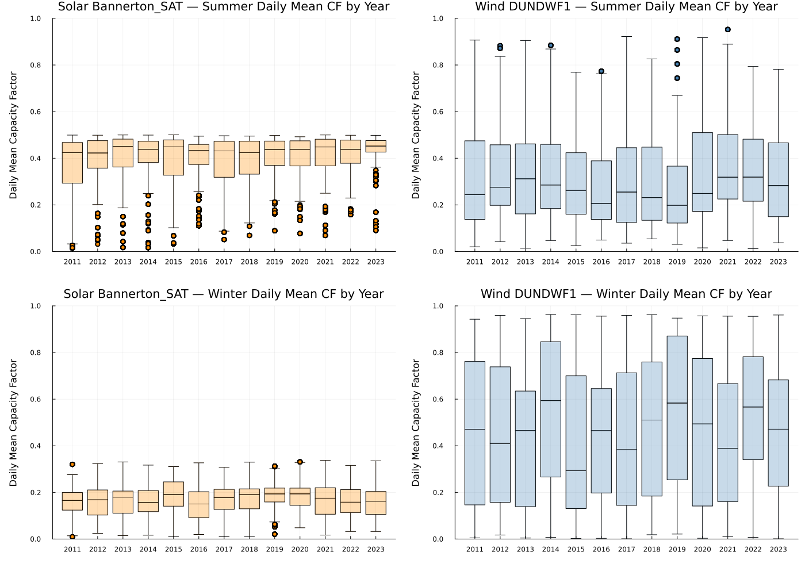
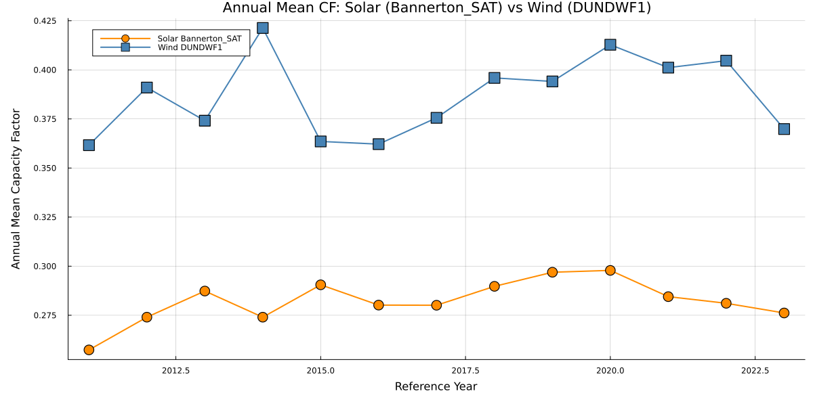
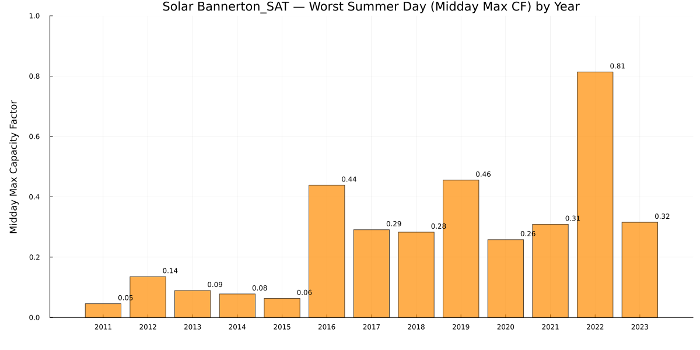
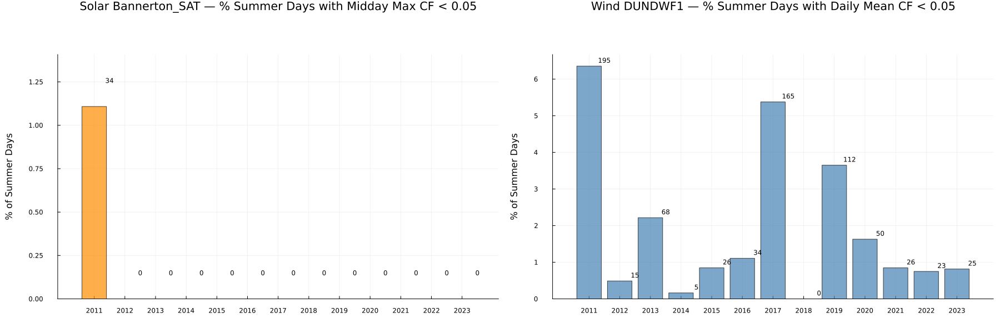

```@meta
EditURL = "../../../literate/eda/03_year_comparison.jl"
```

# Comparing historical solar and wind reference years

A single reference year can conceal substantial interannual variation in renewable availability. This page loads the full historical solar and wind trace archive directly, computes annual and seasonal capacity factors, low-output-day frequencies, and the most adverse summer solar day across the available historical years, and builds the comparison figures.

The comparison is location-specific: solar uses `Bannerton_SAT` and wind uses `DUNDWF1`. Results should not be generalised to all Victorian renewable resources without additional spatial analysis.

```@raw html
<details class="source-code"><summary>Show source code</summary>
```

````julia
ENV["GKSwstype"] = "100"

using CSV
using DataFrames
using Dates
using Statistics
using Plots
using StatsPlots

gr();

const REPO_ROOT = normpath(get(
    ENV,
    "PISP_DOCS_REPO_ROOT",
    joinpath(@__DIR__, "..", "..", ".."),
))

include(joinpath(REPO_ROOT, "eda", "eda_support.jl"))
using .EdaSupport

EdaSupport.snapshot_metadata_line(REPO_ROOT; context = "2024 ISP raw trace downloads, historical years 2011-2023")

const SCRIPT_STEM = "03_year_comparison"
const TRACES = joinpath("data", "2024", "pisp-downloads", "Traces")  # kept relative: this is the path form recorded in the output tables
const YEARS = 2011:2023
const HH_COLS_SOL = string.(1:48)
const HH_COLS_WIND = [lpad(i, 2, '0') for i in 1:48]
const MIDDAY_COLS = string.(24:35)  # hours 12-18
const SOLAR_LOC = "Bannerton_SAT"  # VIC solar
const WIND_LOC = "DUNDWF1"         # VIC wind
abs_path(relative_path) = joinpath(REPO_ROOT, relative_path)  # resolves a TRACES-relative path to an absolute file location for reading

function add_datetime!(df::DataFrame)
    df.datetime = Date.(df.Year, df.Month, df.Day)
    return df
end

function load_location_all_years(tech, location, years)
    dfs = Dict{Int, DataFrame}()
    for yr in years
        file = joinpath(TRACES, "$(tech)_$(yr)", "$(location)_RefYear$(yr).csv")
        if isfile(abs_path(file))
            df = CSV.read(abs_path(file), DataFrame)
            add_datetime!(df)
            dfs[yr] = df
        end
    end
    return dfs
end

row_mean(df::DataFrame, cols) = [mean(row[col] for col in cols) for row in eachrow(df)]
row_max(df::DataFrame, cols) = [maximum(row[col] for col in cols) for row in eachrow(df)]
````

```@raw html
</details>
```

````
Snapshot: PISP.jl commit 0d31fb4+dirty, generated 2026-07-16 — 2024 ISP raw trace downloads, historical years 2011-2023

````

## Step 1 — load solar and wind traces across all historical reference years

`Bannerton_SAT` (solar) and `DUNDWF1` (wind) are loaded for every historical reference year in `YEARS` that has a local trace file available.

```@raw html
<details class="source-code"><summary>Show source code</summary>
```

````julia
sol_years = load_location_all_years("solar", SOLAR_LOC, YEARS)
wind_years = load_location_all_years("wind", WIND_LOC, YEARS)

println("Loaded solar $(SOLAR_LOC): $(length(sol_years)) years")
println("Loaded wind $(WIND_LOC): $(length(wind_years)) years")
````

```@raw html
</details>
```

````
Loaded solar Bannerton_SAT: 13 years
Loaded wind DUNDWF1: 13 years

````

## Step 2 — seasonal capacity factor by year

For each loaded year, the summer (Dec/Jan/Feb) and winter (Jun/Jul/Aug) daily mean capacity factors are summarised separately, since variation between seasons and variation between years within the same season are different effects.

```@raw html
<details class="source-code"><summary>Show source code</summary>
```

````julia
seasonal_cf_rows = NamedTuple[]
for (tech, loc, hh_cols, data) in (
    ("solar", SOLAR_LOC, HH_COLS_SOL, sol_years),
    ("wind", WIND_LOC, HH_COLS_WIND, wind_years),
)
    for yr in sort(collect(keys(data)))
        df = data[yr]
        summer_mask = in.(df.Month, Ref((12, 1, 2)))
        if any(summer_mask)
            vals = row_mean(df[summer_mask, :], hh_cols)
            push!(
                seasonal_cf_rows,
                (
                    tech = tech,
                    location = loc,
                    season = "Summer",
                    year = yr,
                    n_days = length(vals),
                    mean_cf = mean(vals),
                    std_cf = std(vals),
                    min_cf = minimum(vals),
                    max_cf = maximum(vals),
                ),
            )
        end
        winter_mask = in.(df.Month, Ref((6, 7, 8)))
        if any(winter_mask)
            vals = row_mean(df[winter_mask, :], hh_cols)
            push!(
                seasonal_cf_rows,
                (
                    tech = tech,
                    location = loc,
                    season = "Winter",
                    year = yr,
                    n_days = length(vals),
                    mean_cf = mean(vals),
                    std_cf = std(vals),
                    min_cf = minimum(vals),
                    max_cf = maximum(vals),
                ),
            )
        end
    end
end
seasonal_cf_by_year = DataFrame(seasonal_cf_rows)
write_table(seasonal_cf_by_year, SCRIPT_STEM, "seasonal_cf_by_year")
seasonal_cf_by_year
````

```@raw html
</details>
```

```@raw html
<div><div style = "float: left;"><span>52×9 DataFrame</span></div><div style = "clear: both;"></div></div><div class = "data-frame" style = "overflow-x: scroll;"><table class = "data-frame" style = "margin-bottom: 6px;"><thead><tr class = "columnLabelRow"><th class = "stubheadLabel" style = "font-weight: bold; text-align: right;">Row</th><th style = "text-align: left;">tech</th><th style = "text-align: left;">location</th><th style = "text-align: left;">season</th><th style = "text-align: left;">year</th><th style = "text-align: left;">n_days</th><th style = "text-align: left;">mean_cf</th><th style = "text-align: left;">std_cf</th><th style = "text-align: left;">min_cf</th><th style = "text-align: left;">max_cf</th></tr><tr class = "columnLabelRow"><th class = "stubheadLabel" style = "font-weight: bold; text-align: right;"></th><th title = "String" style = "text-align: left;">String</th><th title = "String" style = "text-align: left;">String</th><th title = "String" style = "text-align: left;">String</th><th title = "Int64" style = "text-align: left;">Int64</th><th title = "Int64" style = "text-align: left;">Int64</th><th title = "Float64" style = "text-align: left;">Float64</th><th title = "Float64" style = "text-align: left;">Float64</th><th title = "Float64" style = "text-align: left;">Float64</th><th title = "Float64" style = "text-align: left;">Float64</th></tr></thead><tbody><tr class = "dataRow"><td class = "rowLabel" style = "font-weight: bold; text-align: right;">1</td><td style = "text-align: left;">solar</td><td style = "text-align: left;">Bannerton_SAT</td><td style = "text-align: left;">Summer</td><td style = "text-align: right;">2011</td><td style = "text-align: right;">3068</td><td style = "text-align: right;">0.361699</td><td style = "text-align: right;">0.138521</td><td style = "text-align: right;">0.0145063</td><td style = "text-align: right;">0.499403</td></tr><tr class = "dataRow"><td class = "rowLabel" style = "font-weight: bold; text-align: right;">2</td><td style = "text-align: left;">solar</td><td style = "text-align: left;">Bannerton_SAT</td><td style = "text-align: left;">Winter</td><td style = "text-align: right;">2011</td><td style = "text-align: right;">3128</td><td style = "text-align: right;">0.156857</td><td style = "text-align: right;">0.0585027</td><td style = "text-align: right;">0.0095789</td><td style = "text-align: right;">0.320306</td></tr><tr class = "dataRow"><td class = "rowLabel" style = "font-weight: bold; text-align: right;">3</td><td style = "text-align: left;">solar</td><td style = "text-align: left;">Bannerton_SAT</td><td style = "text-align: left;">Summer</td><td style = "text-align: right;">2012</td><td style = "text-align: right;">3068</td><td style = "text-align: right;">0.38577</td><td style = "text-align: right;">0.113911</td><td style = "text-align: right;">0.0311683</td><td style = "text-align: right;">0.498795</td></tr><tr class = "dataRow"><td class = "rowLabel" style = "font-weight: bold; text-align: right;">4</td><td style = "text-align: left;">solar</td><td style = "text-align: left;">Bannerton_SAT</td><td style = "text-align: left;">Winter</td><td style = "text-align: right;">2012</td><td style = "text-align: right;">3128</td><td style = "text-align: right;">0.161978</td><td style = "text-align: right;">0.07666</td><td style = "text-align: right;">0.0242685</td><td style = "text-align: right;">0.323715</td></tr><tr class = "dataRow"><td class = "rowLabel" style = "font-weight: bold; text-align: right;">5</td><td style = "text-align: left;">solar</td><td style = "text-align: left;">Bannerton_SAT</td><td style = "text-align: left;">Summer</td><td style = "text-align: right;">2013</td><td style = "text-align: right;">3068</td><td style = "text-align: right;">0.404471</td><td style = "text-align: right;">0.114939</td><td style = "text-align: right;">0.0175779</td><td style = "text-align: right;">0.500016</td></tr><tr class = "dataRow"><td class = "rowLabel" style = "font-weight: bold; text-align: right;">6</td><td style = "text-align: left;">solar</td><td style = "text-align: left;">Bannerton_SAT</td><td style = "text-align: left;">Winter</td><td style = "text-align: right;">2013</td><td style = "text-align: right;">3128</td><td style = "text-align: right;">0.164595</td><td style = "text-align: right;">0.0668842</td><td style = "text-align: right;">0.0145248</td><td style = "text-align: right;">0.330601</td></tr><tr class = "dataRow"><td class = "rowLabel" style = "font-weight: bold; text-align: right;">7</td><td style = "text-align: left;">solar</td><td style = "text-align: left;">Bannerton_SAT</td><td style = "text-align: left;">Summer</td><td style = "text-align: right;">2014</td><td style = "text-align: right;">3068</td><td style = "text-align: right;">0.395343</td><td style = "text-align: right;">0.118064</td><td style = "text-align: right;">0.0167056</td><td style = "text-align: right;">0.499387</td></tr><tr class = "dataRow"><td class = "rowLabel" style = "font-weight: bold; text-align: right;">8</td><td style = "text-align: left;">solar</td><td style = "text-align: left;">Bannerton_SAT</td><td style = "text-align: left;">Winter</td><td style = "text-align: right;">2014</td><td style = "text-align: right;">3128</td><td style = "text-align: right;">0.160146</td><td style = "text-align: right;">0.0655081</td><td style = "text-align: right;">0.0164728</td><td style = "text-align: right;">0.317032</td></tr><tr class = "dataRow"><td class = "rowLabel" style = "font-weight: bold; text-align: right;">9</td><td style = "text-align: left;">solar</td><td style = "text-align: left;">Bannerton_SAT</td><td style = "text-align: left;">Summer</td><td style = "text-align: right;">2015</td><td style = "text-align: right;">3068</td><td style = "text-align: right;">0.394685</td><td style = "text-align: right;">0.118126</td><td style = "text-align: right;">0.0329821</td><td style = "text-align: right;">0.500514</td></tr><tr class = "dataRow"><td class = "rowLabel" style = "font-weight: bold; text-align: right;">10</td><td style = "text-align: left;">solar</td><td style = "text-align: left;">Bannerton_SAT</td><td style = "text-align: left;">Winter</td><td style = "text-align: right;">2015</td><td style = "text-align: right;">3128</td><td style = "text-align: right;">0.182758</td><td style = "text-align: right;">0.0753149</td><td style = "text-align: right;">0.00962398</td><td style = "text-align: right;">0.310632</td></tr><tr class = "dataRow"><td class = "rowLabel" style = "font-weight: bold; text-align: right;">11</td><td style = "text-align: left;">solar</td><td style = "text-align: left;">Bannerton_SAT</td><td style = "text-align: left;">Summer</td><td style = "text-align: right;">2016</td><td style = "text-align: right;">3068</td><td style = "text-align: right;">0.393496</td><td style = "text-align: right;">0.0995262</td><td style = "text-align: right;">0.110095</td><td style = "text-align: right;">0.494742</td></tr><tr class = "dataRow"><td class = "rowLabel" style = "font-weight: bold; text-align: right;">12</td><td style = "text-align: left;">solar</td><td style = "text-align: left;">Bannerton_SAT</td><td style = "text-align: left;">Winter</td><td style = "text-align: right;">2016</td><td style = "text-align: right;">3128</td><td style = "text-align: right;">0.143875</td><td style = "text-align: right;">0.071287</td><td style = "text-align: right;">0.0195337</td><td style = "text-align: right;">0.326874</td></tr><tr class = "dataRow"><td class = "rowLabel" style = "font-weight: bold; text-align: right;">13</td><td style = "text-align: left;">solar</td><td style = "text-align: left;">Bannerton_SAT</td><td style = "text-align: left;">Summer</td><td style = "text-align: right;">2017</td><td style = "text-align: right;">3068</td><td style = "text-align: right;">0.382376</td><td style = "text-align: right;">0.116568</td><td style = "text-align: right;">0.0515059</td><td style = "text-align: right;">0.496493</td></tr><tr class = "dataRow"><td class = "rowLabel" style = "font-weight: bold; text-align: right;">14</td><td style = "text-align: left;">solar</td><td style = "text-align: left;">Bannerton_SAT</td><td style = "text-align: left;">Winter</td><td style = "text-align: right;">2017</td><td style = "text-align: right;">3128</td><td style = "text-align: right;">0.167887</td><td style = "text-align: right;">0.0709157</td><td style = "text-align: right;">0.00995626</td><td style = "text-align: right;">0.307574</td></tr><tr class = "dataRow"><td class = "rowLabel" style = "font-weight: bold; text-align: right;">15</td><td style = "text-align: left;">solar</td><td style = "text-align: left;">Bannerton_SAT</td><td style = "text-align: left;">Summer</td><td style = "text-align: right;">2018</td><td style = "text-align: right;">3068</td><td style = "text-align: right;">0.385712</td><td style = "text-align: right;">0.109853</td><td style = "text-align: right;">0.0689566</td><td style = "text-align: right;">0.495107</td></tr><tr class = "dataRow"><td class = "rowLabel" style = "font-weight: bold; text-align: right;">16</td><td style = "text-align: left;">solar</td><td style = "text-align: left;">Bannerton_SAT</td><td style = "text-align: left;">Winter</td><td style = "text-align: right;">2018</td><td style = "text-align: right;">3128</td><td style = "text-align: right;">0.17432</td><td style = "text-align: right;">0.0696596</td><td style = "text-align: right;">0.011263</td><td style = "text-align: right;">0.329645</td></tr><tr class = "dataRow"><td class = "rowLabel" style = "font-weight: bold; text-align: right;">17</td><td style = "text-align: left;">solar</td><td style = "text-align: left;">Bannerton_SAT</td><td style = "text-align: left;">Summer</td><td style = "text-align: right;">2019</td><td style = "text-align: right;">3068</td><td style = "text-align: right;">0.404872</td><td style = "text-align: right;">0.089915</td><td style = "text-align: right;">0.0890162</td><td style = "text-align: right;">0.497658</td></tr><tr class = "dataRow"><td class = "rowLabel" style = "font-weight: bold; text-align: right;">18</td><td style = "text-align: left;">solar</td><td style = "text-align: left;">Bannerton_SAT</td><td style = "text-align: left;">Winter</td><td style = "text-align: right;">2019</td><td style = "text-align: right;">3128</td><td style = "text-align: right;">0.185259</td><td style = "text-align: right;">0.061902</td><td style = "text-align: right;">0.0205672</td><td style = "text-align: right;">0.312467</td></tr><tr class = "dataRow"><td class = "rowLabel" style = "font-weight: bold; text-align: right;">19</td><td style = "text-align: left;">solar</td><td style = "text-align: left;">Bannerton_SAT</td><td style = "text-align: left;">Summer</td><td style = "text-align: right;">2020</td><td style = "text-align: right;">3068</td><td style = "text-align: right;">0.403192</td><td style = "text-align: right;">0.0968427</td><td style = "text-align: right;">0.0773021</td><td style = "text-align: right;">0.492177</td></tr><tr class = "dataRow"><td class = "rowLabel" style = "font-weight: bold; text-align: right;">20</td><td style = "text-align: left;">solar</td><td style = "text-align: left;">Bannerton_SAT</td><td style = "text-align: left;">Winter</td><td style = "text-align: right;">2020</td><td style = "text-align: right;">3128</td><td style = "text-align: right;">0.184591</td><td style = "text-align: right;">0.0654046</td><td style = "text-align: right;">0.0483061</td><td style = "text-align: right;">0.330894</td></tr><tr class = "dataRow"><td class = "rowLabel" style = "font-weight: bold; text-align: right;">21</td><td style = "text-align: left;">solar</td><td style = "text-align: left;">Bannerton_SAT</td><td style = "text-align: left;">Summer</td><td style = "text-align: right;">2021</td><td style = "text-align: right;">3068</td><td style = "text-align: right;">0.409647</td><td style = "text-align: right;">0.104105</td><td style = "text-align: right;">0.0689535</td><td style = "text-align: right;">0.49997</td></tr><tr class = "dataRow"><td class = "rowLabel" style = "font-weight: bold; text-align: right;">22</td><td style = "text-align: left;">solar</td><td style = "text-align: left;">Bannerton_SAT</td><td style = "text-align: left;">Winter</td><td style = "text-align: right;">2021</td><td style = "text-align: right;">3128</td><td style = "text-align: right;">0.16638</td><td style = "text-align: right;">0.075526</td><td style = "text-align: right;">0.0169242</td><td style = "text-align: right;">0.337331</td></tr><tr class = "dataRow"><td class = "rowLabel" style = "font-weight: bold; text-align: right;">23</td><td style = "text-align: left;">solar</td><td style = "text-align: left;">Bannerton_SAT</td><td style = "text-align: left;">Summer</td><td style = "text-align: right;">2022</td><td style = "text-align: right;">3068</td><td style = "text-align: right;">0.410353</td><td style = "text-align: right;">0.0854116</td><td style = "text-align: right;">0.158083</td><td style = "text-align: right;">0.498602</td></tr><tr class = "dataRow"><td class = "rowLabel" style = "font-weight: bold; text-align: right;">24</td><td style = "text-align: left;">solar</td><td style = "text-align: left;">Bannerton_SAT</td><td style = "text-align: left;">Winter</td><td style = "text-align: right;">2022</td><td style = "text-align: right;">3128</td><td style = "text-align: right;">0.161973</td><td style = "text-align: right;">0.0652057</td><td style = "text-align: right;">0.0323292</td><td style = "text-align: right;">0.315824</td></tr><tr class = "dataRow"><td class = "rowLabel" style = "font-weight: bold; text-align: right;">25</td><td style = "text-align: left;">solar</td><td style = "text-align: left;">Bannerton_SAT</td><td style = "text-align: left;">Summer</td><td style = "text-align: right;">2023</td><td style = "text-align: right;">3068</td><td style = "text-align: right;">0.426174</td><td style = "text-align: right;">0.0863665</td><td style = "text-align: right;">0.0907033</td><td style = "text-align: right;">0.498261</td></tr><tr class = "dataRow"><td class = "rowLabel" style = "font-weight: bold; text-align: right;">26</td><td style = "text-align: left;">solar</td><td style = "text-align: left;">Bannerton_SAT</td><td style = "text-align: left;">Winter</td><td style = "text-align: right;">2023</td><td style = "text-align: right;">3128</td><td style = "text-align: right;">0.156571</td><td style = "text-align: right;">0.066205</td><td style = "text-align: right;">0.0323292</td><td style = "text-align: right;">0.335218</td></tr><tr class = "dataRow"><td class = "rowLabel" style = "font-weight: bold; text-align: right;">27</td><td style = "text-align: left;">wind</td><td style = "text-align: left;">DUNDWF1</td><td style = "text-align: left;">Summer</td><td style = "text-align: right;">2011</td><td style = "text-align: right;">3068</td><td style = "text-align: right;">0.307114</td><td style = "text-align: right;">0.218651</td><td style = "text-align: right;">0.020218</td><td style = "text-align: right;">0.906974</td></tr><tr class = "dataRow"><td class = "rowLabel" style = "font-weight: bold; text-align: right;">28</td><td style = "text-align: left;">wind</td><td style = "text-align: left;">DUNDWF1</td><td style = "text-align: left;">Winter</td><td style = "text-align: right;">2011</td><td style = "text-align: right;">3128</td><td style = "text-align: right;">0.464632</td><td style = "text-align: right;">0.316575</td><td style = "text-align: right;">0.00478592</td><td style = "text-align: right;">0.942749</td></tr><tr class = "dataRow"><td class = "rowLabel" style = "font-weight: bold; text-align: right;">29</td><td style = "text-align: left;">wind</td><td style = "text-align: left;">DUNDWF1</td><td style = "text-align: left;">Summer</td><td style = "text-align: right;">2012</td><td style = "text-align: right;">3068</td><td style = "text-align: right;">0.34782</td><td style = "text-align: right;">0.200946</td><td style = "text-align: right;">0.0419995</td><td style = "text-align: right;">0.882836</td></tr><tr class = "dataRow"><td class = "rowLabel" style = "font-weight: bold; text-align: right;">30</td><td style = "text-align: left;">wind</td><td style = "text-align: left;">DUNDWF1</td><td style = "text-align: left;">Winter</td><td style = "text-align: right;">2012</td><td style = "text-align: right;">3128</td><td style = "text-align: right;">0.452188</td><td style = "text-align: right;">0.298884</td><td style = "text-align: right;">0.0172527</td><td style = "text-align: right;">0.959405</td></tr><tr class = "dataRow"><td class = "rowLabel" style = "font-weight: bold; text-align: right;">31</td><td style = "text-align: left;">wind</td><td style = "text-align: left;">DUNDWF1</td><td style = "text-align: left;">Summer</td><td style = "text-align: right;">2013</td><td style = "text-align: right;">3068</td><td style = "text-align: right;">0.323963</td><td style = "text-align: right;">0.194375</td><td style = "text-align: right;">0.0140656</td><td style = "text-align: right;">0.905228</td></tr><tr class = "dataRow"><td class = "rowLabel" style = "font-weight: bold; text-align: right;">32</td><td style = "text-align: left;">wind</td><td style = "text-align: left;">DUNDWF1</td><td style = "text-align: left;">Winter</td><td style = "text-align: right;">2013</td><td style = "text-align: right;">3128</td><td style = "text-align: right;">0.435014</td><td style = "text-align: right;">0.277966</td><td style = "text-align: right;">0.00430331</td><td style = "text-align: right;">0.945294</td></tr><tr class = "dataRow"><td class = "rowLabel" style = "font-weight: bold; text-align: right;">33</td><td style = "text-align: left;">wind</td><td style = "text-align: left;">DUNDWF1</td><td style = "text-align: left;">Summer</td><td style = "text-align: right;">2014</td><td style = "text-align: right;">3068</td><td style = "text-align: right;">0.337852</td><td style = "text-align: right;">0.2068</td><td style = "text-align: right;">0.0472683</td><td style = "text-align: right;">0.884263</td></tr><tr class = "dataRow"><td class = "rowLabel" style = "font-weight: bold; text-align: right;">34</td><td style = "text-align: left;">wind</td><td style = "text-align: left;">DUNDWF1</td><td style = "text-align: left;">Winter</td><td style = "text-align: right;">2014</td><td style = "text-align: right;">3128</td><td style = "text-align: right;">0.538876</td><td style = "text-align: right;">0.309664</td><td style = "text-align: right;">0.00746108</td><td style = "text-align: right;">0.96303</td></tr><tr class = "dataRow"><td class = "rowLabel" style = "font-weight: bold; text-align: right;">35</td><td style = "text-align: left;">wind</td><td style = "text-align: left;">DUNDWF1</td><td style = "text-align: left;">Summer</td><td style = "text-align: right;">2015</td><td style = "text-align: right;">3068</td><td style = "text-align: right;">0.305119</td><td style = "text-align: right;">0.183961</td><td style = "text-align: right;">0.0250786</td><td style = "text-align: right;">0.769096</td></tr><tr class = "dataRow"><td class = "rowLabel" style = "font-weight: bold; text-align: right;">36</td><td style = "text-align: left;">wind</td><td style = "text-align: left;">DUNDWF1</td><td style = "text-align: left;">Winter</td><td style = "text-align: right;">2015</td><td style = "text-align: right;">3128</td><td style = "text-align: right;">0.392061</td><td style = "text-align: right;">0.312063</td><td style = "text-align: right;">0.00216577</td><td style = "text-align: right;">0.961626</td></tr><tr class = "dataRow"><td class = "rowLabel" style = "font-weight: bold; text-align: right;">37</td><td style = "text-align: left;">wind</td><td style = "text-align: left;">DUNDWF1</td><td style = "text-align: left;">Summer</td><td style = "text-align: right;">2016</td><td style = "text-align: right;">3068</td><td style = "text-align: right;">0.28348</td><td style = "text-align: right;">0.187852</td><td style = "text-align: right;">0.0494088</td><td style = "text-align: right;">0.773467</td></tr><tr class = "dataRow"><td class = "rowLabel" style = "font-weight: bold; text-align: right;">38</td><td style = "text-align: left;">wind</td><td style = "text-align: left;">DUNDWF1</td><td style = "text-align: left;">Winter</td><td style = "text-align: right;">2016</td><td style = "text-align: right;">3128</td><td style = "text-align: right;">0.446856</td><td style = "text-align: right;">0.279113</td><td style = "text-align: right;">0.00287329</td><td style = "text-align: right;">0.955865</td></tr><tr class = "dataRow"><td class = "rowLabel" style = "font-weight: bold; text-align: right;">39</td><td style = "text-align: left;">wind</td><td style = "text-align: left;">DUNDWF1</td><td style = "text-align: left;">Summer</td><td style = "text-align: right;">2017</td><td style = "text-align: right;">3068</td><td style = "text-align: right;">0.296865</td><td style = "text-align: right;">0.215863</td><td style = "text-align: right;">0.0357853</td><td style = "text-align: right;">0.922245</td></tr><tr class = "dataRow"><td class = "rowLabel" style = "font-weight: bold; text-align: right;">40</td><td style = "text-align: left;">wind</td><td style = "text-align: left;">DUNDWF1</td><td style = "text-align: left;">Winter</td><td style = "text-align: right;">2017</td><td style = "text-align: right;">3128</td><td style = "text-align: right;">0.428238</td><td style = "text-align: right;">0.305132</td><td style = "text-align: right;">0.00105192</td><td style = "text-align: right;">0.959308</td></tr><tr class = "dataRow"><td class = "rowLabel" style = "font-weight: bold; text-align: right;">41</td><td style = "text-align: left;">wind</td><td style = "text-align: left;">DUNDWF1</td><td style = "text-align: left;">Summer</td><td style = "text-align: right;">2018</td><td style = "text-align: right;">3068</td><td style = "text-align: right;">0.305462</td><td style = "text-align: right;">0.200279</td><td style = "text-align: right;">0.0543059</td><td style = "text-align: right;">0.825952</td></tr><tr class = "dataRow"><td class = "rowLabel" style = "font-weight: bold; text-align: right;">42</td><td style = "text-align: left;">wind</td><td style = "text-align: left;">DUNDWF1</td><td style = "text-align: left;">Winter</td><td style = "text-align: right;">2018</td><td style = "text-align: right;">3128</td><td style = "text-align: right;">0.486458</td><td style = "text-align: right;">0.312867</td><td style = "text-align: right;">0.0184536</td><td style = "text-align: right;">0.962257</td></tr><tr class = "dataRow"><td class = "rowLabel" style = "font-weight: bold; text-align: right;">43</td><td style = "text-align: left;">wind</td><td style = "text-align: left;">DUNDWF1</td><td style = "text-align: left;">Summer</td><td style = "text-align: right;">2019</td><td style = "text-align: right;">3068</td><td style = "text-align: right;">0.26196</td><td style = "text-align: right;">0.189033</td><td style = "text-align: right;">0.0309094</td><td style = "text-align: right;">0.91107</td></tr><tr class = "dataRow"><td class = "rowLabel" style = "font-weight: bold; text-align: right;">44</td><td style = "text-align: left;">wind</td><td style = "text-align: left;">DUNDWF1</td><td style = "text-align: left;">Winter</td><td style = "text-align: right;">2019</td><td style = "text-align: right;">3128</td><td style = "text-align: right;">0.543819</td><td style = "text-align: right;">0.320272</td><td style = "text-align: right;">0.0214145</td><td style = "text-align: right;">0.947504</td></tr><tr class = "dataRow"><td class = "rowLabel" style = "font-weight: bold; text-align: right;">45</td><td style = "text-align: left;">wind</td><td style = "text-align: left;">DUNDWF1</td><td style = "text-align: left;">Summer</td><td style = "text-align: right;">2020</td><td style = "text-align: right;">3068</td><td style = "text-align: right;">0.344116</td><td style = "text-align: right;">0.218582</td><td style = "text-align: right;">0.0156713</td><td style = "text-align: right;">0.917512</td></tr><tr class = "dataRow"><td class = "rowLabel" style = "font-weight: bold; text-align: right;">46</td><td style = "text-align: left;">wind</td><td style = "text-align: left;">DUNDWF1</td><td style = "text-align: left;">Winter</td><td style = "text-align: right;">2020</td><td style = "text-align: right;">3128</td><td style = "text-align: right;">0.473608</td><td style = "text-align: right;">0.324444</td><td style = "text-align: right;">0.00307133</td><td style = "text-align: right;">0.957016</td></tr><tr class = "dataRow"><td class = "rowLabel" style = "font-weight: bold; text-align: right;">47</td><td style = "text-align: left;">wind</td><td style = "text-align: left;">DUNDWF1</td><td style = "text-align: left;">Summer</td><td style = "text-align: right;">2021</td><td style = "text-align: right;">3068</td><td style = "text-align: right;">0.368448</td><td style = "text-align: right;">0.201206</td><td style = "text-align: right;">0.0474335</td><td style = "text-align: right;">0.952007</td></tr><tr class = "dataRow"><td class = "rowLabel" style = "font-weight: bold; text-align: right;">48</td><td style = "text-align: left;">wind</td><td style = "text-align: left;">DUNDWF1</td><td style = "text-align: left;">Winter</td><td style = "text-align: right;">2021</td><td style = "text-align: right;">3128</td><td style = "text-align: right;">0.435217</td><td style = "text-align: right;">0.292918</td><td style = "text-align: right;">0.0109802</td><td style = "text-align: right;">0.955952</td></tr><tr class = "dataRow"><td class = "rowLabel" style = "font-weight: bold; text-align: right;">49</td><td style = "text-align: left;">wind</td><td style = "text-align: left;">DUNDWF1</td><td style = "text-align: left;">Summer</td><td style = "text-align: right;">2022</td><td style = "text-align: right;">3068</td><td style = "text-align: right;">0.355404</td><td style = "text-align: right;">0.181833</td><td style = "text-align: right;">0.0125</td><td style = "text-align: right;">0.793673</td></tr><tr class = "dataRow"><td class = "rowLabel" style = "font-weight: bold; text-align: right;">50</td><td style = "text-align: left;">wind</td><td style = "text-align: left;">DUNDWF1</td><td style = "text-align: left;">Winter</td><td style = "text-align: right;">2022</td><td style = "text-align: right;">3128</td><td style = "text-align: right;">0.543756</td><td style = "text-align: right;">0.273844</td><td style = "text-align: right;">0.00704862</td><td style = "text-align: right;">0.955128</td></tr><tr class = "dataRow"><td class = "rowLabel" style = "font-weight: bold; text-align: right;">51</td><td style = "text-align: left;">wind</td><td style = "text-align: left;">DUNDWF1</td><td style = "text-align: left;">Summer</td><td style = "text-align: right;">2023</td><td style = "text-align: right;">3068</td><td style = "text-align: right;">0.321152</td><td style = "text-align: right;">0.192413</td><td style = "text-align: right;">0.0375621</td><td style = "text-align: right;">0.781754</td></tr><tr class = "dataRow"><td class = "rowLabel" style = "font-weight: bold; text-align: right;">52</td><td style = "text-align: left;">wind</td><td style = "text-align: left;">DUNDWF1</td><td style = "text-align: left;">Winter</td><td style = "text-align: right;">2023</td><td style = "text-align: right;">3128</td><td style = "text-align: right;">0.465627</td><td style = "text-align: right;">0.276335</td><td style = "text-align: right;">0.00101313</td><td style = "text-align: right;">0.960851</td></tr></tbody></table></div>
```

## Step 3 — annual capacity factor by year

Averaging across the whole year (rather than by season) establishes the scale of year-to-year variation before seasonal or extreme-event metrics are considered.

```@raw html
<details class="source-code"><summary>Show source code</summary>
```

````julia
annual_cf_rows = NamedTuple[]
for (tech, loc, hh_cols, data) in (
    ("solar", SOLAR_LOC, HH_COLS_SOL, sol_years),
    ("wind", WIND_LOC, HH_COLS_WIND, wind_years),
)
    for yr in sort(collect(keys(data)))
        vals = row_mean(data[yr], hh_cols)
        push!(annual_cf_rows, (tech = tech, location = loc, year = yr, mean_cf = mean(vals)))
    end
end
annual_cf_by_year = DataFrame(annual_cf_rows)
write_table(annual_cf_by_year, SCRIPT_STEM, "annual_cf_by_year")
annual_cf_by_year
````

```@raw html
</details>
```

```@raw html
<div><div style = "float: left;"><span>26×4 DataFrame</span></div><div style = "clear: both;"></div></div><div class = "data-frame" style = "overflow-x: scroll;"><table class = "data-frame" style = "margin-bottom: 6px;"><thead><tr class = "columnLabelRow"><th class = "stubheadLabel" style = "font-weight: bold; text-align: right;">Row</th><th style = "text-align: left;">tech</th><th style = "text-align: left;">location</th><th style = "text-align: left;">year</th><th style = "text-align: left;">mean_cf</th></tr><tr class = "columnLabelRow"><th class = "stubheadLabel" style = "font-weight: bold; text-align: right;"></th><th title = "String" style = "text-align: left;">String</th><th title = "String" style = "text-align: left;">String</th><th title = "Int64" style = "text-align: left;">Int64</th><th title = "Float64" style = "text-align: left;">Float64</th></tr></thead><tbody><tr class = "dataRow"><td class = "rowLabel" style = "font-weight: bold; text-align: right;">1</td><td style = "text-align: left;">solar</td><td style = "text-align: left;">Bannerton_SAT</td><td style = "text-align: right;">2011</td><td style = "text-align: right;">0.257362</td></tr><tr class = "dataRow"><td class = "rowLabel" style = "font-weight: bold; text-align: right;">2</td><td style = "text-align: left;">solar</td><td style = "text-align: left;">Bannerton_SAT</td><td style = "text-align: right;">2012</td><td style = "text-align: right;">0.274037</td></tr><tr class = "dataRow"><td class = "rowLabel" style = "font-weight: bold; text-align: right;">3</td><td style = "text-align: left;">solar</td><td style = "text-align: left;">Bannerton_SAT</td><td style = "text-align: right;">2013</td><td style = "text-align: right;">0.287337</td></tr><tr class = "dataRow"><td class = "rowLabel" style = "font-weight: bold; text-align: right;">4</td><td style = "text-align: left;">solar</td><td style = "text-align: left;">Bannerton_SAT</td><td style = "text-align: right;">2014</td><td style = "text-align: right;">0.274026</td></tr><tr class = "dataRow"><td class = "rowLabel" style = "font-weight: bold; text-align: right;">5</td><td style = "text-align: left;">solar</td><td style = "text-align: left;">Bannerton_SAT</td><td style = "text-align: right;">2015</td><td style = "text-align: right;">0.29051</td></tr><tr class = "dataRow"><td class = "rowLabel" style = "font-weight: bold; text-align: right;">6</td><td style = "text-align: left;">solar</td><td style = "text-align: left;">Bannerton_SAT</td><td style = "text-align: right;">2016</td><td style = "text-align: right;">0.28018</td></tr><tr class = "dataRow"><td class = "rowLabel" style = "font-weight: bold; text-align: right;">7</td><td style = "text-align: left;">solar</td><td style = "text-align: left;">Bannerton_SAT</td><td style = "text-align: right;">2017</td><td style = "text-align: right;">0.280107</td></tr><tr class = "dataRow"><td class = "rowLabel" style = "font-weight: bold; text-align: right;">8</td><td style = "text-align: left;">solar</td><td style = "text-align: left;">Bannerton_SAT</td><td style = "text-align: right;">2018</td><td style = "text-align: right;">0.289739</td></tr><tr class = "dataRow"><td class = "rowLabel" style = "font-weight: bold; text-align: right;">9</td><td style = "text-align: left;">solar</td><td style = "text-align: left;">Bannerton_SAT</td><td style = "text-align: right;">2019</td><td style = "text-align: right;">0.296915</td></tr><tr class = "dataRow"><td class = "rowLabel" style = "font-weight: bold; text-align: right;">10</td><td style = "text-align: left;">solar</td><td style = "text-align: left;">Bannerton_SAT</td><td style = "text-align: right;">2020</td><td style = "text-align: right;">0.297859</td></tr><tr class = "dataRow"><td class = "rowLabel" style = "font-weight: bold; text-align: right;">11</td><td style = "text-align: left;">solar</td><td style = "text-align: left;">Bannerton_SAT</td><td style = "text-align: right;">2021</td><td style = "text-align: right;">0.284485</td></tr><tr class = "dataRow"><td class = "rowLabel" style = "font-weight: bold; text-align: right;">12</td><td style = "text-align: left;">solar</td><td style = "text-align: left;">Bannerton_SAT</td><td style = "text-align: right;">2022</td><td style = "text-align: right;">0.281107</td></tr><tr class = "dataRow"><td class = "rowLabel" style = "font-weight: bold; text-align: right;">13</td><td style = "text-align: left;">solar</td><td style = "text-align: left;">Bannerton_SAT</td><td style = "text-align: right;">2023</td><td style = "text-align: right;">0.276166</td></tr><tr class = "dataRow"><td class = "rowLabel" style = "font-weight: bold; text-align: right;">14</td><td style = "text-align: left;">wind</td><td style = "text-align: left;">DUNDWF1</td><td style = "text-align: right;">2011</td><td style = "text-align: right;">0.361648</td></tr><tr class = "dataRow"><td class = "rowLabel" style = "font-weight: bold; text-align: right;">15</td><td style = "text-align: left;">wind</td><td style = "text-align: left;">DUNDWF1</td><td style = "text-align: right;">2012</td><td style = "text-align: right;">0.390979</td></tr><tr class = "dataRow"><td class = "rowLabel" style = "font-weight: bold; text-align: right;">16</td><td style = "text-align: left;">wind</td><td style = "text-align: left;">DUNDWF1</td><td style = "text-align: right;">2013</td><td style = "text-align: right;">0.374104</td></tr><tr class = "dataRow"><td class = "rowLabel" style = "font-weight: bold; text-align: right;">17</td><td style = "text-align: left;">wind</td><td style = "text-align: left;">DUNDWF1</td><td style = "text-align: right;">2014</td><td style = "text-align: right;">0.421323</td></tr><tr class = "dataRow"><td class = "rowLabel" style = "font-weight: bold; text-align: right;">18</td><td style = "text-align: left;">wind</td><td style = "text-align: left;">DUNDWF1</td><td style = "text-align: right;">2015</td><td style = "text-align: right;">0.363536</td></tr><tr class = "dataRow"><td class = "rowLabel" style = "font-weight: bold; text-align: right;">19</td><td style = "text-align: left;">wind</td><td style = "text-align: left;">DUNDWF1</td><td style = "text-align: right;">2016</td><td style = "text-align: right;">0.362167</td></tr><tr class = "dataRow"><td class = "rowLabel" style = "font-weight: bold; text-align: right;">20</td><td style = "text-align: left;">wind</td><td style = "text-align: left;">DUNDWF1</td><td style = "text-align: right;">2017</td><td style = "text-align: right;">0.375569</td></tr><tr class = "dataRow"><td class = "rowLabel" style = "font-weight: bold; text-align: right;">21</td><td style = "text-align: left;">wind</td><td style = "text-align: left;">DUNDWF1</td><td style = "text-align: right;">2018</td><td style = "text-align: right;">0.395895</td></tr><tr class = "dataRow"><td class = "rowLabel" style = "font-weight: bold; text-align: right;">22</td><td style = "text-align: left;">wind</td><td style = "text-align: left;">DUNDWF1</td><td style = "text-align: right;">2019</td><td style = "text-align: right;">0.394096</td></tr><tr class = "dataRow"><td class = "rowLabel" style = "font-weight: bold; text-align: right;">23</td><td style = "text-align: left;">wind</td><td style = "text-align: left;">DUNDWF1</td><td style = "text-align: right;">2020</td><td style = "text-align: right;">0.412785</td></tr><tr class = "dataRow"><td class = "rowLabel" style = "font-weight: bold; text-align: right;">24</td><td style = "text-align: left;">wind</td><td style = "text-align: left;">DUNDWF1</td><td style = "text-align: right;">2021</td><td style = "text-align: right;">0.401134</td></tr><tr class = "dataRow"><td class = "rowLabel" style = "font-weight: bold; text-align: right;">25</td><td style = "text-align: left;">wind</td><td style = "text-align: left;">DUNDWF1</td><td style = "text-align: right;">2022</td><td style = "text-align: right;">0.404672</td></tr><tr class = "dataRow"><td class = "rowLabel" style = "font-weight: bold; text-align: right;">26</td><td style = "text-align: left;">wind</td><td style = "text-align: left;">DUNDWF1</td><td style = "text-align: right;">2023</td><td style = "text-align: right;">0.369846</td></tr></tbody></table></div>
```

## Step 4 — worst summer solar day per year

For each year, this finds the summer day with the lowest midday (hour 12-18) maximum capacity factor — an event-screening metric rather than a complete adequacy or energy-shortfall measure. Ties resolve to the first occurrence.

```@raw html
<details class="source-code"><summary>Show source code</summary>
```

````julia
worst_summer_day_rows = NamedTuple[]
for yr in sort(collect(keys(sol_years)))
    df = sol_years[yr]
    summer_mask = in.(df.Month, Ref((12, 1, 2)))
    any(summer_mask) || continue
    summer = df[summer_mask, :]
    midday_max = row_max(summer, MIDDAY_COLS)
    worst_pos = argmin(midday_max)  # first occurrence on ties
    worst_cf = midday_max[worst_pos]
    worst_date = summer.datetime[worst_pos]
    push!(worst_summer_day_rows, (year = yr, date = Dates.format(worst_date, "yyyy-mm-dd"), midday_max_cf = worst_cf))
end
worst_summer_day_by_year = DataFrame(worst_summer_day_rows)
write_table(worst_summer_day_by_year, SCRIPT_STEM, "worst_summer_day_by_year")
worst_summer_day_by_year
````

```@raw html
</details>
```

```@raw html
<div><div style = "float: left;"><span>13×3 DataFrame</span></div><div style = "clear: both;"></div></div><div class = "data-frame" style = "overflow-x: scroll;"><table class = "data-frame" style = "margin-bottom: 6px;"><thead><tr class = "columnLabelRow"><th class = "stubheadLabel" style = "font-weight: bold; text-align: right;">Row</th><th style = "text-align: left;">year</th><th style = "text-align: left;">date</th><th style = "text-align: left;">midday_max_cf</th></tr><tr class = "columnLabelRow"><th class = "stubheadLabel" style = "font-weight: bold; text-align: right;"></th><th title = "Int64" style = "text-align: left;">Int64</th><th title = "String" style = "text-align: left;">String</th><th title = "Float64" style = "text-align: left;">Float64</th></tr></thead><tbody><tr class = "dataRow"><td class = "rowLabel" style = "font-weight: bold; text-align: right;">1</td><td style = "text-align: right;">2011</td><td style = "text-align: left;">2022-01-09</td><td style = "text-align: right;">0.0456214</td></tr><tr class = "dataRow"><td class = "rowLabel" style = "font-weight: bold; text-align: right;">2</td><td style = "text-align: right;">2012</td><td style = "text-align: left;">2022-01-30</td><td style = "text-align: right;">0.135249</td></tr><tr class = "dataRow"><td class = "rowLabel" style = "font-weight: bold; text-align: right;">3</td><td style = "text-align: right;">2013</td><td style = "text-align: left;">2021-12-17</td><td style = "text-align: right;">0.0892427</td></tr><tr class = "dataRow"><td class = "rowLabel" style = "font-weight: bold; text-align: right;">4</td><td style = "text-align: right;">2014</td><td style = "text-align: left;">2022-02-11</td><td style = "text-align: right;">0.0779296</td></tr><tr class = "dataRow"><td class = "rowLabel" style = "font-weight: bold; text-align: right;">5</td><td style = "text-align: right;">2015</td><td style = "text-align: left;">2022-01-07</td><td style = "text-align: right;">0.0631645</td></tr><tr class = "dataRow"><td class = "rowLabel" style = "font-weight: bold; text-align: right;">6</td><td style = "text-align: right;">2016</td><td style = "text-align: left;">2022-01-13</td><td style = "text-align: right;">0.438618</td></tr><tr class = "dataRow"><td class = "rowLabel" style = "font-weight: bold; text-align: right;">7</td><td style = "text-align: right;">2017</td><td style = "text-align: left;">2022-02-07</td><td style = "text-align: right;">0.290899</td></tr><tr class = "dataRow"><td class = "rowLabel" style = "font-weight: bold; text-align: right;">8</td><td style = "text-align: right;">2018</td><td style = "text-align: left;">2021-12-09</td><td style = "text-align: right;">0.282819</td></tr><tr class = "dataRow"><td class = "rowLabel" style = "font-weight: bold; text-align: right;">9</td><td style = "text-align: right;">2019</td><td style = "text-align: left;">2044-02-29</td><td style = "text-align: right;">0.455299</td></tr><tr class = "dataRow"><td class = "rowLabel" style = "font-weight: bold; text-align: right;">10</td><td style = "text-align: right;">2020</td><td style = "text-align: left;">2022-01-02</td><td style = "text-align: right;">0.257957</td></tr><tr class = "dataRow"><td class = "rowLabel" style = "font-weight: bold; text-align: right;">11</td><td style = "text-align: right;">2021</td><td style = "text-align: left;">2021-12-20</td><td style = "text-align: right;">0.308981</td></tr><tr class = "dataRow"><td class = "rowLabel" style = "font-weight: bold; text-align: right;">12</td><td style = "text-align: right;">2022</td><td style = "text-align: left;">2022-01-26</td><td style = "text-align: right;">0.813782</td></tr><tr class = "dataRow"><td class = "rowLabel" style = "font-weight: bold; text-align: right;">13</td><td style = "text-align: right;">2023</td><td style = "text-align: left;">2021-12-22</td><td style = "text-align: right;">0.315597</td></tr></tbody></table></div>
```

## Step 5 — low-output day frequency

Solar and wind use different low-output metrics: solar counts summer days whose midday maximum falls below the threshold, while wind uses the summer daily mean capacity factor. Their percentages are therefore not directly interchangeable without retaining the metric definition.

```@raw html
<details class="source-code"><summary>Show source code</summary>
```

````julia
low_output_days_rows = NamedTuple[]
for yr in sort(collect(keys(sol_years)))
    df = sol_years[yr]
    summer_mask = in.(df.Month, Ref((12, 1, 2)))
    any(summer_mask) || continue
    summer = df[summer_mask, :]
    midday_max = row_max(summer, MIDDAY_COLS)
    n_low = count(<(0.05), midday_max)
    n_total = length(midday_max)
    push!(
        low_output_days_rows,
        (
            tech = "solar",
            location = SOLAR_LOC,
            year = yr,
            metric = "midday_max_cf",
            threshold = 0.05,
            n_low = n_low,
            n_total = n_total,
            low_percent = 100 * n_low / n_total,
        ),
    )
end
for yr in sort(collect(keys(wind_years)))
    df = wind_years[yr]
    summer_mask = in.(df.Month, Ref((12, 1, 2)))
    any(summer_mask) || continue
    summer = df[summer_mask, :]
    daily = row_mean(summer, HH_COLS_WIND)
    n_low = count(<(0.05), daily)
    n_total = length(daily)
    push!(
        low_output_days_rows,
        (
            tech = "wind",
            location = WIND_LOC,
            year = yr,
            metric = "daily_mean_cf",
            threshold = 0.05,
            n_low = n_low,
            n_total = n_total,
            low_percent = 100 * n_low / n_total,
        ),
    )
end
low_output_days_by_year = DataFrame(low_output_days_rows)
write_table(low_output_days_by_year, SCRIPT_STEM, "low_output_days_by_year")
low_output_days_by_year
````

```@raw html
</details>
```

```@raw html
<div><div style = "float: left;"><span>26×8 DataFrame</span></div><div style = "clear: both;"></div></div><div class = "data-frame" style = "overflow-x: scroll;"><table class = "data-frame" style = "margin-bottom: 6px;"><thead><tr class = "columnLabelRow"><th class = "stubheadLabel" style = "font-weight: bold; text-align: right;">Row</th><th style = "text-align: left;">tech</th><th style = "text-align: left;">location</th><th style = "text-align: left;">year</th><th style = "text-align: left;">metric</th><th style = "text-align: left;">threshold</th><th style = "text-align: left;">n_low</th><th style = "text-align: left;">n_total</th><th style = "text-align: left;">low_percent</th></tr><tr class = "columnLabelRow"><th class = "stubheadLabel" style = "font-weight: bold; text-align: right;"></th><th title = "String" style = "text-align: left;">String</th><th title = "String" style = "text-align: left;">String</th><th title = "Int64" style = "text-align: left;">Int64</th><th title = "String" style = "text-align: left;">String</th><th title = "Float64" style = "text-align: left;">Float64</th><th title = "Int64" style = "text-align: left;">Int64</th><th title = "Int64" style = "text-align: left;">Int64</th><th title = "Float64" style = "text-align: left;">Float64</th></tr></thead><tbody><tr class = "dataRow"><td class = "rowLabel" style = "font-weight: bold; text-align: right;">1</td><td style = "text-align: left;">solar</td><td style = "text-align: left;">Bannerton_SAT</td><td style = "text-align: right;">2011</td><td style = "text-align: left;">midday_max_cf</td><td style = "text-align: right;">0.05</td><td style = "text-align: right;">34</td><td style = "text-align: right;">3068</td><td style = "text-align: right;">1.10821</td></tr><tr class = "dataRow"><td class = "rowLabel" style = "font-weight: bold; text-align: right;">2</td><td style = "text-align: left;">solar</td><td style = "text-align: left;">Bannerton_SAT</td><td style = "text-align: right;">2012</td><td style = "text-align: left;">midday_max_cf</td><td style = "text-align: right;">0.05</td><td style = "text-align: right;">0</td><td style = "text-align: right;">3068</td><td style = "text-align: right;">0.0</td></tr><tr class = "dataRow"><td class = "rowLabel" style = "font-weight: bold; text-align: right;">3</td><td style = "text-align: left;">solar</td><td style = "text-align: left;">Bannerton_SAT</td><td style = "text-align: right;">2013</td><td style = "text-align: left;">midday_max_cf</td><td style = "text-align: right;">0.05</td><td style = "text-align: right;">0</td><td style = "text-align: right;">3068</td><td style = "text-align: right;">0.0</td></tr><tr class = "dataRow"><td class = "rowLabel" style = "font-weight: bold; text-align: right;">4</td><td style = "text-align: left;">solar</td><td style = "text-align: left;">Bannerton_SAT</td><td style = "text-align: right;">2014</td><td style = "text-align: left;">midday_max_cf</td><td style = "text-align: right;">0.05</td><td style = "text-align: right;">0</td><td style = "text-align: right;">3068</td><td style = "text-align: right;">0.0</td></tr><tr class = "dataRow"><td class = "rowLabel" style = "font-weight: bold; text-align: right;">5</td><td style = "text-align: left;">solar</td><td style = "text-align: left;">Bannerton_SAT</td><td style = "text-align: right;">2015</td><td style = "text-align: left;">midday_max_cf</td><td style = "text-align: right;">0.05</td><td style = "text-align: right;">0</td><td style = "text-align: right;">3068</td><td style = "text-align: right;">0.0</td></tr><tr class = "dataRow"><td class = "rowLabel" style = "font-weight: bold; text-align: right;">6</td><td style = "text-align: left;">solar</td><td style = "text-align: left;">Bannerton_SAT</td><td style = "text-align: right;">2016</td><td style = "text-align: left;">midday_max_cf</td><td style = "text-align: right;">0.05</td><td style = "text-align: right;">0</td><td style = "text-align: right;">3068</td><td style = "text-align: right;">0.0</td></tr><tr class = "dataRow"><td class = "rowLabel" style = "font-weight: bold; text-align: right;">7</td><td style = "text-align: left;">solar</td><td style = "text-align: left;">Bannerton_SAT</td><td style = "text-align: right;">2017</td><td style = "text-align: left;">midday_max_cf</td><td style = "text-align: right;">0.05</td><td style = "text-align: right;">0</td><td style = "text-align: right;">3068</td><td style = "text-align: right;">0.0</td></tr><tr class = "dataRow"><td class = "rowLabel" style = "font-weight: bold; text-align: right;">8</td><td style = "text-align: left;">solar</td><td style = "text-align: left;">Bannerton_SAT</td><td style = "text-align: right;">2018</td><td style = "text-align: left;">midday_max_cf</td><td style = "text-align: right;">0.05</td><td style = "text-align: right;">0</td><td style = "text-align: right;">3068</td><td style = "text-align: right;">0.0</td></tr><tr class = "dataRow"><td class = "rowLabel" style = "font-weight: bold; text-align: right;">9</td><td style = "text-align: left;">solar</td><td style = "text-align: left;">Bannerton_SAT</td><td style = "text-align: right;">2019</td><td style = "text-align: left;">midday_max_cf</td><td style = "text-align: right;">0.05</td><td style = "text-align: right;">0</td><td style = "text-align: right;">3068</td><td style = "text-align: right;">0.0</td></tr><tr class = "dataRow"><td class = "rowLabel" style = "font-weight: bold; text-align: right;">10</td><td style = "text-align: left;">solar</td><td style = "text-align: left;">Bannerton_SAT</td><td style = "text-align: right;">2020</td><td style = "text-align: left;">midday_max_cf</td><td style = "text-align: right;">0.05</td><td style = "text-align: right;">0</td><td style = "text-align: right;">3068</td><td style = "text-align: right;">0.0</td></tr><tr class = "dataRow"><td class = "rowLabel" style = "font-weight: bold; text-align: right;">11</td><td style = "text-align: left;">solar</td><td style = "text-align: left;">Bannerton_SAT</td><td style = "text-align: right;">2021</td><td style = "text-align: left;">midday_max_cf</td><td style = "text-align: right;">0.05</td><td style = "text-align: right;">0</td><td style = "text-align: right;">3068</td><td style = "text-align: right;">0.0</td></tr><tr class = "dataRow"><td class = "rowLabel" style = "font-weight: bold; text-align: right;">12</td><td style = "text-align: left;">solar</td><td style = "text-align: left;">Bannerton_SAT</td><td style = "text-align: right;">2022</td><td style = "text-align: left;">midday_max_cf</td><td style = "text-align: right;">0.05</td><td style = "text-align: right;">0</td><td style = "text-align: right;">3068</td><td style = "text-align: right;">0.0</td></tr><tr class = "dataRow"><td class = "rowLabel" style = "font-weight: bold; text-align: right;">13</td><td style = "text-align: left;">solar</td><td style = "text-align: left;">Bannerton_SAT</td><td style = "text-align: right;">2023</td><td style = "text-align: left;">midday_max_cf</td><td style = "text-align: right;">0.05</td><td style = "text-align: right;">0</td><td style = "text-align: right;">3068</td><td style = "text-align: right;">0.0</td></tr><tr class = "dataRow"><td class = "rowLabel" style = "font-weight: bold; text-align: right;">14</td><td style = "text-align: left;">wind</td><td style = "text-align: left;">DUNDWF1</td><td style = "text-align: right;">2011</td><td style = "text-align: left;">daily_mean_cf</td><td style = "text-align: right;">0.05</td><td style = "text-align: right;">195</td><td style = "text-align: right;">3068</td><td style = "text-align: right;">6.35593</td></tr><tr class = "dataRow"><td class = "rowLabel" style = "font-weight: bold; text-align: right;">15</td><td style = "text-align: left;">wind</td><td style = "text-align: left;">DUNDWF1</td><td style = "text-align: right;">2012</td><td style = "text-align: left;">daily_mean_cf</td><td style = "text-align: right;">0.05</td><td style = "text-align: right;">15</td><td style = "text-align: right;">3068</td><td style = "text-align: right;">0.488918</td></tr><tr class = "dataRow"><td class = "rowLabel" style = "font-weight: bold; text-align: right;">16</td><td style = "text-align: left;">wind</td><td style = "text-align: left;">DUNDWF1</td><td style = "text-align: right;">2013</td><td style = "text-align: left;">daily_mean_cf</td><td style = "text-align: right;">0.05</td><td style = "text-align: right;">68</td><td style = "text-align: right;">3068</td><td style = "text-align: right;">2.21643</td></tr><tr class = "dataRow"><td class = "rowLabel" style = "font-weight: bold; text-align: right;">17</td><td style = "text-align: left;">wind</td><td style = "text-align: left;">DUNDWF1</td><td style = "text-align: right;">2014</td><td style = "text-align: left;">daily_mean_cf</td><td style = "text-align: right;">0.05</td><td style = "text-align: right;">5</td><td style = "text-align: right;">3068</td><td style = "text-align: right;">0.162973</td></tr><tr class = "dataRow"><td class = "rowLabel" style = "font-weight: bold; text-align: right;">18</td><td style = "text-align: left;">wind</td><td style = "text-align: left;">DUNDWF1</td><td style = "text-align: right;">2015</td><td style = "text-align: left;">daily_mean_cf</td><td style = "text-align: right;">0.05</td><td style = "text-align: right;">26</td><td style = "text-align: right;">3068</td><td style = "text-align: right;">0.847458</td></tr><tr class = "dataRow"><td class = "rowLabel" style = "font-weight: bold; text-align: right;">19</td><td style = "text-align: left;">wind</td><td style = "text-align: left;">DUNDWF1</td><td style = "text-align: right;">2016</td><td style = "text-align: left;">daily_mean_cf</td><td style = "text-align: right;">0.05</td><td style = "text-align: right;">34</td><td style = "text-align: right;">3068</td><td style = "text-align: right;">1.10821</td></tr><tr class = "dataRow"><td class = "rowLabel" style = "font-weight: bold; text-align: right;">20</td><td style = "text-align: left;">wind</td><td style = "text-align: left;">DUNDWF1</td><td style = "text-align: right;">2017</td><td style = "text-align: left;">daily_mean_cf</td><td style = "text-align: right;">0.05</td><td style = "text-align: right;">165</td><td style = "text-align: right;">3068</td><td style = "text-align: right;">5.3781</td></tr><tr class = "dataRow"><td class = "rowLabel" style = "font-weight: bold; text-align: right;">21</td><td style = "text-align: left;">wind</td><td style = "text-align: left;">DUNDWF1</td><td style = "text-align: right;">2018</td><td style = "text-align: left;">daily_mean_cf</td><td style = "text-align: right;">0.05</td><td style = "text-align: right;">0</td><td style = "text-align: right;">3068</td><td style = "text-align: right;">0.0</td></tr><tr class = "dataRow"><td class = "rowLabel" style = "font-weight: bold; text-align: right;">22</td><td style = "text-align: left;">wind</td><td style = "text-align: left;">DUNDWF1</td><td style = "text-align: right;">2019</td><td style = "text-align: left;">daily_mean_cf</td><td style = "text-align: right;">0.05</td><td style = "text-align: right;">112</td><td style = "text-align: right;">3068</td><td style = "text-align: right;">3.65059</td></tr><tr class = "dataRow"><td class = "rowLabel" style = "font-weight: bold; text-align: right;">23</td><td style = "text-align: left;">wind</td><td style = "text-align: left;">DUNDWF1</td><td style = "text-align: right;">2020</td><td style = "text-align: left;">daily_mean_cf</td><td style = "text-align: right;">0.05</td><td style = "text-align: right;">50</td><td style = "text-align: right;">3068</td><td style = "text-align: right;">1.62973</td></tr><tr class = "dataRow"><td class = "rowLabel" style = "font-weight: bold; text-align: right;">24</td><td style = "text-align: left;">wind</td><td style = "text-align: left;">DUNDWF1</td><td style = "text-align: right;">2021</td><td style = "text-align: left;">daily_mean_cf</td><td style = "text-align: right;">0.05</td><td style = "text-align: right;">26</td><td style = "text-align: right;">3068</td><td style = "text-align: right;">0.847458</td></tr><tr class = "dataRow"><td class = "rowLabel" style = "font-weight: bold; text-align: right;">25</td><td style = "text-align: left;">wind</td><td style = "text-align: left;">DUNDWF1</td><td style = "text-align: right;">2022</td><td style = "text-align: left;">daily_mean_cf</td><td style = "text-align: right;">0.05</td><td style = "text-align: right;">23</td><td style = "text-align: right;">3068</td><td style = "text-align: right;">0.749674</td></tr><tr class = "dataRow"><td class = "rowLabel" style = "font-weight: bold; text-align: right;">26</td><td style = "text-align: left;">wind</td><td style = "text-align: left;">DUNDWF1</td><td style = "text-align: right;">2023</td><td style = "text-align: left;">daily_mean_cf</td><td style = "text-align: right;">0.05</td><td style = "text-align: right;">25</td><td style = "text-align: right;">3068</td><td style = "text-align: right;">0.814863</td></tr></tbody></table></div>
```

## Step 6 — annual CF variability summary

This summarises the spread of annual mean capacity factor across all loaded years for each technology, using the population standard deviation (dividing by n, not n-1) — a different convention from the sample standard deviation used for `std_cf` in the seasonal summary above (Step 2), which divides by n-1.

```@raw html
<details class="source-code"><summary>Show source code</summary>
```

````julia
variability_rows = NamedTuple[]
for (tech, loc, hh_cols, data) in (
    ("solar", SOLAR_LOC, HH_COLS_SOL, sol_years),
    ("wind", WIND_LOC, HH_COLS_WIND, wind_years),
)
    vals = [mean(row_mean(data[yr], hh_cols)) for yr in sort(collect(keys(data)))]
    push!(
        variability_rows,
        (
            tech = tech,
            location = loc,
            mean_annual_cf = mean(vals),
            std_annual_cf = std(vals; corrected = false),
            min_annual_cf = minimum(vals),
            max_annual_cf = maximum(vals),
        ),
    )
end
annual_cf_variability_summary = DataFrame(variability_rows)
write_table(annual_cf_variability_summary, SCRIPT_STEM, "annual_cf_variability_summary")
annual_cf_variability_summary
````

```@raw html
</details>
```

```@raw html
<div><div style = "float: left;"><span>2×6 DataFrame</span></div><div style = "clear: both;"></div></div><div class = "data-frame" style = "overflow-x: scroll;"><table class = "data-frame" style = "margin-bottom: 6px;"><thead><tr class = "columnLabelRow"><th class = "stubheadLabel" style = "font-weight: bold; text-align: right;">Row</th><th style = "text-align: left;">tech</th><th style = "text-align: left;">location</th><th style = "text-align: left;">mean_annual_cf</th><th style = "text-align: left;">std_annual_cf</th><th style = "text-align: left;">min_annual_cf</th><th style = "text-align: left;">max_annual_cf</th></tr><tr class = "columnLabelRow"><th class = "stubheadLabel" style = "font-weight: bold; text-align: right;"></th><th title = "String" style = "text-align: left;">String</th><th title = "String" style = "text-align: left;">String</th><th title = "Float64" style = "text-align: left;">Float64</th><th title = "Float64" style = "text-align: left;">Float64</th><th title = "Float64" style = "text-align: left;">Float64</th><th title = "Float64" style = "text-align: left;">Float64</th></tr></thead><tbody><tr class = "dataRow"><td class = "rowLabel" style = "font-weight: bold; text-align: right;">1</td><td style = "text-align: left;">solar</td><td style = "text-align: left;">Bannerton_SAT</td><td style = "text-align: right;">0.282295</td><td style = "text-align: right;">0.0104352</td><td style = "text-align: right;">0.257362</td><td style = "text-align: right;">0.297859</td></tr><tr class = "dataRow"><td class = "rowLabel" style = "font-weight: bold; text-align: right;">2</td><td style = "text-align: left;">wind</td><td style = "text-align: left;">DUNDWF1</td><td style = "text-align: right;">0.38675</td><td style = "text-align: right;">0.019416</td><td style = "text-align: right;">0.361648</td><td style = "text-align: right;">0.421323</td></tr></tbody></table></div>
```

## Step 7 — figure: year-over-year boxplot of summer and winter daily mean CF

Each panel shows the distribution of daily mean capacity factor across all days in one season for one technology, one box per historical reference year.

```@raw html
<details class="source-code"><summary>Show source code</summary>
```

````julia
summer_cfs_sol = Dict()
summer_cfs_wind = Dict()
winter_cfs_sol = Dict()
winter_cfs_wind = Dict()

for yr in sort(collect(keys(sol_years)))
    df = sol_years[yr]
    summer_mask = in.(df.Month, Ref((12, 1, 2)))
    winter_mask = in.(df.Month, Ref((6, 7, 8)))
    if any(summer_mask)
        summer_cfs_sol[yr] = [mean(skipmissing(Vector(df[i, HH_COLS_SOL]))) for i in findall(summer_mask)]
    end
    if any(winter_mask)
        winter_cfs_sol[yr] = [mean(skipmissing(Vector(df[i, HH_COLS_SOL]))) for i in findall(winter_mask)]
    end
end

for yr in sort(collect(keys(wind_years)))
    df = wind_years[yr]
    summer_mask = in.(df.Month, Ref((12, 1, 2)))
    winter_mask = in.(df.Month, Ref((6, 7, 8)))
    if any(summer_mask)
        summer_cfs_wind[yr] = [mean(skipmissing(Vector(df[i, HH_COLS_WIND]))) for i in findall(summer_mask)]
    end
    if any(winter_mask)
        winter_cfs_wind[yr] = [mean(skipmissing(Vector(df[i, HH_COLS_WIND]))) for i in findall(winter_mask)]
    end
end

yrs_sol_summer = sort(collect(keys(summer_cfs_sol)))
yrs_wind_summer = sort(collect(keys(summer_cfs_wind)))
yrs_sol_winter = sort(collect(keys(winter_cfs_sol)))
yrs_wind_winter = sort(collect(keys(winter_cfs_wind)))

function long_form(cf_dict, years)
    labels = String[]
    values = Float64[]
    for yr in years
        for v in cf_dict[yr]
            push!(labels, string(yr))
            push!(values, v)
        end
    end
    return DataFrame(labels = labels, values = values)
end

p1 = @df long_form(summer_cfs_sol, yrs_sol_summer) boxplot(:labels, :values, legend = false, fillalpha = 0.3, color = :darkorange, title = "Solar $(SOLAR_LOC) — Summer Daily Mean CF by Year", ylabel = "Daily Mean Capacity Factor", ylim = (0, 1))
p2 = @df long_form(summer_cfs_wind, yrs_wind_summer) boxplot(:labels, :values, legend = false, fillalpha = 0.3, color = :steelblue, title = "Wind $(WIND_LOC) — Summer Daily Mean CF by Year", ylabel = "Daily Mean Capacity Factor", ylim = (0, 1))
p3 = @df long_form(winter_cfs_sol, yrs_sol_winter) boxplot(:labels, :values, legend = false, fillalpha = 0.3, color = :darkorange, title = "Solar $(SOLAR_LOC) — Winter Daily Mean CF by Year", ylabel = "Daily Mean Capacity Factor", ylim = (0, 1))
p4 = @df long_form(winter_cfs_wind, yrs_wind_winter) boxplot(:labels, :values, legend = false, fillalpha = 0.3, color = :steelblue, title = "Wind $(WIND_LOC) — Winter Daily Mean CF by Year", ylabel = "Daily Mean Capacity Factor", ylim = (0, 1))

p_bp = plot(p1, p2, p3, p4, layout = (2, 2), size = (1400, 1000), left_margin = 8Plots.mm, bottom_margin = 8Plots.mm)
savefig(p_bp, figure_path(SCRIPT_STEM, "03_year_comparison_boxplot.png"))
cp(figure_path(SCRIPT_STEM, "03_year_comparison_boxplot.png"), joinpath(normpath(get(ENV, "PISP_LITERATE_OUTPUT_DIR", @__DIR__)), "03_year_comparison_boxplot.png"); force = true)
````

```@raw html
</details>
```



## Step 8 — figure: annual mean CF trend across years

This plots one point per historical reference year for each technology, showing the overall trend in annual mean capacity factor across the sampled years.

```@raw html
<details class="source-code"><summary>Show source code</summary>
```

````julia
p_trend = plot(legend = true, size = (1200, 600), left_margin = 8Plots.mm, bottom_margin = 8Plots.mm)

annual_means_sol = []
yrs_list_sol = []
for yr in sort(collect(keys(sol_years)))
    df = sol_years[yr]
    daily = [mean(skipmissing(Vector(df[i, HH_COLS_SOL]))) for i in 1:nrow(df)]
    push!(annual_means_sol, mean(daily))
    push!(yrs_list_sol, yr)
end
plot!(p_trend, yrs_list_sol, annual_means_sol, marker = :circle, color = :darkorange, linewidth = 2, markersize = 8, label = "Solar $(SOLAR_LOC)")

annual_means_wind = []
yrs_list_wind = []
for yr in sort(collect(keys(wind_years)))
    df = wind_years[yr]
    daily = [mean(skipmissing(Vector(df[i, HH_COLS_WIND]))) for i in 1:nrow(df)]
    push!(annual_means_wind, mean(daily))
    push!(yrs_list_wind, yr)
end
plot!(p_trend, yrs_list_wind, annual_means_wind, marker = :square, color = :steelblue, linewidth = 2, markersize = 8, label = "Wind $(WIND_LOC)")

plot!(p_trend, xlabel = "Reference Year", ylabel = "Annual Mean Capacity Factor", title = "Annual Mean CF: Solar ($(SOLAR_LOC)) vs Wind ($(WIND_LOC))", grid = true, gridalpha = 0.3)
savefig(p_trend, figure_path(SCRIPT_STEM, "03_annual_cf_trend.png"))
cp(figure_path(SCRIPT_STEM, "03_annual_cf_trend.png"), joinpath(normpath(get(ENV, "PISP_LITERATE_OUTPUT_DIR", @__DIR__)), "03_annual_cf_trend.png"); force = true)
````

```@raw html
</details>
```



## Step 9 — figure: worst summer solar day per year

This bar chart visualises the same worst-summer-day metric computed in Step 4, one bar per year, annotated with its midday max capacity factor.

```@raw html
<details class="source-code"><summary>Show source code</summary>
```

````julia
midday_cols = string.(24:35)
worst_days = Dict()
for yr in sort(collect(keys(sol_years)))
    df = sol_years[yr]
    summer_mask = in.(df.Month, Ref((12, 1, 2)))
    if any(summer_mask)
        summer = df[summer_mask, :]
        midday_max = [maximum(skipmissing(Vector(summer[i, midday_cols]))) for i in 1:nrow(summer)]
        worst_pos = argmin(midday_max)
        worst_days[yr] = midday_max[worst_pos]
    end
end

yrs_worst = sort(collect(keys(worst_days)))
cfs_worst = [worst_days[yr] for yr in yrs_worst]

p_worst = bar(
    string.(yrs_worst), cfs_worst, color = :darkorange, alpha = 0.7, legend = false,
    title = "Solar $(SOLAR_LOC) — Worst Summer Day (Midday Max CF) by Year",
    ylabel = "Midday Max Capacity Factor", ylim = (0, 1), size = (1200, 600), left_margin = 8Plots.mm, bottom_margin = 8Plots.mm,
)
for (i, (yr, cf)) in enumerate(zip(yrs_worst, cfs_worst))
    annotate!(p_worst, i, cf + 0.02, text(string(round(cf, digits = 2)), 8, :center))
end
savefig(p_worst, figure_path(SCRIPT_STEM, "03_worst_summer_day.png"))
cp(figure_path(SCRIPT_STEM, "03_worst_summer_day.png"), joinpath(normpath(get(ENV, "PISP_LITERATE_OUTPUT_DIR", @__DIR__)), "03_worst_summer_day.png"); force = true)
````

```@raw html
</details>
```



## Step 10 — figure: near-zero-output day frequency

This two-panel bar chart visualises the same low-output-day metric computed in Step 5 as a percentage of summer days per year, annotated with the underlying day count, one panel per technology.

```@raw html
<details class="source-code"><summary>Show source code</summary>
```

````julia
sol_low = Dict()
wind_low = Dict()
sol_low_counts = Dict()
wind_low_counts = Dict()

for yr in sort(collect(keys(sol_years)))
    df = sol_years[yr]
    summer_mask = in.(df.Month, Ref((12, 1, 2)))
    if any(summer_mask)
        summer = df[summer_mask, :]
        midday_max = [maximum(skipmissing(Vector(summer[i, midday_cols]))) for i in 1:nrow(summer)]
        n_low = count(<(0.05), midday_max)
        n_total = length(midday_max)
        sol_low[yr] = 100 * n_low / n_total
        sol_low_counts[yr] = n_low
    end
end

for yr in sort(collect(keys(wind_years)))
    df = wind_years[yr]
    summer_mask = in.(df.Month, Ref((12, 1, 2)))
    if any(summer_mask)
        summer = df[summer_mask, :]
        daily = [mean(skipmissing(Vector(summer[i, HH_COLS_WIND]))) for i in 1:nrow(summer)]
        n_low = count(<(0.05), daily)
        n_total = length(daily)
        wind_low[yr] = 100 * n_low / n_total
        wind_low_counts[yr] = n_low
    end
end

yrs_sol_low = sort(collect(keys(sol_low)))
yrs_wind_low = sort(collect(keys(wind_low)))
sol_low_values = [sol_low[yr] for yr in yrs_sol_low]
wind_low_values = [wind_low[yr] for yr in yrs_wind_low]
sol_label_offset = max(0.15, 0.025 * maximum(sol_low_values))
wind_label_offset = max(0.15, 0.025 * maximum(wind_low_values))

p_low1 = bar(
    string.(yrs_sol_low), sol_low_values, color = :darkorange, alpha = 0.7,
    legend = false, title = "Solar $(SOLAR_LOC) — % Summer Days with Midday Max CF < 0.05",
    ylabel = "% of Summer Days", ylim = (0, maximum(sol_low_values) + 2 * sol_label_offset),
)
p_low2 = bar(
    string.(yrs_wind_low), wind_low_values, color = :steelblue, alpha = 0.7,
    legend = false, title = "Wind $(WIND_LOC) — % Summer Days with Daily Mean CF < 0.05",
    ylabel = "% of Summer Days", ylim = (0, maximum(wind_low_values) + 2 * wind_label_offset),
)

for (idx, yr) in enumerate(yrs_sol_low)
    annotate!(p_low1, idx, sol_low_values[idx] + sol_label_offset, text(string(sol_low_counts[yr]), 8, :center))
end
for (idx, yr) in enumerate(yrs_wind_low)
    annotate!(p_low2, idx, wind_low_values[idx] + wind_label_offset, text(string(wind_low_counts[yr]), 8, :center))
end

p_zero = plot(p_low1, p_low2, layout = (1, 2), size = (1800, 600), left_margin = 10Plots.mm, bottom_margin = 10Plots.mm, top_margin = 20Plots.mm)
savefig(p_zero, figure_path(SCRIPT_STEM, "03_zero_output_days.png"))
cp(figure_path(SCRIPT_STEM, "03_zero_output_days.png"), joinpath(normpath(get(ENV, "PISP_LITERATE_OUTPUT_DIR", @__DIR__)), "03_zero_output_days.png"); force = true)
````

```@raw html
</details>
```



## Summary

- Solar (`Bannerton_SAT`) and wind (`DUNDWF1`) show materially different year-to-year and season-to-season capacity factor variability across the 2011-2023 historical reference years.
- The worst-summer-day and near-zero-output-day tables and figures identify specific adverse years rather than a single averaged risk figure, and the two technologies use different low-output metrics that are not directly interchangeable.

