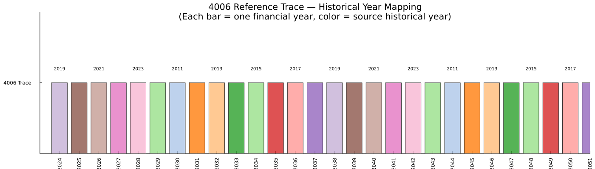
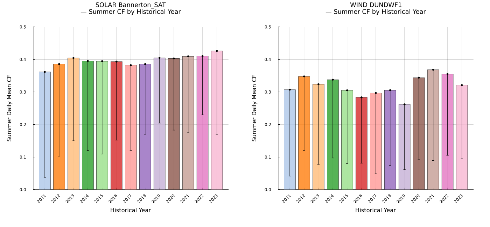
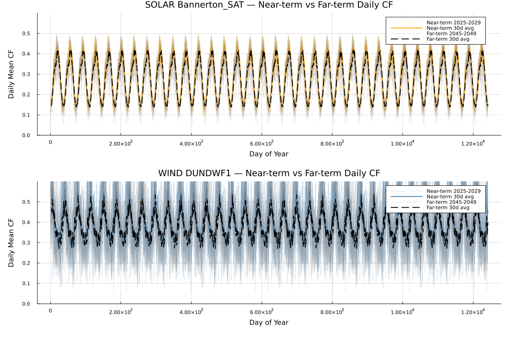
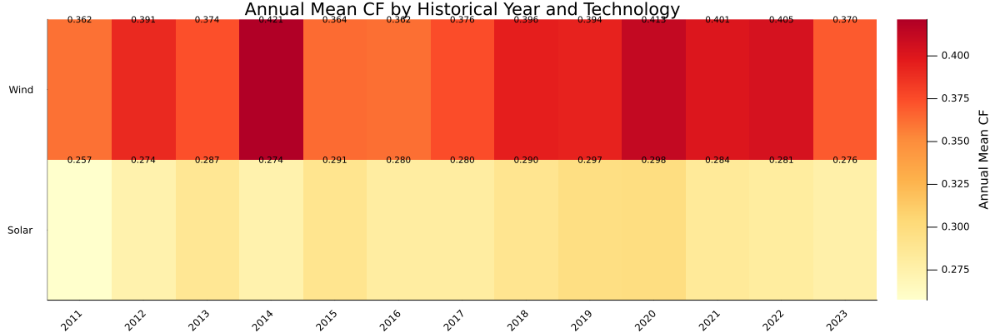

```@meta
EditURL = "../../../literate/eda/08_4006_composite_map.jl"
```

# The 4006 composite reference-trace mapping

Reference trace `4006` assigns a historical weather year to each financial year across the planning horizon, so a "near-term" or "far-term" renewable profile is really a reuse of a specific historical solar and wind year, not an independent forecast. This page builds the financial-year-to-historical-year mapping, the per-historical-year and near/far renewable statistics derived from it, and the four figures that visualise the mapping and its consequences — the same analysis that produces the regression-comparison evidence under `eda/tables/julia/08_4006_composite_map/`, computed live on this page rather than read back from that evidence afterwards.

```@raw html
<details class="source-code"><summary>Show source code</summary>
```

````julia
ENV["GKSwstype"] = "100"

using CSV
using DataFrames
using Dates
using Printf
using Statistics
using Plots

gr();

const REPO_ROOT = normpath(get(
    ENV,
    "PISP_DOCS_REPO_ROOT",
    joinpath(@__DIR__, "..", "..", ".."),
))

include(joinpath(REPO_ROOT, "eda", "eda_support.jl"))
using .EdaSupport

const SCRIPT_STEM = "08_4006_composite_map"
const TRACES = joinpath("data", "2024", "pisp-downloads", "Traces")
````

```@raw html
</details>
```

````
"data/2024/pisp-downloads/Traces"
````

Literate executes each code block with the working directory changed to the page's own output directory, so file reads must go through an absolute path; none of this page's recorded tables store a raw trace path, so there is no recorded-string byte-identity concern here, but existence checks and reads still need to resolve correctly regardless of Literate's working directory.

```@raw html
<details class="source-code"><summary>Show source code</summary>
```

````julia
abs_path(relative_path) = joinpath(REPO_ROOT, relative_path)

const HH_COLS_SOL = string.(1:48)
const HH_COLS_WIND = [lpad(i, 2, '0') for i in 1:48]

const SOLAR_LOC = "Bannerton_SAT"
const WIND_LOC = "DUNDWF1"

const NEAR_YEARS = [2025, 2026, 2027, 2028, 2029]
const FAR_YEARS = [2045, 2046, 2047, 2048, 2049]
````

```@raw html
</details>
```

````
5-element Vector{Int64}:
 2045
 2046
 2047
 2048
 2049
````

The hardcoded DATE_RANGES_REFYEARS mapping from PISP.jl

```@raw html
<details class="source-code"><summary>Show source code</summary>
```

````julia
const DATE_RANGES_REFYEARS = [
    ("2024-07-01", "2025-06-30", 2019),
    ("2025-07-01", "2026-06-30", 2020),
    ("2026-07-01", "2027-06-30", 2021),
    ("2027-07-01", "2028-06-30", 2022),
    ("2028-07-01", "2029-06-30", 2023),
    ("2029-07-01", "2030-06-30", 2015),
    ("2030-07-01", "2031-06-30", 2011),
    ("2031-07-01", "2032-06-30", 2012),
    ("2032-07-01", "2033-06-30", 2013),
    ("2033-07-01", "2034-06-30", 2014),
    ("2034-07-01", "2035-06-30", 2015),
    ("2035-07-01", "2036-06-30", 2016),
    ("2036-07-01", "2037-06-30", 2017),
    ("2037-07-01", "2038-06-30", 2018),
    ("2038-07-01", "2039-06-30", 2019),
    ("2039-07-01", "2040-06-30", 2020),
    ("2040-07-01", "2041-06-30", 2021),
    ("2041-07-01", "2042-06-30", 2022),
    ("2042-07-01", "2043-06-30", 2023),
    ("2043-07-01", "2044-06-30", 2015),
    ("2044-07-01", "2045-06-30", 2011),
    ("2045-07-01", "2046-06-30", 2012),
    ("2046-07-01", "2047-06-30", 2013),
    ("2047-07-01", "2048-06-30", 2014),
    ("2048-07-01", "2049-06-30", 2015),
    ("2049-07-01", "2050-06-30", 2016),
    ("2050-07-01", "2051-06-30", 2017),
    ("2051-07-01", "2052-06-30", 2018),
]
````

```@raw html
</details>
```

````
28-element Vector{Tuple{String, String, Int64}}:
 ("2024-07-01", "2025-06-30", 2019)
 ("2025-07-01", "2026-06-30", 2020)
 ("2026-07-01", "2027-06-30", 2021)
 ("2027-07-01", "2028-06-30", 2022)
 ("2028-07-01", "2029-06-30", 2023)
 ("2029-07-01", "2030-06-30", 2015)
 ("2030-07-01", "2031-06-30", 2011)
 ("2031-07-01", "2032-06-30", 2012)
 ("2032-07-01", "2033-06-30", 2013)
 ("2033-07-01", "2034-06-30", 2014)
 ("2034-07-01", "2035-06-30", 2015)
 ("2035-07-01", "2036-06-30", 2016)
 ("2036-07-01", "2037-06-30", 2017)
 ("2037-07-01", "2038-06-30", 2018)
 ("2038-07-01", "2039-06-30", 2019)
 ("2039-07-01", "2040-06-30", 2020)
 ("2040-07-01", "2041-06-30", 2021)
 ("2041-07-01", "2042-06-30", 2022)
 ("2042-07-01", "2043-06-30", 2023)
 ("2043-07-01", "2044-06-30", 2015)
 ("2044-07-01", "2045-06-30", 2011)
 ("2045-07-01", "2046-06-30", 2012)
 ("2046-07-01", "2047-06-30", 2013)
 ("2047-07-01", "2048-06-30", 2014)
 ("2048-07-01", "2049-06-30", 2015)
 ("2049-07-01", "2050-06-30", 2016)
 ("2050-07-01", "2051-06-30", 2017)
 ("2051-07-01", "2052-06-30", 2018)
````

`read_trace`, `trace_path`, `daily_cf`, `ref_year_for_fy_end`, and `load_year_cf` are shared by several steps below: they resolve a technology/reference-year/location combination to a trace file, load it, and reduce it to one daily capacity-factor value per row.

```@raw html
<details class="source-code"><summary>Show source code</summary>
```

````julia
read_trace(path) = CSV.read(abs_path(path), DataFrame)

trace_path(tech, yr, loc) = joinpath(TRACES, "$(tech)_$(yr)", "$(loc)_RefYear$(yr).csv")

daily_cf(df::DataFrame, hh_cols) = [mean(row[col] for col in hh_cols) for row in eachrow(df)]
````

```@raw html
</details>
```

````
daily_cf (generic function with 1 method)
````

Mirrors `mapping_df[mapping_df['fy_end'].str.startswith(str(yr))]['ref_year'].values[0]`: `yr` is a financial-year-END year (e.g. 2025, 2045), not a historical/ref year, and must be translated through the mapping table before loading a trace file.

```@raw html
<details class="source-code"><summary>Show source code</summary>
```

````julia
function ref_year_for_fy_end(yr::Int)
    idx = findfirst(t -> startswith(t[2], string(yr)), DATE_RANGES_REFYEARS)
    idx === nothing && return nothing
    return DATE_RANGES_REFYEARS[idx][3]
end

function load_year_cf(years, tech, loc, hh_cols)
    all_cfs = Vector{Float64}[]
    for yr in years
        ref = ref_year_for_fy_end(yr)
        ref === nothing && continue
        path = trace_path(tech, ref, loc)
        isfile(abs_path(path)) || continue
        push!(all_cfs, daily_cf(read_trace(path), hh_cols))
    end
    isempty(all_cfs) && return nothing
    n = length(all_cfs[1])
    return [mean(cfs[i] for cfs in all_cfs) for i in 1:n]
end
````

```@raw html
</details>
```

````
load_year_cf (generic function with 1 method)
````

## Step 1 — build the financial-year to historical-year mapping table

Each row assigns one financial year in the planning horizon to the historical weather year whose trace is reused for it.

```@raw html
<details class="source-code"><summary>Show source code</summary>
```

````julia
fy_start = [t[1] for t in DATE_RANGES_REFYEARS]
fy_end = [t[2] for t in DATE_RANGES_REFYEARS]
ref_year = [t[3] for t in DATE_RANGES_REFYEARS]
fy_label = ["FY$(e[1:4])" for e in fy_end]
ref_label = string.(ref_year)

mapping_table = DataFrame(
    fy_start = fy_start,
    fy_end = fy_end,
    ref_year = ref_year,
    fy_label = fy_label,
    ref_label = ref_label,
)
write_table(mapping_table, SCRIPT_STEM, "mapping_table")
mapping_table
````

```@raw html
</details>
```

```@raw html
<div><div style = "float: left;"><span>28×5 DataFrame</span></div><div style = "clear: both;"></div></div><div class = "data-frame" style = "overflow-x: scroll;"><table class = "data-frame" style = "margin-bottom: 6px;"><thead><tr class = "columnLabelRow"><th class = "stubheadLabel" style = "font-weight: bold; text-align: right;">Row</th><th style = "text-align: left;">fy_start</th><th style = "text-align: left;">fy_end</th><th style = "text-align: left;">ref_year</th><th style = "text-align: left;">fy_label</th><th style = "text-align: left;">ref_label</th></tr><tr class = "columnLabelRow"><th class = "stubheadLabel" style = "font-weight: bold; text-align: right;"></th><th title = "String" style = "text-align: left;">String</th><th title = "String" style = "text-align: left;">String</th><th title = "Int64" style = "text-align: left;">Int64</th><th title = "String" style = "text-align: left;">String</th><th title = "String" style = "text-align: left;">String</th></tr></thead><tbody><tr class = "dataRow"><td class = "rowLabel" style = "font-weight: bold; text-align: right;">1</td><td style = "text-align: left;">2024-07-01</td><td style = "text-align: left;">2025-06-30</td><td style = "text-align: right;">2019</td><td style = "text-align: left;">FY2025</td><td style = "text-align: left;">2019</td></tr><tr class = "dataRow"><td class = "rowLabel" style = "font-weight: bold; text-align: right;">2</td><td style = "text-align: left;">2025-07-01</td><td style = "text-align: left;">2026-06-30</td><td style = "text-align: right;">2020</td><td style = "text-align: left;">FY2026</td><td style = "text-align: left;">2020</td></tr><tr class = "dataRow"><td class = "rowLabel" style = "font-weight: bold; text-align: right;">3</td><td style = "text-align: left;">2026-07-01</td><td style = "text-align: left;">2027-06-30</td><td style = "text-align: right;">2021</td><td style = "text-align: left;">FY2027</td><td style = "text-align: left;">2021</td></tr><tr class = "dataRow"><td class = "rowLabel" style = "font-weight: bold; text-align: right;">4</td><td style = "text-align: left;">2027-07-01</td><td style = "text-align: left;">2028-06-30</td><td style = "text-align: right;">2022</td><td style = "text-align: left;">FY2028</td><td style = "text-align: left;">2022</td></tr><tr class = "dataRow"><td class = "rowLabel" style = "font-weight: bold; text-align: right;">5</td><td style = "text-align: left;">2028-07-01</td><td style = "text-align: left;">2029-06-30</td><td style = "text-align: right;">2023</td><td style = "text-align: left;">FY2029</td><td style = "text-align: left;">2023</td></tr><tr class = "dataRow"><td class = "rowLabel" style = "font-weight: bold; text-align: right;">6</td><td style = "text-align: left;">2029-07-01</td><td style = "text-align: left;">2030-06-30</td><td style = "text-align: right;">2015</td><td style = "text-align: left;">FY2030</td><td style = "text-align: left;">2015</td></tr><tr class = "dataRow"><td class = "rowLabel" style = "font-weight: bold; text-align: right;">7</td><td style = "text-align: left;">2030-07-01</td><td style = "text-align: left;">2031-06-30</td><td style = "text-align: right;">2011</td><td style = "text-align: left;">FY2031</td><td style = "text-align: left;">2011</td></tr><tr class = "dataRow"><td class = "rowLabel" style = "font-weight: bold; text-align: right;">8</td><td style = "text-align: left;">2031-07-01</td><td style = "text-align: left;">2032-06-30</td><td style = "text-align: right;">2012</td><td style = "text-align: left;">FY2032</td><td style = "text-align: left;">2012</td></tr><tr class = "dataRow"><td class = "rowLabel" style = "font-weight: bold; text-align: right;">9</td><td style = "text-align: left;">2032-07-01</td><td style = "text-align: left;">2033-06-30</td><td style = "text-align: right;">2013</td><td style = "text-align: left;">FY2033</td><td style = "text-align: left;">2013</td></tr><tr class = "dataRow"><td class = "rowLabel" style = "font-weight: bold; text-align: right;">10</td><td style = "text-align: left;">2033-07-01</td><td style = "text-align: left;">2034-06-30</td><td style = "text-align: right;">2014</td><td style = "text-align: left;">FY2034</td><td style = "text-align: left;">2014</td></tr><tr class = "dataRow"><td class = "rowLabel" style = "font-weight: bold; text-align: right;">11</td><td style = "text-align: left;">2034-07-01</td><td style = "text-align: left;">2035-06-30</td><td style = "text-align: right;">2015</td><td style = "text-align: left;">FY2035</td><td style = "text-align: left;">2015</td></tr><tr class = "dataRow"><td class = "rowLabel" style = "font-weight: bold; text-align: right;">12</td><td style = "text-align: left;">2035-07-01</td><td style = "text-align: left;">2036-06-30</td><td style = "text-align: right;">2016</td><td style = "text-align: left;">FY2036</td><td style = "text-align: left;">2016</td></tr><tr class = "dataRow"><td class = "rowLabel" style = "font-weight: bold; text-align: right;">13</td><td style = "text-align: left;">2036-07-01</td><td style = "text-align: left;">2037-06-30</td><td style = "text-align: right;">2017</td><td style = "text-align: left;">FY2037</td><td style = "text-align: left;">2017</td></tr><tr class = "dataRow"><td class = "rowLabel" style = "font-weight: bold; text-align: right;">14</td><td style = "text-align: left;">2037-07-01</td><td style = "text-align: left;">2038-06-30</td><td style = "text-align: right;">2018</td><td style = "text-align: left;">FY2038</td><td style = "text-align: left;">2018</td></tr><tr class = "dataRow"><td class = "rowLabel" style = "font-weight: bold; text-align: right;">15</td><td style = "text-align: left;">2038-07-01</td><td style = "text-align: left;">2039-06-30</td><td style = "text-align: right;">2019</td><td style = "text-align: left;">FY2039</td><td style = "text-align: left;">2019</td></tr><tr class = "dataRow"><td class = "rowLabel" style = "font-weight: bold; text-align: right;">16</td><td style = "text-align: left;">2039-07-01</td><td style = "text-align: left;">2040-06-30</td><td style = "text-align: right;">2020</td><td style = "text-align: left;">FY2040</td><td style = "text-align: left;">2020</td></tr><tr class = "dataRow"><td class = "rowLabel" style = "font-weight: bold; text-align: right;">17</td><td style = "text-align: left;">2040-07-01</td><td style = "text-align: left;">2041-06-30</td><td style = "text-align: right;">2021</td><td style = "text-align: left;">FY2041</td><td style = "text-align: left;">2021</td></tr><tr class = "dataRow"><td class = "rowLabel" style = "font-weight: bold; text-align: right;">18</td><td style = "text-align: left;">2041-07-01</td><td style = "text-align: left;">2042-06-30</td><td style = "text-align: right;">2022</td><td style = "text-align: left;">FY2042</td><td style = "text-align: left;">2022</td></tr><tr class = "dataRow"><td class = "rowLabel" style = "font-weight: bold; text-align: right;">19</td><td style = "text-align: left;">2042-07-01</td><td style = "text-align: left;">2043-06-30</td><td style = "text-align: right;">2023</td><td style = "text-align: left;">FY2043</td><td style = "text-align: left;">2023</td></tr><tr class = "dataRow"><td class = "rowLabel" style = "font-weight: bold; text-align: right;">20</td><td style = "text-align: left;">2043-07-01</td><td style = "text-align: left;">2044-06-30</td><td style = "text-align: right;">2015</td><td style = "text-align: left;">FY2044</td><td style = "text-align: left;">2015</td></tr><tr class = "dataRow"><td class = "rowLabel" style = "font-weight: bold; text-align: right;">21</td><td style = "text-align: left;">2044-07-01</td><td style = "text-align: left;">2045-06-30</td><td style = "text-align: right;">2011</td><td style = "text-align: left;">FY2045</td><td style = "text-align: left;">2011</td></tr><tr class = "dataRow"><td class = "rowLabel" style = "font-weight: bold; text-align: right;">22</td><td style = "text-align: left;">2045-07-01</td><td style = "text-align: left;">2046-06-30</td><td style = "text-align: right;">2012</td><td style = "text-align: left;">FY2046</td><td style = "text-align: left;">2012</td></tr><tr class = "dataRow"><td class = "rowLabel" style = "font-weight: bold; text-align: right;">23</td><td style = "text-align: left;">2046-07-01</td><td style = "text-align: left;">2047-06-30</td><td style = "text-align: right;">2013</td><td style = "text-align: left;">FY2047</td><td style = "text-align: left;">2013</td></tr><tr class = "dataRow"><td class = "rowLabel" style = "font-weight: bold; text-align: right;">24</td><td style = "text-align: left;">2047-07-01</td><td style = "text-align: left;">2048-06-30</td><td style = "text-align: right;">2014</td><td style = "text-align: left;">FY2048</td><td style = "text-align: left;">2014</td></tr><tr class = "dataRow"><td class = "rowLabel" style = "font-weight: bold; text-align: right;">25</td><td style = "text-align: left;">2048-07-01</td><td style = "text-align: left;">2049-06-30</td><td style = "text-align: right;">2015</td><td style = "text-align: left;">FY2049</td><td style = "text-align: left;">2015</td></tr><tr class = "dataRow"><td class = "rowLabel" style = "font-weight: bold; text-align: right;">26</td><td style = "text-align: left;">2049-07-01</td><td style = "text-align: left;">2050-06-30</td><td style = "text-align: right;">2016</td><td style = "text-align: left;">FY2050</td><td style = "text-align: left;">2016</td></tr><tr class = "dataRow"><td class = "rowLabel" style = "font-weight: bold; text-align: right;">27</td><td style = "text-align: left;">2050-07-01</td><td style = "text-align: left;">2051-06-30</td><td style = "text-align: right;">2017</td><td style = "text-align: left;">FY2051</td><td style = "text-align: left;">2017</td></tr><tr class = "dataRow"><td class = "rowLabel" style = "font-weight: bold; text-align: right;">28</td><td style = "text-align: left;">2051-07-01</td><td style = "text-align: left;">2052-06-30</td><td style = "text-align: right;">2018</td><td style = "text-align: left;">FY2052</td><td style = "text-align: left;">2018</td></tr></tbody></table></div>
```

```@raw html
<details class="source-code"><summary>Show source code</summary>
```

````julia
println("=== 4006 Composite Mapping ===")
for row in eachrow(mapping_table)
    println("  ", row.fy_start[1:4], " → ref ", row.ref_year)
end
````

```@raw html
</details>
```

````
=== 4006 Composite Mapping ===
  2024 → ref 2019
  2025 → ref 2020
  2026 → ref 2021
  2027 → ref 2022
  2028 → ref 2023
  2029 → ref 2015
  2030 → ref 2011
  2031 → ref 2012
  2032 → ref 2013
  2033 → ref 2014
  2034 → ref 2015
  2035 → ref 2016
  2036 → ref 2017
  2037 → ref 2018
  2038 → ref 2019
  2039 → ref 2020
  2040 → ref 2021
  2041 → ref 2022
  2042 → ref 2023
  2043 → ref 2015
  2044 → ref 2011
  2045 → ref 2012
  2046 → ref 2013
  2047 → ref 2014
  2048 → ref 2015
  2049 → ref 2016
  2050 → ref 2017
  2051 → ref 2018

````

## Step 2 — renewable statistics by historical year

For every historical year actually used by the mapping, this computes the annual mean capacity factor and the summer (Dec/Jan/Feb) mean, minimum, and 5th-percentile capacity factor for the representative solar and wind locations.

```@raw html
<details class="source-code"><summary>Show source code</summary>
```

````julia
historical_year_vre_stats_rows = NamedTuple[]
for yr in sort(unique(mapping_table.ref_year))
    for (tech, loc, hh_cols) in (("solar", SOLAR_LOC, HH_COLS_SOL), ("wind", WIND_LOC, HH_COLS_WIND))
        path = trace_path(tech, yr, loc)
        isfile(abs_path(path)) || continue
        df = read_trace(path)
        summer = df[in.(df.Month, Ref((12, 1, 2))), :]
        nrow(summer) == 0 && continue
        summer_cf = daily_cf(summer, hh_cols)
        push!(
            historical_year_vre_stats_rows,
            (
                ref_year = yr,
                tech = tech,
                annual_mean_cf = mean(daily_cf(df, hh_cols)),
                summer_mean_cf = mean(summer_cf),
                summer_min_cf = minimum(summer_cf),
                summer_p5_cf = quantile(summer_cf, 0.05),
            ),
        )
    end
end
historical_year_vre_stats = DataFrame(historical_year_vre_stats_rows)
write_table(historical_year_vre_stats, SCRIPT_STEM, "historical_year_vre_stats")
historical_year_vre_stats
````

```@raw html
</details>
```

```@raw html
<div><div style = "float: left;"><span>26×6 DataFrame</span></div><div style = "clear: both;"></div></div><div class = "data-frame" style = "overflow-x: scroll;"><table class = "data-frame" style = "margin-bottom: 6px;"><thead><tr class = "columnLabelRow"><th class = "stubheadLabel" style = "font-weight: bold; text-align: right;">Row</th><th style = "text-align: left;">ref_year</th><th style = "text-align: left;">tech</th><th style = "text-align: left;">annual_mean_cf</th><th style = "text-align: left;">summer_mean_cf</th><th style = "text-align: left;">summer_min_cf</th><th style = "text-align: left;">summer_p5_cf</th></tr><tr class = "columnLabelRow"><th class = "stubheadLabel" style = "font-weight: bold; text-align: right;"></th><th title = "Int64" style = "text-align: left;">Int64</th><th title = "String" style = "text-align: left;">String</th><th title = "Float64" style = "text-align: left;">Float64</th><th title = "Float64" style = "text-align: left;">Float64</th><th title = "Float64" style = "text-align: left;">Float64</th><th title = "Float64" style = "text-align: left;">Float64</th></tr></thead><tbody><tr class = "dataRow"><td class = "rowLabel" style = "font-weight: bold; text-align: right;">1</td><td style = "text-align: right;">2011</td><td style = "text-align: left;">solar</td><td style = "text-align: right;">0.257362</td><td style = "text-align: right;">0.361699</td><td style = "text-align: right;">0.0145063</td><td style = "text-align: right;">0.0377352</td></tr><tr class = "dataRow"><td class = "rowLabel" style = "font-weight: bold; text-align: right;">2</td><td style = "text-align: right;">2011</td><td style = "text-align: left;">wind</td><td style = "text-align: right;">0.361648</td><td style = "text-align: right;">0.307114</td><td style = "text-align: right;">0.020218</td><td style = "text-align: right;">0.0412972</td></tr><tr class = "dataRow"><td class = "rowLabel" style = "font-weight: bold; text-align: right;">3</td><td style = "text-align: right;">2012</td><td style = "text-align: left;">solar</td><td style = "text-align: right;">0.274037</td><td style = "text-align: right;">0.38577</td><td style = "text-align: right;">0.0311683</td><td style = "text-align: right;">0.102937</td></tr><tr class = "dataRow"><td class = "rowLabel" style = "font-weight: bold; text-align: right;">4</td><td style = "text-align: right;">2012</td><td style = "text-align: left;">wind</td><td style = "text-align: right;">0.390979</td><td style = "text-align: right;">0.34782</td><td style = "text-align: right;">0.0419995</td><td style = "text-align: right;">0.120625</td></tr><tr class = "dataRow"><td class = "rowLabel" style = "font-weight: bold; text-align: right;">5</td><td style = "text-align: right;">2013</td><td style = "text-align: left;">solar</td><td style = "text-align: right;">0.287337</td><td style = "text-align: right;">0.404471</td><td style = "text-align: right;">0.0175779</td><td style = "text-align: right;">0.149914</td></tr><tr class = "dataRow"><td class = "rowLabel" style = "font-weight: bold; text-align: right;">6</td><td style = "text-align: right;">2013</td><td style = "text-align: left;">wind</td><td style = "text-align: right;">0.374104</td><td style = "text-align: right;">0.323963</td><td style = "text-align: right;">0.0140656</td><td style = "text-align: right;">0.0776668</td></tr><tr class = "dataRow"><td class = "rowLabel" style = "font-weight: bold; text-align: right;">7</td><td style = "text-align: right;">2014</td><td style = "text-align: left;">solar</td><td style = "text-align: right;">0.274026</td><td style = "text-align: right;">0.395343</td><td style = "text-align: right;">0.0167056</td><td style = "text-align: right;">0.119831</td></tr><tr class = "dataRow"><td class = "rowLabel" style = "font-weight: bold; text-align: right;">8</td><td style = "text-align: right;">2014</td><td style = "text-align: left;">wind</td><td style = "text-align: right;">0.421323</td><td style = "text-align: right;">0.337852</td><td style = "text-align: right;">0.0472683</td><td style = "text-align: right;">0.0970499</td></tr><tr class = "dataRow"><td class = "rowLabel" style = "font-weight: bold; text-align: right;">9</td><td style = "text-align: right;">2015</td><td style = "text-align: left;">solar</td><td style = "text-align: right;">0.29051</td><td style = "text-align: right;">0.394685</td><td style = "text-align: right;">0.0329821</td><td style = "text-align: right;">0.109433</td></tr><tr class = "dataRow"><td class = "rowLabel" style = "font-weight: bold; text-align: right;">10</td><td style = "text-align: right;">2015</td><td style = "text-align: left;">wind</td><td style = "text-align: right;">0.363536</td><td style = "text-align: right;">0.305119</td><td style = "text-align: right;">0.0250786</td><td style = "text-align: right;">0.0803984</td></tr><tr class = "dataRow"><td class = "rowLabel" style = "font-weight: bold; text-align: right;">11</td><td style = "text-align: right;">2016</td><td style = "text-align: left;">solar</td><td style = "text-align: right;">0.28018</td><td style = "text-align: right;">0.393496</td><td style = "text-align: right;">0.110095</td><td style = "text-align: right;">0.152268</td></tr><tr class = "dataRow"><td class = "rowLabel" style = "font-weight: bold; text-align: right;">12</td><td style = "text-align: right;">2016</td><td style = "text-align: left;">wind</td><td style = "text-align: right;">0.362167</td><td style = "text-align: right;">0.28348</td><td style = "text-align: right;">0.0494088</td><td style = "text-align: right;">0.0812237</td></tr><tr class = "dataRow"><td class = "rowLabel" style = "font-weight: bold; text-align: right;">13</td><td style = "text-align: right;">2017</td><td style = "text-align: left;">solar</td><td style = "text-align: right;">0.280107</td><td style = "text-align: right;">0.382376</td><td style = "text-align: right;">0.0515059</td><td style = "text-align: right;">0.120608</td></tr><tr class = "dataRow"><td class = "rowLabel" style = "font-weight: bold; text-align: right;">14</td><td style = "text-align: right;">2017</td><td style = "text-align: left;">wind</td><td style = "text-align: right;">0.375569</td><td style = "text-align: right;">0.296865</td><td style = "text-align: right;">0.0357853</td><td style = "text-align: right;">0.0484888</td></tr><tr class = "dataRow"><td class = "rowLabel" style = "font-weight: bold; text-align: right;">15</td><td style = "text-align: right;">2018</td><td style = "text-align: left;">solar</td><td style = "text-align: right;">0.289739</td><td style = "text-align: right;">0.385712</td><td style = "text-align: right;">0.0689566</td><td style = "text-align: right;">0.170206</td></tr><tr class = "dataRow"><td class = "rowLabel" style = "font-weight: bold; text-align: right;">16</td><td style = "text-align: right;">2018</td><td style = "text-align: left;">wind</td><td style = "text-align: right;">0.395895</td><td style = "text-align: right;">0.305462</td><td style = "text-align: right;">0.0543059</td><td style = "text-align: right;">0.0746259</td></tr><tr class = "dataRow"><td class = "rowLabel" style = "font-weight: bold; text-align: right;">17</td><td style = "text-align: right;">2019</td><td style = "text-align: left;">solar</td><td style = "text-align: right;">0.296915</td><td style = "text-align: right;">0.404872</td><td style = "text-align: right;">0.0890162</td><td style = "text-align: right;">0.204355</td></tr><tr class = "dataRow"><td class = "rowLabel" style = "font-weight: bold; text-align: right;">18</td><td style = "text-align: right;">2019</td><td style = "text-align: left;">wind</td><td style = "text-align: right;">0.394096</td><td style = "text-align: right;">0.26196</td><td style = "text-align: right;">0.0309094</td><td style = "text-align: right;">0.0619373</td></tr><tr class = "dataRow"><td class = "rowLabel" style = "font-weight: bold; text-align: right;">19</td><td style = "text-align: right;">2020</td><td style = "text-align: left;">solar</td><td style = "text-align: right;">0.297859</td><td style = "text-align: right;">0.403192</td><td style = "text-align: right;">0.0773021</td><td style = "text-align: right;">0.182836</td></tr><tr class = "dataRow"><td class = "rowLabel" style = "font-weight: bold; text-align: right;">20</td><td style = "text-align: right;">2020</td><td style = "text-align: left;">wind</td><td style = "text-align: right;">0.412785</td><td style = "text-align: right;">0.344116</td><td style = "text-align: right;">0.0156713</td><td style = "text-align: right;">0.0933679</td></tr><tr class = "dataRow"><td class = "rowLabel" style = "font-weight: bold; text-align: right;">21</td><td style = "text-align: right;">2021</td><td style = "text-align: left;">solar</td><td style = "text-align: right;">0.284485</td><td style = "text-align: right;">0.409647</td><td style = "text-align: right;">0.0689535</td><td style = "text-align: right;">0.174614</td></tr><tr class = "dataRow"><td class = "rowLabel" style = "font-weight: bold; text-align: right;">22</td><td style = "text-align: right;">2021</td><td style = "text-align: left;">wind</td><td style = "text-align: right;">0.401134</td><td style = "text-align: right;">0.368448</td><td style = "text-align: right;">0.0474335</td><td style = "text-align: right;">0.0892812</td></tr><tr class = "dataRow"><td class = "rowLabel" style = "font-weight: bold; text-align: right;">23</td><td style = "text-align: right;">2022</td><td style = "text-align: left;">solar</td><td style = "text-align: right;">0.281107</td><td style = "text-align: right;">0.410353</td><td style = "text-align: right;">0.158083</td><td style = "text-align: right;">0.229602</td></tr><tr class = "dataRow"><td class = "rowLabel" style = "font-weight: bold; text-align: right;">24</td><td style = "text-align: right;">2022</td><td style = "text-align: left;">wind</td><td style = "text-align: right;">0.404672</td><td style = "text-align: right;">0.355404</td><td style = "text-align: right;">0.0125</td><td style = "text-align: right;">0.105401</td></tr><tr class = "dataRow"><td class = "rowLabel" style = "font-weight: bold; text-align: right;">25</td><td style = "text-align: right;">2023</td><td style = "text-align: left;">solar</td><td style = "text-align: right;">0.276166</td><td style = "text-align: right;">0.426174</td><td style = "text-align: right;">0.0907033</td><td style = "text-align: right;">0.168359</td></tr><tr class = "dataRow"><td class = "rowLabel" style = "font-weight: bold; text-align: right;">26</td><td style = "text-align: right;">2023</td><td style = "text-align: left;">wind</td><td style = "text-align: right;">0.369846</td><td style = "text-align: right;">0.321152</td><td style = "text-align: right;">0.0375621</td><td style = "text-align: right;">0.094468</td></tr></tbody></table></div>
```

## Step 3 — near-term vs far-term daily capacity factor

The near-term group (financial years ending 2025-2029) and far-term group (financial years ending 2045-2049) are each translated through the mapping to their historical reference years, then averaged day-by-day across the group's traces.

```@raw html
<details class="source-code"><summary>Show source code</summary>
```

````julia
near_vs_far_term_rows = NamedTuple[]
for (tech, loc, hh_cols) in (("solar", SOLAR_LOC, HH_COLS_SOL), ("wind", WIND_LOC, HH_COLS_WIND))
    near_cf = load_year_cf(NEAR_YEARS, tech, loc, hh_cols)
    far_cf = load_year_cf(FAR_YEARS, tech, loc, hh_cols)
    if near_cf !== nothing
        for (day, cf) in enumerate(near_cf)
            push!(near_vs_far_term_rows, (tech = tech, term = "near", day_of_year = day, daily_cf = cf))
        end
    end
    if far_cf !== nothing
        for (day, cf) in enumerate(far_cf)
            push!(near_vs_far_term_rows, (tech = tech, term = "far", day_of_year = day, daily_cf = cf))
        end
    end
end
near_vs_far_term_daily_cf = DataFrame(near_vs_far_term_rows)
write_table(near_vs_far_term_daily_cf, SCRIPT_STEM, "near_vs_far_term_daily_cf")
first(near_vs_far_term_daily_cf, 20)
````

```@raw html
</details>
```

```@raw html
<div><div style = "float: left;"><span>20×4 DataFrame</span></div><div style = "clear: both;"></div></div><div class = "data-frame" style = "overflow-x: scroll;"><table class = "data-frame" style = "margin-bottom: 6px;"><thead><tr class = "columnLabelRow"><th class = "stubheadLabel" style = "font-weight: bold; text-align: right;">Row</th><th style = "text-align: left;">tech</th><th style = "text-align: left;">term</th><th style = "text-align: left;">day_of_year</th><th style = "text-align: left;">daily_cf</th></tr><tr class = "columnLabelRow"><th class = "stubheadLabel" style = "font-weight: bold; text-align: right;"></th><th title = "String" style = "text-align: left;">String</th><th title = "String" style = "text-align: left;">String</th><th title = "Int64" style = "text-align: left;">Int64</th><th title = "Float64" style = "text-align: left;">Float64</th></tr></thead><tbody><tr class = "dataRow"><td class = "rowLabel" style = "font-weight: bold; text-align: right;">1</td><td style = "text-align: left;">solar</td><td style = "text-align: left;">near</td><td style = "text-align: right;">1</td><td style = "text-align: right;">0.161203</td></tr><tr class = "dataRow"><td class = "rowLabel" style = "font-weight: bold; text-align: right;">2</td><td style = "text-align: left;">solar</td><td style = "text-align: left;">near</td><td style = "text-align: right;">2</td><td style = "text-align: right;">0.176654</td></tr><tr class = "dataRow"><td class = "rowLabel" style = "font-weight: bold; text-align: right;">3</td><td style = "text-align: left;">solar</td><td style = "text-align: left;">near</td><td style = "text-align: right;">3</td><td style = "text-align: right;">0.173519</td></tr><tr class = "dataRow"><td class = "rowLabel" style = "font-weight: bold; text-align: right;">4</td><td style = "text-align: left;">solar</td><td style = "text-align: left;">near</td><td style = "text-align: right;">4</td><td style = "text-align: right;">0.147777</td></tr><tr class = "dataRow"><td class = "rowLabel" style = "font-weight: bold; text-align: right;">5</td><td style = "text-align: left;">solar</td><td style = "text-align: left;">near</td><td style = "text-align: right;">5</td><td style = "text-align: right;">0.17499</td></tr><tr class = "dataRow"><td class = "rowLabel" style = "font-weight: bold; text-align: right;">6</td><td style = "text-align: left;">solar</td><td style = "text-align: left;">near</td><td style = "text-align: right;">6</td><td style = "text-align: right;">0.146859</td></tr><tr class = "dataRow"><td class = "rowLabel" style = "font-weight: bold; text-align: right;">7</td><td style = "text-align: left;">solar</td><td style = "text-align: left;">near</td><td style = "text-align: right;">7</td><td style = "text-align: right;">0.175536</td></tr><tr class = "dataRow"><td class = "rowLabel" style = "font-weight: bold; text-align: right;">8</td><td style = "text-align: left;">solar</td><td style = "text-align: left;">near</td><td style = "text-align: right;">8</td><td style = "text-align: right;">0.164882</td></tr><tr class = "dataRow"><td class = "rowLabel" style = "font-weight: bold; text-align: right;">9</td><td style = "text-align: left;">solar</td><td style = "text-align: left;">near</td><td style = "text-align: right;">9</td><td style = "text-align: right;">0.183625</td></tr><tr class = "dataRow"><td class = "rowLabel" style = "font-weight: bold; text-align: right;">10</td><td style = "text-align: left;">solar</td><td style = "text-align: left;">near</td><td style = "text-align: right;">10</td><td style = "text-align: right;">0.15295</td></tr><tr class = "dataRow"><td class = "rowLabel" style = "font-weight: bold; text-align: right;">11</td><td style = "text-align: left;">solar</td><td style = "text-align: left;">near</td><td style = "text-align: right;">11</td><td style = "text-align: right;">0.151964</td></tr><tr class = "dataRow"><td class = "rowLabel" style = "font-weight: bold; text-align: right;">12</td><td style = "text-align: left;">solar</td><td style = "text-align: left;">near</td><td style = "text-align: right;">12</td><td style = "text-align: right;">0.139798</td></tr><tr class = "dataRow"><td class = "rowLabel" style = "font-weight: bold; text-align: right;">13</td><td style = "text-align: left;">solar</td><td style = "text-align: left;">near</td><td style = "text-align: right;">13</td><td style = "text-align: right;">0.136836</td></tr><tr class = "dataRow"><td class = "rowLabel" style = "font-weight: bold; text-align: right;">14</td><td style = "text-align: left;">solar</td><td style = "text-align: left;">near</td><td style = "text-align: right;">14</td><td style = "text-align: right;">0.163308</td></tr><tr class = "dataRow"><td class = "rowLabel" style = "font-weight: bold; text-align: right;">15</td><td style = "text-align: left;">solar</td><td style = "text-align: left;">near</td><td style = "text-align: right;">15</td><td style = "text-align: right;">0.174574</td></tr><tr class = "dataRow"><td class = "rowLabel" style = "font-weight: bold; text-align: right;">16</td><td style = "text-align: left;">solar</td><td style = "text-align: left;">near</td><td style = "text-align: right;">16</td><td style = "text-align: right;">0.187039</td></tr><tr class = "dataRow"><td class = "rowLabel" style = "font-weight: bold; text-align: right;">17</td><td style = "text-align: left;">solar</td><td style = "text-align: left;">near</td><td style = "text-align: right;">17</td><td style = "text-align: right;">0.166879</td></tr><tr class = "dataRow"><td class = "rowLabel" style = "font-weight: bold; text-align: right;">18</td><td style = "text-align: left;">solar</td><td style = "text-align: left;">near</td><td style = "text-align: right;">18</td><td style = "text-align: right;">0.171428</td></tr><tr class = "dataRow"><td class = "rowLabel" style = "font-weight: bold; text-align: right;">19</td><td style = "text-align: left;">solar</td><td style = "text-align: left;">near</td><td style = "text-align: right;">19</td><td style = "text-align: right;">0.180874</td></tr><tr class = "dataRow"><td class = "rowLabel" style = "font-weight: bold; text-align: right;">20</td><td style = "text-align: left;">solar</td><td style = "text-align: left;">near</td><td style = "text-align: right;">20</td><td style = "text-align: right;">0.164677</td></tr></tbody></table></div>
```

## Step 4 — year-by-year renewable matrix

One annual mean capacity factor per historical year and technology, feeding the heatmap figure below.

```@raw html
<details class="source-code"><summary>Show source code</summary>
```

````julia
heatmap_years = sort(unique(mapping_table.ref_year))
vre_heatmap_rows = NamedTuple[]
for (tech, loc, hh_cols) in (("solar", SOLAR_LOC, HH_COLS_SOL), ("wind", WIND_LOC, HH_COLS_WIND))
    for yr in heatmap_years
        path = trace_path(tech, yr, loc)
        val = isfile(abs_path(path)) ? mean(daily_cf(read_trace(path), hh_cols)) : missing
        push!(vre_heatmap_rows, (tech = tech, ref_year = yr, annual_mean_cf = val))
    end
end
vre_heatmap = DataFrame(vre_heatmap_rows)
write_table(vre_heatmap, SCRIPT_STEM, "vre_heatmap")
vre_heatmap
````

```@raw html
</details>
```

```@raw html
<div><div style = "float: left;"><span>26×3 DataFrame</span></div><div style = "clear: both;"></div></div><div class = "data-frame" style = "overflow-x: scroll;"><table class = "data-frame" style = "margin-bottom: 6px;"><thead><tr class = "columnLabelRow"><th class = "stubheadLabel" style = "font-weight: bold; text-align: right;">Row</th><th style = "text-align: left;">tech</th><th style = "text-align: left;">ref_year</th><th style = "text-align: left;">annual_mean_cf</th></tr><tr class = "columnLabelRow"><th class = "stubheadLabel" style = "font-weight: bold; text-align: right;"></th><th title = "String" style = "text-align: left;">String</th><th title = "Int64" style = "text-align: left;">Int64</th><th title = "Float64" style = "text-align: left;">Float64</th></tr></thead><tbody><tr class = "dataRow"><td class = "rowLabel" style = "font-weight: bold; text-align: right;">1</td><td style = "text-align: left;">solar</td><td style = "text-align: right;">2011</td><td style = "text-align: right;">0.257362</td></tr><tr class = "dataRow"><td class = "rowLabel" style = "font-weight: bold; text-align: right;">2</td><td style = "text-align: left;">solar</td><td style = "text-align: right;">2012</td><td style = "text-align: right;">0.274037</td></tr><tr class = "dataRow"><td class = "rowLabel" style = "font-weight: bold; text-align: right;">3</td><td style = "text-align: left;">solar</td><td style = "text-align: right;">2013</td><td style = "text-align: right;">0.287337</td></tr><tr class = "dataRow"><td class = "rowLabel" style = "font-weight: bold; text-align: right;">4</td><td style = "text-align: left;">solar</td><td style = "text-align: right;">2014</td><td style = "text-align: right;">0.274026</td></tr><tr class = "dataRow"><td class = "rowLabel" style = "font-weight: bold; text-align: right;">5</td><td style = "text-align: left;">solar</td><td style = "text-align: right;">2015</td><td style = "text-align: right;">0.29051</td></tr><tr class = "dataRow"><td class = "rowLabel" style = "font-weight: bold; text-align: right;">6</td><td style = "text-align: left;">solar</td><td style = "text-align: right;">2016</td><td style = "text-align: right;">0.28018</td></tr><tr class = "dataRow"><td class = "rowLabel" style = "font-weight: bold; text-align: right;">7</td><td style = "text-align: left;">solar</td><td style = "text-align: right;">2017</td><td style = "text-align: right;">0.280107</td></tr><tr class = "dataRow"><td class = "rowLabel" style = "font-weight: bold; text-align: right;">8</td><td style = "text-align: left;">solar</td><td style = "text-align: right;">2018</td><td style = "text-align: right;">0.289739</td></tr><tr class = "dataRow"><td class = "rowLabel" style = "font-weight: bold; text-align: right;">9</td><td style = "text-align: left;">solar</td><td style = "text-align: right;">2019</td><td style = "text-align: right;">0.296915</td></tr><tr class = "dataRow"><td class = "rowLabel" style = "font-weight: bold; text-align: right;">10</td><td style = "text-align: left;">solar</td><td style = "text-align: right;">2020</td><td style = "text-align: right;">0.297859</td></tr><tr class = "dataRow"><td class = "rowLabel" style = "font-weight: bold; text-align: right;">11</td><td style = "text-align: left;">solar</td><td style = "text-align: right;">2021</td><td style = "text-align: right;">0.284485</td></tr><tr class = "dataRow"><td class = "rowLabel" style = "font-weight: bold; text-align: right;">12</td><td style = "text-align: left;">solar</td><td style = "text-align: right;">2022</td><td style = "text-align: right;">0.281107</td></tr><tr class = "dataRow"><td class = "rowLabel" style = "font-weight: bold; text-align: right;">13</td><td style = "text-align: left;">solar</td><td style = "text-align: right;">2023</td><td style = "text-align: right;">0.276166</td></tr><tr class = "dataRow"><td class = "rowLabel" style = "font-weight: bold; text-align: right;">14</td><td style = "text-align: left;">wind</td><td style = "text-align: right;">2011</td><td style = "text-align: right;">0.361648</td></tr><tr class = "dataRow"><td class = "rowLabel" style = "font-weight: bold; text-align: right;">15</td><td style = "text-align: left;">wind</td><td style = "text-align: right;">2012</td><td style = "text-align: right;">0.390979</td></tr><tr class = "dataRow"><td class = "rowLabel" style = "font-weight: bold; text-align: right;">16</td><td style = "text-align: left;">wind</td><td style = "text-align: right;">2013</td><td style = "text-align: right;">0.374104</td></tr><tr class = "dataRow"><td class = "rowLabel" style = "font-weight: bold; text-align: right;">17</td><td style = "text-align: left;">wind</td><td style = "text-align: right;">2014</td><td style = "text-align: right;">0.421323</td></tr><tr class = "dataRow"><td class = "rowLabel" style = "font-weight: bold; text-align: right;">18</td><td style = "text-align: left;">wind</td><td style = "text-align: right;">2015</td><td style = "text-align: right;">0.363536</td></tr><tr class = "dataRow"><td class = "rowLabel" style = "font-weight: bold; text-align: right;">19</td><td style = "text-align: left;">wind</td><td style = "text-align: right;">2016</td><td style = "text-align: right;">0.362167</td></tr><tr class = "dataRow"><td class = "rowLabel" style = "font-weight: bold; text-align: right;">20</td><td style = "text-align: left;">wind</td><td style = "text-align: right;">2017</td><td style = "text-align: right;">0.375569</td></tr><tr class = "dataRow"><td class = "rowLabel" style = "font-weight: bold; text-align: right;">21</td><td style = "text-align: left;">wind</td><td style = "text-align: right;">2018</td><td style = "text-align: right;">0.395895</td></tr><tr class = "dataRow"><td class = "rowLabel" style = "font-weight: bold; text-align: right;">22</td><td style = "text-align: left;">wind</td><td style = "text-align: right;">2019</td><td style = "text-align: right;">0.394096</td></tr><tr class = "dataRow"><td class = "rowLabel" style = "font-weight: bold; text-align: right;">23</td><td style = "text-align: left;">wind</td><td style = "text-align: right;">2020</td><td style = "text-align: right;">0.412785</td></tr><tr class = "dataRow"><td class = "rowLabel" style = "font-weight: bold; text-align: right;">24</td><td style = "text-align: left;">wind</td><td style = "text-align: right;">2021</td><td style = "text-align: right;">0.401134</td></tr><tr class = "dataRow"><td class = "rowLabel" style = "font-weight: bold; text-align: right;">25</td><td style = "text-align: left;">wind</td><td style = "text-align: right;">2022</td><td style = "text-align: right;">0.404672</td></tr><tr class = "dataRow"><td class = "rowLabel" style = "font-weight: bold; text-align: right;">26</td><td style = "text-align: left;">wind</td><td style = "text-align: right;">2023</td><td style = "text-align: right;">0.369846</td></tr></tbody></table></div>
```

## Step 5 — how often each historical year is reused

Repeated reference years mean the planning horizon is not a monotonic sequence of new weather conditions; some historical years are reused several times.

```@raw html
<details class="source-code"><summary>Show source code</summary>
```

````julia
println("\n=== 4006 COMPOSITE STATS ===")
println("Total years: ", nrow(mapping_table))
println("Unique historical years used: ", sort(unique(mapping_table.ref_year)))

ref_year_counts = combine(groupby(mapping_table, :ref_year), nrow => :count)
sort!(ref_year_counts, :ref_year)
write_table(ref_year_counts, SCRIPT_STEM, "ref_year_counts")
ref_year_counts
````

```@raw html
</details>
```

```@raw html
<div><div style = "float: left;"><span>13×2 DataFrame</span></div><div style = "clear: both;"></div></div><div class = "data-frame" style = "overflow-x: scroll;"><table class = "data-frame" style = "margin-bottom: 6px;"><thead><tr class = "columnLabelRow"><th class = "stubheadLabel" style = "font-weight: bold; text-align: right;">Row</th><th style = "text-align: left;">ref_year</th><th style = "text-align: left;">count</th></tr><tr class = "columnLabelRow"><th class = "stubheadLabel" style = "font-weight: bold; text-align: right;"></th><th title = "Int64" style = "text-align: left;">Int64</th><th title = "Int64" style = "text-align: left;">Int64</th></tr></thead><tbody><tr class = "dataRow"><td class = "rowLabel" style = "font-weight: bold; text-align: right;">1</td><td style = "text-align: right;">2011</td><td style = "text-align: right;">2</td></tr><tr class = "dataRow"><td class = "rowLabel" style = "font-weight: bold; text-align: right;">2</td><td style = "text-align: right;">2012</td><td style = "text-align: right;">2</td></tr><tr class = "dataRow"><td class = "rowLabel" style = "font-weight: bold; text-align: right;">3</td><td style = "text-align: right;">2013</td><td style = "text-align: right;">2</td></tr><tr class = "dataRow"><td class = "rowLabel" style = "font-weight: bold; text-align: right;">4</td><td style = "text-align: right;">2014</td><td style = "text-align: right;">2</td></tr><tr class = "dataRow"><td class = "rowLabel" style = "font-weight: bold; text-align: right;">5</td><td style = "text-align: right;">2015</td><td style = "text-align: right;">4</td></tr><tr class = "dataRow"><td class = "rowLabel" style = "font-weight: bold; text-align: right;">6</td><td style = "text-align: right;">2016</td><td style = "text-align: right;">2</td></tr><tr class = "dataRow"><td class = "rowLabel" style = "font-weight: bold; text-align: right;">7</td><td style = "text-align: right;">2017</td><td style = "text-align: right;">2</td></tr><tr class = "dataRow"><td class = "rowLabel" style = "font-weight: bold; text-align: right;">8</td><td style = "text-align: right;">2018</td><td style = "text-align: right;">2</td></tr><tr class = "dataRow"><td class = "rowLabel" style = "font-weight: bold; text-align: right;">9</td><td style = "text-align: right;">2019</td><td style = "text-align: right;">2</td></tr><tr class = "dataRow"><td class = "rowLabel" style = "font-weight: bold; text-align: right;">10</td><td style = "text-align: right;">2020</td><td style = "text-align: right;">2</td></tr><tr class = "dataRow"><td class = "rowLabel" style = "font-weight: bold; text-align: right;">11</td><td style = "text-align: right;">2021</td><td style = "text-align: right;">2</td></tr><tr class = "dataRow"><td class = "rowLabel" style = "font-weight: bold; text-align: right;">12</td><td style = "text-align: right;">2022</td><td style = "text-align: right;">2</td></tr><tr class = "dataRow"><td class = "rowLabel" style = "font-weight: bold; text-align: right;">13</td><td style = "text-align: right;">2023</td><td style = "text-align: right;">2</td></tr></tbody></table></div>
```

## Step 6 — timeline of historical years across the planning horizon

Each bar is one financial year in the mapping, coloured by its source historical year, so repeated colours show reused historical years.

```@raw html
<details class="source-code"><summary>Show source code</summary>
```

````julia
unique_years = sort(unique(mapping_table.ref_year))
color_map = Dict(yr => palette(:tab20)[i % 20 + 1] for (i, yr) in enumerate(unique_years))

p1 = plot(xlim=(0, nrow(mapping_table)), ylim=(0.5, 1.5), legend=:none, title="4006 Reference Trace — Historical Year Mapping\n(Each bar = one financial year, color = source historical year)",
         xlabel="Financial Year", ylabel="", yticks=([1], ["4006 Trace"]), size=(1400, 400), grid=false)

for (idx, row) in enumerate(eachrow(mapping_table))
    color = color_map[row.ref_year]
    bar!(p1, [idx], [1.0], color=color, alpha=0.8, legend=false, width=1)
    if idx % 2 == 1
        annotate!(p1, idx, 1.1, text("$(row.ref_year)", 7, :center))
    end
end

fy_labels = [row.fy_start[1:4] for row in eachrow(mapping_table)]
plot!(p1, xticks=(1:nrow(mapping_table), fy_labels), xrotation=90)

savefig(p1, figure_path(SCRIPT_STEM, "08_4006_timeline_map.png"))
cp(figure_path(SCRIPT_STEM, "08_4006_timeline_map.png"), joinpath(normpath(get(ENV, "PISP_LITERATE_OUTPUT_DIR", @__DIR__)), "08_4006_timeline_map.png"); force = true)
````

```@raw html
</details>
```



## Step 7 — summer capacity factor by historical year

Reads back the historical-year statistics table written in Step 2 and plots summer mean capacity factor per historical year for solar and wind, with downward error bars to the summer 5th-percentile value.

```@raw html
<details class="source-code"><summary>Show source code</summary>
```

````julia
stats = CSV.read(table_path(SCRIPT_STEM, "historical_year_vre_stats"), DataFrame)

p2 = plot(
    layout=(1,2), size=(1400, 650),
    left_margin=10Plots.mm, right_margin=10Plots.mm,
    top_margin=12Plots.mm, bottom_margin=16Plots.mm,
)

for (idx, tech) in enumerate(("solar", "wind"))
    tech_df = filter(row -> row.tech == tech, stats)
    sort!(tech_df, :ref_year)
    colors = [color_map[yr] for yr in tech_df.ref_year]

    years_labels = string.(tech_df.ref_year)
    for (i, (year, cf, p5_cf)) in enumerate(zip(tech_df.ref_year, tech_df.summer_mean_cf, tech_df.summer_p5_cf))
        bar!(p2[idx], [i], [cf], color=colors[i], alpha=0.8, legend=false, width=0.8)
    end

    errors = tech_df.summer_mean_cf .- tech_df.summer_p5_cf
    scatter!(p2[idx], 1:nrow(tech_df), tech_df.summer_mean_cf, yerror=(errors, zeros(length(errors))), color=:black, markersize=3, label="")

    loc = tech == "solar" ? SOLAR_LOC : WIND_LOC
    plot!(p2[idx], title="$(uppercase(tech)) $(loc)\n— Summer CF by Historical Year", titlefont=font(12),
          xlabel="Historical Year", ylabel="Summer Daily Mean CF", xticks=(1:nrow(tech_df), years_labels),
          xrotation=45, xtickfont=font(8), ylim=(0, 0.5), grid=true, gridalpha=0.3)
end

savefig(p2, figure_path(SCRIPT_STEM, "08_vre_by_historical_year.png"))
cp(figure_path(SCRIPT_STEM, "08_vre_by_historical_year.png"), joinpath(normpath(get(ENV, "PISP_LITERATE_OUTPUT_DIR", @__DIR__)), "08_vre_by_historical_year.png"); force = true)
````

```@raw html
</details>
```



## Step 8 — near-term vs far-term daily capacity factor

Overlays each group's raw daily capacity factor with its own 30-day rolling average, for solar and wind separately.

```@raw html
<details class="source-code"><summary>Show source code</summary>
```

````julia
p3 = plot(layout=(2,1), size=(1200, 800), left_margin=8Plots.mm, bottom_margin=8Plots.mm)

for (idx, (tech, loc, hh_cols, color)) in enumerate([("solar", SOLAR_LOC, HH_COLS_SOL, :orange), ("wind", WIND_LOC, HH_COLS_WIND, :steelblue)])
    near_cf = load_year_cf(NEAR_YEARS, tech, loc, hh_cols)
    far_cf = load_year_cf(FAR_YEARS, tech, loc, hh_cols)

    ax_idx = idx

    if near_cf !== nothing
        plot!(p3[ax_idx], near_cf, color=color, linewidth=0.5, alpha=0.5, label="Near-term 2025-2029")
        near_rolling = [i < 30 ? NaN : mean(near_cf[max(1,i-29):i]) for i in 1:length(near_cf)]
        plot!(p3[ax_idx], near_rolling, color=color, linewidth=2, label="Near-term 30d avg")
    end

    if far_cf !== nothing
        plot!(p3[ax_idx], far_cf, color=:grey, linewidth=0.5, alpha=0.5, label="Far-term 2045-2049")
        far_rolling = [i < 30 ? NaN : mean(far_cf[max(1,i-29):i]) for i in 1:length(far_cf)]
        plot!(p3[ax_idx], far_rolling, color=:black, linewidth=2, linestyle=:dash, label="Far-term 30d avg")
    end

    plot!(p3[ax_idx], title="$(uppercase(tech)) $(loc) — Near-term vs Far-term Daily CF",
          xlabel="Day of Year", ylabel="Daily Mean CF", ylim=(0, 0.6), legend=:topright, grid=true, gridalpha=0.3)
end

savefig(p3, figure_path(SCRIPT_STEM, "08_near_vs_far_term.png"))
cp(figure_path(SCRIPT_STEM, "08_near_vs_far_term.png"), joinpath(normpath(get(ENV, "PISP_LITERATE_OUTPUT_DIR", @__DIR__)), "08_near_vs_far_term.png"); force = true)
````

```@raw html
</details>
```



## Step 9 — year-by-year renewable heatmap

Reads back the year-by-year matrix written in Step 4 and renders it as a heatmap with per-cell annotations, deriving the colour range from the actual data rather than a fixed guess.

```@raw html
<details class="source-code"><summary>Show source code</summary>
```

````julia
heatmap_df = CSV.read(table_path(SCRIPT_STEM, "vre_heatmap"), DataFrame)

years_unique = sort(unique(heatmap_df.ref_year))
solar_data = filter(row -> row.tech == "solar", heatmap_df)
wind_data = filter(row -> row.tech == "wind", heatmap_df)

sort!(solar_data, :ref_year)
sort!(wind_data, :ref_year)

solar_vals = solar_data.annual_mean_cf
wind_vals = wind_data.annual_mean_cf

heatmap_matrix = [solar_vals'; wind_vals']

clim_vals = skipmissing(heatmap_matrix)
clim_min = minimum(clim_vals)
clim_max = maximum(clim_vals)
clim = (clim_min, clim_max)

p4 = heatmap(years_unique, ["Solar", "Wind"], heatmap_matrix, c=:YlOrRd,
            title="Annual Mean CF by Historical Year and Technology",
            xlabel="Historical Year", ylabel="", size=(1200, 400), clim=clim,
            colorbar_title="Annual Mean CF", xticks=(years_unique, string.(years_unique)), xrotation=45)

for (i, tech) in enumerate(["Solar", "Wind"])
    for (j, yr) in enumerate(years_unique)
        val = heatmap_matrix[i, j]
        if !ismissing(val) && !isnan(val)
            text_color = val > 0.25 ? :black : :white
            annotate!(p4, years_unique[j], i, text(@sprintf("%.3f", val), 7, text_color), legend=false)
        end
    end
end

savefig(p4, figure_path(SCRIPT_STEM, "08_vre_heatmap.png"))
cp(figure_path(SCRIPT_STEM, "08_vre_heatmap.png"), joinpath(normpath(get(ENV, "PISP_LITERATE_OUTPUT_DIR", @__DIR__)), "08_vre_heatmap.png"); force = true)
````

```@raw html
</details>
```



## Summary

- Reference trace 4006 reuses a fixed set of historical solar and wind years across the planning horizon; several historical years are reused more than once, so later financial years are not new weather draws.
- The timeline, summer-statistics, near/far-term, and heatmap figures above are all built live from the mapping and trace data on this page, the same code that also writes the regression-comparison evidence under `eda/tables/julia/08_4006_composite_map/*.csv`.

