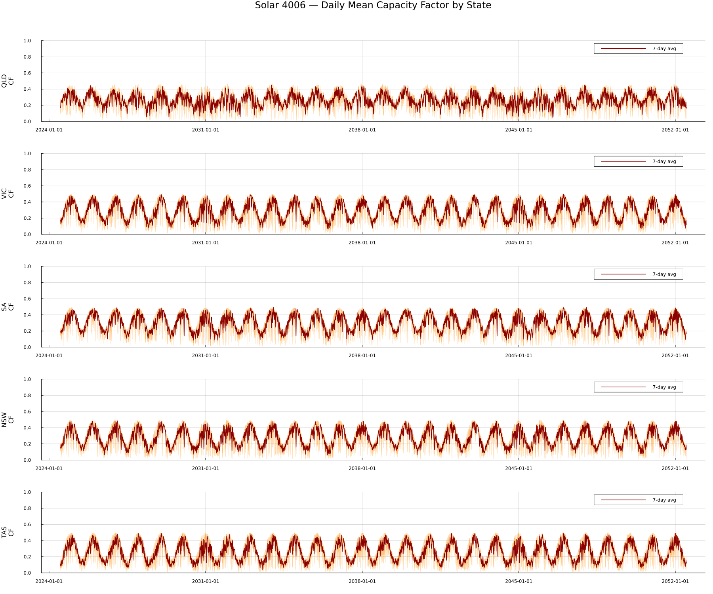
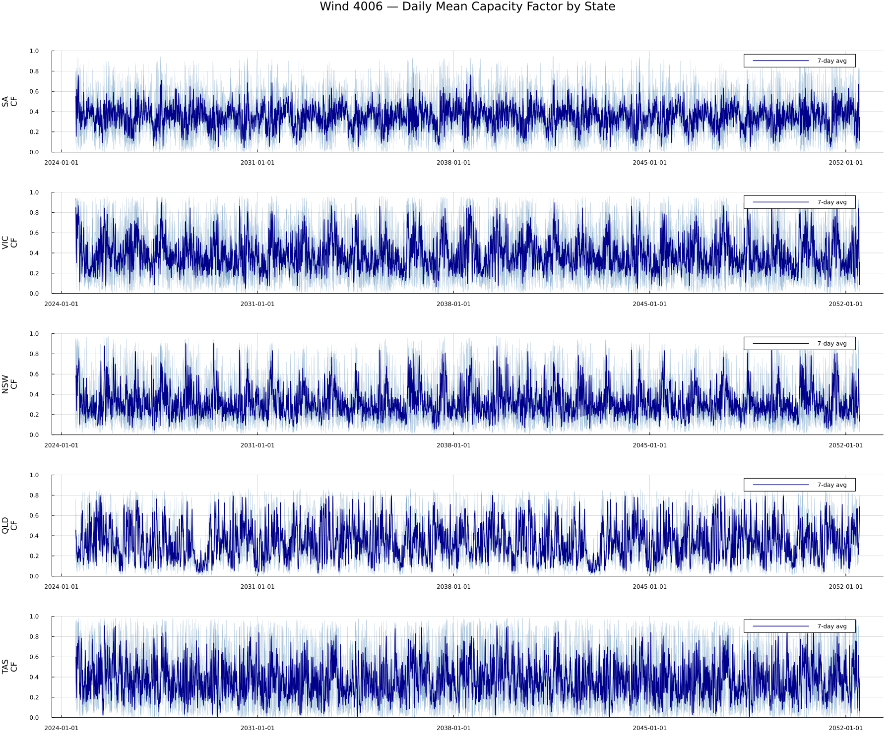
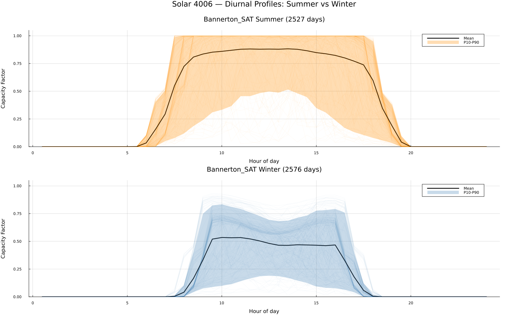
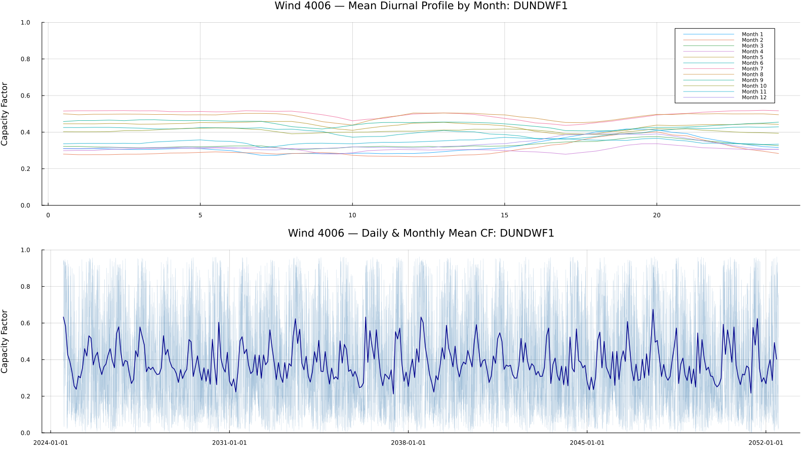
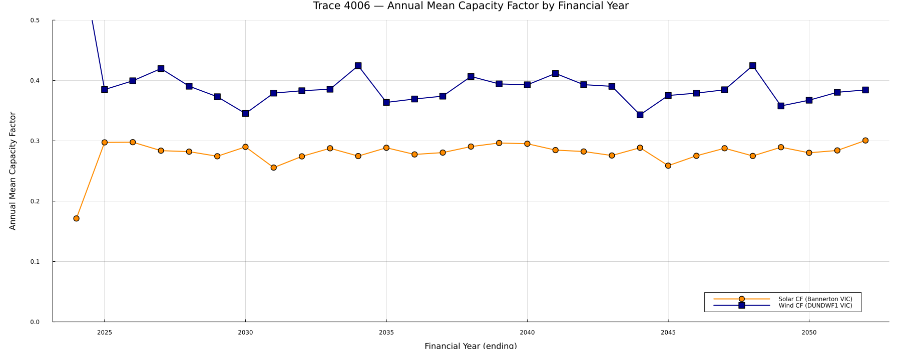

```@meta
EditURL = "../../../literate/eda/02_plot_4006_traces.jl"
```

# Reference trace 4006 profiles

Reference trace `4006` combines location-specific solar and wind profiles with a planning-horizon weather-year mapping. This page loads the raw solar and wind traces for one representative location per state, computes daily and seasonal capacity-factor structure, and builds each figure directly on the page.

Reference trace `4006` is not a climate projection. Its planning-year behaviour depends on the historical-year composition documented in [Parameters and mappings](@ref).

```@raw html
<details class="source-code"><summary>Show source code</summary>
```

````julia
ENV["GKSwstype"] = "100"

using CSV
using DataFrames
using Dates
using Printf
using Statistics
using Plots

gr();

const REPO_ROOT = normpath(get(
    ENV,
    "PISP_DOCS_REPO_ROOT",
    joinpath(@__DIR__, "..", "..", ".."),
))

include(joinpath(REPO_ROOT, "eda", "eda_support.jl"))
using .EdaSupport

EdaSupport.snapshot_metadata_line(REPO_ROOT; context = "2024 ISP raw trace downloads, trace year 4006")

const SCRIPT_STEM = "02_plot_4006_traces"
const TRACES = joinpath("data", "2024", "pisp-downloads", "Traces")  # kept relative: this is the path form recorded in the tables below
abs_path(relative_path) = joinpath(REPO_ROOT, relative_path)  # resolves a TRACES-relative path to an absolute file location for reading

const SOLAR_LOCATIONS = [
    ("VIC", "Bannerton_SAT"),
    ("NSW", "Darlington_Point_SAT"),
    ("QLD", "Banksia_SAT"),
    ("SA", "Bungala_One_SAT"),
    ("TAS", "Derby_SAT"),
]

const WIND_LOCATIONS = [
    ("VIC", "DUNDWF1"),
    ("NSW", "GULLRWF1"),
    ("QLD", "KABANWF1"),
    ("SA", "CLEMGPWF"),
    ("TAS", "MUSSELR1"),
]

const HH_COLS_SOL = string.(1:48)
const HH_COLS_WIND = [lpad(i, 2, '0') for i in 1:48]
const HALF_HOURS = collect(0.5:0.5:24.0)

function read_trace(path)
    return CSV.read(path, DataFrame)
end

function add_datetime!(df::DataFrame)
    df.datetime = Date.(df.Year, df.Month, df.Day)
    return df
end

function daily_cf(df::DataFrame, half_hour_cols)
    return [mean(row[col] for col in half_hour_cols) for row in eachrow(df)]
end

function load_traces(tech, trace_year, locations)
    dfs = Dict{String, DataFrame}()
    base = joinpath(TRACES, "$(tech)_$(trace_year)")
    for loc in locations
        file = joinpath(base, "$(loc)_RefYear$(trace_year).csv")
        if isfile(abs_path(file))
            df = read_trace(abs_path(file))
            add_datetime!(df)
            dfs[loc] = df
        end
    end
    return dfs
end

"""
    rolling_mean(values, window)

Rolling mean with a `window`-sized minimum period: the first `window - 1`
entries of the result are `missing` because no full window of prior values
exists yet.
"""
function rolling_mean(values, window)
    n = length(values)
    result = Vector{Union{Missing, Float64}}(missing, n)
    for i in window:n
        result[i] = mean(values[(i - window + 1):i])
    end
    return result
end

"""
    fy_year(date, n = 6)

Buckets a day into an Australian financial year (ending June), returned as
the ending year. A date that already falls on the last day of its month
advances `n` month-ends forward; any other date first rolls forward to its
own month's end (consuming one step), then advances `n - 1` more
month-ends. The bucket year is the year of that final month-end.
"""
function fy_year(date::Date, n::Int = 6)
    absolute_month = year(date) * 12 + (month(date) - 1)
    on_offset = day(date) == daysinmonth(date)
    shifted = absolute_month + n - (on_offset ? 0 : 1)
    return fld(shifted, 12)
end

function daily_cf_row(tech, state, loc, df::DataFrame, hh_cols)
    daily = daily_cf(df, hh_cols)
    rolling7 = rolling_mean(daily, 7)
    return (
        tech = tech,
        state = state,
        location = loc,
        n_days = length(daily),
        mean_daily_cf = mean(daily),
        std_daily_cf = std(daily),
        min_daily_cf = minimum(daily),
        max_daily_cf = maximum(daily),
        mean_rolling7_cf = mean(skipmissing(rolling7)),
    )
end
````

```@raw html
</details>
```

````
Snapshot: PISP.jl commit 0d31fb4+dirty, generated 2026-07-16 — 2024 ISP raw trace downloads, trace year 4006

````

## Step 1 — load the solar and wind reference traces for trace year 4006

One representative solar and one representative wind location per state are loaded for trace year `4006`.

```@raw html
<details class="source-code"><summary>Show source code</summary>
```

````julia
sol_4006 = load_traces("solar", 4006, last.(SOLAR_LOCATIONS))
wind_4006 = load_traces("wind", 4006, last.(WIND_LOCATIONS))

println("Loaded $(length(sol_4006)) solar locations, $(length(wind_4006)) wind locations for trace 4006")
````

```@raw html
</details>
```

````
Loaded 5 solar locations, 5 wind locations for trace 4006

````

## Step 2 — which representative locations loaded successfully

The loaded-location inventory records, for every representative solar and wind site, whether its trace file was found and its shape if so.

```@raw html
<details class="source-code"><summary>Show source code</summary>
```

````julia
loaded_location_rows = NamedTuple[]
for (state, loc) in SOLAR_LOCATIONS
    df = get(sol_4006, loc, nothing)
    push!(loaded_location_rows, (
        tech = "solar",
        state = state,
        location = loc,
        file_name = "$(loc)_RefYear4006.csv",
        loaded = df === nothing ? 0 : 1,
        rows = df === nothing ? missing : nrow(df),
        columns = df === nothing ? missing : ncol(df),
    ))
end
for (state, loc) in WIND_LOCATIONS
    df = get(wind_4006, loc, nothing)
    push!(loaded_location_rows, (
        tech = "wind",
        state = state,
        location = loc,
        file_name = "$(loc)_RefYear4006.csv",
        loaded = df === nothing ? 0 : 1,
        rows = df === nothing ? missing : nrow(df),
        columns = df === nothing ? missing : ncol(df),
    ))
end

loaded_locations = DataFrame(loaded_location_rows)
write_table(loaded_locations, SCRIPT_STEM, "loaded_locations")
loaded_locations
````

```@raw html
</details>
```

```@raw html
<div><div style = "float: left;"><span>10×7 DataFrame</span></div><div style = "clear: both;"></div></div><div class = "data-frame" style = "overflow-x: scroll;"><table class = "data-frame" style = "margin-bottom: 6px;"><thead><tr class = "columnLabelRow"><th class = "stubheadLabel" style = "font-weight: bold; text-align: right;">Row</th><th style = "text-align: left;">tech</th><th style = "text-align: left;">state</th><th style = "text-align: left;">location</th><th style = "text-align: left;">file_name</th><th style = "text-align: left;">loaded</th><th style = "text-align: left;">rows</th><th style = "text-align: left;">columns</th></tr><tr class = "columnLabelRow"><th class = "stubheadLabel" style = "font-weight: bold; text-align: right;"></th><th title = "String" style = "text-align: left;">String</th><th title = "String" style = "text-align: left;">String</th><th title = "String" style = "text-align: left;">String</th><th title = "String" style = "text-align: left;">String</th><th title = "Int64" style = "text-align: left;">Int64</th><th title = "Int64" style = "text-align: left;">Int64</th><th title = "Int64" style = "text-align: left;">Int64</th></tr></thead><tbody><tr class = "dataRow"><td class = "rowLabel" style = "font-weight: bold; text-align: right;">1</td><td style = "text-align: left;">solar</td><td style = "text-align: left;">VIC</td><td style = "text-align: left;">Bannerton_SAT</td><td style = "text-align: left;">Bannerton_SAT_RefYear4006.csv</td><td style = "text-align: right;">1</td><td style = "text-align: right;">10227</td><td style = "text-align: right;">52</td></tr><tr class = "dataRow"><td class = "rowLabel" style = "font-weight: bold; text-align: right;">2</td><td style = "text-align: left;">solar</td><td style = "text-align: left;">NSW</td><td style = "text-align: left;">Darlington_Point_SAT</td><td style = "text-align: left;">Darlington_Point_SAT_RefYear4006.csv</td><td style = "text-align: right;">1</td><td style = "text-align: right;">10227</td><td style = "text-align: right;">52</td></tr><tr class = "dataRow"><td class = "rowLabel" style = "font-weight: bold; text-align: right;">3</td><td style = "text-align: left;">solar</td><td style = "text-align: left;">QLD</td><td style = "text-align: left;">Banksia_SAT</td><td style = "text-align: left;">Banksia_SAT_RefYear4006.csv</td><td style = "text-align: right;">1</td><td style = "text-align: right;">10227</td><td style = "text-align: right;">52</td></tr><tr class = "dataRow"><td class = "rowLabel" style = "font-weight: bold; text-align: right;">4</td><td style = "text-align: left;">solar</td><td style = "text-align: left;">SA</td><td style = "text-align: left;">Bungala_One_SAT</td><td style = "text-align: left;">Bungala_One_SAT_RefYear4006.csv</td><td style = "text-align: right;">1</td><td style = "text-align: right;">10227</td><td style = "text-align: right;">52</td></tr><tr class = "dataRow"><td class = "rowLabel" style = "font-weight: bold; text-align: right;">5</td><td style = "text-align: left;">solar</td><td style = "text-align: left;">TAS</td><td style = "text-align: left;">Derby_SAT</td><td style = "text-align: left;">Derby_SAT_RefYear4006.csv</td><td style = "text-align: right;">1</td><td style = "text-align: right;">10227</td><td style = "text-align: right;">52</td></tr><tr class = "dataRow"><td class = "rowLabel" style = "font-weight: bold; text-align: right;">6</td><td style = "text-align: left;">wind</td><td style = "text-align: left;">VIC</td><td style = "text-align: left;">DUNDWF1</td><td style = "text-align: left;">DUNDWF1_RefYear4006.csv</td><td style = "text-align: right;">1</td><td style = "text-align: right;">10227</td><td style = "text-align: right;">52</td></tr><tr class = "dataRow"><td class = "rowLabel" style = "font-weight: bold; text-align: right;">7</td><td style = "text-align: left;">wind</td><td style = "text-align: left;">NSW</td><td style = "text-align: left;">GULLRWF1</td><td style = "text-align: left;">GULLRWF1_RefYear4006.csv</td><td style = "text-align: right;">1</td><td style = "text-align: right;">10227</td><td style = "text-align: right;">52</td></tr><tr class = "dataRow"><td class = "rowLabel" style = "font-weight: bold; text-align: right;">8</td><td style = "text-align: left;">wind</td><td style = "text-align: left;">QLD</td><td style = "text-align: left;">KABANWF1</td><td style = "text-align: left;">KABANWF1_RefYear4006.csv</td><td style = "text-align: right;">1</td><td style = "text-align: right;">10227</td><td style = "text-align: right;">52</td></tr><tr class = "dataRow"><td class = "rowLabel" style = "font-weight: bold; text-align: right;">9</td><td style = "text-align: left;">wind</td><td style = "text-align: left;">SA</td><td style = "text-align: left;">CLEMGPWF</td><td style = "text-align: left;">CLEMGPWF_RefYear4006.csv</td><td style = "text-align: right;">1</td><td style = "text-align: right;">10227</td><td style = "text-align: right;">52</td></tr><tr class = "dataRow"><td class = "rowLabel" style = "font-weight: bold; text-align: right;">10</td><td style = "text-align: left;">wind</td><td style = "text-align: left;">TAS</td><td style = "text-align: left;">MUSSELR1</td><td style = "text-align: left;">MUSSELR1_RefYear4006.csv</td><td style = "text-align: right;">1</td><td style = "text-align: right;">10227</td><td style = "text-align: right;">52</td></tr></tbody></table></div>
```

## Step 3 — daily capacity-factor summary

For each loaded location, the daily summary reports descriptive statistics of the daily mean capacity factor, including the mean of a 7-day rolling average.

```@raw html
<details class="source-code"><summary>Show source code</summary>
```

````julia
daily_cf_summary_rows = NamedTuple[]
for (state, loc) in SOLAR_LOCATIONS
    df = get(sol_4006, loc, nothing)
    df === nothing && continue
    push!(daily_cf_summary_rows, daily_cf_row("solar", state, loc, df, HH_COLS_SOL))
end
for (state, loc) in WIND_LOCATIONS
    df = get(wind_4006, loc, nothing)
    df === nothing && continue
    push!(daily_cf_summary_rows, daily_cf_row("wind", state, loc, df, HH_COLS_WIND))
end

daily_cf_summary = DataFrame(daily_cf_summary_rows)
write_table(daily_cf_summary, SCRIPT_STEM, "daily_cf_summary")
daily_cf_summary
````

```@raw html
</details>
```

```@raw html
<div><div style = "float: left;"><span>10×9 DataFrame</span></div><div style = "clear: both;"></div></div><div class = "data-frame" style = "overflow-x: scroll;"><table class = "data-frame" style = "margin-bottom: 6px;"><thead><tr class = "columnLabelRow"><th class = "stubheadLabel" style = "font-weight: bold; text-align: right;">Row</th><th style = "text-align: left;">tech</th><th style = "text-align: left;">state</th><th style = "text-align: left;">location</th><th style = "text-align: left;">n_days</th><th style = "text-align: left;">mean_daily_cf</th><th style = "text-align: left;">std_daily_cf</th><th style = "text-align: left;">min_daily_cf</th><th style = "text-align: left;">max_daily_cf</th><th style = "text-align: left;">mean_rolling7_cf</th></tr><tr class = "columnLabelRow"><th class = "stubheadLabel" style = "font-weight: bold; text-align: right;"></th><th title = "String" style = "text-align: left;">String</th><th title = "String" style = "text-align: left;">String</th><th title = "String" style = "text-align: left;">String</th><th title = "Int64" style = "text-align: left;">Int64</th><th title = "Float64" style = "text-align: left;">Float64</th><th title = "Float64" style = "text-align: left;">Float64</th><th title = "Float64" style = "text-align: left;">Float64</th><th title = "Float64" style = "text-align: left;">Float64</th><th title = "Float64" style = "text-align: left;">Float64</th></tr></thead><tbody><tr class = "dataRow"><td class = "rowLabel" style = "font-weight: bold; text-align: right;">1</td><td style = "text-align: left;">solar</td><td style = "text-align: left;">VIC</td><td style = "text-align: left;">Bannerton_SAT</td><td style = "text-align: right;">10227</td><td style = "text-align: right;">0.282755</td><td style = "text-align: right;">0.131951</td><td style = "text-align: right;">0.0095789</td><td style = "text-align: right;">0.500514</td><td style = "text-align: right;">0.282823</td></tr><tr class = "dataRow"><td class = "rowLabel" style = "font-weight: bold; text-align: right;">2</td><td style = "text-align: left;">solar</td><td style = "text-align: left;">NSW</td><td style = "text-align: left;">Darlington_Point_SAT</td><td style = "text-align: right;">10227</td><td style = "text-align: right;">0.275729</td><td style = "text-align: right;">0.130218</td><td style = "text-align: right;">0.00911927</td><td style = "text-align: right;">0.495879</td><td style = "text-align: right;">0.2758</td></tr><tr class = "dataRow"><td class = "rowLabel" style = "font-weight: bold; text-align: right;">3</td><td style = "text-align: left;">solar</td><td style = "text-align: left;">QLD</td><td style = "text-align: left;">Banksia_SAT</td><td style = "text-align: right;">10227</td><td style = "text-align: right;">0.262995</td><td style = "text-align: right;">0.106228</td><td style = "text-align: right;">0.00712346</td><td style = "text-align: right;">0.46654</td><td style = "text-align: right;">0.26304</td></tr><tr class = "dataRow"><td class = "rowLabel" style = "font-weight: bold; text-align: right;">4</td><td style = "text-align: left;">solar</td><td style = "text-align: left;">SA</td><td style = "text-align: left;">Bungala_One_SAT</td><td style = "text-align: right;">10227</td><td style = "text-align: right;">0.295472</td><td style = "text-align: right;">0.126436</td><td style = "text-align: right;">0.0122899</td><td style = "text-align: right;">0.492928</td><td style = "text-align: right;">0.295525</td></tr><tr class = "dataRow"><td class = "rowLabel" style = "font-weight: bold; text-align: right;">5</td><td style = "text-align: left;">solar</td><td style = "text-align: left;">TAS</td><td style = "text-align: left;">Derby_SAT</td><td style = "text-align: right;">10227</td><td style = "text-align: right;">0.256992</td><td style = "text-align: right;">0.137548</td><td style = "text-align: right;">0.00850535</td><td style = "text-align: right;">0.500684</td><td style = "text-align: right;">0.257065</td></tr><tr class = "dataRow"><td class = "rowLabel" style = "font-weight: bold; text-align: right;">6</td><td style = "text-align: left;">wind</td><td style = "text-align: left;">VIC</td><td style = "text-align: left;">DUNDWF1</td><td style = "text-align: right;">10227</td><td style = "text-align: right;">0.38563</td><td style = "text-align: right;">0.265356</td><td style = "text-align: right;">0.000649813</td><td style = "text-align: right;">0.96303</td><td style = "text-align: right;">0.385482</td></tr><tr class = "dataRow"><td class = "rowLabel" style = "font-weight: bold; text-align: right;">7</td><td style = "text-align: left;">wind</td><td style = "text-align: left;">NSW</td><td style = "text-align: left;">GULLRWF1</td><td style = "text-align: right;">10227</td><td style = "text-align: right;">0.326027</td><td style = "text-align: right;">0.234427</td><td style = "text-align: right;">0.0</td><td style = "text-align: right;">0.9737</td><td style = "text-align: right;">0.326075</td></tr><tr class = "dataRow"><td class = "rowLabel" style = "font-weight: bold; text-align: right;">8</td><td style = "text-align: left;">wind</td><td style = "text-align: left;">QLD</td><td style = "text-align: left;">KABANWF1</td><td style = "text-align: right;">10227</td><td style = "text-align: right;">0.340004</td><td style = "text-align: right;">0.226991</td><td style = "text-align: right;">0.00196787</td><td style = "text-align: right;">0.864389</td><td style = "text-align: right;">0.339832</td></tr><tr class = "dataRow"><td class = "rowLabel" style = "font-weight: bold; text-align: right;">9</td><td style = "text-align: left;">wind</td><td style = "text-align: left;">SA</td><td style = "text-align: left;">CLEMGPWF</td><td style = "text-align: right;">10227</td><td style = "text-align: right;">0.352498</td><td style = "text-align: right;">0.211693</td><td style = "text-align: right;">0.0</td><td style = "text-align: right;">0.948054</td><td style = "text-align: right;">0.352411</td></tr><tr class = "dataRow"><td class = "rowLabel" style = "font-weight: bold; text-align: right;">10</td><td style = "text-align: left;">wind</td><td style = "text-align: left;">TAS</td><td style = "text-align: left;">MUSSELR1</td><td style = "text-align: right;">10227</td><td style = "text-align: right;">0.377225</td><td style = "text-align: right;">0.286636</td><td style = "text-align: right;">0.0</td><td style = "text-align: right;">0.987126</td><td style = "text-align: right;">0.377288</td></tr></tbody></table></div>
```

## Step 4 — solar diurnal profile at the Victorian representative location

The half-hourly diurnal profile at `Bannerton_SAT` is split into summer (Dec-Feb) and winter (Jun-Aug) days, reporting the mean, 10th and 90th percentile capacity factor at each half hour.

```@raw html
<details class="source-code"><summary>Show source code</summary>
```

````julia
df_prof = sol_4006["Bannerton_SAT"]
summer_mask = in.(df_prof.Month, Ref((12, 1, 2)))
winter_mask = in.(df_prof.Month, Ref((6, 7, 8)))

solar_diurnal_profile_rows = NamedTuple[]
for (season, mask) in (("Summer", summer_mask), ("Winter", winter_mask))
    df_season = df_prof[mask, :]
    n_days_season = nrow(df_season)
    for (hh, hh_col) in zip(HALF_HOURS, HH_COLS_SOL)
        vals = df_season[!, hh_col]
        push!(solar_diurnal_profile_rows, (
            location = "Bannerton_SAT",
            season = season,
            half_hour = hh,
            n_days = n_days_season,
            mean_cf = mean(vals),
            p10_cf = quantile(vals, 0.1),
            p90_cf = quantile(vals, 0.9),
        ))
    end
end

solar_diurnal_profile = DataFrame(solar_diurnal_profile_rows)
write_table(solar_diurnal_profile, SCRIPT_STEM, "solar_diurnal_profile")
solar_diurnal_profile
````

```@raw html
</details>
```

```@raw html
<div><div style = "float: left;"><span>96×7 DataFrame</span></div><div style = "clear: both;"></div></div><div class = "data-frame" style = "overflow-x: scroll;"><table class = "data-frame" style = "margin-bottom: 6px;"><thead><tr class = "columnLabelRow"><th class = "stubheadLabel" style = "font-weight: bold; text-align: right;">Row</th><th style = "text-align: left;">location</th><th style = "text-align: left;">season</th><th style = "text-align: left;">half_hour</th><th style = "text-align: left;">n_days</th><th style = "text-align: left;">mean_cf</th><th style = "text-align: left;">p10_cf</th><th style = "text-align: left;">p90_cf</th></tr><tr class = "columnLabelRow"><th class = "stubheadLabel" style = "font-weight: bold; text-align: right;"></th><th title = "String" style = "text-align: left;">String</th><th title = "String" style = "text-align: left;">String</th><th title = "Float64" style = "text-align: left;">Float64</th><th title = "Int64" style = "text-align: left;">Int64</th><th title = "Float64" style = "text-align: left;">Float64</th><th title = "Float64" style = "text-align: left;">Float64</th><th title = "Float64" style = "text-align: left;">Float64</th></tr></thead><tbody><tr class = "dataRow"><td class = "rowLabel" style = "font-weight: bold; text-align: right;">1</td><td style = "text-align: left;">Bannerton_SAT</td><td style = "text-align: left;">Summer</td><td style = "text-align: right;">0.5</td><td style = "text-align: right;">2527</td><td style = "text-align: right;">0.0</td><td style = "text-align: right;">0.0</td><td style = "text-align: right;">0.0</td></tr><tr class = "dataRow"><td class = "rowLabel" style = "font-weight: bold; text-align: right;">2</td><td style = "text-align: left;">Bannerton_SAT</td><td style = "text-align: left;">Summer</td><td style = "text-align: right;">1.0</td><td style = "text-align: right;">2527</td><td style = "text-align: right;">0.0</td><td style = "text-align: right;">0.0</td><td style = "text-align: right;">0.0</td></tr><tr class = "dataRow"><td class = "rowLabel" style = "font-weight: bold; text-align: right;">3</td><td style = "text-align: left;">Bannerton_SAT</td><td style = "text-align: left;">Summer</td><td style = "text-align: right;">1.5</td><td style = "text-align: right;">2527</td><td style = "text-align: right;">0.0</td><td style = "text-align: right;">0.0</td><td style = "text-align: right;">0.0</td></tr><tr class = "dataRow"><td class = "rowLabel" style = "font-weight: bold; text-align: right;">4</td><td style = "text-align: left;">Bannerton_SAT</td><td style = "text-align: left;">Summer</td><td style = "text-align: right;">2.0</td><td style = "text-align: right;">2527</td><td style = "text-align: right;">0.0</td><td style = "text-align: right;">0.0</td><td style = "text-align: right;">0.0</td></tr><tr class = "dataRow"><td class = "rowLabel" style = "font-weight: bold; text-align: right;">5</td><td style = "text-align: left;">Bannerton_SAT</td><td style = "text-align: left;">Summer</td><td style = "text-align: right;">2.5</td><td style = "text-align: right;">2527</td><td style = "text-align: right;">0.0</td><td style = "text-align: right;">0.0</td><td style = "text-align: right;">0.0</td></tr><tr class = "dataRow"><td class = "rowLabel" style = "font-weight: bold; text-align: right;">6</td><td style = "text-align: left;">Bannerton_SAT</td><td style = "text-align: left;">Summer</td><td style = "text-align: right;">3.0</td><td style = "text-align: right;">2527</td><td style = "text-align: right;">0.0</td><td style = "text-align: right;">0.0</td><td style = "text-align: right;">0.0</td></tr><tr class = "dataRow"><td class = "rowLabel" style = "font-weight: bold; text-align: right;">7</td><td style = "text-align: left;">Bannerton_SAT</td><td style = "text-align: left;">Summer</td><td style = "text-align: right;">3.5</td><td style = "text-align: right;">2527</td><td style = "text-align: right;">0.0</td><td style = "text-align: right;">0.0</td><td style = "text-align: right;">0.0</td></tr><tr class = "dataRow"><td class = "rowLabel" style = "font-weight: bold; text-align: right;">8</td><td style = "text-align: left;">Bannerton_SAT</td><td style = "text-align: left;">Summer</td><td style = "text-align: right;">4.0</td><td style = "text-align: right;">2527</td><td style = "text-align: right;">0.0</td><td style = "text-align: right;">0.0</td><td style = "text-align: right;">0.0</td></tr><tr class = "dataRow"><td class = "rowLabel" style = "font-weight: bold; text-align: right;">9</td><td style = "text-align: left;">Bannerton_SAT</td><td style = "text-align: left;">Summer</td><td style = "text-align: right;">4.5</td><td style = "text-align: right;">2527</td><td style = "text-align: right;">0.0</td><td style = "text-align: right;">0.0</td><td style = "text-align: right;">0.0</td></tr><tr class = "dataRow"><td class = "rowLabel" style = "font-weight: bold; text-align: right;">10</td><td style = "text-align: left;">Bannerton_SAT</td><td style = "text-align: left;">Summer</td><td style = "text-align: right;">5.0</td><td style = "text-align: right;">2527</td><td style = "text-align: right;">0.0</td><td style = "text-align: right;">0.0</td><td style = "text-align: right;">0.0</td></tr><tr class = "dataRow"><td class = "rowLabel" style = "font-weight: bold; text-align: right;">11</td><td style = "text-align: left;">Bannerton_SAT</td><td style = "text-align: left;">Summer</td><td style = "text-align: right;">5.5</td><td style = "text-align: right;">2527</td><td style = "text-align: right;">0.00112645</td><td style = "text-align: right;">0.0</td><td style = "text-align: right;">0.00225437</td></tr><tr class = "dataRow"><td class = "rowLabel" style = "font-weight: bold; text-align: right;">12</td><td style = "text-align: left;">Bannerton_SAT</td><td style = "text-align: left;">Summer</td><td style = "text-align: right;">6.0</td><td style = "text-align: right;">2527</td><td style = "text-align: right;">0.0338495</td><td style = "text-align: right;">0.0</td><td style = "text-align: right;">0.101698</td></tr><tr class = "dataRow"><td class = "rowLabel" style = "font-weight: bold; text-align: right;">13</td><td style = "text-align: left;">Bannerton_SAT</td><td style = "text-align: left;">Summer</td><td style = "text-align: right;">6.5</td><td style = "text-align: right;">2527</td><td style = "text-align: right;">0.158414</td><td style = "text-align: right;">0.00515178</td><td style = "text-align: right;">0.405485</td></tr><tr class = "dataRow"><td class = "rowLabel" style = "font-weight: bold; text-align: right;">14</td><td style = "text-align: left;">Bannerton_SAT</td><td style = "text-align: left;">Summer</td><td style = "text-align: right;">7.0</td><td style = "text-align: right;">2527</td><td style = "text-align: right;">0.293433</td><td style = "text-align: right;">0.0506821</td><td style = "text-align: right;">0.506098</td></tr><tr class = "dataRow"><td class = "rowLabel" style = "font-weight: bold; text-align: right;">15</td><td style = "text-align: left;">Bannerton_SAT</td><td style = "text-align: left;">Summer</td><td style = "text-align: right;">7.5</td><td style = "text-align: right;">2527</td><td style = "text-align: right;">0.551065</td><td style = "text-align: right;">0.0791632</td><td style = "text-align: right;">0.989672</td></tr><tr class = "dataRow"><td class = "rowLabel" style = "font-weight: bold; text-align: right;">16</td><td style = "text-align: left;">Bannerton_SAT</td><td style = "text-align: left;">Summer</td><td style = "text-align: right;">8.0</td><td style = "text-align: right;">2527</td><td style = "text-align: right;">0.724201</td><td style = "text-align: right;">0.119949</td><td style = "text-align: right;">1.0</td></tr><tr class = "dataRow"><td class = "rowLabel" style = "font-weight: bold; text-align: right;">17</td><td style = "text-align: left;">Bannerton_SAT</td><td style = "text-align: left;">Summer</td><td style = "text-align: right;">8.5</td><td style = "text-align: right;">2527</td><td style = "text-align: right;">0.808047</td><td style = "text-align: right;">0.186438</td><td style = "text-align: right;">1.0</td></tr><tr class = "dataRow"><td class = "rowLabel" style = "font-weight: bold; text-align: right;">18</td><td style = "text-align: left;">Bannerton_SAT</td><td style = "text-align: left;">Summer</td><td style = "text-align: right;">9.0</td><td style = "text-align: right;">2527</td><td style = "text-align: right;">0.835295</td><td style = "text-align: right;">0.240157</td><td style = "text-align: right;">1.0</td></tr><tr class = "dataRow"><td class = "rowLabel" style = "font-weight: bold; text-align: right;">19</td><td style = "text-align: left;">Bannerton_SAT</td><td style = "text-align: left;">Summer</td><td style = "text-align: right;">9.5</td><td style = "text-align: right;">2527</td><td style = "text-align: right;">0.852269</td><td style = "text-align: right;">0.310091</td><td style = "text-align: right;">1.0</td></tr><tr class = "dataRow"><td class = "rowLabel" style = "font-weight: bold; text-align: right;">20</td><td style = "text-align: left;">Bannerton_SAT</td><td style = "text-align: left;">Summer</td><td style = "text-align: right;">10.0</td><td style = "text-align: right;">2527</td><td style = "text-align: right;">0.859632</td><td style = "text-align: right;">0.333368</td><td style = "text-align: right;">1.0</td></tr><tr class = "dataRow"><td class = "rowLabel" style = "font-weight: bold; text-align: right;">21</td><td style = "text-align: left;">Bannerton_SAT</td><td style = "text-align: left;">Summer</td><td style = "text-align: right;">10.5</td><td style = "text-align: right;">2527</td><td style = "text-align: right;">0.869157</td><td style = "text-align: right;">0.366343</td><td style = "text-align: right;">1.0</td></tr><tr class = "dataRow"><td class = "rowLabel" style = "font-weight: bold; text-align: right;">22</td><td style = "text-align: left;">Bannerton_SAT</td><td style = "text-align: left;">Summer</td><td style = "text-align: right;">11.0</td><td style = "text-align: right;">2527</td><td style = "text-align: right;">0.878689</td><td style = "text-align: right;">0.455965</td><td style = "text-align: right;">1.0</td></tr><tr class = "dataRow"><td class = "rowLabel" style = "font-weight: bold; text-align: right;">23</td><td style = "text-align: left;">Bannerton_SAT</td><td style = "text-align: left;">Summer</td><td style = "text-align: right;">11.5</td><td style = "text-align: right;">2527</td><td style = "text-align: right;">0.880964</td><td style = "text-align: right;">0.456015</td><td style = "text-align: right;">1.0</td></tr><tr class = "dataRow"><td class = "rowLabel" style = "font-weight: bold; text-align: right;">24</td><td style = "text-align: left;">Bannerton_SAT</td><td style = "text-align: left;">Summer</td><td style = "text-align: right;">12.0</td><td style = "text-align: right;">2527</td><td style = "text-align: right;">0.878934</td><td style = "text-align: right;">0.482956</td><td style = "text-align: right;">1.0</td></tr><tr class = "dataRow"><td class = "rowLabel" style = "font-weight: bold; text-align: right;">25</td><td style = "text-align: left;">Bannerton_SAT</td><td style = "text-align: left;">Summer</td><td style = "text-align: right;">12.5</td><td style = "text-align: right;">2527</td><td style = "text-align: right;">0.880215</td><td style = "text-align: right;">0.497711</td><td style = "text-align: right;">1.0</td></tr><tr class = "dataRow"><td class = "rowLabel" style = "font-weight: bold; text-align: right;">26</td><td style = "text-align: left;">Bannerton_SAT</td><td style = "text-align: left;">Summer</td><td style = "text-align: right;">13.0</td><td style = "text-align: right;">2527</td><td style = "text-align: right;">0.878858</td><td style = "text-align: right;">0.487522</td><td style = "text-align: right;">1.0</td></tr><tr class = "dataRow"><td class = "rowLabel" style = "font-weight: bold; text-align: right;">27</td><td style = "text-align: left;">Bannerton_SAT</td><td style = "text-align: left;">Summer</td><td style = "text-align: right;">13.5</td><td style = "text-align: right;">2527</td><td style = "text-align: right;">0.88244</td><td style = "text-align: right;">0.515594</td><td style = "text-align: right;">1.0</td></tr><tr class = "dataRow"><td class = "rowLabel" style = "font-weight: bold; text-align: right;">28</td><td style = "text-align: left;">Bannerton_SAT</td><td style = "text-align: left;">Summer</td><td style = "text-align: right;">14.0</td><td style = "text-align: right;">2527</td><td style = "text-align: right;">0.878134</td><td style = "text-align: right;">0.481139</td><td style = "text-align: right;">1.0</td></tr><tr class = "dataRow"><td class = "rowLabel" style = "font-weight: bold; text-align: right;">29</td><td style = "text-align: left;">Bannerton_SAT</td><td style = "text-align: left;">Summer</td><td style = "text-align: right;">14.5</td><td style = "text-align: right;">2527</td><td style = "text-align: right;">0.865373</td><td style = "text-align: right;">0.447599</td><td style = "text-align: right;">1.0</td></tr><tr class = "dataRow"><td class = "rowLabel" style = "font-weight: bold; text-align: right;">30</td><td style = "text-align: left;">Bannerton_SAT</td><td style = "text-align: left;">Summer</td><td style = "text-align: right;">15.0</td><td style = "text-align: right;">2527</td><td style = "text-align: right;">0.848161</td><td style = "text-align: right;">0.348466</td><td style = "text-align: right;">1.0</td></tr><tr class = "dataRow"><td class = "rowLabel" style = "font-weight: bold; text-align: right;">31</td><td style = "text-align: left;">Bannerton_SAT</td><td style = "text-align: left;">Summer</td><td style = "text-align: right;">15.5</td><td style = "text-align: right;">2527</td><td style = "text-align: right;">0.837886</td><td style = "text-align: right;">0.308027</td><td style = "text-align: right;">1.0</td></tr><tr class = "dataRow"><td class = "rowLabel" style = "font-weight: bold; text-align: right;">32</td><td style = "text-align: left;">Bannerton_SAT</td><td style = "text-align: left;">Summer</td><td style = "text-align: right;">16.0</td><td style = "text-align: right;">2527</td><td style = "text-align: right;">0.823186</td><td style = "text-align: right;">0.238623</td><td style = "text-align: right;">1.0</td></tr><tr class = "dataRow"><td class = "rowLabel" style = "font-weight: bold; text-align: right;">33</td><td style = "text-align: left;">Bannerton_SAT</td><td style = "text-align: left;">Summer</td><td style = "text-align: right;">16.5</td><td style = "text-align: right;">2527</td><td style = "text-align: right;">0.800563</td><td style = "text-align: right;">0.169806</td><td style = "text-align: right;">1.0</td></tr><tr class = "dataRow"><td class = "rowLabel" style = "font-weight: bold; text-align: right;">34</td><td style = "text-align: left;">Bannerton_SAT</td><td style = "text-align: left;">Summer</td><td style = "text-align: right;">17.0</td><td style = "text-align: right;">2527</td><td style = "text-align: right;">0.771118</td><td style = "text-align: right;">0.131601</td><td style = "text-align: right;">1.0</td></tr><tr class = "dataRow"><td class = "rowLabel" style = "font-weight: bold; text-align: right;">35</td><td style = "text-align: left;">Bannerton_SAT</td><td style = "text-align: left;">Summer</td><td style = "text-align: right;">17.5</td><td style = "text-align: right;">2527</td><td style = "text-align: right;">0.737642</td><td style = "text-align: right;">0.105189</td><td style = "text-align: right;">1.0</td></tr><tr class = "dataRow"><td class = "rowLabel" style = "font-weight: bold; text-align: right;">36</td><td style = "text-align: left;">Bannerton_SAT</td><td style = "text-align: left;">Summer</td><td style = "text-align: right;">18.0</td><td style = "text-align: right;">2527</td><td style = "text-align: right;">0.597066</td><td style = "text-align: right;">0.0795343</td><td style = "text-align: right;">0.95063</td></tr><tr class = "dataRow"><td class = "rowLabel" style = "font-weight: bold; text-align: right;">37</td><td style = "text-align: left;">Bannerton_SAT</td><td style = "text-align: left;">Summer</td><td style = "text-align: right;">18.5</td><td style = "text-align: right;">2527</td><td style = "text-align: right;">0.345505</td><td style = "text-align: right;">0.0567868</td><td style = "text-align: right;">0.484176</td></tr><tr class = "dataRow"><td class = "rowLabel" style = "font-weight: bold; text-align: right;">38</td><td style = "text-align: left;">Bannerton_SAT</td><td style = "text-align: left;">Summer</td><td style = "text-align: right;">19.0</td><td style = "text-align: right;">2527</td><td style = "text-align: right;">0.189567</td><td style = "text-align: right;">0.034255</td><td style = "text-align: right;">0.379718</td></tr><tr class = "dataRow"><td class = "rowLabel" style = "font-weight: bold; text-align: right;">39</td><td style = "text-align: left;">Bannerton_SAT</td><td style = "text-align: left;">Summer</td><td style = "text-align: right;">19.5</td><td style = "text-align: right;">2527</td><td style = "text-align: right;">0.0412864</td><td style = "text-align: right;">0.0</td><td style = "text-align: right;">0.0969854</td></tr><tr class = "dataRow"><td class = "rowLabel" style = "font-weight: bold; text-align: right;">40</td><td style = "text-align: left;">Bannerton_SAT</td><td style = "text-align: left;">Summer</td><td style = "text-align: right;">20.0</td><td style = "text-align: right;">2527</td><td style = "text-align: right;">0.0</td><td style = "text-align: right;">0.0</td><td style = "text-align: right;">0.0</td></tr><tr class = "dataRow"><td class = "rowLabel" style = "font-weight: bold; text-align: right;">41</td><td style = "text-align: left;">Bannerton_SAT</td><td style = "text-align: left;">Summer</td><td style = "text-align: right;">20.5</td><td style = "text-align: right;">2527</td><td style = "text-align: right;">0.0</td><td style = "text-align: right;">0.0</td><td style = "text-align: right;">0.0</td></tr><tr class = "dataRow"><td class = "rowLabel" style = "font-weight: bold; text-align: right;">42</td><td style = "text-align: left;">Bannerton_SAT</td><td style = "text-align: left;">Summer</td><td style = "text-align: right;">21.0</td><td style = "text-align: right;">2527</td><td style = "text-align: right;">0.0</td><td style = "text-align: right;">0.0</td><td style = "text-align: right;">0.0</td></tr><tr class = "dataRow"><td class = "rowLabel" style = "font-weight: bold; text-align: right;">43</td><td style = "text-align: left;">Bannerton_SAT</td><td style = "text-align: left;">Summer</td><td style = "text-align: right;">21.5</td><td style = "text-align: right;">2527</td><td style = "text-align: right;">0.0</td><td style = "text-align: right;">0.0</td><td style = "text-align: right;">0.0</td></tr><tr class = "dataRow"><td class = "rowLabel" style = "font-weight: bold; text-align: right;">44</td><td style = "text-align: left;">Bannerton_SAT</td><td style = "text-align: left;">Summer</td><td style = "text-align: right;">22.0</td><td style = "text-align: right;">2527</td><td style = "text-align: right;">0.0</td><td style = "text-align: right;">0.0</td><td style = "text-align: right;">0.0</td></tr><tr class = "dataRow"><td class = "rowLabel" style = "font-weight: bold; text-align: right;">45</td><td style = "text-align: left;">Bannerton_SAT</td><td style = "text-align: left;">Summer</td><td style = "text-align: right;">22.5</td><td style = "text-align: right;">2527</td><td style = "text-align: right;">0.0</td><td style = "text-align: right;">0.0</td><td style = "text-align: right;">0.0</td></tr><tr class = "dataRow"><td class = "rowLabel" style = "font-weight: bold; text-align: right;">46</td><td style = "text-align: left;">Bannerton_SAT</td><td style = "text-align: left;">Summer</td><td style = "text-align: right;">23.0</td><td style = "text-align: right;">2527</td><td style = "text-align: right;">0.0</td><td style = "text-align: right;">0.0</td><td style = "text-align: right;">0.0</td></tr><tr class = "dataRow"><td class = "rowLabel" style = "font-weight: bold; text-align: right;">47</td><td style = "text-align: left;">Bannerton_SAT</td><td style = "text-align: left;">Summer</td><td style = "text-align: right;">23.5</td><td style = "text-align: right;">2527</td><td style = "text-align: right;">0.0</td><td style = "text-align: right;">0.0</td><td style = "text-align: right;">0.0</td></tr><tr class = "dataRow"><td class = "rowLabel" style = "font-weight: bold; text-align: right;">48</td><td style = "text-align: left;">Bannerton_SAT</td><td style = "text-align: left;">Summer</td><td style = "text-align: right;">24.0</td><td style = "text-align: right;">2527</td><td style = "text-align: right;">0.0</td><td style = "text-align: right;">0.0</td><td style = "text-align: right;">0.0</td></tr><tr class = "dataRow"><td class = "rowLabel" style = "font-weight: bold; text-align: right;">49</td><td style = "text-align: left;">Bannerton_SAT</td><td style = "text-align: left;">Winter</td><td style = "text-align: right;">0.5</td><td style = "text-align: right;">2576</td><td style = "text-align: right;">0.0</td><td style = "text-align: right;">0.0</td><td style = "text-align: right;">0.0</td></tr><tr class = "dataRow"><td class = "rowLabel" style = "font-weight: bold; text-align: right;">50</td><td style = "text-align: left;">Bannerton_SAT</td><td style = "text-align: left;">Winter</td><td style = "text-align: right;">1.0</td><td style = "text-align: right;">2576</td><td style = "text-align: right;">0.0</td><td style = "text-align: right;">0.0</td><td style = "text-align: right;">0.0</td></tr><tr class = "dataRow"><td class = "rowLabel" style = "font-weight: bold; text-align: right;">51</td><td style = "text-align: left;">Bannerton_SAT</td><td style = "text-align: left;">Winter</td><td style = "text-align: right;">1.5</td><td style = "text-align: right;">2576</td><td style = "text-align: right;">0.0</td><td style = "text-align: right;">0.0</td><td style = "text-align: right;">0.0</td></tr><tr class = "dataRow"><td class = "rowLabel" style = "font-weight: bold; text-align: right;">52</td><td style = "text-align: left;">Bannerton_SAT</td><td style = "text-align: left;">Winter</td><td style = "text-align: right;">2.0</td><td style = "text-align: right;">2576</td><td style = "text-align: right;">0.0</td><td style = "text-align: right;">0.0</td><td style = "text-align: right;">0.0</td></tr><tr class = "dataRow"><td class = "rowLabel" style = "font-weight: bold; text-align: right;">53</td><td style = "text-align: left;">Bannerton_SAT</td><td style = "text-align: left;">Winter</td><td style = "text-align: right;">2.5</td><td style = "text-align: right;">2576</td><td style = "text-align: right;">0.0</td><td style = "text-align: right;">0.0</td><td style = "text-align: right;">0.0</td></tr><tr class = "dataRow"><td class = "rowLabel" style = "font-weight: bold; text-align: right;">54</td><td style = "text-align: left;">Bannerton_SAT</td><td style = "text-align: left;">Winter</td><td style = "text-align: right;">3.0</td><td style = "text-align: right;">2576</td><td style = "text-align: right;">0.0</td><td style = "text-align: right;">0.0</td><td style = "text-align: right;">0.0</td></tr><tr class = "dataRow"><td class = "rowLabel" style = "font-weight: bold; text-align: right;">55</td><td style = "text-align: left;">Bannerton_SAT</td><td style = "text-align: left;">Winter</td><td style = "text-align: right;">3.5</td><td style = "text-align: right;">2576</td><td style = "text-align: right;">0.0</td><td style = "text-align: right;">0.0</td><td style = "text-align: right;">0.0</td></tr><tr class = "dataRow"><td class = "rowLabel" style = "font-weight: bold; text-align: right;">56</td><td style = "text-align: left;">Bannerton_SAT</td><td style = "text-align: left;">Winter</td><td style = "text-align: right;">4.0</td><td style = "text-align: right;">2576</td><td style = "text-align: right;">0.0</td><td style = "text-align: right;">0.0</td><td style = "text-align: right;">0.0</td></tr><tr class = "dataRow"><td class = "rowLabel" style = "font-weight: bold; text-align: right;">57</td><td style = "text-align: left;">Bannerton_SAT</td><td style = "text-align: left;">Winter</td><td style = "text-align: right;">4.5</td><td style = "text-align: right;">2576</td><td style = "text-align: right;">0.0</td><td style = "text-align: right;">0.0</td><td style = "text-align: right;">0.0</td></tr><tr class = "dataRow"><td class = "rowLabel" style = "font-weight: bold; text-align: right;">58</td><td style = "text-align: left;">Bannerton_SAT</td><td style = "text-align: left;">Winter</td><td style = "text-align: right;">5.0</td><td style = "text-align: right;">2576</td><td style = "text-align: right;">0.0</td><td style = "text-align: right;">0.0</td><td style = "text-align: right;">0.0</td></tr><tr class = "dataRow"><td class = "rowLabel" style = "font-weight: bold; text-align: right;">59</td><td style = "text-align: left;">Bannerton_SAT</td><td style = "text-align: left;">Winter</td><td style = "text-align: right;">5.5</td><td style = "text-align: right;">2576</td><td style = "text-align: right;">0.0</td><td style = "text-align: right;">0.0</td><td style = "text-align: right;">0.0</td></tr><tr class = "dataRow"><td class = "rowLabel" style = "font-weight: bold; text-align: right;">60</td><td style = "text-align: left;">Bannerton_SAT</td><td style = "text-align: left;">Winter</td><td style = "text-align: right;">6.0</td><td style = "text-align: right;">2576</td><td style = "text-align: right;">0.0</td><td style = "text-align: right;">0.0</td><td style = "text-align: right;">0.0</td></tr><tr class = "dataRow"><td class = "rowLabel" style = "font-weight: bold; text-align: right;">61</td><td style = "text-align: left;">Bannerton_SAT</td><td style = "text-align: left;">Winter</td><td style = "text-align: right;">6.5</td><td style = "text-align: right;">2576</td><td style = "text-align: right;">0.0</td><td style = "text-align: right;">0.0</td><td style = "text-align: right;">0.0</td></tr><tr class = "dataRow"><td class = "rowLabel" style = "font-weight: bold; text-align: right;">62</td><td style = "text-align: left;">Bannerton_SAT</td><td style = "text-align: left;">Winter</td><td style = "text-align: right;">7.0</td><td style = "text-align: right;">2576</td><td style = "text-align: right;">0.0</td><td style = "text-align: right;">0.0</td><td style = "text-align: right;">0.0</td></tr><tr class = "dataRow"><td class = "rowLabel" style = "font-weight: bold; text-align: right;">63</td><td style = "text-align: left;">Bannerton_SAT</td><td style = "text-align: left;">Winter</td><td style = "text-align: right;">7.5</td><td style = "text-align: right;">2576</td><td style = "text-align: right;">0.00464521</td><td style = "text-align: right;">0.0</td><td style = "text-align: right;">0.0135734</td></tr><tr class = "dataRow"><td class = "rowLabel" style = "font-weight: bold; text-align: right;">64</td><td style = "text-align: left;">Bannerton_SAT</td><td style = "text-align: left;">Winter</td><td style = "text-align: right;">8.0</td><td style = "text-align: right;">2576</td><td style = "text-align: right;">0.041447</td><td style = "text-align: right;">0.00302342</td><td style = "text-align: right;">0.10273</td></tr><tr class = "dataRow"><td class = "rowLabel" style = "font-weight: bold; text-align: right;">65</td><td style = "text-align: left;">Bannerton_SAT</td><td style = "text-align: left;">Winter</td><td style = "text-align: right;">8.5</td><td style = "text-align: right;">2576</td><td style = "text-align: right;">0.165315</td><td style = "text-align: right;">0.0435124</td><td style = "text-align: right;">0.395085</td></tr><tr class = "dataRow"><td class = "rowLabel" style = "font-weight: bold; text-align: right;">66</td><td style = "text-align: left;">Bannerton_SAT</td><td style = "text-align: left;">Winter</td><td style = "text-align: right;">9.0</td><td style = "text-align: right;">2576</td><td style = "text-align: right;">0.331962</td><td style = "text-align: right;">0.0751844</td><td style = "text-align: right;">0.748802</td></tr><tr class = "dataRow"><td class = "rowLabel" style = "font-weight: bold; text-align: right;">67</td><td style = "text-align: left;">Bannerton_SAT</td><td style = "text-align: left;">Winter</td><td style = "text-align: right;">9.5</td><td style = "text-align: right;">2576</td><td style = "text-align: right;">0.520152</td><td style = "text-align: right;">0.0887947</td><td style = "text-align: right;">0.823594</td></tr><tr class = "dataRow"><td class = "rowLabel" style = "font-weight: bold; text-align: right;">68</td><td style = "text-align: left;">Bannerton_SAT</td><td style = "text-align: left;">Winter</td><td style = "text-align: right;">10.0</td><td style = "text-align: right;">2576</td><td style = "text-align: right;">0.534694</td><td style = "text-align: right;">0.0998846</td><td style = "text-align: right;">0.832588</td></tr><tr class = "dataRow"><td class = "rowLabel" style = "font-weight: bold; text-align: right;">69</td><td style = "text-align: left;">Bannerton_SAT</td><td style = "text-align: left;">Winter</td><td style = "text-align: right;">10.5</td><td style = "text-align: right;">2576</td><td style = "text-align: right;">0.532482</td><td style = "text-align: right;">0.114233</td><td style = "text-align: right;">0.811134</td></tr><tr class = "dataRow"><td class = "rowLabel" style = "font-weight: bold; text-align: right;">70</td><td style = "text-align: left;">Bannerton_SAT</td><td style = "text-align: left;">Winter</td><td style = "text-align: right;">11.0</td><td style = "text-align: right;">2576</td><td style = "text-align: right;">0.533879</td><td style = "text-align: right;">0.141766</td><td style = "text-align: right;">0.791824</td></tr><tr class = "dataRow"><td class = "rowLabel" style = "font-weight: bold; text-align: right;">71</td><td style = "text-align: left;">Bannerton_SAT</td><td style = "text-align: left;">Winter</td><td style = "text-align: right;">11.5</td><td style = "text-align: right;">2576</td><td style = "text-align: right;">0.521858</td><td style = "text-align: right;">0.166427</td><td style = "text-align: right;">0.760644</td></tr><tr class = "dataRow"><td class = "rowLabel" style = "font-weight: bold; text-align: right;">72</td><td style = "text-align: left;">Bannerton_SAT</td><td style = "text-align: left;">Winter</td><td style = "text-align: right;">12.0</td><td style = "text-align: right;">2576</td><td style = "text-align: right;">0.503675</td><td style = "text-align: right;">0.185524</td><td style = "text-align: right;">0.728361</td></tr><tr class = "dataRow"><td class = "rowLabel" style = "font-weight: bold; text-align: right;">73</td><td style = "text-align: left;">Bannerton_SAT</td><td style = "text-align: left;">Winter</td><td style = "text-align: right;">12.5</td><td style = "text-align: right;">2576</td><td style = "text-align: right;">0.481561</td><td style = "text-align: right;">0.190961</td><td style = "text-align: right;">0.693301</td></tr><tr class = "dataRow"><td class = "rowLabel" style = "font-weight: bold; text-align: right;">74</td><td style = "text-align: left;">Bannerton_SAT</td><td style = "text-align: left;">Winter</td><td style = "text-align: right;">13.0</td><td style = "text-align: right;">2576</td><td style = "text-align: right;">0.464815</td><td style = "text-align: right;">0.185816</td><td style = "text-align: right;">0.682444</td></tr><tr class = "dataRow"><td class = "rowLabel" style = "font-weight: bold; text-align: right;">75</td><td style = "text-align: left;">Bannerton_SAT</td><td style = "text-align: left;">Winter</td><td style = "text-align: right;">13.5</td><td style = "text-align: right;">2576</td><td style = "text-align: right;">0.463837</td><td style = "text-align: right;">0.171167</td><td style = "text-align: right;">0.685816</td></tr><tr class = "dataRow"><td class = "rowLabel" style = "font-weight: bold; text-align: right;">76</td><td style = "text-align: left;">Bannerton_SAT</td><td style = "text-align: left;">Winter</td><td style = "text-align: right;">14.0</td><td style = "text-align: right;">2576</td><td style = "text-align: right;">0.469031</td><td style = "text-align: right;">0.146434</td><td style = "text-align: right;">0.713409</td></tr><tr class = "dataRow"><td class = "rowLabel" style = "font-weight: bold; text-align: right;">77</td><td style = "text-align: left;">Bannerton_SAT</td><td style = "text-align: left;">Winter</td><td style = "text-align: right;">14.5</td><td style = "text-align: right;">2576</td><td style = "text-align: right;">0.46738</td><td style = "text-align: right;">0.125491</td><td style = "text-align: right;">0.732354</td></tr><tr class = "dataRow"><td class = "rowLabel" style = "font-weight: bold; text-align: right;">78</td><td style = "text-align: left;">Bannerton_SAT</td><td style = "text-align: left;">Winter</td><td style = "text-align: right;">15.0</td><td style = "text-align: right;">2576</td><td style = "text-align: right;">0.465009</td><td style = "text-align: right;">0.0931319</td><td style = "text-align: right;">0.776375</td></tr><tr class = "dataRow"><td class = "rowLabel" style = "font-weight: bold; text-align: right;">79</td><td style = "text-align: left;">Bannerton_SAT</td><td style = "text-align: left;">Winter</td><td style = "text-align: right;">15.5</td><td style = "text-align: right;">2576</td><td style = "text-align: right;">0.461251</td><td style = "text-align: right;">0.0815028</td><td style = "text-align: right;">0.781373</td></tr><tr class = "dataRow"><td class = "rowLabel" style = "font-weight: bold; text-align: right;">80</td><td style = "text-align: left;">Bannerton_SAT</td><td style = "text-align: left;">Winter</td><td style = "text-align: right;">16.0</td><td style = "text-align: right;">2576</td><td style = "text-align: right;">0.467479</td><td style = "text-align: right;">0.0769725</td><td style = "text-align: right;">0.792466</td></tr><tr class = "dataRow"><td class = "rowLabel" style = "font-weight: bold; text-align: right;">81</td><td style = "text-align: left;">Bannerton_SAT</td><td style = "text-align: left;">Winter</td><td style = "text-align: right;">16.5</td><td style = "text-align: right;">2576</td><td style = "text-align: right;">0.328269</td><td style = "text-align: right;">0.0646505</td><td style = "text-align: right;">0.75967</td></tr><tr class = "dataRow"><td class = "rowLabel" style = "font-weight: bold; text-align: right;">82</td><td style = "text-align: left;">Bannerton_SAT</td><td style = "text-align: left;">Winter</td><td style = "text-align: right;">17.0</td><td style = "text-align: right;">2576</td><td style = "text-align: right;">0.179456</td><td style = "text-align: right;">0.0419698</td><td style = "text-align: right;">0.393809</td></tr><tr class = "dataRow"><td class = "rowLabel" style = "font-weight: bold; text-align: right;">83</td><td style = "text-align: left;">Bannerton_SAT</td><td style = "text-align: left;">Winter</td><td style = "text-align: right;">17.5</td><td style = "text-align: right;">2576</td><td style = "text-align: right;">0.0579395</td><td style = "text-align: right;">0.00310549</td><td style = "text-align: right;">0.124155</td></tr><tr class = "dataRow"><td class = "rowLabel" style = "font-weight: bold; text-align: right;">84</td><td style = "text-align: left;">Bannerton_SAT</td><td style = "text-align: left;">Winter</td><td style = "text-align: right;">18.0</td><td style = "text-align: right;">2576</td><td style = "text-align: right;">0.00543513</td><td style = "text-align: right;">0.0</td><td style = "text-align: right;">0.0223187</td></tr><tr class = "dataRow"><td class = "rowLabel" style = "font-weight: bold; text-align: right;">85</td><td style = "text-align: left;">Bannerton_SAT</td><td style = "text-align: left;">Winter</td><td style = "text-align: right;">18.5</td><td style = "text-align: right;">2576</td><td style = "text-align: right;">0.0</td><td style = "text-align: right;">0.0</td><td style = "text-align: right;">0.0</td></tr><tr class = "dataRow"><td class = "rowLabel" style = "font-weight: bold; text-align: right;">86</td><td style = "text-align: left;">Bannerton_SAT</td><td style = "text-align: left;">Winter</td><td style = "text-align: right;">19.0</td><td style = "text-align: right;">2576</td><td style = "text-align: right;">0.0</td><td style = "text-align: right;">0.0</td><td style = "text-align: right;">0.0</td></tr><tr class = "dataRow"><td class = "rowLabel" style = "font-weight: bold; text-align: right;">87</td><td style = "text-align: left;">Bannerton_SAT</td><td style = "text-align: left;">Winter</td><td style = "text-align: right;">19.5</td><td style = "text-align: right;">2576</td><td style = "text-align: right;">0.0</td><td style = "text-align: right;">0.0</td><td style = "text-align: right;">0.0</td></tr><tr class = "dataRow"><td class = "rowLabel" style = "font-weight: bold; text-align: right;">88</td><td style = "text-align: left;">Bannerton_SAT</td><td style = "text-align: left;">Winter</td><td style = "text-align: right;">20.0</td><td style = "text-align: right;">2576</td><td style = "text-align: right;">0.0</td><td style = "text-align: right;">0.0</td><td style = "text-align: right;">0.0</td></tr><tr class = "dataRow"><td class = "rowLabel" style = "font-weight: bold; text-align: right;">89</td><td style = "text-align: left;">Bannerton_SAT</td><td style = "text-align: left;">Winter</td><td style = "text-align: right;">20.5</td><td style = "text-align: right;">2576</td><td style = "text-align: right;">0.0</td><td style = "text-align: right;">0.0</td><td style = "text-align: right;">0.0</td></tr><tr class = "dataRow"><td class = "rowLabel" style = "font-weight: bold; text-align: right;">90</td><td style = "text-align: left;">Bannerton_SAT</td><td style = "text-align: left;">Winter</td><td style = "text-align: right;">21.0</td><td style = "text-align: right;">2576</td><td style = "text-align: right;">0.0</td><td style = "text-align: right;">0.0</td><td style = "text-align: right;">0.0</td></tr><tr class = "dataRow"><td class = "rowLabel" style = "font-weight: bold; text-align: right;">91</td><td style = "text-align: left;">Bannerton_SAT</td><td style = "text-align: left;">Winter</td><td style = "text-align: right;">21.5</td><td style = "text-align: right;">2576</td><td style = "text-align: right;">0.0</td><td style = "text-align: right;">0.0</td><td style = "text-align: right;">0.0</td></tr><tr class = "dataRow"><td class = "rowLabel" style = "font-weight: bold; text-align: right;">92</td><td style = "text-align: left;">Bannerton_SAT</td><td style = "text-align: left;">Winter</td><td style = "text-align: right;">22.0</td><td style = "text-align: right;">2576</td><td style = "text-align: right;">0.0</td><td style = "text-align: right;">0.0</td><td style = "text-align: right;">0.0</td></tr><tr class = "dataRow"><td class = "rowLabel" style = "font-weight: bold; text-align: right;">93</td><td style = "text-align: left;">Bannerton_SAT</td><td style = "text-align: left;">Winter</td><td style = "text-align: right;">22.5</td><td style = "text-align: right;">2576</td><td style = "text-align: right;">0.0</td><td style = "text-align: right;">0.0</td><td style = "text-align: right;">0.0</td></tr><tr class = "dataRow"><td class = "rowLabel" style = "font-weight: bold; text-align: right;">94</td><td style = "text-align: left;">Bannerton_SAT</td><td style = "text-align: left;">Winter</td><td style = "text-align: right;">23.0</td><td style = "text-align: right;">2576</td><td style = "text-align: right;">0.0</td><td style = "text-align: right;">0.0</td><td style = "text-align: right;">0.0</td></tr><tr class = "dataRow"><td class = "rowLabel" style = "font-weight: bold; text-align: right;">95</td><td style = "text-align: left;">Bannerton_SAT</td><td style = "text-align: left;">Winter</td><td style = "text-align: right;">23.5</td><td style = "text-align: right;">2576</td><td style = "text-align: right;">0.0</td><td style = "text-align: right;">0.0</td><td style = "text-align: right;">0.0</td></tr><tr class = "dataRow"><td class = "rowLabel" style = "font-weight: bold; text-align: right;">96</td><td style = "text-align: left;">Bannerton_SAT</td><td style = "text-align: left;">Winter</td><td style = "text-align: right;">24.0</td><td style = "text-align: right;">2576</td><td style = "text-align: right;">0.0</td><td style = "text-align: right;">0.0</td><td style = "text-align: right;">0.0</td></tr></tbody></table></div>
```

## Step 5 — wind monthly diurnal profile at the Victorian representative location

The half-hourly diurnal profile at `DUNDWF1` is reported separately for each calendar month present in the trace — 12 months of 48 half-hourly points each, visualised together in Step 11's figure. The full table is written to the evidence CSV; the page displays only the first complete month as a representative sample.

```@raw html
<details class="source-code"><summary>Show source code</summary>
```

````julia
df_wind_prof = wind_4006["DUNDWF1"]

wind_monthly_diurnal_profile_rows = NamedTuple[]
for m in 1:12
    mask = df_wind_prof.Month .== m
    any(mask) || continue
    df_month = df_wind_prof[mask, :]
    for (hh, hh_col) in zip(HALF_HOURS, HH_COLS_WIND)
        push!(wind_monthly_diurnal_profile_rows, (
            location = "DUNDWF1",
            month = m,
            half_hour = hh,
            mean_cf = mean(df_month[!, hh_col]),
        ))
    end
end

wind_monthly_diurnal_profile = DataFrame(wind_monthly_diurnal_profile_rows)
write_table(wind_monthly_diurnal_profile, SCRIPT_STEM, "wind_monthly_diurnal_profile")
first(wind_monthly_diurnal_profile, 48)
````

```@raw html
</details>
```

```@raw html
<div><div style = "float: left;"><span>48×4 DataFrame</span></div><div style = "clear: both;"></div></div><div class = "data-frame" style = "overflow-x: scroll;"><table class = "data-frame" style = "margin-bottom: 6px;"><thead><tr class = "columnLabelRow"><th class = "stubheadLabel" style = "font-weight: bold; text-align: right;">Row</th><th style = "text-align: left;">location</th><th style = "text-align: left;">month</th><th style = "text-align: left;">half_hour</th><th style = "text-align: left;">mean_cf</th></tr><tr class = "columnLabelRow"><th class = "stubheadLabel" style = "font-weight: bold; text-align: right;"></th><th title = "String" style = "text-align: left;">String</th><th title = "Int64" style = "text-align: left;">Int64</th><th title = "Float64" style = "text-align: left;">Float64</th><th title = "Float64" style = "text-align: left;">Float64</th></tr></thead><tbody><tr class = "dataRow"><td class = "rowLabel" style = "font-weight: bold; text-align: right;">1</td><td style = "text-align: left;">DUNDWF1</td><td style = "text-align: right;">1</td><td style = "text-align: right;">0.5</td><td style = "text-align: right;">0.310919</td></tr><tr class = "dataRow"><td class = "rowLabel" style = "font-weight: bold; text-align: right;">2</td><td style = "text-align: left;">DUNDWF1</td><td style = "text-align: right;">1</td><td style = "text-align: right;">1.0</td><td style = "text-align: right;">0.309558</td></tr><tr class = "dataRow"><td class = "rowLabel" style = "font-weight: bold; text-align: right;">3</td><td style = "text-align: left;">DUNDWF1</td><td style = "text-align: right;">1</td><td style = "text-align: right;">1.5</td><td style = "text-align: right;">0.309992</td></tr><tr class = "dataRow"><td class = "rowLabel" style = "font-weight: bold; text-align: right;">4</td><td style = "text-align: left;">DUNDWF1</td><td style = "text-align: right;">1</td><td style = "text-align: right;">2.0</td><td style = "text-align: right;">0.308409</td></tr><tr class = "dataRow"><td class = "rowLabel" style = "font-weight: bold; text-align: right;">5</td><td style = "text-align: left;">DUNDWF1</td><td style = "text-align: right;">1</td><td style = "text-align: right;">2.5</td><td style = "text-align: right;">0.305366</td></tr><tr class = "dataRow"><td class = "rowLabel" style = "font-weight: bold; text-align: right;">6</td><td style = "text-align: left;">DUNDWF1</td><td style = "text-align: right;">1</td><td style = "text-align: right;">3.0</td><td style = "text-align: right;">0.305224</td></tr><tr class = "dataRow"><td class = "rowLabel" style = "font-weight: bold; text-align: right;">7</td><td style = "text-align: left;">DUNDWF1</td><td style = "text-align: right;">1</td><td style = "text-align: right;">3.5</td><td style = "text-align: right;">0.305995</td></tr><tr class = "dataRow"><td class = "rowLabel" style = "font-weight: bold; text-align: right;">8</td><td style = "text-align: left;">DUNDWF1</td><td style = "text-align: right;">1</td><td style = "text-align: right;">4.0</td><td style = "text-align: right;">0.308799</td></tr><tr class = "dataRow"><td class = "rowLabel" style = "font-weight: bold; text-align: right;">9</td><td style = "text-align: left;">DUNDWF1</td><td style = "text-align: right;">1</td><td style = "text-align: right;">4.5</td><td style = "text-align: right;">0.312317</td></tr><tr class = "dataRow"><td class = "rowLabel" style = "font-weight: bold; text-align: right;">10</td><td style = "text-align: left;">DUNDWF1</td><td style = "text-align: right;">1</td><td style = "text-align: right;">5.0</td><td style = "text-align: right;">0.310048</td></tr><tr class = "dataRow"><td class = "rowLabel" style = "font-weight: bold; text-align: right;">11</td><td style = "text-align: left;">DUNDWF1</td><td style = "text-align: right;">1</td><td style = "text-align: right;">5.5</td><td style = "text-align: right;">0.303957</td></tr><tr class = "dataRow"><td class = "rowLabel" style = "font-weight: bold; text-align: right;">12</td><td style = "text-align: left;">DUNDWF1</td><td style = "text-align: right;">1</td><td style = "text-align: right;">6.0</td><td style = "text-align: right;">0.299077</td></tr><tr class = "dataRow"><td class = "rowLabel" style = "font-weight: bold; text-align: right;">13</td><td style = "text-align: left;">DUNDWF1</td><td style = "text-align: right;">1</td><td style = "text-align: right;">6.5</td><td style = "text-align: right;">0.286254</td></tr><tr class = "dataRow"><td class = "rowLabel" style = "font-weight: bold; text-align: right;">14</td><td style = "text-align: left;">DUNDWF1</td><td style = "text-align: right;">1</td><td style = "text-align: right;">7.0</td><td style = "text-align: right;">0.273518</td></tr><tr class = "dataRow"><td class = "rowLabel" style = "font-weight: bold; text-align: right;">15</td><td style = "text-align: left;">DUNDWF1</td><td style = "text-align: right;">1</td><td style = "text-align: right;">7.5</td><td style = "text-align: right;">0.273388</td></tr><tr class = "dataRow"><td class = "rowLabel" style = "font-weight: bold; text-align: right;">16</td><td style = "text-align: left;">DUNDWF1</td><td style = "text-align: right;">1</td><td style = "text-align: right;">8.0</td><td style = "text-align: right;">0.283653</td></tr><tr class = "dataRow"><td class = "rowLabel" style = "font-weight: bold; text-align: right;">17</td><td style = "text-align: left;">DUNDWF1</td><td style = "text-align: right;">1</td><td style = "text-align: right;">8.5</td><td style = "text-align: right;">0.283428</td></tr><tr class = "dataRow"><td class = "rowLabel" style = "font-weight: bold; text-align: right;">18</td><td style = "text-align: left;">DUNDWF1</td><td style = "text-align: right;">1</td><td style = "text-align: right;">9.0</td><td style = "text-align: right;">0.282451</td></tr><tr class = "dataRow"><td class = "rowLabel" style = "font-weight: bold; text-align: right;">19</td><td style = "text-align: left;">DUNDWF1</td><td style = "text-align: right;">1</td><td style = "text-align: right;">9.5</td><td style = "text-align: right;">0.283205</td></tr><tr class = "dataRow"><td class = "rowLabel" style = "font-weight: bold; text-align: right;">20</td><td style = "text-align: left;">DUNDWF1</td><td style = "text-align: right;">1</td><td style = "text-align: right;">10.0</td><td style = "text-align: right;">0.284297</td></tr><tr class = "dataRow"><td class = "rowLabel" style = "font-weight: bold; text-align: right;">21</td><td style = "text-align: left;">DUNDWF1</td><td style = "text-align: right;">1</td><td style = "text-align: right;">10.5</td><td style = "text-align: right;">0.28504</td></tr><tr class = "dataRow"><td class = "rowLabel" style = "font-weight: bold; text-align: right;">22</td><td style = "text-align: left;">DUNDWF1</td><td style = "text-align: right;">1</td><td style = "text-align: right;">11.0</td><td style = "text-align: right;">0.282411</td></tr><tr class = "dataRow"><td class = "rowLabel" style = "font-weight: bold; text-align: right;">23</td><td style = "text-align: left;">DUNDWF1</td><td style = "text-align: right;">1</td><td style = "text-align: right;">11.5</td><td style = "text-align: right;">0.283309</td></tr><tr class = "dataRow"><td class = "rowLabel" style = "font-weight: bold; text-align: right;">24</td><td style = "text-align: left;">DUNDWF1</td><td style = "text-align: right;">1</td><td style = "text-align: right;">12.0</td><td style = "text-align: right;">0.28339</td></tr><tr class = "dataRow"><td class = "rowLabel" style = "font-weight: bold; text-align: right;">25</td><td style = "text-align: left;">DUNDWF1</td><td style = "text-align: right;">1</td><td style = "text-align: right;">12.5</td><td style = "text-align: right;">0.287288</td></tr><tr class = "dataRow"><td class = "rowLabel" style = "font-weight: bold; text-align: right;">26</td><td style = "text-align: left;">DUNDWF1</td><td style = "text-align: right;">1</td><td style = "text-align: right;">13.0</td><td style = "text-align: right;">0.293583</td></tr><tr class = "dataRow"><td class = "rowLabel" style = "font-weight: bold; text-align: right;">27</td><td style = "text-align: left;">DUNDWF1</td><td style = "text-align: right;">1</td><td style = "text-align: right;">13.5</td><td style = "text-align: right;">0.300178</td></tr><tr class = "dataRow"><td class = "rowLabel" style = "font-weight: bold; text-align: right;">28</td><td style = "text-align: left;">DUNDWF1</td><td style = "text-align: right;">1</td><td style = "text-align: right;">14.0</td><td style = "text-align: right;">0.305076</td></tr><tr class = "dataRow"><td class = "rowLabel" style = "font-weight: bold; text-align: right;">29</td><td style = "text-align: left;">DUNDWF1</td><td style = "text-align: right;">1</td><td style = "text-align: right;">14.5</td><td style = "text-align: right;">0.309665</td></tr><tr class = "dataRow"><td class = "rowLabel" style = "font-weight: bold; text-align: right;">30</td><td style = "text-align: left;">DUNDWF1</td><td style = "text-align: right;">1</td><td style = "text-align: right;">15.0</td><td style = "text-align: right;">0.314961</td></tr><tr class = "dataRow"><td class = "rowLabel" style = "font-weight: bold; text-align: right;">31</td><td style = "text-align: left;">DUNDWF1</td><td style = "text-align: right;">1</td><td style = "text-align: right;">15.5</td><td style = "text-align: right;">0.325784</td></tr><tr class = "dataRow"><td class = "rowLabel" style = "font-weight: bold; text-align: right;">32</td><td style = "text-align: left;">DUNDWF1</td><td style = "text-align: right;">1</td><td style = "text-align: right;">16.0</td><td style = "text-align: right;">0.343967</td></tr><tr class = "dataRow"><td class = "rowLabel" style = "font-weight: bold; text-align: right;">33</td><td style = "text-align: left;">DUNDWF1</td><td style = "text-align: right;">1</td><td style = "text-align: right;">16.5</td><td style = "text-align: right;">0.357296</td></tr><tr class = "dataRow"><td class = "rowLabel" style = "font-weight: bold; text-align: right;">34</td><td style = "text-align: left;">DUNDWF1</td><td style = "text-align: right;">1</td><td style = "text-align: right;">17.0</td><td style = "text-align: right;">0.371007</td></tr><tr class = "dataRow"><td class = "rowLabel" style = "font-weight: bold; text-align: right;">35</td><td style = "text-align: left;">DUNDWF1</td><td style = "text-align: right;">1</td><td style = "text-align: right;">17.5</td><td style = "text-align: right;">0.3846</td></tr><tr class = "dataRow"><td class = "rowLabel" style = "font-weight: bold; text-align: right;">36</td><td style = "text-align: left;">DUNDWF1</td><td style = "text-align: right;">1</td><td style = "text-align: right;">18.0</td><td style = "text-align: right;">0.401118</td></tr><tr class = "dataRow"><td class = "rowLabel" style = "font-weight: bold; text-align: right;">37</td><td style = "text-align: left;">DUNDWF1</td><td style = "text-align: right;">1</td><td style = "text-align: right;">18.5</td><td style = "text-align: right;">0.406242</td></tr><tr class = "dataRow"><td class = "rowLabel" style = "font-weight: bold; text-align: right;">38</td><td style = "text-align: left;">DUNDWF1</td><td style = "text-align: right;">1</td><td style = "text-align: right;">19.0</td><td style = "text-align: right;">0.41736</td></tr><tr class = "dataRow"><td class = "rowLabel" style = "font-weight: bold; text-align: right;">39</td><td style = "text-align: left;">DUNDWF1</td><td style = "text-align: right;">1</td><td style = "text-align: right;">19.5</td><td style = "text-align: right;">0.414948</td></tr><tr class = "dataRow"><td class = "rowLabel" style = "font-weight: bold; text-align: right;">40</td><td style = "text-align: left;">DUNDWF1</td><td style = "text-align: right;">1</td><td style = "text-align: right;">20.0</td><td style = "text-align: right;">0.41257</td></tr><tr class = "dataRow"><td class = "rowLabel" style = "font-weight: bold; text-align: right;">41</td><td style = "text-align: left;">DUNDWF1</td><td style = "text-align: right;">1</td><td style = "text-align: right;">20.5</td><td style = "text-align: right;">0.399103</td></tr><tr class = "dataRow"><td class = "rowLabel" style = "font-weight: bold; text-align: right;">42</td><td style = "text-align: left;">DUNDWF1</td><td style = "text-align: right;">1</td><td style = "text-align: right;">21.0</td><td style = "text-align: right;">0.391666</td></tr><tr class = "dataRow"><td class = "rowLabel" style = "font-weight: bold; text-align: right;">43</td><td style = "text-align: left;">DUNDWF1</td><td style = "text-align: right;">1</td><td style = "text-align: right;">21.5</td><td style = "text-align: right;">0.369269</td></tr><tr class = "dataRow"><td class = "rowLabel" style = "font-weight: bold; text-align: right;">44</td><td style = "text-align: left;">DUNDWF1</td><td style = "text-align: right;">1</td><td style = "text-align: right;">22.0</td><td style = "text-align: right;">0.355134</td></tr><tr class = "dataRow"><td class = "rowLabel" style = "font-weight: bold; text-align: right;">45</td><td style = "text-align: left;">DUNDWF1</td><td style = "text-align: right;">1</td><td style = "text-align: right;">22.5</td><td style = "text-align: right;">0.34204</td></tr><tr class = "dataRow"><td class = "rowLabel" style = "font-weight: bold; text-align: right;">46</td><td style = "text-align: left;">DUNDWF1</td><td style = "text-align: right;">1</td><td style = "text-align: right;">23.0</td><td style = "text-align: right;">0.331154</td></tr><tr class = "dataRow"><td class = "rowLabel" style = "font-weight: bold; text-align: right;">47</td><td style = "text-align: left;">DUNDWF1</td><td style = "text-align: right;">1</td><td style = "text-align: right;">23.5</td><td style = "text-align: right;">0.320918</td></tr><tr class = "dataRow"><td class = "rowLabel" style = "font-weight: bold; text-align: right;">48</td><td style = "text-align: left;">DUNDWF1</td><td style = "text-align: right;">1</td><td style = "text-align: right;">24.0</td><td style = "text-align: right;">0.316191</td></tr></tbody></table></div>
```

## Step 6 — wind monthly mean capacity factor

The daily capacity factor at `DUNDWF1` is grouped by calendar month start to give a compact monthly mean series spanning the full trace. The full series is written to the evidence CSV and plotted in Step 11's figure; the page displays only the first two years as a representative sample.

```@raw html
<details class="source-code"><summary>Show source code</summary>
```

````julia
df_wind_prof = wind_4006["DUNDWF1"]
daily_wind = daily_cf(df_wind_prof, HH_COLS_WIND)
wind_month_starts = [Date(year(d), month(d), 1) for d in df_wind_prof.datetime]

wind_month_grouped = DataFrame(month_start = wind_month_starts, cf = daily_wind)
wind_month_summary = combine(groupby(wind_month_grouped, :month_start), :cf => mean => :mean_cf)

wind_monthly_mean_cf_rows = [
    (location = "DUNDWF1", month_start = Dates.format(row.month_start, "yyyy-mm-dd"), mean_cf = row.mean_cf)
    for row in eachrow(wind_month_summary)
]
wind_monthly_mean_cf = DataFrame(wind_monthly_mean_cf_rows)
write_table(wind_monthly_mean_cf, SCRIPT_STEM, "wind_monthly_mean_cf")
first(wind_monthly_mean_cf, 24)
````

```@raw html
</details>
```

```@raw html
<div><div style = "float: left;"><span>24×3 DataFrame</span></div><div style = "clear: both;"></div></div><div class = "data-frame" style = "overflow-x: scroll;"><table class = "data-frame" style = "margin-bottom: 6px;"><thead><tr class = "columnLabelRow"><th class = "stubheadLabel" style = "font-weight: bold; text-align: right;">Row</th><th style = "text-align: left;">location</th><th style = "text-align: left;">month_start</th><th style = "text-align: left;">mean_cf</th></tr><tr class = "columnLabelRow"><th class = "stubheadLabel" style = "font-weight: bold; text-align: right;"></th><th title = "String" style = "text-align: left;">String</th><th title = "String" style = "text-align: left;">String</th><th title = "Float64" style = "text-align: left;">Float64</th></tr></thead><tbody><tr class = "dataRow"><td class = "rowLabel" style = "font-weight: bold; text-align: right;">1</td><td style = "text-align: left;">DUNDWF1</td><td style = "text-align: left;">2024-07-01</td><td style = "text-align: right;">0.632757</td></tr><tr class = "dataRow"><td class = "rowLabel" style = "font-weight: bold; text-align: right;">2</td><td style = "text-align: left;">DUNDWF1</td><td style = "text-align: left;">2024-08-01</td><td style = "text-align: right;">0.582657</td></tr><tr class = "dataRow"><td class = "rowLabel" style = "font-weight: bold; text-align: right;">3</td><td style = "text-align: left;">DUNDWF1</td><td style = "text-align: left;">2024-09-01</td><td style = "text-align: right;">0.427451</td></tr><tr class = "dataRow"><td class = "rowLabel" style = "font-weight: bold; text-align: right;">4</td><td style = "text-align: left;">DUNDWF1</td><td style = "text-align: left;">2024-10-01</td><td style = "text-align: right;">0.390287</td></tr><tr class = "dataRow"><td class = "rowLabel" style = "font-weight: bold; text-align: right;">5</td><td style = "text-align: left;">DUNDWF1</td><td style = "text-align: left;">2024-11-01</td><td style = "text-align: right;">0.333989</td></tr><tr class = "dataRow"><td class = "rowLabel" style = "font-weight: bold; text-align: right;">6</td><td style = "text-align: left;">DUNDWF1</td><td style = "text-align: left;">2024-12-01</td><td style = "text-align: right;">0.256684</td></tr><tr class = "dataRow"><td class = "rowLabel" style = "font-weight: bold; text-align: right;">7</td><td style = "text-align: left;">DUNDWF1</td><td style = "text-align: left;">2025-01-01</td><td style = "text-align: right;">0.238217</td></tr><tr class = "dataRow"><td class = "rowLabel" style = "font-weight: bold; text-align: right;">8</td><td style = "text-align: left;">DUNDWF1</td><td style = "text-align: left;">2025-02-01</td><td style = "text-align: right;">0.310401</td></tr><tr class = "dataRow"><td class = "rowLabel" style = "font-weight: bold; text-align: right;">9</td><td style = "text-align: left;">DUNDWF1</td><td style = "text-align: left;">2025-03-01</td><td style = "text-align: right;">0.300776</td></tr><tr class = "dataRow"><td class = "rowLabel" style = "font-weight: bold; text-align: right;">10</td><td style = "text-align: left;">DUNDWF1</td><td style = "text-align: left;">2025-04-01</td><td style = "text-align: right;">0.355824</td></tr><tr class = "dataRow"><td class = "rowLabel" style = "font-weight: bold; text-align: right;">11</td><td style = "text-align: left;">DUNDWF1</td><td style = "text-align: left;">2025-05-01</td><td style = "text-align: right;">0.459771</td></tr><tr class = "dataRow"><td class = "rowLabel" style = "font-weight: bold; text-align: right;">12</td><td style = "text-align: left;">DUNDWF1</td><td style = "text-align: left;">2025-06-01</td><td style = "text-align: right;">0.419685</td></tr><tr class = "dataRow"><td class = "rowLabel" style = "font-weight: bold; text-align: right;">13</td><td style = "text-align: left;">DUNDWF1</td><td style = "text-align: left;">2025-07-01</td><td style = "text-align: right;">0.530267</td></tr><tr class = "dataRow"><td class = "rowLabel" style = "font-weight: bold; text-align: right;">14</td><td style = "text-align: left;">DUNDWF1</td><td style = "text-align: left;">2025-08-01</td><td style = "text-align: right;">0.516709</td></tr><tr class = "dataRow"><td class = "rowLabel" style = "font-weight: bold; text-align: right;">15</td><td style = "text-align: left;">DUNDWF1</td><td style = "text-align: left;">2025-09-01</td><td style = "text-align: right;">0.37134</td></tr><tr class = "dataRow"><td class = "rowLabel" style = "font-weight: bold; text-align: right;">16</td><td style = "text-align: left;">DUNDWF1</td><td style = "text-align: left;">2025-10-01</td><td style = "text-align: right;">0.416739</td></tr><tr class = "dataRow"><td class = "rowLabel" style = "font-weight: bold; text-align: right;">17</td><td style = "text-align: left;">DUNDWF1</td><td style = "text-align: left;">2025-11-01</td><td style = "text-align: right;">0.440677</td></tr><tr class = "dataRow"><td class = "rowLabel" style = "font-weight: bold; text-align: right;">18</td><td style = "text-align: left;">DUNDWF1</td><td style = "text-align: left;">2025-12-01</td><td style = "text-align: right;">0.361783</td></tr><tr class = "dataRow"><td class = "rowLabel" style = "font-weight: bold; text-align: right;">19</td><td style = "text-align: left;">DUNDWF1</td><td style = "text-align: left;">2026-01-01</td><td style = "text-align: right;">0.318526</td></tr><tr class = "dataRow"><td class = "rowLabel" style = "font-weight: bold; text-align: right;">20</td><td style = "text-align: left;">DUNDWF1</td><td style = "text-align: left;">2026-02-01</td><td style = "text-align: right;">0.361456</td></tr><tr class = "dataRow"><td class = "rowLabel" style = "font-weight: bold; text-align: right;">21</td><td style = "text-align: left;">DUNDWF1</td><td style = "text-align: left;">2026-03-01</td><td style = "text-align: right;">0.374958</td></tr><tr class = "dataRow"><td class = "rowLabel" style = "font-weight: bold; text-align: right;">22</td><td style = "text-align: left;">DUNDWF1</td><td style = "text-align: left;">2026-04-01</td><td style = "text-align: right;">0.425556</td></tr><tr class = "dataRow"><td class = "rowLabel" style = "font-weight: bold; text-align: right;">23</td><td style = "text-align: left;">DUNDWF1</td><td style = "text-align: left;">2026-05-01</td><td style = "text-align: right;">0.45991</td></tr><tr class = "dataRow"><td class = "rowLabel" style = "font-weight: bold; text-align: right;">24</td><td style = "text-align: left;">DUNDWF1</td><td style = "text-align: left;">2026-06-01</td><td style = "text-align: right;">0.393556</td></tr></tbody></table></div>
```

## Step 7 — annual capacity factor by financial year

Daily capacity factor for the Victorian solar and wind representative locations is grouped into Australian financial years (ending June) for a compact annual comparison.

```@raw html
<details class="source-code"><summary>Show source code</summary>
```

````julia
annual_cf_by_fy_rows = NamedTuple[]

df_s = get(sol_4006, "Bannerton_SAT", nothing)
if df_s !== nothing
    fy_solar = fy_year.(df_s.datetime)
    cf_solar_annual = daily_cf(df_s, HH_COLS_SOL)
    grouped_fy_solar = DataFrame(fy = fy_solar, cf = cf_solar_annual)
    summary_fy_solar = combine(groupby(grouped_fy_solar, :fy), :cf => mean => :mean_cf)
    for row in eachrow(summary_fy_solar)
        push!(annual_cf_by_fy_rows, (tech = "solar", location = "Bannerton_SAT", financial_year = row.fy, mean_cf = row.mean_cf))
    end
end

df_w = get(wind_4006, "DUNDWF1", nothing)
if df_w !== nothing
    fy_wind = fy_year.(df_w.datetime)
    cf_wind_annual = daily_cf(df_w, HH_COLS_WIND)
    grouped_fy_wind = DataFrame(fy = fy_wind, cf = cf_wind_annual)
    summary_fy_wind = combine(groupby(grouped_fy_wind, :fy), :cf => mean => :mean_cf)
    for row in eachrow(summary_fy_wind)
        push!(annual_cf_by_fy_rows, (tech = "wind", location = "DUNDWF1", financial_year = row.fy, mean_cf = row.mean_cf))
    end
end

annual_cf_by_fy = DataFrame(annual_cf_by_fy_rows)
write_table(annual_cf_by_fy, SCRIPT_STEM, "annual_cf_by_fy")
annual_cf_by_fy
````

```@raw html
</details>
```

```@raw html
<div><div style = "float: left;"><span>58×4 DataFrame</span></div><div style = "clear: both;"></div></div><div class = "data-frame" style = "overflow-x: scroll;"><table class = "data-frame" style = "margin-bottom: 6px;"><thead><tr class = "columnLabelRow"><th class = "stubheadLabel" style = "font-weight: bold; text-align: right;">Row</th><th style = "text-align: left;">tech</th><th style = "text-align: left;">location</th><th style = "text-align: left;">financial_year</th><th style = "text-align: left;">mean_cf</th></tr><tr class = "columnLabelRow"><th class = "stubheadLabel" style = "font-weight: bold; text-align: right;"></th><th title = "String" style = "text-align: left;">String</th><th title = "String" style = "text-align: left;">String</th><th title = "Int64" style = "text-align: left;">Int64</th><th title = "Float64" style = "text-align: left;">Float64</th></tr></thead><tbody><tr class = "dataRow"><td class = "rowLabel" style = "font-weight: bold; text-align: right;">1</td><td style = "text-align: left;">solar</td><td style = "text-align: left;">Bannerton_SAT</td><td style = "text-align: right;">2024</td><td style = "text-align: right;">0.171319</td></tr><tr class = "dataRow"><td class = "rowLabel" style = "font-weight: bold; text-align: right;">2</td><td style = "text-align: left;">solar</td><td style = "text-align: left;">Bannerton_SAT</td><td style = "text-align: right;">2025</td><td style = "text-align: right;">0.297388</td></tr><tr class = "dataRow"><td class = "rowLabel" style = "font-weight: bold; text-align: right;">3</td><td style = "text-align: left;">solar</td><td style = "text-align: left;">Bannerton_SAT</td><td style = "text-align: right;">2026</td><td style = "text-align: right;">0.297733</td></tr><tr class = "dataRow"><td class = "rowLabel" style = "font-weight: bold; text-align: right;">4</td><td style = "text-align: left;">solar</td><td style = "text-align: left;">Bannerton_SAT</td><td style = "text-align: right;">2027</td><td style = "text-align: right;">0.283699</td></tr><tr class = "dataRow"><td class = "rowLabel" style = "font-weight: bold; text-align: right;">5</td><td style = "text-align: left;">solar</td><td style = "text-align: left;">Bannerton_SAT</td><td style = "text-align: right;">2028</td><td style = "text-align: right;">0.282057</td></tr><tr class = "dataRow"><td class = "rowLabel" style = "font-weight: bold; text-align: right;">6</td><td style = "text-align: left;">solar</td><td style = "text-align: left;">Bannerton_SAT</td><td style = "text-align: right;">2029</td><td style = "text-align: right;">0.274396</td></tr><tr class = "dataRow"><td class = "rowLabel" style = "font-weight: bold; text-align: right;">7</td><td style = "text-align: left;">solar</td><td style = "text-align: left;">Bannerton_SAT</td><td style = "text-align: right;">2030</td><td style = "text-align: right;">0.289975</td></tr><tr class = "dataRow"><td class = "rowLabel" style = "font-weight: bold; text-align: right;">8</td><td style = "text-align: left;">solar</td><td style = "text-align: left;">Bannerton_SAT</td><td style = "text-align: right;">2031</td><td style = "text-align: right;">0.255611</td></tr><tr class = "dataRow"><td class = "rowLabel" style = "font-weight: bold; text-align: right;">9</td><td style = "text-align: left;">solar</td><td style = "text-align: left;">Bannerton_SAT</td><td style = "text-align: right;">2032</td><td style = "text-align: right;">0.274199</td></tr><tr class = "dataRow"><td class = "rowLabel" style = "font-weight: bold; text-align: right;">10</td><td style = "text-align: left;">solar</td><td style = "text-align: left;">Bannerton_SAT</td><td style = "text-align: right;">2033</td><td style = "text-align: right;">0.287621</td></tr><tr class = "dataRow"><td class = "rowLabel" style = "font-weight: bold; text-align: right;">11</td><td style = "text-align: left;">solar</td><td style = "text-align: left;">Bannerton_SAT</td><td style = "text-align: right;">2034</td><td style = "text-align: right;">0.274723</td></tr><tr class = "dataRow"><td class = "rowLabel" style = "font-weight: bold; text-align: right;">12</td><td style = "text-align: left;">solar</td><td style = "text-align: left;">Bannerton_SAT</td><td style = "text-align: right;">2035</td><td style = "text-align: right;">0.288487</td></tr><tr class = "dataRow"><td class = "rowLabel" style = "font-weight: bold; text-align: right;">13</td><td style = "text-align: left;">solar</td><td style = "text-align: left;">Bannerton_SAT</td><td style = "text-align: right;">2036</td><td style = "text-align: right;">0.277431</td></tr><tr class = "dataRow"><td class = "rowLabel" style = "font-weight: bold; text-align: right;">14</td><td style = "text-align: left;">solar</td><td style = "text-align: left;">Bannerton_SAT</td><td style = "text-align: right;">2037</td><td style = "text-align: right;">0.280485</td></tr><tr class = "dataRow"><td class = "rowLabel" style = "font-weight: bold; text-align: right;">15</td><td style = "text-align: left;">solar</td><td style = "text-align: left;">Bannerton_SAT</td><td style = "text-align: right;">2038</td><td style = "text-align: right;">0.290456</td></tr><tr class = "dataRow"><td class = "rowLabel" style = "font-weight: bold; text-align: right;">16</td><td style = "text-align: left;">solar</td><td style = "text-align: left;">Bannerton_SAT</td><td style = "text-align: right;">2039</td><td style = "text-align: right;">0.296414</td></tr><tr class = "dataRow"><td class = "rowLabel" style = "font-weight: bold; text-align: right;">17</td><td style = "text-align: left;">solar</td><td style = "text-align: left;">Bannerton_SAT</td><td style = "text-align: right;">2040</td><td style = "text-align: right;">0.295149</td></tr><tr class = "dataRow"><td class = "rowLabel" style = "font-weight: bold; text-align: right;">18</td><td style = "text-align: left;">solar</td><td style = "text-align: left;">Bannerton_SAT</td><td style = "text-align: right;">2041</td><td style = "text-align: right;">0.28462</td></tr><tr class = "dataRow"><td class = "rowLabel" style = "font-weight: bold; text-align: right;">19</td><td style = "text-align: left;">solar</td><td style = "text-align: left;">Bannerton_SAT</td><td style = "text-align: right;">2042</td><td style = "text-align: right;">0.282282</td></tr><tr class = "dataRow"><td class = "rowLabel" style = "font-weight: bold; text-align: right;">20</td><td style = "text-align: left;">solar</td><td style = "text-align: left;">Bannerton_SAT</td><td style = "text-align: right;">2043</td><td style = "text-align: right;">0.275654</td></tr><tr class = "dataRow"><td class = "rowLabel" style = "font-weight: bold; text-align: right;">21</td><td style = "text-align: left;">solar</td><td style = "text-align: left;">Bannerton_SAT</td><td style = "text-align: right;">2044</td><td style = "text-align: right;">0.288563</td></tr><tr class = "dataRow"><td class = "rowLabel" style = "font-weight: bold; text-align: right;">22</td><td style = "text-align: left;">solar</td><td style = "text-align: left;">Bannerton_SAT</td><td style = "text-align: right;">2045</td><td style = "text-align: right;">0.258824</td></tr><tr class = "dataRow"><td class = "rowLabel" style = "font-weight: bold; text-align: right;">23</td><td style = "text-align: left;">solar</td><td style = "text-align: left;">Bannerton_SAT</td><td style = "text-align: right;">2046</td><td style = "text-align: right;">0.275159</td></tr><tr class = "dataRow"><td class = "rowLabel" style = "font-weight: bold; text-align: right;">24</td><td style = "text-align: left;">solar</td><td style = "text-align: left;">Bannerton_SAT</td><td style = "text-align: right;">2047</td><td style = "text-align: right;">0.287679</td></tr><tr class = "dataRow"><td class = "rowLabel" style = "font-weight: bold; text-align: right;">25</td><td style = "text-align: left;">solar</td><td style = "text-align: left;">Bannerton_SAT</td><td style = "text-align: right;">2048</td><td style = "text-align: right;">0.274937</td></tr><tr class = "dataRow"><td class = "rowLabel" style = "font-weight: bold; text-align: right;">26</td><td style = "text-align: left;">solar</td><td style = "text-align: left;">Bannerton_SAT</td><td style = "text-align: right;">2049</td><td style = "text-align: right;">0.289397</td></tr><tr class = "dataRow"><td class = "rowLabel" style = "font-weight: bold; text-align: right;">27</td><td style = "text-align: left;">solar</td><td style = "text-align: left;">Bannerton_SAT</td><td style = "text-align: right;">2050</td><td style = "text-align: right;">0.280143</td></tr><tr class = "dataRow"><td class = "rowLabel" style = "font-weight: bold; text-align: right;">28</td><td style = "text-align: left;">solar</td><td style = "text-align: left;">Bannerton_SAT</td><td style = "text-align: right;">2051</td><td style = "text-align: right;">0.284045</td></tr><tr class = "dataRow"><td class = "rowLabel" style = "font-weight: bold; text-align: right;">29</td><td style = "text-align: left;">solar</td><td style = "text-align: left;">Bannerton_SAT</td><td style = "text-align: right;">2052</td><td style = "text-align: right;">0.300592</td></tr><tr class = "dataRow"><td class = "rowLabel" style = "font-weight: bold; text-align: right;">30</td><td style = "text-align: left;">wind</td><td style = "text-align: left;">DUNDWF1</td><td style = "text-align: right;">2024</td><td style = "text-align: right;">0.645226</td></tr><tr class = "dataRow"><td class = "rowLabel" style = "font-weight: bold; text-align: right;">31</td><td style = "text-align: left;">wind</td><td style = "text-align: left;">DUNDWF1</td><td style = "text-align: right;">2025</td><td style = "text-align: right;">0.384884</td></tr><tr class = "dataRow"><td class = "rowLabel" style = "font-weight: bold; text-align: right;">32</td><td style = "text-align: left;">wind</td><td style = "text-align: left;">DUNDWF1</td><td style = "text-align: right;">2026</td><td style = "text-align: right;">0.399409</td></tr><tr class = "dataRow"><td class = "rowLabel" style = "font-weight: bold; text-align: right;">33</td><td style = "text-align: left;">wind</td><td style = "text-align: left;">DUNDWF1</td><td style = "text-align: right;">2027</td><td style = "text-align: right;">0.419673</td></tr><tr class = "dataRow"><td class = "rowLabel" style = "font-weight: bold; text-align: right;">34</td><td style = "text-align: left;">wind</td><td style = "text-align: left;">DUNDWF1</td><td style = "text-align: right;">2028</td><td style = "text-align: right;">0.390497</td></tr><tr class = "dataRow"><td class = "rowLabel" style = "font-weight: bold; text-align: right;">35</td><td style = "text-align: left;">wind</td><td style = "text-align: left;">DUNDWF1</td><td style = "text-align: right;">2029</td><td style = "text-align: right;">0.373</td></tr><tr class = "dataRow"><td class = "rowLabel" style = "font-weight: bold; text-align: right;">36</td><td style = "text-align: left;">wind</td><td style = "text-align: left;">DUNDWF1</td><td style = "text-align: right;">2030</td><td style = "text-align: right;">0.345239</td></tr><tr class = "dataRow"><td class = "rowLabel" style = "font-weight: bold; text-align: right;">37</td><td style = "text-align: left;">wind</td><td style = "text-align: left;">DUNDWF1</td><td style = "text-align: right;">2031</td><td style = "text-align: right;">0.379052</td></tr><tr class = "dataRow"><td class = "rowLabel" style = "font-weight: bold; text-align: right;">38</td><td style = "text-align: left;">wind</td><td style = "text-align: left;">DUNDWF1</td><td style = "text-align: right;">2032</td><td style = "text-align: right;">0.382921</td></tr><tr class = "dataRow"><td class = "rowLabel" style = "font-weight: bold; text-align: right;">39</td><td style = "text-align: left;">wind</td><td style = "text-align: left;">DUNDWF1</td><td style = "text-align: right;">2033</td><td style = "text-align: right;">0.38554</td></tr><tr class = "dataRow"><td class = "rowLabel" style = "font-weight: bold; text-align: right;">40</td><td style = "text-align: left;">wind</td><td style = "text-align: left;">DUNDWF1</td><td style = "text-align: right;">2034</td><td style = "text-align: right;">0.424437</td></tr><tr class = "dataRow"><td class = "rowLabel" style = "font-weight: bold; text-align: right;">41</td><td style = "text-align: left;">wind</td><td style = "text-align: left;">DUNDWF1</td><td style = "text-align: right;">2035</td><td style = "text-align: right;">0.363684</td></tr><tr class = "dataRow"><td class = "rowLabel" style = "font-weight: bold; text-align: right;">42</td><td style = "text-align: left;">wind</td><td style = "text-align: left;">DUNDWF1</td><td style = "text-align: right;">2036</td><td style = "text-align: right;">0.369277</td></tr><tr class = "dataRow"><td class = "rowLabel" style = "font-weight: bold; text-align: right;">43</td><td style = "text-align: left;">wind</td><td style = "text-align: left;">DUNDWF1</td><td style = "text-align: right;">2037</td><td style = "text-align: right;">0.374024</td></tr><tr class = "dataRow"><td class = "rowLabel" style = "font-weight: bold; text-align: right;">44</td><td style = "text-align: left;">wind</td><td style = "text-align: left;">DUNDWF1</td><td style = "text-align: right;">2038</td><td style = "text-align: right;">0.406603</td></tr><tr class = "dataRow"><td class = "rowLabel" style = "font-weight: bold; text-align: right;">45</td><td style = "text-align: left;">wind</td><td style = "text-align: left;">DUNDWF1</td><td style = "text-align: right;">2039</td><td style = "text-align: right;">0.394251</td></tr><tr class = "dataRow"><td class = "rowLabel" style = "font-weight: bold; text-align: right;">46</td><td style = "text-align: left;">wind</td><td style = "text-align: left;">DUNDWF1</td><td style = "text-align: right;">2040</td><td style = "text-align: right;">0.392789</td></tr><tr class = "dataRow"><td class = "rowLabel" style = "font-weight: bold; text-align: right;">47</td><td style = "text-align: left;">wind</td><td style = "text-align: left;">DUNDWF1</td><td style = "text-align: right;">2041</td><td style = "text-align: right;">0.411623</td></tr><tr class = "dataRow"><td class = "rowLabel" style = "font-weight: bold; text-align: right;">48</td><td style = "text-align: left;">wind</td><td style = "text-align: left;">DUNDWF1</td><td style = "text-align: right;">2042</td><td style = "text-align: right;">0.393033</td></tr><tr class = "dataRow"><td class = "rowLabel" style = "font-weight: bold; text-align: right;">49</td><td style = "text-align: left;">wind</td><td style = "text-align: left;">DUNDWF1</td><td style = "text-align: right;">2043</td><td style = "text-align: right;">0.390258</td></tr><tr class = "dataRow"><td class = "rowLabel" style = "font-weight: bold; text-align: right;">50</td><td style = "text-align: left;">wind</td><td style = "text-align: left;">DUNDWF1</td><td style = "text-align: right;">2044</td><td style = "text-align: right;">0.343069</td></tr><tr class = "dataRow"><td class = "rowLabel" style = "font-weight: bold; text-align: right;">51</td><td style = "text-align: left;">wind</td><td style = "text-align: left;">DUNDWF1</td><td style = "text-align: right;">2045</td><td style = "text-align: right;">0.375079</td></tr><tr class = "dataRow"><td class = "rowLabel" style = "font-weight: bold; text-align: right;">52</td><td style = "text-align: left;">wind</td><td style = "text-align: left;">DUNDWF1</td><td style = "text-align: right;">2046</td><td style = "text-align: right;">0.378997</td></tr><tr class = "dataRow"><td class = "rowLabel" style = "font-weight: bold; text-align: right;">53</td><td style = "text-align: left;">wind</td><td style = "text-align: left;">DUNDWF1</td><td style = "text-align: right;">2047</td><td style = "text-align: right;">0.384508</td></tr><tr class = "dataRow"><td class = "rowLabel" style = "font-weight: bold; text-align: right;">54</td><td style = "text-align: left;">wind</td><td style = "text-align: left;">DUNDWF1</td><td style = "text-align: right;">2048</td><td style = "text-align: right;">0.424584</td></tr><tr class = "dataRow"><td class = "rowLabel" style = "font-weight: bold; text-align: right;">55</td><td style = "text-align: left;">wind</td><td style = "text-align: left;">DUNDWF1</td><td style = "text-align: right;">2049</td><td style = "text-align: right;">0.357804</td></tr><tr class = "dataRow"><td class = "rowLabel" style = "font-weight: bold; text-align: right;">56</td><td style = "text-align: left;">wind</td><td style = "text-align: left;">DUNDWF1</td><td style = "text-align: right;">2050</td><td style = "text-align: right;">0.367272</td></tr><tr class = "dataRow"><td class = "rowLabel" style = "font-weight: bold; text-align: right;">57</td><td style = "text-align: left;">wind</td><td style = "text-align: left;">DUNDWF1</td><td style = "text-align: right;">2051</td><td style = "text-align: right;">0.380433</td></tr><tr class = "dataRow"><td class = "rowLabel" style = "font-weight: bold; text-align: right;">58</td><td style = "text-align: left;">wind</td><td style = "text-align: left;">DUNDWF1</td><td style = "text-align: right;">2052</td><td style = "text-align: right;">0.384275</td></tr></tbody></table></div>
```

## Step 8 — figure: solar daily capacity factor by state

One panel per state shows the daily mean capacity factor for the representative solar location, with a 7-day rolling average overlaid.

```@raw html
<details class="source-code"><summary>Show source code</summary>
```

````julia
state_names = Dict(v => k for (k, v) in SOLAR_LOCATIONS)
plots_sol = []
for (loc, df) in sort(sol_4006)
    state = get(state_names, loc, loc)
    daily = daily_cf(df, HH_COLS_SOL)
    rolling7 = rolling_mean(daily, 7)
    p = plot(df.datetime, daily, linewidth=0.3, alpha=0.7, color=:darkorange, label="", legend=:topright, legendfontsize=8)
    plot!(p, df.datetime, rolling7, linewidth=1.5, color=:darkred, label="7-day avg")
    plot!(p, ylabel="$(state)\nCF", ylim=(0, 1), grid=true, gridalpha=0.3)
    push!(plots_sol, p)
end
p_sol = plot(plots_sol..., layout=(length(plots_sol), 1), size=(1800, 300*length(plots_sol)), left_margin=6Plots.mm, right_margin=3Plots.mm, top_margin=5Plots.mm, bottom_margin=4Plots.mm)
plot!(p_sol, plot_title="Solar 4006 — Daily Mean Capacity Factor by State")
savefig(p_sol, figure_path(SCRIPT_STEM, "02_solar_4006_daily_cf.png"))
println("Saved: 02_solar_4006_daily_cf.png")
cp(figure_path(SCRIPT_STEM, "02_solar_4006_daily_cf.png"), joinpath(normpath(get(ENV, "PISP_LITERATE_OUTPUT_DIR", @__DIR__)), "02_solar_4006_daily_cf.png"); force = true)
````

```@raw html
</details>
```

````
Saved: 02_solar_4006_daily_cf.png

````



## Step 9 — figure: wind daily capacity factor by state

The same daily-mean-plus-rolling-average layout as Step 8, for the representative wind location in each state.

```@raw html
<details class="source-code"><summary>Show source code</summary>
```

````julia
state_names_w = Dict(v => k for (k, v) in WIND_LOCATIONS)
plots_wind = []
for (loc, df) in sort(wind_4006)
    state = get(state_names_w, loc, loc)
    daily = daily_cf(df, HH_COLS_WIND)
    rolling7 = rolling_mean(daily, 7)
    p = plot(df.datetime, daily, linewidth=0.3, alpha=0.7, color=:steelblue, label="", legend=:topright, legendfontsize=8)
    plot!(p, df.datetime, rolling7, linewidth=1.5, color=:darkblue, label="7-day avg")
    plot!(p, ylabel="$(state)\nCF", ylim=(0, 1), grid=true, gridalpha=0.3)
    push!(plots_wind, p)
end
p_wind = plot(plots_wind..., layout=(length(plots_wind), 1), size=(1800, 300*length(plots_wind)), left_margin=6Plots.mm, right_margin=3Plots.mm, top_margin=5Plots.mm, bottom_margin=4Plots.mm)
plot!(p_wind, plot_title="Wind 4006 — Daily Mean Capacity Factor by State")
savefig(p_wind, figure_path(SCRIPT_STEM, "02_wind_4006_daily_cf.png"))
println("Saved: 02_wind_4006_daily_cf.png")
cp(figure_path(SCRIPT_STEM, "02_wind_4006_daily_cf.png"), joinpath(normpath(get(ENV, "PISP_LITERATE_OUTPUT_DIR", @__DIR__)), "02_wind_4006_daily_cf.png"); force = true)
````

```@raw html
</details>
```

````
Saved: 02_wind_4006_daily_cf.png

````



## Step 10 — figure: solar diurnal profile, summer vs winter

Individual daily half-hourly profiles (up to 200 per season), the mean profile, and the P10-P90 band, for `Bannerton_SAT` summer and winter days.

```@raw html
<details class="source-code"><summary>Show source code</summary>
```

````julia
df_prof = sol_4006["Bannerton_SAT"]
summer_mask = in.(df_prof.Month, Ref((12, 1, 2)))
winter_mask = in.(df_prof.Month, Ref((6, 7, 8)))

plots_diurnal = []
for (season, mask, color) in [("Summer", summer_mask, :darkorange), ("Winter", winter_mask, :steelblue)]
    df_season = df_prof[mask, :]
    hh_vals = Matrix(df_season[!, HH_COLS_SOL])

    p = plot(legend=:topright, legendfontsize=8)
    for i in 1:min(200, size(hh_vals, 1))
        plot!(p, HALF_HOURS, hh_vals[i, :], linewidth=0.3, alpha=0.15, color=color, label="")
    end

    mean_profile = vec(mean(hh_vals, dims=1))
    plot!(p, HALF_HOURS, mean_profile, linewidth=2.5, color=:black, label="Mean")

    p10 = [quantile(hh_vals[:, j], 0.1) for j in 1:size(hh_vals, 2)]
    p90 = [quantile(hh_vals[:, j], 0.9) for j in 1:size(hh_vals, 2)]
    plot!(p, HALF_HOURS, p10, fillrange=p90, alpha=0.3, color=color, label="P10-P90", linewidth=0)

    plot!(p, title="Bannerton_SAT $(season) ($(count(mask)) days)", ylabel="Capacity Factor",
          ylim=(0, 1.05), xlabel="Hour of day", grid=true, gridalpha=0.3)
    push!(plots_diurnal, p)
end
p_diu = plot(plots_diurnal..., layout=(2,1), size=(1600, 1000), left_margin=6Plots.mm, right_margin=3Plots.mm, top_margin=5Plots.mm, bottom_margin=4Plots.mm)
plot!(p_diu, plot_title="Solar 4006 — Diurnal Profiles: Summer vs Winter")
savefig(p_diu, figure_path(SCRIPT_STEM, "02_solar_4006_diurnal.png"))
println("Saved: 02_solar_4006_diurnal.png")
cp(figure_path(SCRIPT_STEM, "02_solar_4006_diurnal.png"), joinpath(normpath(get(ENV, "PISP_LITERATE_OUTPUT_DIR", @__DIR__)), "02_solar_4006_diurnal.png"); force = true)
````

```@raw html
</details>
```

````
Saved: 02_solar_4006_diurnal.png

````



## Step 11 — figure: wind seasonal analysis

The top panel shows the mean diurnal profile by calendar month at `DUNDWF1`; the bottom panel shows the daily capacity factor overlaid with the monthly mean.

```@raw html
<details class="source-code"><summary>Show source code</summary>
```

````julia
df_wind_prof = get(wind_4006, "DUNDWF1", nothing)
if df_wind_prof !== nothing
    plots_wind_sea = []

    wind_hh_cols = [lpad(i, 2, '0') for i in 1:48]
    monthly_cf = combine(groupby(df_wind_prof, :Month), [col => mean => col for col in HH_COLS_WIND])

    p1 = plot(legend=false)
    for m in 1:12
        if m in monthly_cf.Month
            row_idx = findfirst(==(m), monthly_cf.Month)
            vals = Vector(monthly_cf[row_idx, 2:49])
            plot!(p1, HALF_HOURS, vals, linewidth=1, alpha=0.8, label="Month $m")
        end
    end
    plot!(p1, title="Wind 4006 — Mean Diurnal Profile by Month: DUNDWF1", ylabel="Capacity Factor",
          ylim=(0, 1), grid=true, gridalpha=0.3, legend=:topright, legendfontsize=7, ncol=4)
    push!(plots_wind_sea, p1)

    daily_wind = daily_cf(df_wind_prof, HH_COLS_WIND)
    p2 = plot(df_wind_prof.datetime, daily_wind, linewidth=0.3, alpha=0.5, color=:steelblue, label="", legend=false)

    month_dates = df_wind_prof.datetime
    month_periods = [Date(year(d), month(d), 1) for d in month_dates]
    grouped = DataFrame(month_start = month_periods, cf = daily_wind)
    monthly_summary = combine(groupby(grouped, :month_start), :cf => mean => :mean_cf)
    monthly_dates = monthly_summary.month_start
    plot!(p2, monthly_dates, monthly_summary.mean_cf, linewidth=1.5, color=:darkblue, label="")
    plot!(p2, title="Wind 4006 — Daily & Monthly Mean CF: DUNDWF1", ylabel="Capacity Factor",
          ylim=(0, 1), grid=true, gridalpha=0.3)
    push!(plots_wind_sea, p2)

    p_wind_sea = plot(plots_wind_sea..., layout=(2,1), size=(1600, 900), left_margin=6Plots.mm, right_margin=3Plots.mm, top_margin=5Plots.mm, bottom_margin=4Plots.mm)
    savefig(p_wind_sea, figure_path(SCRIPT_STEM, "02_wind_4006_seasonal.png"))
    println("Saved: 02_wind_4006_seasonal.png")
    cp(figure_path(SCRIPT_STEM, "02_wind_4006_seasonal.png"), joinpath(normpath(get(ENV, "PISP_LITERATE_OUTPUT_DIR", @__DIR__)), "02_wind_4006_seasonal.png"); force = true)
end
````

```@raw html
</details>
```

````
Saved: 02_wind_4006_seasonal.png

````



## Step 12 — figure: annual capacity factor by financial year

The Victorian solar and wind representative locations' annual mean capacity factor, grouped by financial year, on one comparison chart.

```@raw html
<details class="source-code"><summary>Show source code</summary>
```

````julia
p5 = plot(legend=true, size=(1800, 700), left_margin=6Plots.mm, right_margin=4Plots.mm, top_margin=5Plots.mm, bottom_margin=5Plots.mm)

df_s = get(sol_4006, "Bannerton_SAT", nothing)
if df_s !== nothing
    fy = fy_year.(df_s.datetime)
    cf_sol = daily_cf(df_s, HH_COLS_SOL)
    grouped_sol = DataFrame(fy = fy, cf = cf_sol)
    summary_sol = combine(groupby(grouped_sol, :fy), :cf => mean => :mean_cf)
    plot!(p5, summary_sol.fy, summary_sol.mean_cf, marker=:circle, color=:darkorange,
          linewidth=2, markersize=6, label="Solar CF (Bannerton VIC)")
end

df_w = get(wind_4006, "DUNDWF1", nothing)
if df_w !== nothing
    fy = fy_year.(df_w.datetime)
    cf_wind = daily_cf(df_w, HH_COLS_WIND)
    grouped_wind = DataFrame(fy = fy, cf = cf_wind)
    summary_wind = combine(groupby(grouped_wind, :fy), :cf => mean => :mean_cf)
    plot!(p5, summary_wind.fy, summary_wind.mean_cf, marker=:square, color=:darkblue,
          linewidth=2, markersize=6, label="Wind CF (DUNDWF1 VIC)")
end

plot!(p5, xlabel="Financial Year (ending)", ylabel="Annual Mean Capacity Factor",
      title="Trace 4006 — Annual Mean Capacity Factor by Financial Year", ylim=(0, 0.5),
      grid=true, gridalpha=0.3, left_margin=12Plots.mm)
savefig(p5, figure_path(SCRIPT_STEM, "02_4006_annual_cf.png"))
println("Saved: 02_4006_annual_cf.png")
cp(figure_path(SCRIPT_STEM, "02_4006_annual_cf.png"), joinpath(normpath(get(ENV, "PISP_LITERATE_OUTPUT_DIR", @__DIR__)), "02_4006_annual_cf.png"); force = true)
````

```@raw html
</details>
```

````
Saved: 02_4006_annual_cf.png

````



```@raw html
<details class="source-code"><summary>Show source code</summary>
```

````julia
println("\nDone.")
````

```@raw html
</details>
```

````

Done.

````

## Summary

- Solar and wind capacity-factor structure for reference trace 4006 is loaded, transformed, and plotted directly on this page.
- Five figures cover daily capacity factor by state, diurnal structure at the Victorian representative locations, wind seasonal structure, and the annual financial-year comparison.

