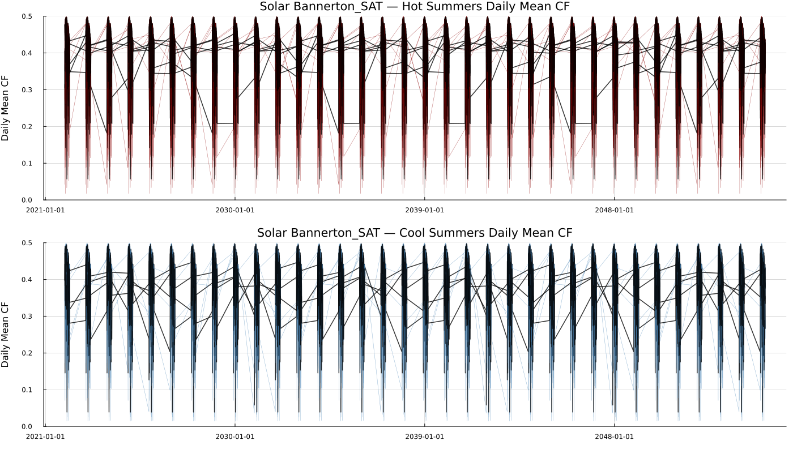
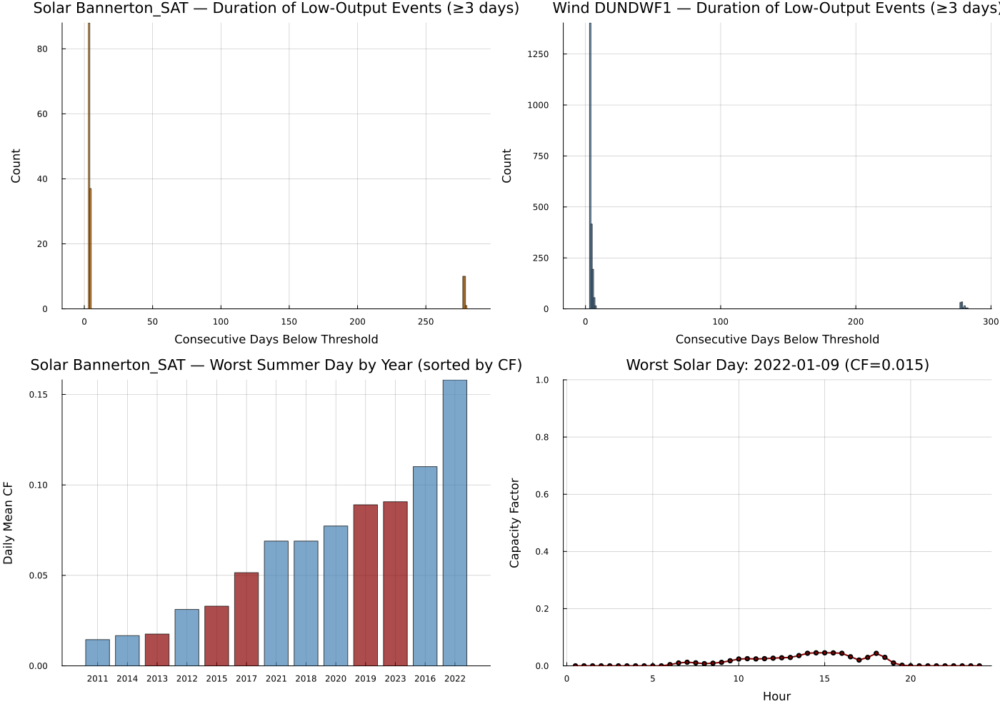
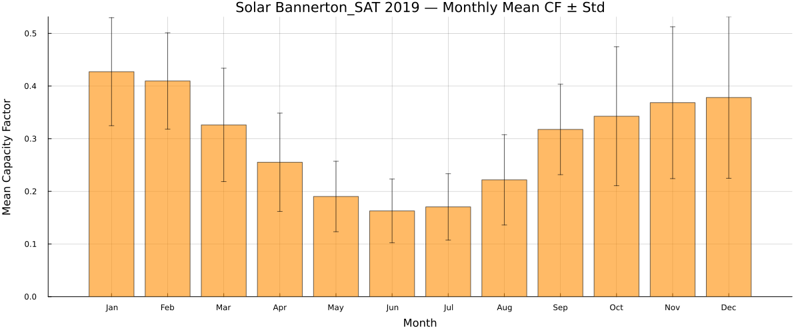
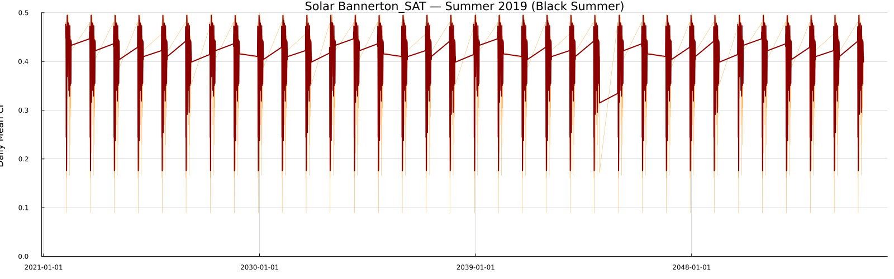

```@meta
EditURL = "../../../literate/analysis/seasonal_renewable_extremes.jl"
```

# Examining seasonal renewable extremes

Mean capacity factors do not describe the persistence, timing, or profile of low-output conditions. This page loads the underlying half-hourly solar and wind traces directly, then builds grouped summer comparisons, candidate multi-day low-output events, and detailed solar profiles for adverse days.

The analysis uses one Victorian solar location and one Victorian wind location. Its event definitions are exploratory and should not be treated as a system-wide adequacy criterion.

```@raw html
<details class="source-code"><summary>Show source code</summary>
```

````julia
ENV["GKSwstype"] = "100"

using CSV
using DataFrames
using Dates
using Statistics
using Plots

gr();

const REPO_ROOT = normpath(get(
    ENV,
    "PISP_DOCS_REPO_ROOT",
    joinpath(@__DIR__, "..", "..", ".."),
))

include(joinpath(REPO_ROOT, "docs", "eda_support.jl"))
using .EdaSupport

const SCRIPT_STEM = "04_seasonal_extremes"
const TRACES = joinpath("data", "2024", "pisp-downloads", "Traces")

abs_path(relative_path) = joinpath(REPO_ROOT, relative_path)

const HH_COLS_SOL = string.(1:48)
const HH_COLS_WIND = [lpad(i, 2, '0') for i in 1:48]
````

```@raw html
</details>
```

````
48-element Vector{String}:
 "01"
 "02"
 "03"
 "04"
 "05"
 "06"
 "07"
 "08"
 "09"
 "10"
 "11"
 "12"
 "13"
 "14"
 "15"
 "16"
 "17"
 "18"
 "19"
 "20"
 "21"
 "22"
 "23"
 "24"
 "25"
 "26"
 "27"
 "28"
 "29"
 "30"
 "31"
 "32"
 "33"
 "34"
 "35"
 "36"
 "37"
 "38"
 "39"
 "40"
 "41"
 "42"
 "43"
 "44"
 "45"
 "46"
 "47"
 "48"
````

Known hot vs cool (La Nina) Australian historical summers.

```@raw html
<details class="source-code"><summary>Show source code</summary>
```

````julia
const HOT_SUMMERS = [2019, 2013, 2017, 2015, 2023]
const COOL_SUMMERS = [2011, 2016, 2020, 2022]

const SOLAR_LOC = "Bannerton_SAT"
const WIND_LOC = "DUNDWF1"

function add_datetime!(df::DataFrame)
    df.datetime = Date.(df.Year, df.Month, df.Day)
    return df
end

function load_trace(tech, yr, loc)
    file = joinpath(TRACES, "$(tech)_$(yr)", "$(loc)_RefYear$(yr).csv")
    isfile(abs_path(file)) || return nothing
    df = CSV.read(abs_path(file), DataFrame)
    add_datetime!(df)
    return df
end

row_mean(df::DataFrame, cols) = [mean(row[col] for col in cols) for row in eachrow(df)]
````

```@raw html
</details>
```

A simple trailing rolling mean: the first `window - 1` entries have no full window of preceding values yet, so they are left `missing`.

```@raw html
<details class="source-code"><summary>Show source code</summary>
```

````julia
function rolling_mean(values, window)
    n = length(values)
    result = Vector{Union{Missing, Float64}}(missing, n)
    for i in window:n
        result[i] = mean(values[(i - window + 1):i])
    end
    return result
end

function low_output_events_for(tech, loc, hh_cols, threshold, yr)
    df = load_trace(tech, yr, loc)
    df === nothing && return NamedTuple[]
    summer_mask = in.(df.Month, Ref((12, 1, 2)))
    any(summer_mask) || return NamedTuple[]

    full_idx = findall(summer_mask)  # original row positions, in file order
    dates = df.datetime[full_idx]
    daily = row_mean(df[full_idx, :], hh_cols)
    below = daily .< threshold
    n = length(below)

    starts = Int[]
    ends = Int[]
    for i in 2:n
        delta = Int(below[i]) - Int(below[i - 1])
        if delta == 1
            push!(starts, full_idx[i])
        elseif delta == -1
            push!(ends, full_idx[i])
        end
    end

    rows = NamedTuple[]
    for k in 1:min(length(starts), length(ends))
        s = starts[k]
        e = ends[k]
        duration = (e - s) + 1
        duration >= 3 || continue
        mask_range = (full_idx .>= s) .& (full_idx .<= e)
        vals = daily[mask_range]
        s_pos = findfirst(==(s), full_idx)
        e_pos = findfirst(==(e), full_idx)
        push!(
            rows,
            NamedTuple{(:year, :start, :end, :duration, :min_cf, :mean_cf, :tech)}(
                (
                    yr,
                    Dates.format(dates[s_pos], "yyyy-mm-dd"),
                    Dates.format(dates[e_pos], "yyyy-mm-dd"),
                    duration,
                    minimum(vals),
                    mean(vals),
                    tech,
                ),
            ),
        )
    end
    return rows
end

snapshot_metadata_line(
    REPO_ROOT;
    context = "2024 ISP raw trace downloads (data/2024/pisp-downloads/Traces), historical years 2011-2023, hot/cool summers fixed by HOT_SUMMERS/COOL_SUMMERS",
)
````

```@raw html
</details>
```

````
Snapshot: PISP.jl commit 4b32060, generated 2026-07-17 — 2024 ISP raw trace downloads (data/2024/pisp-downloads/Traces), historical years 2011-2023, hot/cool summers fixed by HOT_SUMMERS/COOL_SUMMERS

````

## Step 1 — hot vs cool summer solar profile summary

For each historical hot or cool summer, this computes the mean daily capacity factor across December/January/February and summarises it with its own spread and range.

```@raw html
<details class="source-code"><summary>Show source code</summary>
```

````julia
rows = NamedTuple[]
for (season_type, year_list) in (("Hot Summers", HOT_SUMMERS), ("Cool Summers", COOL_SUMMERS))
    for yr in year_list
        df = load_trace("solar", yr, SOLAR_LOC)
        df === nothing && continue
        summer_mask = in.(df.Month, Ref((12, 1, 2)))
        any(summer_mask) || continue
        vals = row_mean(df[summer_mask, :], HH_COLS_SOL)
        push!(
            rows,
            (
                season_type = season_type,
                year = yr,
                n_days = length(vals),
                mean_daily_cf = mean(vals),
                std_daily_cf = std(vals),
                min_daily_cf = minimum(vals),
                max_daily_cf = maximum(vals),
            ),
        )
    end
end

hot_cool_summer_solar_summary = DataFrame(rows)
write_table(hot_cool_summer_solar_summary, SCRIPT_STEM, "hot_cool_summer_solar_summary")
markdown_table(hot_cool_summer_solar_summary)
````

```@raw html
</details>
```

| **season\_type** | **year** | **n\_days** | **mean\_daily\_cf** | **std\_daily\_cf** | **min\_daily\_cf** | **max\_daily\_cf** |
|--:|--:|--:|--:|--:|--:|--:|
| Hot Summers | 2019 | 3068 | 0.404872 | 0.089915 | 0.0890162 | 0.497658 |
| Hot Summers | 2013 | 3068 | 0.404471 | 0.114939 | 0.0175779 | 0.500016 |
| Hot Summers | 2017 | 3068 | 0.382376 | 0.116568 | 0.0515059 | 0.496493 |
| Hot Summers | 2015 | 3068 | 0.394685 | 0.118126 | 0.0329821 | 0.500514 |
| Hot Summers | 2023 | 3068 | 0.426174 | 0.0863665 | 0.0907033 | 0.498261 |
| Cool Summers | 2011 | 3068 | 0.361699 | 0.138521 | 0.0145063 | 0.499403 |
| Cool Summers | 2016 | 3068 | 0.393496 | 0.0995262 | 0.110095 | 0.494742 |
| Cool Summers | 2020 | 3068 | 0.403192 | 0.0968427 | 0.0773021 | 0.492177 |
| Cool Summers | 2022 | 3068 | 0.410353 | 0.0854116 | 0.158083 | 0.498602 |


## Step 2 — candidate multi-day low-output events

The current event-duration calculation retains original row labels after summer filtering. Events crossing excluded months can therefore receive inflated or otherwise misleading durations, and positional pairing can shift when start and end counts differ. Do not use the reported durations as modelling inputs until this calculation is corrected.

The full event-by-event table is written to `eda/tables/julia/04_seasonal_extremes/low_output_events.csv`; the page instead shows a compact per-technology-per-year summary of how many candidate events were found and how long they lasted.

```@raw html
<details class="source-code"><summary>Show source code</summary>
```

````julia
rows = NamedTuple[]
for (tech, loc, hh_cols, threshold) in (
    ("solar", SOLAR_LOC, HH_COLS_SOL, 0.1),
    ("wind", WIND_LOC, HH_COLS_WIND, 0.15),
)
    for yr in 2011:2023
        append!(rows, low_output_events_for(tech, loc, hh_cols, threshold, yr))
    end
end

low_output_events = DataFrame(rows)
write_table(low_output_events, SCRIPT_STEM, "low_output_events")

low_output_event_summary = if isempty(low_output_events)
    DataFrame()
else
    sort(
        combine(
            groupby(low_output_events, [:tech, :year]),
            nrow => :n_events,
            :duration => minimum => :min_duration,
            :duration => (x -> round(mean(x), digits = 1)) => :mean_duration,
            :duration => maximum => :max_duration,
        ),
        [:tech, :year],
    )
end
markdown_table(low_output_event_summary)
````

```@raw html
</details>
```

| **tech** | **year** | **n\_events** | **min\_duration** | **mean\_duration** | **max\_duration** |
|--:|--:|--:|--:|--:|--:|
| solar | 2011 | 42 | 3 | 3.9 | 4 |
| solar | 2012 | 36 | 3 | 163.2 | 279 |
| solar | 2014 | 34 | 3 | 3.0 | 3 |
| solar | 2015 | 34 | 3 | 3.0 | 3 |
| wind | 2011 | 207 | 3 | 27.8 | 282 |
| wind | 2012 | 98 | 3 | 17.0 | 277 |
| wind | 2013 | 140 | 3 | 3.6 | 4 |
| wind | 2014 | 140 | 3 | 13.3 | 277 |
| wind | 2015 | 173 | 3 | 34.8 | 278 |
| wind | 2016 | 262 | 3 | 23.8 | 280 |
| wind | 2017 | 275 | 3 | 4.4 | 278 |
| wind | 2018 | 327 | 3 | 8.4 | 277 |
| wind | 2019 | 272 | 3 | 5.1 | 279 |
| wind | 2020 | 82 | 3 | 20.0 | 277 |
| wind | 2021 | 131 | 3 | 21.9 | 278 |
| wind | 2022 | 70 | 3 | 22.6 | 278 |


## Step 3 — worst solar day and half-hourly profile

The summary identifies the selected adverse day for each year, while the profile table retains the intraday shape needed to understand whether the low-output metric is broad or confined to a short interval.

```@raw html
<details class="source-code"><summary>Show source code</summary>
```

````julia
worst_rows = NamedTuple[]
for yr in 2011:2023
    df = load_trace("solar", yr, SOLAR_LOC)
    df === nothing && continue
    summer_mask = in.(df.Month, Ref((12, 1, 2)))
    any(summer_mask) || continue
    summer = df[summer_mask, :]
    daily = row_mean(summer, HH_COLS_SOL)
    worst_pos = argmin(daily)  # first occurrence on ties
    push!(
        worst_rows,
        (
            year = yr,
            date = Dates.format(summer.datetime[worst_pos], "yyyy-mm-dd"),
            cf = daily[worst_pos],
            is_hot_summer = yr in HOT_SUMMERS ? 1 : 0,
        ),
    )
end

worst_solar_day_summary = DataFrame(worst_rows)
write_table(worst_solar_day_summary, SCRIPT_STEM, "worst_solar_day_summary")
markdown_table(worst_solar_day_summary)
````

```@raw html
</details>
```

| **year** | **date** | **cf** | **is\_hot\_summer** |
|--:|--:|--:|--:|
| 2011 | 2022-01-09 | 0.0145063 | 0 |
| 2012 | 2048-02-29 | 0.0311683 | 0 |
| 2013 | 2021-12-17 | 0.0175779 | 1 |
| 2014 | 2022-02-11 | 0.0167056 | 0 |
| 2015 | 2022-01-07 | 0.0329821 | 1 |
| 2016 | 2022-01-13 | 0.110095 | 0 |
| 2017 | 2022-02-07 | 0.0515059 | 1 |
| 2018 | 2021-12-04 | 0.0689566 | 0 |
| 2019 | 2021-12-16 | 0.0890162 | 1 |
| 2020 | 2022-01-02 | 0.0773021 | 0 |
| 2021 | 2021-12-20 | 0.0689535 | 0 |
| 2022 | 2021-12-15 | 0.158083 | 0 |
| 2023 | 2022-01-30 | 0.0907033 | 1 |


```@raw html
<details class="source-code"><summary>Show source code</summary>
```

````julia
rows = NamedTuple[]
if !isempty(worst_rows)
    best_idx = argmin([r.cf for r in worst_rows])
    worst = worst_rows[best_idx]
    yr = worst.year
    worst_date = Date(worst.date, "yyyy-mm-dd")
    df = load_trace("solar", yr, SOLAR_LOC)
    if df !== nothing
        mask = df.datetime .== worst_date
        if any(mask)
            row_idx = findfirst(mask)
            half_hours = collect(0.5:0.5:24.0)
            for (hh, col) in zip(half_hours, HH_COLS_SOL)
                push!(rows, (year = yr, date = worst.date, half_hour = hh, cf = df[row_idx, col]))
            end
        end
    end
end

worst_solar_day_profile = DataFrame(rows)
write_table(worst_solar_day_profile, SCRIPT_STEM, "worst_solar_day_profile")
markdown_table(worst_solar_day_profile)
````

```@raw html
</details>
```

| **year** | **date** | **half\_hour** | **cf** |
|--:|--:|--:|--:|
| 2011 | 2022-01-09 | 0.5 | 0.0 |
| 2011 | 2022-01-09 | 1.0 | 0.0 |
| 2011 | 2022-01-09 | 1.5 | 0.0 |
| 2011 | 2022-01-09 | 2.0 | 0.0 |
| 2011 | 2022-01-09 | 2.5 | 0.0 |
| 2011 | 2022-01-09 | 3.0 | 0.0 |
| 2011 | 2022-01-09 | 3.5 | 0.0 |
| 2011 | 2022-01-09 | 4.0 | 0.0 |
| 2011 | 2022-01-09 | 4.5 | 0.0 |
| 2011 | 2022-01-09 | 5.0 | 0.0 |
| 2011 | 2022-01-09 | 5.5 | 0.0 |
| 2011 | 2022-01-09 | 6.0 | 0.00428803 |
| 2011 | 2022-01-09 | 6.5 | 0.0101904 |
| 2011 | 2022-01-09 | 7.0 | 0.0126238 |
| 2011 | 2022-01-09 | 7.5 | 0.0105536 |
| 2011 | 2022-01-09 | 8.0 | 0.00773084 |
| 2011 | 2022-01-09 | 8.5 | 0.00935496 |
| 2011 | 2022-01-09 | 9.0 | 0.0122468 |
| 2011 | 2022-01-09 | 9.5 | 0.0178283 |
| 2011 | 2022-01-09 | 10.0 | 0.0239241 |
| 2011 | 2022-01-09 | 10.5 | 0.0251329 |
| 2011 | 2022-01-09 | 11.0 | 0.0243254 |
| 2011 | 2022-01-09 | 11.5 | 0.0252249 |
| 2011 | 2022-01-09 | 12.0 | 0.0268889 |
| 2011 | 2022-01-09 | 12.5 | 0.0282818 |
| 2011 | 2022-01-09 | 13.0 | 0.0293787 |
| 2011 | 2022-01-09 | 13.5 | 0.0358903 |
| 2011 | 2022-01-09 | 14.0 | 0.0440908 |
| 2011 | 2022-01-09 | 14.5 | 0.0455812 |
| 2011 | 2022-01-09 | 15.0 | 0.0456214 |
| 2011 | 2022-01-09 | 15.5 | 0.0453891 |
| 2011 | 2022-01-09 | 16.0 | 0.0440116 |
| 2011 | 2022-01-09 | 16.5 | 0.0318094 |
| 2011 | 2022-01-09 | 17.0 | 0.0203476 |
| 2011 | 2022-01-09 | 17.5 | 0.0295542 |
| 2011 | 2022-01-09 | 18.0 | 0.043779 |
| 2011 | 2022-01-09 | 18.5 | 0.0297961 |
| 2011 | 2022-01-09 | 19.0 | 0.0102454 |
| 2011 | 2022-01-09 | 19.5 | 0.00221341 |
| 2011 | 2022-01-09 | 20.0 | 0.0 |
| 2011 | 2022-01-09 | 20.5 | 0.0 |
| 2011 | 2022-01-09 | 21.0 | 0.0 |
| 2011 | 2022-01-09 | 21.5 | 0.0 |
| 2011 | 2022-01-09 | 22.0 | 0.0 |
| 2011 | 2022-01-09 | 22.5 | 0.0 |
| 2011 | 2022-01-09 | 23.0 | 0.0 |
| 2011 | 2022-01-09 | 23.5 | 0.0 |
| 2011 | 2022-01-09 | 24.0 | 0.0 |


## Step 4 — 2019 monthly and Black Summer detail

The monthly table provides a calendar context for the detailed summer series. It uses a two-stage aggregation: per half-hourly column, compute that column's mean/std across the days in the month, then average those 48 per-column values into one monthly figure. The three-day rolling value in the daily series below is descriptive and should not be interpreted as a dispatch or storage requirement without a separate system model.

```@raw html
<details class="source-code"><summary>Show source code</summary>
```

````julia
df = load_trace("solar", 2019, SOLAR_LOC)
rows = NamedTuple[]
if df !== nothing
    for m in 1:12
        mask = df.Month .== m
        if any(mask)
            sub = df[mask, :]
            col_means = [mean(sub[!, col]) for col in HH_COLS_SOL]
            col_stds = [std(sub[!, col]) for col in HH_COLS_SOL]
            push!(rows, (month = m, mean_cf = mean(col_means), std_cf = mean(col_stds)))
        else
            push!(rows, (month = m, mean_cf = 0.0, std_cf = 0.0))
        end
    end
end

monthly_cf_2019_summary = DataFrame(rows)
write_table(monthly_cf_2019_summary, SCRIPT_STEM, "monthly_cf_2019_summary")
markdown_table(monthly_cf_2019_summary)
````

```@raw html
</details>
```

| **month** | **mean\_cf** | **std\_cf** |
|--:|--:|--:|
| 1 | 0.427211 | 0.102535 |
| 2 | 0.409629 | 0.0914764 |
| 3 | 0.326171 | 0.10768 |
| 4 | 0.255254 | 0.0934389 |
| 5 | 0.190201 | 0.0668752 |
| 6 | 0.162797 | 0.0605264 |
| 7 | 0.170442 | 0.0630134 |
| 8 | 0.221814 | 0.0857514 |
| 9 | 0.317571 | 0.0859169 |
| 10 | 0.342657 | 0.131934 |
| 11 | 0.36839 | 0.144209 |
| 12 | 0.3782 | 0.15342 |


The `RefYear2019` trace reuses the 2019 (Black Summer) historical weather pattern across the entire projected planning horizon, not just the single 2018-19 season, so the daily series below has one row per summer day in every simulated year. The table previews the first 15 rows; the complete series is written to `eda/tables/julia/04_seasonal_extremes/black_summer_2019_daily_cf.csv`.

```@raw html
<details class="source-code"><summary>Show source code</summary>
```

````julia
df = load_trace("solar", 2019, SOLAR_LOC)
rows = NamedTuple[]
if df !== nothing
    summer_mask = in.(df.Month, Ref((12, 1, 2)))
    summer = df[summer_mask, :]
    daily = row_mean(summer, HH_COLS_SOL)
    rolling3 = rolling_mean(daily, 3)
    for (i, d) in enumerate(summer.datetime)
        push!(rows, (date = Dates.format(d, "yyyy-mm-dd"), daily_mean_cf = daily[i], rolling3_cf = rolling3[i]))
    end
end

black_summer_2019_daily_cf = DataFrame(rows)
write_table(black_summer_2019_daily_cf, SCRIPT_STEM, "black_summer_2019_daily_cf")
markdown_table(first(black_summer_2019_daily_cf, 15))
````

```@raw html
</details>
```

| **date** | **daily\_mean\_cf** | **rolling3\_cf** |
|--:|--:|--:|
| 2021-12-01 | 0.469144 | missing |
| 2021-12-02 | 0.478529 | missing |
| 2021-12-03 | 0.480572 | 0.476081 |
| 2021-12-04 | 0.40653 | 0.45521 |
| 2021-12-05 | 0.4805 | 0.455867 |
| 2021-12-06 | 0.45622 | 0.44775 |
| 2021-12-07 | 0.48078 | 0.4725 |
| 2021-12-08 | 0.47843 | 0.47181 |
| 2021-12-09 | 0.454311 | 0.471174 |
| 2021-12-10 | 0.354046 | 0.428929 |
| 2021-12-11 | 0.21802 | 0.342126 |
| 2021-12-12 | 0.161514 | 0.244527 |
| 2021-12-13 | 0.36446 | 0.247998 |
| 2021-12-14 | 0.429491 | 0.318488 |
| 2021-12-15 | 0.234228 | 0.342726 |


## Step 5 — hot vs cool summer solar profiles (figure)

Each panel overlays every year in the group as a thin line with its own 3-day rolling mean drawn on top, so persistent dips stand out from single-day noise.

```@raw html
<details class="source-code"><summary>Show source code</summary>
```

````julia
plots_hot_cool = []
for (season_type, year_list, color) in [("Hot Summers", HOT_SUMMERS, :darkred), ("Cool Summers", COOL_SUMMERS, :steelblue)]
    p = plot(legend=false, size=(1400, 400))
    for yr in year_list
        df = load_trace("solar", yr, SOLAR_LOC)
        df === nothing && continue
        summer_mask = in.(df.Month, Ref((12, 1, 2)))
        any(summer_mask) || continue
        summer = df[summer_mask, :]
        daily = [mean(skipmissing(Vector(summer[i, HH_COLS_SOL]))) for i in 1:nrow(summer)]
        rolling3 = rolling_mean(daily, 3)
        plot!(p, summer.datetime, daily, linewidth=0.5, alpha=0.6, color=color, label="$yr")
        plot!(p, summer.datetime, rolling3, linewidth=1.5, color=:black, alpha=0.8, label="")
    end
    plot!(p, title="Solar $(SOLAR_LOC) — $(season_type) Daily Mean CF", ylabel="Daily Mean CF",
          ylim=(0, 0.5), grid=true, gridalpha=0.3)
    push!(plots_hot_cool, p)
end
p_hc = plot(plots_hot_cool..., layout=(2,1), size=(1400, 800),
            left_margin=5Plots.mm, bottom_margin=5Plots.mm)
savefig(p_hc, figure_path(SCRIPT_STEM, "04_hot_vs_cool_summer_solar.png"))
EdaSupport.embed_figure(figure_path(SCRIPT_STEM, "04_hot_vs_cool_summer_solar.png"), "04_hot_vs_cool_summer_solar.png")
````

```@raw html
</details>
```

````
┌ Warning: Assignment to `df` in soft scope is ambiguous because a global variable by the same name exists: `df` will be treated as a new local. Disambiguate by using `local df` to suppress this warning or `global df` to assign to the existing global variable.
└ @ ~/Documents/Git/arpst-unimelb-agents/projects/PISP.jl/docs/.literate-staging-R1OdJV/src/generated/analyses/seasonal_renewable_extremes.md:5
┌ Warning: Assignment to `summer_mask` in soft scope is ambiguous because a global variable by the same name exists: `summer_mask` will be treated as a new local. Disambiguate by using `local summer_mask` to suppress this warning or `global summer_mask` to assign to the existing global variable.
└ @ ~/Documents/Git/arpst-unimelb-agents/projects/PISP.jl/docs/.literate-staging-R1OdJV/src/generated/analyses/seasonal_renewable_extremes.md:7
┌ Warning: Assignment to `summer` in soft scope is ambiguous because a global variable by the same name exists: `summer` will be treated as a new local. Disambiguate by using `local summer` to suppress this warning or `global summer` to assign to the existing global variable.
└ @ ~/Documents/Git/arpst-unimelb-agents/projects/PISP.jl/docs/.literate-staging-R1OdJV/src/generated/analyses/seasonal_renewable_extremes.md:9
┌ Warning: Assignment to `daily` in soft scope is ambiguous because a global variable by the same name exists: `daily` will be treated as a new local. Disambiguate by using `local daily` to suppress this warning or `global daily` to assign to the existing global variable.
└ @ ~/Documents/Git/arpst-unimelb-agents/projects/PISP.jl/docs/.literate-staging-R1OdJV/src/generated/analyses/seasonal_renewable_extremes.md:10
┌ Warning: Assignment to `rolling3` in soft scope is ambiguous because a global variable by the same name exists: `rolling3` will be treated as a new local. Disambiguate by using `local rolling3` to suppress this warning or `global rolling3` to assign to the existing global variable.
└ @ ~/Documents/Git/arpst-unimelb-agents/projects/PISP.jl/docs/.literate-staging-R1OdJV/src/generated/analyses/seasonal_renewable_extremes.md:11

````



## Step 6 — low-output events overview (figure)

A 2x2 grid: event-duration histograms for solar and wind low-output events, a bar chart of each year's worst solar day sorted by capacity factor, and the half-hourly profile of the single worst solar day across all years.

```@raw html
<details class="source-code"><summary>Show source code</summary>
```

````julia
solar_low_events = []
wind_low_events = []
worst_solar_days_data = Dict()

for yr in 2011:2023
    df = load_trace("solar", yr, SOLAR_LOC)
    df === nothing && continue
    summer_mask = in.(df.Month, Ref((12, 1, 2)))
    any(summer_mask) || continue
    summer = df[summer_mask, :]
    daily = [mean(skipmissing(Vector(summer[i, HH_COLS_SOL]))) for i in 1:nrow(summer)]

    events = low_output_events_for("solar", SOLAR_LOC, HH_COLS_SOL, 0.1, yr)
    for row in events
        push!(solar_low_events, row.duration)
    end

    worst_pos = argmin(daily)
    worst_solar_days_data[yr] = (date = summer.datetime[worst_pos], cf = daily[worst_pos])
end

for yr in 2011:2023
    df = load_trace("wind", yr, WIND_LOC)
    df === nothing && continue
    summer_mask = in.(df.Month, Ref((12, 1, 2)))
    any(summer_mask) || continue
    summer = df[summer_mask, :]
    daily = [mean(skipmissing(Vector(summer[i, HH_COLS_WIND]))) for i in 1:nrow(summer)]

    events = low_output_events_for("wind", WIND_LOC, HH_COLS_WIND, 0.15, yr)
    for row in events
        push!(wind_low_events, row.duration)
    end
end

p_sol_hist = histogram(solar_low_events, bins=1:maximum(solar_low_events)+1, color=:darkorange, alpha=0.7,
                        legend=false, title="Solar $(SOLAR_LOC) — Duration of Low-Output Events (≥3 days)",
                        xlabel="Consecutive Days Below Threshold", ylabel="Count", grid=true, gridalpha=0.3)

p_wind_hist = histogram(wind_low_events, bins=1:maximum(wind_low_events)+1, color=:steelblue, alpha=0.7,
                         legend=false, title="Wind $(WIND_LOC) — Duration of Low-Output Events (≥3 days)",
                         xlabel="Consecutive Days Below Threshold", ylabel="Count", grid=true, gridalpha=0.3)

worst_yrs = collect(keys(worst_solar_days_data))
sort!(worst_yrs, by = yr -> worst_solar_days_data[yr].cf)
worst_cfs = [worst_solar_days_data[yr].cf for yr in worst_yrs]
worst_colors = [yr in HOT_SUMMERS ? :darkred : :steelblue for yr in worst_yrs]
p_worst_days = bar(string.(worst_yrs), worst_cfs, color=worst_colors, alpha=0.7, legend=false,
                    title="Solar $(SOLAR_LOC) — Worst Summer Day by Year (sorted by CF)",
                    ylabel="Daily Mean CF", grid=true, gridalpha=0.3)

if !isempty(worst_rows)
    best_idx = argmin([r.cf for r in worst_rows])
    worst = worst_rows[best_idx]
    yr = worst.year
    worst_date = Date(worst.date, "yyyy-mm-dd")
    df = load_trace("solar", yr, SOLAR_LOC)
    if df !== nothing
        mask = df.datetime .== worst_date
        if any(mask)
            row_idx = findfirst(mask)
            half_hours = collect(0.5:0.5:24.0)
            hh_vals = Vector(df[row_idx, HH_COLS_SOL])
            p_worst_profile = plot(half_hours, hh_vals, linewidth=2, marker=:circle, markersize=3,
                                    color=:darkred, legend=false,
                                    title="Worst Solar Day: $(worst.date) (CF=$(round(worst.cf, digits=3)))",
                                    xlabel="Hour", ylabel="Capacity Factor", ylim=(0, 1),
                                    grid=true, gridalpha=0.3)
        else
            p_worst_profile = plot(legend=false)
        end
    else
        p_worst_profile = plot(legend=false)
    end
else
    p_worst_profile = plot(legend=false)
end

p_low_out = plot(p_sol_hist, p_wind_hist, p_worst_days, p_worst_profile, layout=(2,2), size=(1400, 1000),
                  left_margin=5Plots.mm, bottom_margin=5Plots.mm)
savefig(p_low_out, figure_path(SCRIPT_STEM, "04_low_output_events.png"))
EdaSupport.embed_figure(figure_path(SCRIPT_STEM, "04_low_output_events.png"), "04_low_output_events.png")
````

```@raw html
</details>
```

````
┌ Warning: Assignment to `df` in soft scope is ambiguous because a global variable by the same name exists: `df` will be treated as a new local. Disambiguate by using `local df` to suppress this warning or `global df` to assign to the existing global variable.
└ @ ~/Documents/Git/arpst-unimelb-agents/projects/PISP.jl/docs/.literate-staging-R1OdJV/src/generated/analyses/seasonal_renewable_extremes.md:6
┌ Warning: Assignment to `summer_mask` in soft scope is ambiguous because a global variable by the same name exists: `summer_mask` will be treated as a new local. Disambiguate by using `local summer_mask` to suppress this warning or `global summer_mask` to assign to the existing global variable.
└ @ ~/Documents/Git/arpst-unimelb-agents/projects/PISP.jl/docs/.literate-staging-R1OdJV/src/generated/analyses/seasonal_renewable_extremes.md:8
┌ Warning: Assignment to `summer` in soft scope is ambiguous because a global variable by the same name exists: `summer` will be treated as a new local. Disambiguate by using `local summer` to suppress this warning or `global summer` to assign to the existing global variable.
└ @ ~/Documents/Git/arpst-unimelb-agents/projects/PISP.jl/docs/.literate-staging-R1OdJV/src/generated/analyses/seasonal_renewable_extremes.md:10
┌ Warning: Assignment to `daily` in soft scope is ambiguous because a global variable by the same name exists: `daily` will be treated as a new local. Disambiguate by using `local daily` to suppress this warning or `global daily` to assign to the existing global variable.
└ @ ~/Documents/Git/arpst-unimelb-agents/projects/PISP.jl/docs/.literate-staging-R1OdJV/src/generated/analyses/seasonal_renewable_extremes.md:11
┌ Warning: Assignment to `df` in soft scope is ambiguous because a global variable by the same name exists: `df` will be treated as a new local. Disambiguate by using `local df` to suppress this warning or `global df` to assign to the existing global variable.
└ @ ~/Documents/Git/arpst-unimelb-agents/projects/PISP.jl/docs/.literate-staging-R1OdJV/src/generated/analyses/seasonal_renewable_extremes.md:23
┌ Warning: Assignment to `summer_mask` in soft scope is ambiguous because a global variable by the same name exists: `summer_mask` will be treated as a new local. Disambiguate by using `local summer_mask` to suppress this warning or `global summer_mask` to assign to the existing global variable.
└ @ ~/Documents/Git/arpst-unimelb-agents/projects/PISP.jl/docs/.literate-staging-R1OdJV/src/generated/analyses/seasonal_renewable_extremes.md:25
┌ Warning: Assignment to `summer` in soft scope is ambiguous because a global variable by the same name exists: `summer` will be treated as a new local. Disambiguate by using `local summer` to suppress this warning or `global summer` to assign to the existing global variable.
└ @ ~/Documents/Git/arpst-unimelb-agents/projects/PISP.jl/docs/.literate-staging-R1OdJV/src/generated/analyses/seasonal_renewable_extremes.md:27
┌ Warning: Assignment to `daily` in soft scope is ambiguous because a global variable by the same name exists: `daily` will be treated as a new local. Disambiguate by using `local daily` to suppress this warning or `global daily` to assign to the existing global variable.
└ @ ~/Documents/Git/arpst-unimelb-agents/projects/PISP.jl/docs/.literate-staging-R1OdJV/src/generated/analyses/seasonal_renewable_extremes.md:28

````



## Step 7 — 2019 monthly CF (figure)

The bar chart reads back the monthly summary table written in Step 4, so the plot uses exactly the same aggregation as the table.

```@raw html
<details class="source-code"><summary>Show source code</summary>
```

````julia
monthly_table_path = table_path(SCRIPT_STEM, "monthly_cf_2019_summary")
if isfile(monthly_table_path)
    monthly_df = CSV.read(monthly_table_path, DataFrame)
    month_labels = ["Jan", "Feb", "Mar", "Apr", "May", "Jun", "Jul", "Aug", "Sep", "Oct", "Nov", "Dec"]
    p_monthly = bar(month_labels, monthly_df.mean_cf, yerror=monthly_df.std_cf, color=:darkorange, alpha=0.6,
                    edgecolor=:black, legend=false,
                    title="Solar $(SOLAR_LOC) 2019 — Monthly Mean CF ± Std",
                    xlabel="Month", ylabel="Mean Capacity Factor", grid=true, gridalpha=0.3, size=(1200, 500),
                    left_margin=5Plots.mm, bottom_margin=5Plots.mm)
    savefig(p_monthly, figure_path(SCRIPT_STEM, "04_monthly_cf_2019.png"))
    EdaSupport.embed_figure(figure_path(SCRIPT_STEM, "04_monthly_cf_2019.png"), "04_monthly_cf_2019.png")
end
````

```@raw html
</details>
```



## Step 8 — Summer 2019 Black Summer (figure)

The daily mean capacity factor across December 2018/January-February 2019, with its 3-day rolling mean overlaid, showing the persistence of the low-output stretch during the Black Summer period.

```@raw html
<details class="source-code"><summary>Show source code</summary>
```

````julia
df_2019 = load_trace("solar", 2019, SOLAR_LOC)
if df_2019 !== nothing
    summer_2019 = df_2019[in.(df_2019.Month, Ref((12, 1, 2))), :]
    daily = [mean(skipmissing(Vector(summer_2019[i, HH_COLS_SOL]))) for i in 1:nrow(summer_2019)]
    rolling3 = rolling_mean(daily, 3)
    p_black = plot(summer_2019.datetime, daily, linewidth=0.5, color=:darkorange, alpha=0.7, legend=false)
    plot!(p_black, summer_2019.datetime, rolling3, linewidth=2, color=:darkred, label="")
    plot!(p_black, title="Solar $(SOLAR_LOC) — Summer 2019 (Black Summer)", ylabel="Daily Mean CF",
          ylim=(0, 0.5), grid=true, gridalpha=0.3, size=(1600, 500),
          left_margin=5Plots.mm, bottom_margin=5Plots.mm)
    savefig(p_black, figure_path(SCRIPT_STEM, "04_summer_2019_black_summer.png"))
    EdaSupport.embed_figure(figure_path(SCRIPT_STEM, "04_summer_2019_black_summer.png"), "04_summer_2019_black_summer.png")
end
````

```@raw html
</details>
```



## Summary

- Hot and cool historical summers show visibly different daily mean solar capacity factor spreads once each year's series is overlaid with its own 3-day rolling mean.
- The multi-day low-output event table retains the row-label/positional mismatch described in Step 2 rather than silently correcting it, so its durations should be read with that caveat in mind.
- The 2019 monthly summary and Black Summer daily series both come from the same two-stage aggregation described in Step 4.

