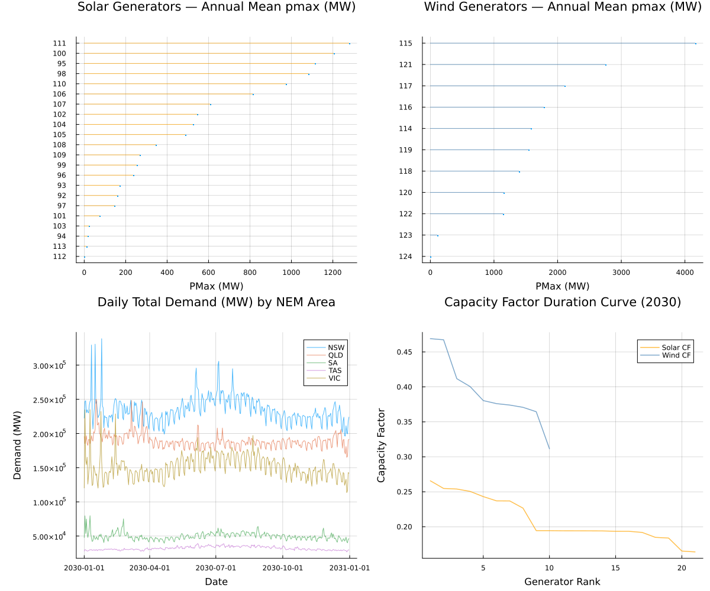
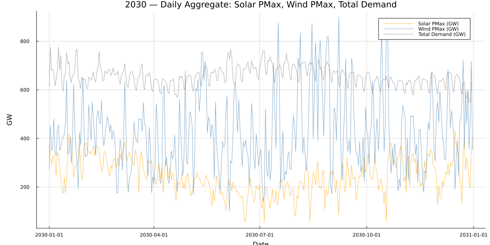
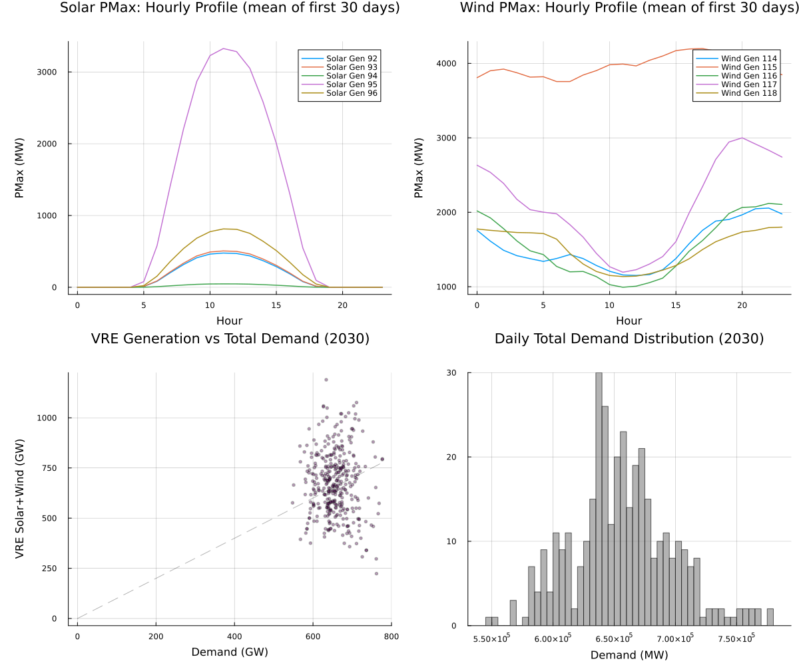

```@meta
EditURL = "../../../literate/eda/06_pisp_outputs.jl"
```

# PISP generated-output consistency

PISP writes a static asset dataset (`Generator.csv`, `Demand.csv`, `Bus.csv`) alongside time-varying schedules (`Generator_pmax_sched.csv`, `Demand_load_sched.csv`) for one generated build. This page loads one such build, joins the static and schedule tables, and checks identifier coverage, schedule coverage, generator classification, and daily solar/wind/demand alignment, computed live on this page and written to `eda/tables/julia/06_pisp_outputs/` as evidence. It also builds the three PISP-output figures shown in the generated docs site.

```@raw html
<details class="source-code"><summary>Show source code</summary>
```

````julia
ENV["GKSwstype"] = "100"

using CSV
using DataFrames
using Dates
using Printf
using Statistics
using Plots

gr();

const REPO_ROOT = normpath(get(
    ENV,
    "PISP_DOCS_REPO_ROOT",
    joinpath(@__DIR__, "..", "..", ".."),
))

include(joinpath(REPO_ROOT, "eda", "eda_support.jl"))
using .EdaSupport

const SCRIPT_STEM = "06_pisp_outputs"
const OUT = normpath(get(
    ENV,
    "PISP_OUTPUT_ROOT",
    joinpath(REPO_ROOT, "data", "2024", "pisp-datasets", "out-ref4006-poe10", "csv"),
))
const SCHEDULE_TAG = get(ENV, "PISP_SCHEDULE_TAG", "schedule-2030")
const SCHEDULE_DIR = joinpath(OUT, SCHEDULE_TAG)

snapshot_metadata_line(REPO_ROOT; context = "$(SCHEDULE_TAG) generated PISP output (out-ref4006-poe10 build)")

abs_path(relative_path) = joinpath(REPO_ROOT, relative_path)  # no-op here since OUT/SCHEDULE_DIR are already absolute; kept for consistency with the other EDA pages

const AREA_NAMES = Dict(1 => "QLD", 2 => "NSW", 3 => "VIC", 4 => "TAS", 5 => "SA")
````

```@raw html
</details>
```

````
Snapshot: PISP.jl commit 0d31fb4+dirty, generated 2026-07-16 — schedule-2030 generated PISP output (out-ref4006-poe10 build)

````

Schedule dates look like "2030-01-01T00:00:00.0"; this fallback handles the case where the column is read back as text rather than the DateTime CSV.jl already infers.

```@raw html
<details class="source-code"><summary>Show source code</summary>
```

````julia
parse_schedule_datetime(s::AbstractString) = DateTime(replace(s, r"\.\d+$" => ""))
parse_schedule_datetime(d::DateTime) = d

is_solar_tech(tech) = occursin(r"PV|SOLAR"i, tech)
is_wind_tech(tech) = occursin(r"WIND"i, tech)

function append_relationship_diagnostics!(summary_rows, detail_rows, relationship, left_label, right_label, left_ids, right_ids)
    left_set = Set(skipmissing(left_ids))
    right_set = Set(skipmissing(right_ids))
    left_unmatched = sort(collect(setdiff(left_set, right_set)))
    right_unmatched = sort(collect(setdiff(right_set, left_set)))

    push!(
        summary_rows,
        (
            relationship = relationship,
            left_label = left_label,
            right_label = right_label,
            left_unique_ids = length(left_set),
            right_unique_ids = length(right_set),
            left_unmatched_ids = length(left_unmatched),
            right_unmatched_ids = length(right_unmatched),
        ),
    )

    for id in left_unmatched
        push!(detail_rows, (relationship = relationship, unmatched_side = left_label, id = string(id)))
    end
    for id in right_unmatched
        push!(detail_rows, (relationship = relationship, unmatched_side = right_label, id = string(id)))
    end
end
````

```@raw html
</details>
```

Capacity factor for solar and wind divides each generator's scheduled mean output by that generator's own scheduled maximum, not by the static `pmax` recorded in `Generator.csv`.
The static field is not a reliable capacity reference for these generators: rooftop PV rows carry a fixed placeholder pmax (src/parsers/PISP-2024parser.jl:1070, `gen_pmax_distpv`), and utility-scale solar/wind rows record only currently operating capacity, which a future-year schedule can exceed once ISP-outlook build-out is reflected in the trace (`gen_pmax_wind`, ~1386 vs. ~1477 in the same file).
SiennaNEM.jl, which builds unit-commitment models from this same PISP output, applies the same convention (src/read_data.jl:214-229, `update_system_data_bound!`) and calls the static pmax "dummy" for these generators (src/create_system.jl:342,368).
See PISP.jl's own the generated Parameters and mappings page and docs/src/assumptions.md for the full caveat.

```@raw html
<details class="source-code"><summary>Show source code</summary>
```

````julia
function capacity_factor_duration_frame(gen_pmax::DataFrame, gens::DataFrame, tech::AbstractString)
    ids = Set(gens.id_gen)

    sched = gen_pmax[in.(gen_pmax.id_gen, Ref(ids)), :]
    grouped = combine(groupby(sched, :id_gen), :value => mean => :mean_value, :value => maximum => :max_value)

    cf_values = Float64[]
    for row in eachrow(grouped)
        cf = row.mean_value / row.max_value
        isnan(cf) && continue
        push!(cf_values, cf)
    end
    sorted_desc = sort(cf_values; rev = true)
    return DataFrame(tech = tech, rank = 1:length(sorted_desc), capacity_factor = sorted_desc)
end

function build_dem_load_full(dem_load::DataFrame, dem_df::DataFrame, bus_df::DataFrame)
    area_map = Dict(row.id_bus => row.id_area for row in eachrow(bus_df))
    dem_load_full = innerjoin(dem_load, dem_df[:, [:id_dem, :id_bus]], on = :id_dem)
    dem_load_full.datetime = parse_schedule_datetime.(dem_load_full.date)
    dem_load_full.area = [area_map[b] for b in dem_load_full.id_bus]
    dem_load_full.area_name = [AREA_NAMES[a] for a in dem_load_full.area]
    return dem_load_full
end

function build_gen_pmax_ts(gen_pmax::DataFrame, gen_df::DataFrame)
    gen_pmax_ts = innerjoin(gen_pmax, gen_df[:, [:id_gen, :tech]], on = :id_gen)
    gen_pmax_ts.datetime = parse_schedule_datetime.(gen_pmax_ts.date)
    return gen_pmax_ts
end

function daily_tech_sum(gen_pmax_ts::DataFrame, tech_predicate)
    subset = gen_pmax_ts[tech_predicate.(gen_pmax_ts.tech), :]
    subset = transform(subset, :datetime => ByRow(Date) => :date_only)
    return combine(groupby(subset, :date_only), :value => sum => :total)
end
````

```@raw html
</details>
```

## Step 1 — load the static asset tables and the 2030 schedule outputs

`Generator.csv`, `Demand.csv`, and `Bus.csv` describe the static network; `Generator_pmax_sched.csv` and `Demand_load_sched.csv` under the `schedule-2030` tag describe the time-varying build for this generated dataset.

```@raw html
<details class="source-code"><summary>Show source code</summary>
```

````julia
gen_df = CSV.read(abs_path(joinpath(OUT, "Generator.csv")), DataFrame)
dem_df = CSV.read(abs_path(joinpath(OUT, "Demand.csv")), DataFrame)
bus_df = CSV.read(abs_path(joinpath(OUT, "Bus.csv")), DataFrame)

gen_pmax = CSV.read(abs_path(joinpath(SCHEDULE_DIR, "Generator_pmax_sched.csv")), DataFrame)
dem_load = CSV.read(abs_path(joinpath(SCHEDULE_DIR, "Demand_load_sched.csv")), DataFrame)
````

```@raw html
</details>
```

## Step 2 — record which output root and schedule directory were used

The recorded paths are relative to the repository root so this evidence table stays comparable across machines and reproducible from any checkout.

```@raw html
<details class="source-code"><summary>Show source code</summary>
```

````julia
build_metadata = DataFrame([
    (
        pisp_output_root = replace(relpath(OUT, REPO_ROOT), '\\' => '/'),
        schedule_tag = SCHEDULE_TAG,
        schedule_directory = replace(relpath(SCHEDULE_DIR, REPO_ROOT), '\\' => '/'),
    ),
])
write_table(build_metadata, SCRIPT_STEM, "build_metadata")
build_metadata
````

```@raw html
</details>
```

```@raw html
<div><div style = "float: left;"><span>1×3 DataFrame</span></div><div style = "clear: both;"></div></div><div class = "data-frame" style = "overflow-x: scroll;"><table class = "data-frame" style = "margin-bottom: 6px;"><thead><tr class = "columnLabelRow"><th class = "stubheadLabel" style = "font-weight: bold; text-align: right;">Row</th><th style = "text-align: left;">pisp_output_root</th><th style = "text-align: left;">schedule_tag</th><th style = "text-align: left;">schedule_directory</th></tr><tr class = "columnLabelRow"><th class = "stubheadLabel" style = "font-weight: bold; text-align: right;"></th><th title = "String" style = "text-align: left;">String</th><th title = "String" style = "text-align: left;">String</th><th title = "String" style = "text-align: left;">String</th></tr></thead><tbody><tr class = "dataRow"><td class = "rowLabel" style = "font-weight: bold; text-align: right;">1</td><td style = "text-align: left;">data/2024/pisp-datasets/out-ref4006-poe10/csv</td><td style = "text-align: left;">schedule-2030</td><td style = "text-align: left;">data/2024/pisp-datasets/out-ref4006-poe10/csv/schedule-2030</td></tr></tbody></table></div>
```

## Step 3 — generator table shape and classification counts

`Generator.csv` classifies each generator by `fuel` and by `tech`; these counts show which classifications are available for later technology-specific filtering.

```@raw html
<details class="source-code"><summary>Show source code</summary>
```

````julia
println("=== Generator Table ===")
println("Shape: ", (nrow(gen_df), ncol(gen_df)))

generator_fuel_counts = combine(groupby(gen_df, :fuel), nrow => :count)
write_table(generator_fuel_counts, SCRIPT_STEM, "generator_fuel_counts")
generator_fuel_counts
````

```@raw html
</details>
```

```@raw html
<div><div style = "float: left;"><span>7×2 DataFrame</span></div><div style = "clear: both;"></div></div><div class = "data-frame" style = "overflow-x: scroll;"><table class = "data-frame" style = "margin-bottom: 6px;"><thead><tr class = "columnLabelRow"><th class = "stubheadLabel" style = "font-weight: bold; text-align: right;">Row</th><th style = "text-align: left;">fuel</th><th style = "text-align: left;">count</th></tr><tr class = "columnLabelRow"><th class = "stubheadLabel" style = "font-weight: bold; text-align: right;"></th><th title = "InlineStrings.String15" style = "text-align: left;">String15</th><th title = "Int64" style = "text-align: left;">Int64</th></tr></thead><tbody><tr class = "dataRow"><td class = "rowLabel" style = "font-weight: bold; text-align: right;">1</td><td style = "text-align: left;">Coal</td><td style = "text-align: right;">15</td></tr><tr class = "dataRow"><td class = "rowLabel" style = "font-weight: bold; text-align: right;">2</td><td style = "text-align: left;">Diesel</td><td style = "text-align: right;">7</td></tr><tr class = "dataRow"><td class = "rowLabel" style = "font-weight: bold; text-align: right;">3</td><td style = "text-align: left;">Hydro</td><td style = "text-align: right;">30</td></tr><tr class = "dataRow"><td class = "rowLabel" style = "font-weight: bold; text-align: right;">4</td><td style = "text-align: left;">Hydrogen</td><td style = "text-align: right;">2</td></tr><tr class = "dataRow"><td class = "rowLabel" style = "font-weight: bold; text-align: right;">5</td><td style = "text-align: left;">Natural Gas</td><td style = "text-align: right;">37</td></tr><tr class = "dataRow"><td class = "rowLabel" style = "font-weight: bold; text-align: right;">6</td><td style = "text-align: left;">Solar</td><td style = "text-align: right;">22</td></tr><tr class = "dataRow"><td class = "rowLabel" style = "font-weight: bold; text-align: right;">7</td><td style = "text-align: left;">Wind</td><td style = "text-align: right;">11</td></tr></tbody></table></div>
```

```@raw html
<details class="source-code"><summary>Show source code</summary>
```

````julia
generator_tech_counts = combine(groupby(gen_df, :tech), nrow => :count)
write_table(generator_tech_counts, SCRIPT_STEM, "generator_tech_counts")
generator_tech_counts
````

```@raw html
</details>
```

```@raw html
<div><div style = "float: left;"><span>13×2 DataFrame</span></div><div style = "clear: both;"></div></div><div class = "data-frame" style = "overflow-x: scroll;"><table class = "data-frame" style = "margin-bottom: 6px;"><thead><tr class = "columnLabelRow"><th class = "stubheadLabel" style = "font-weight: bold; text-align: right;">Row</th><th style = "text-align: left;">tech</th><th style = "text-align: left;">count</th></tr><tr class = "columnLabelRow"><th class = "stubheadLabel" style = "font-weight: bold; text-align: right;"></th><th title = "InlineStrings.String31" style = "text-align: left;">String31</th><th title = "Int64" style = "text-align: left;">Int64</th></tr></thead><tbody><tr class = "dataRow"><td class = "rowLabel" style = "font-weight: bold; text-align: right;">1</td><td style = "text-align: left;">Black Coal NSW</td><td style = "text-align: right;">4</td></tr><tr class = "dataRow"><td class = "rowLabel" style = "font-weight: bold; text-align: right;">2</td><td style = "text-align: left;">Black Coal QLD</td><td style = "text-align: right;">8</td></tr><tr class = "dataRow"><td class = "rowLabel" style = "font-weight: bold; text-align: right;">3</td><td style = "text-align: left;">Brown Coal VIC</td><td style = "text-align: right;">2</td></tr><tr class = "dataRow"><td class = "rowLabel" style = "font-weight: bold; text-align: right;">4</td><td style = "text-align: left;">Brown Coal</td><td style = "text-align: right;">1</td></tr><tr class = "dataRow"><td class = "rowLabel" style = "font-weight: bold; text-align: right;">5</td><td style = "text-align: left;">Diesel</td><td style = "text-align: right;">7</td></tr><tr class = "dataRow"><td class = "rowLabel" style = "font-weight: bold; text-align: right;">6</td><td style = "text-align: left;">Run-of-River</td><td style = "text-align: right;">2</td></tr><tr class = "dataRow"><td class = "rowLabel" style = "font-weight: bold; text-align: right;">7</td><td style = "text-align: left;">Reservoir</td><td style = "text-align: right;">28</td></tr><tr class = "dataRow"><td class = "rowLabel" style = "font-weight: bold; text-align: right;">8</td><td style = "text-align: left;">Hydrogen-based gas turbines</td><td style = "text-align: right;">2</td></tr><tr class = "dataRow"><td class = "rowLabel" style = "font-weight: bold; text-align: right;">9</td><td style = "text-align: left;">OCGT</td><td style = "text-align: right;">28</td></tr><tr class = "dataRow"><td class = "rowLabel" style = "font-weight: bold; text-align: right;">10</td><td style = "text-align: left;">CCGT</td><td style = "text-align: right;">9</td></tr><tr class = "dataRow"><td class = "rowLabel" style = "font-weight: bold; text-align: right;">11</td><td style = "text-align: left;">RoofPV</td><td style = "text-align: right;">12</td></tr><tr class = "dataRow"><td class = "rowLabel" style = "font-weight: bold; text-align: right;">12</td><td style = "text-align: left;">LargePV</td><td style = "text-align: right;">10</td></tr><tr class = "dataRow"><td class = "rowLabel" style = "font-weight: bold; text-align: right;">13</td><td style = "text-align: left;">Wind</td><td style = "text-align: right;">11</td></tr></tbody></table></div>
```

## Step 4 — schedule shapes and time coverage

The two schedule tables share the same long-format layout (one row per identifier per timestamp); their row/column shapes and represented time interval describe the extent of this generated build.

```@raw html
<details class="source-code"><summary>Show source code</summary>
```

````julia
println("\n=== Generator_pmax_sched ===")
println("Shape: ", (nrow(gen_pmax), ncol(gen_pmax)))
println("\n=== Demand_load_sched ===")
println("Shape: ", (nrow(dem_load), ncol(dem_load)))

schedule_shapes = DataFrame([
    (schedule = "Generator_pmax_sched", n_rows = nrow(gen_pmax), n_cols = ncol(gen_pmax)),
    (schedule = "Demand_load_sched", n_rows = nrow(dem_load), n_cols = ncol(dem_load)),
])
write_table(schedule_shapes, SCRIPT_STEM, "schedule_shapes")
schedule_shapes
````

```@raw html
</details>
```

```@raw html
<div><div style = "float: left;"><span>2×3 DataFrame</span></div><div style = "clear: both;"></div></div><div class = "data-frame" style = "overflow-x: scroll;"><table class = "data-frame" style = "margin-bottom: 6px;"><thead><tr class = "columnLabelRow"><th class = "stubheadLabel" style = "font-weight: bold; text-align: right;">Row</th><th style = "text-align: left;">schedule</th><th style = "text-align: left;">n_rows</th><th style = "text-align: left;">n_cols</th></tr><tr class = "columnLabelRow"><th class = "stubheadLabel" style = "font-weight: bold; text-align: right;"></th><th title = "String" style = "text-align: left;">String</th><th title = "Int64" style = "text-align: left;">Int64</th><th title = "Int64" style = "text-align: left;">Int64</th></tr></thead><tbody><tr class = "dataRow"><td class = "rowLabel" style = "font-weight: bold; text-align: right;">1</td><td style = "text-align: left;">Generator_pmax_sched</td><td style = "text-align: right;">289083</td><td style = "text-align: right;">5</td></tr><tr class = "dataRow"><td class = "rowLabel" style = "font-weight: bold; text-align: right;">2</td><td style = "text-align: left;">Demand_load_sched</td><td style = "text-align: right;">105120</td><td style = "text-align: right;">5</td></tr></tbody></table></div>
```

```@raw html
<details class="source-code"><summary>Show source code</summary>
```

````julia
schedule_time_coverage_rows = NamedTuple[]
for (schedule_name, schedule) in [
    ("Generator_pmax_sched", gen_pmax),
    ("Demand_load_sched", dem_load),
]
    timestamps = parse_schedule_datetime.(schedule.date)
    push!(
        schedule_time_coverage_rows,
        (
            schedule = schedule_name,
            first_timestamp = minimum(timestamps),
            last_timestamp = maximum(timestamps),
            unique_timestamps = length(unique(timestamps)),
            unique_days = length(unique(Date.(timestamps))),
        ),
    )
end
schedule_time_coverage = DataFrame(schedule_time_coverage_rows)
write_table(schedule_time_coverage, SCRIPT_STEM, "schedule_time_coverage")
schedule_time_coverage
````

```@raw html
</details>
```

```@raw html
<div><div style = "float: left;"><span>2×5 DataFrame</span></div><div style = "clear: both;"></div></div><div class = "data-frame" style = "overflow-x: scroll;"><table class = "data-frame" style = "margin-bottom: 6px;"><thead><tr class = "columnLabelRow"><th class = "stubheadLabel" style = "font-weight: bold; text-align: right;">Row</th><th style = "text-align: left;">schedule</th><th style = "text-align: left;">first_timestamp</th><th style = "text-align: left;">last_timestamp</th><th style = "text-align: left;">unique_timestamps</th><th style = "text-align: left;">unique_days</th></tr><tr class = "columnLabelRow"><th class = "stubheadLabel" style = "font-weight: bold; text-align: right;"></th><th title = "String" style = "text-align: left;">String</th><th title = "Dates.DateTime" style = "text-align: left;">DateTime</th><th title = "Dates.DateTime" style = "text-align: left;">DateTime</th><th title = "Int64" style = "text-align: left;">Int64</th><th title = "Int64" style = "text-align: left;">Int64</th></tr></thead><tbody><tr class = "dataRow"><td class = "rowLabel" style = "font-weight: bold; text-align: right;">1</td><td style = "text-align: left;">Generator_pmax_sched</td><td style = "text-align: left;">2030-01-01T00:00:00</td><td style = "text-align: left;">2044-07-01T00:00:00</td><td style = "text-align: right;">8761</td><td style = "text-align: right;">366</td></tr><tr class = "dataRow"><td class = "rowLabel" style = "font-weight: bold; text-align: right;">2</td><td style = "text-align: left;">Demand_load_sched</td><td style = "text-align: left;">2030-01-01T00:00:00</td><td style = "text-align: left;">2030-12-31T23:00:00</td><td style = "text-align: right;">8760</td><td style = "text-align: right;">365</td></tr></tbody></table></div>
```

## Step 5 — join coverage between schedules, static tables, and the bus table

Each relationship below compares one schedule or static identifier column against the identifier column it should join against, recording how many identifiers are unmatched on either side.

```@raw html
<details class="source-code"><summary>Show source code</summary>
```

````julia
join_summary_rows = NamedTuple[]
join_detail_rows = NamedTuple[]

append_relationship_diagnostics!(
    join_summary_rows,
    join_detail_rows,
    "generator schedule to static generator",
    "Generator_pmax_sched.id_gen",
    "Generator.id_gen",
    gen_pmax.id_gen,
    gen_df.id_gen,
)
append_relationship_diagnostics!(
    join_summary_rows,
    join_detail_rows,
    "demand schedule to static demand",
    "Demand_load_sched.id_dem",
    "Demand.id_dem",
    dem_load.id_dem,
    dem_df.id_dem,
)
append_relationship_diagnostics!(
    join_summary_rows,
    join_detail_rows,
    "generator bus to bus table",
    "Generator.id_bus",
    "Bus.id_bus",
    gen_df.id_bus,
    bus_df.id_bus,
)
append_relationship_diagnostics!(
    join_summary_rows,
    join_detail_rows,
    "demand bus to bus table",
    "Demand.id_bus",
    "Bus.id_bus",
    dem_df.id_bus,
    bus_df.id_bus,
)

join_coverage = DataFrame(join_summary_rows)
write_table(join_coverage, SCRIPT_STEM, "join_coverage")
join_coverage
````

```@raw html
</details>
```

```@raw html
<div><div style = "float: left;"><span>4×7 DataFrame</span></div><div style = "clear: both;"></div></div><div class = "data-frame" style = "overflow-x: scroll;"><table class = "data-frame" style = "margin-bottom: 6px;"><thead><tr class = "columnLabelRow"><th class = "stubheadLabel" style = "font-weight: bold; text-align: right;">Row</th><th style = "text-align: left;">relationship</th><th style = "text-align: left;">left_label</th><th style = "text-align: left;">right_label</th><th style = "text-align: left;">left_unique_ids</th><th style = "text-align: left;">right_unique_ids</th><th style = "text-align: left;">left_unmatched_ids</th><th style = "text-align: left;">right_unmatched_ids</th></tr><tr class = "columnLabelRow"><th class = "stubheadLabel" style = "font-weight: bold; text-align: right;"></th><th title = "String" style = "text-align: left;">String</th><th title = "String" style = "text-align: left;">String</th><th title = "String" style = "text-align: left;">String</th><th title = "Int64" style = "text-align: left;">Int64</th><th title = "Int64" style = "text-align: left;">Int64</th><th title = "Int64" style = "text-align: left;">Int64</th><th title = "Int64" style = "text-align: left;">Int64</th></tr></thead><tbody><tr class = "dataRow"><td class = "rowLabel" style = "font-weight: bold; text-align: right;">1</td><td style = "text-align: left;">generator schedule to static generator</td><td style = "text-align: left;">Generator_pmax_sched.id_gen</td><td style = "text-align: left;">Generator.id_gen</td><td style = "text-align: right;">34</td><td style = "text-align: right;">124</td><td style = "text-align: right;">0</td><td style = "text-align: right;">90</td></tr><tr class = "dataRow"><td class = "rowLabel" style = "font-weight: bold; text-align: right;">2</td><td style = "text-align: left;">demand schedule to static demand</td><td style = "text-align: left;">Demand_load_sched.id_dem</td><td style = "text-align: left;">Demand.id_dem</td><td style = "text-align: right;">12</td><td style = "text-align: right;">12</td><td style = "text-align: right;">0</td><td style = "text-align: right;">0</td></tr><tr class = "dataRow"><td class = "rowLabel" style = "font-weight: bold; text-align: right;">3</td><td style = "text-align: left;">generator bus to bus table</td><td style = "text-align: left;">Generator.id_bus</td><td style = "text-align: left;">Bus.id_bus</td><td style = "text-align: right;">12</td><td style = "text-align: right;">12</td><td style = "text-align: right;">0</td><td style = "text-align: right;">0</td></tr><tr class = "dataRow"><td class = "rowLabel" style = "font-weight: bold; text-align: right;">4</td><td style = "text-align: left;">demand bus to bus table</td><td style = "text-align: left;">Demand.id_bus</td><td style = "text-align: left;">Bus.id_bus</td><td style = "text-align: right;">12</td><td style = "text-align: right;">12</td><td style = "text-align: right;">0</td><td style = "text-align: right;">0</td></tr></tbody></table></div>
```

```@raw html
<details class="source-code"><summary>Show source code</summary>
```

````julia
unmatched_ids = isempty(join_detail_rows) ? DataFrame(relationship = String[], unmatched_side = String[], id = String[]) : DataFrame(join_detail_rows)
write_table(unmatched_ids, SCRIPT_STEM, "unmatched_ids")
unmatched_ids
````

```@raw html
</details>
```

```@raw html
<div><div style = "float: left;"><span>90×3 DataFrame</span></div><div style = "clear: both;"></div></div><div class = "data-frame" style = "overflow-x: scroll;"><table class = "data-frame" style = "margin-bottom: 6px;"><thead><tr class = "columnLabelRow"><th class = "stubheadLabel" style = "font-weight: bold; text-align: right;">Row</th><th style = "text-align: left;">relationship</th><th style = "text-align: left;">unmatched_side</th><th style = "text-align: left;">id</th></tr><tr class = "columnLabelRow"><th class = "stubheadLabel" style = "font-weight: bold; text-align: right;"></th><th title = "String" style = "text-align: left;">String</th><th title = "String" style = "text-align: left;">String</th><th title = "String" style = "text-align: left;">String</th></tr></thead><tbody><tr class = "dataRow"><td class = "rowLabel" style = "font-weight: bold; text-align: right;">1</td><td style = "text-align: left;">generator schedule to static generator</td><td style = "text-align: left;">Generator.id_gen</td><td style = "text-align: left;">1</td></tr><tr class = "dataRow"><td class = "rowLabel" style = "font-weight: bold; text-align: right;">2</td><td style = "text-align: left;">generator schedule to static generator</td><td style = "text-align: left;">Generator.id_gen</td><td style = "text-align: left;">2</td></tr><tr class = "dataRow"><td class = "rowLabel" style = "font-weight: bold; text-align: right;">3</td><td style = "text-align: left;">generator schedule to static generator</td><td style = "text-align: left;">Generator.id_gen</td><td style = "text-align: left;">3</td></tr><tr class = "dataRow"><td class = "rowLabel" style = "font-weight: bold; text-align: right;">4</td><td style = "text-align: left;">generator schedule to static generator</td><td style = "text-align: left;">Generator.id_gen</td><td style = "text-align: left;">4</td></tr><tr class = "dataRow"><td class = "rowLabel" style = "font-weight: bold; text-align: right;">5</td><td style = "text-align: left;">generator schedule to static generator</td><td style = "text-align: left;">Generator.id_gen</td><td style = "text-align: left;">5</td></tr><tr class = "dataRow"><td class = "rowLabel" style = "font-weight: bold; text-align: right;">6</td><td style = "text-align: left;">generator schedule to static generator</td><td style = "text-align: left;">Generator.id_gen</td><td style = "text-align: left;">6</td></tr><tr class = "dataRow"><td class = "rowLabel" style = "font-weight: bold; text-align: right;">7</td><td style = "text-align: left;">generator schedule to static generator</td><td style = "text-align: left;">Generator.id_gen</td><td style = "text-align: left;">7</td></tr><tr class = "dataRow"><td class = "rowLabel" style = "font-weight: bold; text-align: right;">8</td><td style = "text-align: left;">generator schedule to static generator</td><td style = "text-align: left;">Generator.id_gen</td><td style = "text-align: left;">8</td></tr><tr class = "dataRow"><td class = "rowLabel" style = "font-weight: bold; text-align: right;">9</td><td style = "text-align: left;">generator schedule to static generator</td><td style = "text-align: left;">Generator.id_gen</td><td style = "text-align: left;">9</td></tr><tr class = "dataRow"><td class = "rowLabel" style = "font-weight: bold; text-align: right;">10</td><td style = "text-align: left;">generator schedule to static generator</td><td style = "text-align: left;">Generator.id_gen</td><td style = "text-align: left;">10</td></tr><tr class = "dataRow"><td class = "rowLabel" style = "font-weight: bold; text-align: right;">11</td><td style = "text-align: left;">generator schedule to static generator</td><td style = "text-align: left;">Generator.id_gen</td><td style = "text-align: left;">11</td></tr><tr class = "dataRow"><td class = "rowLabel" style = "font-weight: bold; text-align: right;">12</td><td style = "text-align: left;">generator schedule to static generator</td><td style = "text-align: left;">Generator.id_gen</td><td style = "text-align: left;">12</td></tr><tr class = "dataRow"><td class = "rowLabel" style = "font-weight: bold; text-align: right;">13</td><td style = "text-align: left;">generator schedule to static generator</td><td style = "text-align: left;">Generator.id_gen</td><td style = "text-align: left;">13</td></tr><tr class = "dataRow"><td class = "rowLabel" style = "font-weight: bold; text-align: right;">14</td><td style = "text-align: left;">generator schedule to static generator</td><td style = "text-align: left;">Generator.id_gen</td><td style = "text-align: left;">14</td></tr><tr class = "dataRow"><td class = "rowLabel" style = "font-weight: bold; text-align: right;">15</td><td style = "text-align: left;">generator schedule to static generator</td><td style = "text-align: left;">Generator.id_gen</td><td style = "text-align: left;">15</td></tr><tr class = "dataRow"><td class = "rowLabel" style = "font-weight: bold; text-align: right;">16</td><td style = "text-align: left;">generator schedule to static generator</td><td style = "text-align: left;">Generator.id_gen</td><td style = "text-align: left;">16</td></tr><tr class = "dataRow"><td class = "rowLabel" style = "font-weight: bold; text-align: right;">17</td><td style = "text-align: left;">generator schedule to static generator</td><td style = "text-align: left;">Generator.id_gen</td><td style = "text-align: left;">17</td></tr><tr class = "dataRow"><td class = "rowLabel" style = "font-weight: bold; text-align: right;">18</td><td style = "text-align: left;">generator schedule to static generator</td><td style = "text-align: left;">Generator.id_gen</td><td style = "text-align: left;">18</td></tr><tr class = "dataRow"><td class = "rowLabel" style = "font-weight: bold; text-align: right;">19</td><td style = "text-align: left;">generator schedule to static generator</td><td style = "text-align: left;">Generator.id_gen</td><td style = "text-align: left;">19</td></tr><tr class = "dataRow"><td class = "rowLabel" style = "font-weight: bold; text-align: right;">20</td><td style = "text-align: left;">generator schedule to static generator</td><td style = "text-align: left;">Generator.id_gen</td><td style = "text-align: left;">20</td></tr><tr class = "dataRow"><td class = "rowLabel" style = "font-weight: bold; text-align: right;">21</td><td style = "text-align: left;">generator schedule to static generator</td><td style = "text-align: left;">Generator.id_gen</td><td style = "text-align: left;">21</td></tr><tr class = "dataRow"><td class = "rowLabel" style = "font-weight: bold; text-align: right;">22</td><td style = "text-align: left;">generator schedule to static generator</td><td style = "text-align: left;">Generator.id_gen</td><td style = "text-align: left;">22</td></tr><tr class = "dataRow"><td class = "rowLabel" style = "font-weight: bold; text-align: right;">23</td><td style = "text-align: left;">generator schedule to static generator</td><td style = "text-align: left;">Generator.id_gen</td><td style = "text-align: left;">23</td></tr><tr class = "dataRow"><td class = "rowLabel" style = "font-weight: bold; text-align: right;">24</td><td style = "text-align: left;">generator schedule to static generator</td><td style = "text-align: left;">Generator.id_gen</td><td style = "text-align: left;">24</td></tr><tr class = "dataRow"><td class = "rowLabel" style = "font-weight: bold; text-align: right;">25</td><td style = "text-align: left;">generator schedule to static generator</td><td style = "text-align: left;">Generator.id_gen</td><td style = "text-align: left;">25</td></tr><tr class = "dataRow"><td class = "rowLabel" style = "font-weight: bold; text-align: right;">26</td><td style = "text-align: left;">generator schedule to static generator</td><td style = "text-align: left;">Generator.id_gen</td><td style = "text-align: left;">26</td></tr><tr class = "dataRow"><td class = "rowLabel" style = "font-weight: bold; text-align: right;">27</td><td style = "text-align: left;">generator schedule to static generator</td><td style = "text-align: left;">Generator.id_gen</td><td style = "text-align: left;">27</td></tr><tr class = "dataRow"><td class = "rowLabel" style = "font-weight: bold; text-align: right;">28</td><td style = "text-align: left;">generator schedule to static generator</td><td style = "text-align: left;">Generator.id_gen</td><td style = "text-align: left;">28</td></tr><tr class = "dataRow"><td class = "rowLabel" style = "font-weight: bold; text-align: right;">29</td><td style = "text-align: left;">generator schedule to static generator</td><td style = "text-align: left;">Generator.id_gen</td><td style = "text-align: left;">29</td></tr><tr class = "dataRow"><td class = "rowLabel" style = "font-weight: bold; text-align: right;">30</td><td style = "text-align: left;">generator schedule to static generator</td><td style = "text-align: left;">Generator.id_gen</td><td style = "text-align: left;">30</td></tr><tr class = "dataRow"><td class = "rowLabel" style = "font-weight: bold; text-align: right;">31</td><td style = "text-align: left;">generator schedule to static generator</td><td style = "text-align: left;">Generator.id_gen</td><td style = "text-align: left;">31</td></tr><tr class = "dataRow"><td class = "rowLabel" style = "font-weight: bold; text-align: right;">32</td><td style = "text-align: left;">generator schedule to static generator</td><td style = "text-align: left;">Generator.id_gen</td><td style = "text-align: left;">32</td></tr><tr class = "dataRow"><td class = "rowLabel" style = "font-weight: bold; text-align: right;">33</td><td style = "text-align: left;">generator schedule to static generator</td><td style = "text-align: left;">Generator.id_gen</td><td style = "text-align: left;">33</td></tr><tr class = "dataRow"><td class = "rowLabel" style = "font-weight: bold; text-align: right;">34</td><td style = "text-align: left;">generator schedule to static generator</td><td style = "text-align: left;">Generator.id_gen</td><td style = "text-align: left;">34</td></tr><tr class = "dataRow"><td class = "rowLabel" style = "font-weight: bold; text-align: right;">35</td><td style = "text-align: left;">generator schedule to static generator</td><td style = "text-align: left;">Generator.id_gen</td><td style = "text-align: left;">35</td></tr><tr class = "dataRow"><td class = "rowLabel" style = "font-weight: bold; text-align: right;">36</td><td style = "text-align: left;">generator schedule to static generator</td><td style = "text-align: left;">Generator.id_gen</td><td style = "text-align: left;">36</td></tr><tr class = "dataRow"><td class = "rowLabel" style = "font-weight: bold; text-align: right;">37</td><td style = "text-align: left;">generator schedule to static generator</td><td style = "text-align: left;">Generator.id_gen</td><td style = "text-align: left;">37</td></tr><tr class = "dataRow"><td class = "rowLabel" style = "font-weight: bold; text-align: right;">38</td><td style = "text-align: left;">generator schedule to static generator</td><td style = "text-align: left;">Generator.id_gen</td><td style = "text-align: left;">38</td></tr><tr class = "dataRow"><td class = "rowLabel" style = "font-weight: bold; text-align: right;">39</td><td style = "text-align: left;">generator schedule to static generator</td><td style = "text-align: left;">Generator.id_gen</td><td style = "text-align: left;">39</td></tr><tr class = "dataRow"><td class = "rowLabel" style = "font-weight: bold; text-align: right;">40</td><td style = "text-align: left;">generator schedule to static generator</td><td style = "text-align: left;">Generator.id_gen</td><td style = "text-align: left;">40</td></tr><tr class = "dataRow"><td class = "rowLabel" style = "font-weight: bold; text-align: right;">41</td><td style = "text-align: left;">generator schedule to static generator</td><td style = "text-align: left;">Generator.id_gen</td><td style = "text-align: left;">41</td></tr><tr class = "dataRow"><td class = "rowLabel" style = "font-weight: bold; text-align: right;">42</td><td style = "text-align: left;">generator schedule to static generator</td><td style = "text-align: left;">Generator.id_gen</td><td style = "text-align: left;">42</td></tr><tr class = "dataRow"><td class = "rowLabel" style = "font-weight: bold; text-align: right;">43</td><td style = "text-align: left;">generator schedule to static generator</td><td style = "text-align: left;">Generator.id_gen</td><td style = "text-align: left;">43</td></tr><tr class = "dataRow"><td class = "rowLabel" style = "font-weight: bold; text-align: right;">44</td><td style = "text-align: left;">generator schedule to static generator</td><td style = "text-align: left;">Generator.id_gen</td><td style = "text-align: left;">44</td></tr><tr class = "dataRow"><td class = "rowLabel" style = "font-weight: bold; text-align: right;">45</td><td style = "text-align: left;">generator schedule to static generator</td><td style = "text-align: left;">Generator.id_gen</td><td style = "text-align: left;">45</td></tr><tr class = "dataRow"><td class = "rowLabel" style = "font-weight: bold; text-align: right;">46</td><td style = "text-align: left;">generator schedule to static generator</td><td style = "text-align: left;">Generator.id_gen</td><td style = "text-align: left;">46</td></tr><tr class = "dataRow"><td class = "rowLabel" style = "font-weight: bold; text-align: right;">47</td><td style = "text-align: left;">generator schedule to static generator</td><td style = "text-align: left;">Generator.id_gen</td><td style = "text-align: left;">47</td></tr><tr class = "dataRow"><td class = "rowLabel" style = "font-weight: bold; text-align: right;">48</td><td style = "text-align: left;">generator schedule to static generator</td><td style = "text-align: left;">Generator.id_gen</td><td style = "text-align: left;">48</td></tr><tr class = "dataRow"><td class = "rowLabel" style = "font-weight: bold; text-align: right;">49</td><td style = "text-align: left;">generator schedule to static generator</td><td style = "text-align: left;">Generator.id_gen</td><td style = "text-align: left;">49</td></tr><tr class = "dataRow"><td class = "rowLabel" style = "font-weight: bold; text-align: right;">50</td><td style = "text-align: left;">generator schedule to static generator</td><td style = "text-align: left;">Generator.id_gen</td><td style = "text-align: left;">50</td></tr><tr class = "dataRow"><td class = "rowLabel" style = "font-weight: bold; text-align: right;">51</td><td style = "text-align: left;">generator schedule to static generator</td><td style = "text-align: left;">Generator.id_gen</td><td style = "text-align: left;">51</td></tr><tr class = "dataRow"><td class = "rowLabel" style = "font-weight: bold; text-align: right;">52</td><td style = "text-align: left;">generator schedule to static generator</td><td style = "text-align: left;">Generator.id_gen</td><td style = "text-align: left;">52</td></tr><tr class = "dataRow"><td class = "rowLabel" style = "font-weight: bold; text-align: right;">53</td><td style = "text-align: left;">generator schedule to static generator</td><td style = "text-align: left;">Generator.id_gen</td><td style = "text-align: left;">53</td></tr><tr class = "dataRow"><td class = "rowLabel" style = "font-weight: bold; text-align: right;">54</td><td style = "text-align: left;">generator schedule to static generator</td><td style = "text-align: left;">Generator.id_gen</td><td style = "text-align: left;">54</td></tr><tr class = "dataRow"><td class = "rowLabel" style = "font-weight: bold; text-align: right;">55</td><td style = "text-align: left;">generator schedule to static generator</td><td style = "text-align: left;">Generator.id_gen</td><td style = "text-align: left;">55</td></tr><tr class = "dataRow"><td class = "rowLabel" style = "font-weight: bold; text-align: right;">56</td><td style = "text-align: left;">generator schedule to static generator</td><td style = "text-align: left;">Generator.id_gen</td><td style = "text-align: left;">56</td></tr><tr class = "dataRow"><td class = "rowLabel" style = "font-weight: bold; text-align: right;">57</td><td style = "text-align: left;">generator schedule to static generator</td><td style = "text-align: left;">Generator.id_gen</td><td style = "text-align: left;">57</td></tr><tr class = "dataRow"><td class = "rowLabel" style = "font-weight: bold; text-align: right;">58</td><td style = "text-align: left;">generator schedule to static generator</td><td style = "text-align: left;">Generator.id_gen</td><td style = "text-align: left;">58</td></tr><tr class = "dataRow"><td class = "rowLabel" style = "font-weight: bold; text-align: right;">59</td><td style = "text-align: left;">generator schedule to static generator</td><td style = "text-align: left;">Generator.id_gen</td><td style = "text-align: left;">59</td></tr><tr class = "dataRow"><td class = "rowLabel" style = "font-weight: bold; text-align: right;">60</td><td style = "text-align: left;">generator schedule to static generator</td><td style = "text-align: left;">Generator.id_gen</td><td style = "text-align: left;">60</td></tr><tr class = "dataRow"><td class = "rowLabel" style = "font-weight: bold; text-align: right;">61</td><td style = "text-align: left;">generator schedule to static generator</td><td style = "text-align: left;">Generator.id_gen</td><td style = "text-align: left;">61</td></tr><tr class = "dataRow"><td class = "rowLabel" style = "font-weight: bold; text-align: right;">62</td><td style = "text-align: left;">generator schedule to static generator</td><td style = "text-align: left;">Generator.id_gen</td><td style = "text-align: left;">62</td></tr><tr class = "dataRow"><td class = "rowLabel" style = "font-weight: bold; text-align: right;">63</td><td style = "text-align: left;">generator schedule to static generator</td><td style = "text-align: left;">Generator.id_gen</td><td style = "text-align: left;">63</td></tr><tr class = "dataRow"><td class = "rowLabel" style = "font-weight: bold; text-align: right;">64</td><td style = "text-align: left;">generator schedule to static generator</td><td style = "text-align: left;">Generator.id_gen</td><td style = "text-align: left;">64</td></tr><tr class = "dataRow"><td class = "rowLabel" style = "font-weight: bold; text-align: right;">65</td><td style = "text-align: left;">generator schedule to static generator</td><td style = "text-align: left;">Generator.id_gen</td><td style = "text-align: left;">65</td></tr><tr class = "dataRow"><td class = "rowLabel" style = "font-weight: bold; text-align: right;">66</td><td style = "text-align: left;">generator schedule to static generator</td><td style = "text-align: left;">Generator.id_gen</td><td style = "text-align: left;">66</td></tr><tr class = "dataRow"><td class = "rowLabel" style = "font-weight: bold; text-align: right;">67</td><td style = "text-align: left;">generator schedule to static generator</td><td style = "text-align: left;">Generator.id_gen</td><td style = "text-align: left;">67</td></tr><tr class = "dataRow"><td class = "rowLabel" style = "font-weight: bold; text-align: right;">68</td><td style = "text-align: left;">generator schedule to static generator</td><td style = "text-align: left;">Generator.id_gen</td><td style = "text-align: left;">68</td></tr><tr class = "dataRow"><td class = "rowLabel" style = "font-weight: bold; text-align: right;">69</td><td style = "text-align: left;">generator schedule to static generator</td><td style = "text-align: left;">Generator.id_gen</td><td style = "text-align: left;">69</td></tr><tr class = "dataRow"><td class = "rowLabel" style = "font-weight: bold; text-align: right;">70</td><td style = "text-align: left;">generator schedule to static generator</td><td style = "text-align: left;">Generator.id_gen</td><td style = "text-align: left;">70</td></tr><tr class = "dataRow"><td class = "rowLabel" style = "font-weight: bold; text-align: right;">71</td><td style = "text-align: left;">generator schedule to static generator</td><td style = "text-align: left;">Generator.id_gen</td><td style = "text-align: left;">71</td></tr><tr class = "dataRow"><td class = "rowLabel" style = "font-weight: bold; text-align: right;">72</td><td style = "text-align: left;">generator schedule to static generator</td><td style = "text-align: left;">Generator.id_gen</td><td style = "text-align: left;">72</td></tr><tr class = "dataRow"><td class = "rowLabel" style = "font-weight: bold; text-align: right;">73</td><td style = "text-align: left;">generator schedule to static generator</td><td style = "text-align: left;">Generator.id_gen</td><td style = "text-align: left;">73</td></tr><tr class = "dataRow"><td class = "rowLabel" style = "font-weight: bold; text-align: right;">74</td><td style = "text-align: left;">generator schedule to static generator</td><td style = "text-align: left;">Generator.id_gen</td><td style = "text-align: left;">74</td></tr><tr class = "dataRow"><td class = "rowLabel" style = "font-weight: bold; text-align: right;">75</td><td style = "text-align: left;">generator schedule to static generator</td><td style = "text-align: left;">Generator.id_gen</td><td style = "text-align: left;">75</td></tr><tr class = "dataRow"><td class = "rowLabel" style = "font-weight: bold; text-align: right;">76</td><td style = "text-align: left;">generator schedule to static generator</td><td style = "text-align: left;">Generator.id_gen</td><td style = "text-align: left;">76</td></tr><tr class = "dataRow"><td class = "rowLabel" style = "font-weight: bold; text-align: right;">77</td><td style = "text-align: left;">generator schedule to static generator</td><td style = "text-align: left;">Generator.id_gen</td><td style = "text-align: left;">77</td></tr><tr class = "dataRow"><td class = "rowLabel" style = "font-weight: bold; text-align: right;">78</td><td style = "text-align: left;">generator schedule to static generator</td><td style = "text-align: left;">Generator.id_gen</td><td style = "text-align: left;">79</td></tr><tr class = "dataRow"><td class = "rowLabel" style = "font-weight: bold; text-align: right;">79</td><td style = "text-align: left;">generator schedule to static generator</td><td style = "text-align: left;">Generator.id_gen</td><td style = "text-align: left;">80</td></tr><tr class = "dataRow"><td class = "rowLabel" style = "font-weight: bold; text-align: right;">80</td><td style = "text-align: left;">generator schedule to static generator</td><td style = "text-align: left;">Generator.id_gen</td><td style = "text-align: left;">81</td></tr><tr class = "dataRow"><td class = "rowLabel" style = "font-weight: bold; text-align: right;">81</td><td style = "text-align: left;">generator schedule to static generator</td><td style = "text-align: left;">Generator.id_gen</td><td style = "text-align: left;">82</td></tr><tr class = "dataRow"><td class = "rowLabel" style = "font-weight: bold; text-align: right;">82</td><td style = "text-align: left;">generator schedule to static generator</td><td style = "text-align: left;">Generator.id_gen</td><td style = "text-align: left;">83</td></tr><tr class = "dataRow"><td class = "rowLabel" style = "font-weight: bold; text-align: right;">83</td><td style = "text-align: left;">generator schedule to static generator</td><td style = "text-align: left;">Generator.id_gen</td><td style = "text-align: left;">84</td></tr><tr class = "dataRow"><td class = "rowLabel" style = "font-weight: bold; text-align: right;">84</td><td style = "text-align: left;">generator schedule to static generator</td><td style = "text-align: left;">Generator.id_gen</td><td style = "text-align: left;">85</td></tr><tr class = "dataRow"><td class = "rowLabel" style = "font-weight: bold; text-align: right;">85</td><td style = "text-align: left;">generator schedule to static generator</td><td style = "text-align: left;">Generator.id_gen</td><td style = "text-align: left;">86</td></tr><tr class = "dataRow"><td class = "rowLabel" style = "font-weight: bold; text-align: right;">86</td><td style = "text-align: left;">generator schedule to static generator</td><td style = "text-align: left;">Generator.id_gen</td><td style = "text-align: left;">87</td></tr><tr class = "dataRow"><td class = "rowLabel" style = "font-weight: bold; text-align: right;">87</td><td style = "text-align: left;">generator schedule to static generator</td><td style = "text-align: left;">Generator.id_gen</td><td style = "text-align: left;">88</td></tr><tr class = "dataRow"><td class = "rowLabel" style = "font-weight: bold; text-align: right;">88</td><td style = "text-align: left;">generator schedule to static generator</td><td style = "text-align: left;">Generator.id_gen</td><td style = "text-align: left;">89</td></tr><tr class = "dataRow"><td class = "rowLabel" style = "font-weight: bold; text-align: right;">89</td><td style = "text-align: left;">generator schedule to static generator</td><td style = "text-align: left;">Generator.id_gen</td><td style = "text-align: left;">90</td></tr><tr class = "dataRow"><td class = "rowLabel" style = "font-weight: bold; text-align: right;">90</td><td style = "text-align: left;">generator schedule to static generator</td><td style = "text-align: left;">Generator.id_gen</td><td style = "text-align: left;">91</td></tr></tbody></table></div>
```

## Step 6 — identify the solar and wind generators

Solar and wind generators are identified from `Generator.tech` using the same case-insensitive pattern match used throughout this page.

```@raw html
<details class="source-code"><summary>Show source code</summary>
```

````julia
solar_gens = gen_df[is_solar_tech.(gen_df.tech), :]
wind_gens = gen_df[is_wind_tech.(gen_df.tech), :]
println("\nSolar generators: ", nrow(solar_gens))
println("Wind generators: ", nrow(wind_gens))

solar_wind_generator_counts = DataFrame([
    (category = "solar", n_generators = nrow(solar_gens)),
    (category = "wind", n_generators = nrow(wind_gens)),
])
write_table(solar_wind_generator_counts, SCRIPT_STEM, "solar_wind_generator_counts")
solar_wind_generator_counts
````

```@raw html
</details>
```

```@raw html
<div><div style = "float: left;"><span>2×2 DataFrame</span></div><div style = "clear: both;"></div></div><div class = "data-frame" style = "overflow-x: scroll;"><table class = "data-frame" style = "margin-bottom: 6px;"><thead><tr class = "columnLabelRow"><th class = "stubheadLabel" style = "font-weight: bold; text-align: right;">Row</th><th style = "text-align: left;">category</th><th style = "text-align: left;">n_generators</th></tr><tr class = "columnLabelRow"><th class = "stubheadLabel" style = "font-weight: bold; text-align: right;"></th><th title = "String" style = "text-align: left;">String</th><th title = "Int64" style = "text-align: left;">Int64</th></tr></thead><tbody><tr class = "dataRow"><td class = "rowLabel" style = "font-weight: bold; text-align: right;">1</td><td style = "text-align: left;">solar</td><td style = "text-align: right;">22</td></tr><tr class = "dataRow"><td class = "rowLabel" style = "font-weight: bold; text-align: right;">2</td><td style = "text-align: left;">wind</td><td style = "text-align: right;">11</td></tr></tbody></table></div>
```

```@raw html
<details class="source-code"><summary>Show source code</summary>
```

````julia
solar_wind_tech_counts_solar = combine(groupby(solar_gens, :tech), nrow => :count)
solar_wind_tech_counts_solar.category .= "solar"
solar_wind_tech_counts_wind = combine(groupby(wind_gens, :tech), nrow => :count)
solar_wind_tech_counts_wind.category .= "wind"
solar_wind_tech_counts = vcat(solar_wind_tech_counts_solar, solar_wind_tech_counts_wind)[:, [:category, :tech, :count]]
write_table(solar_wind_tech_counts, SCRIPT_STEM, "solar_wind_tech_counts")
solar_wind_tech_counts
````

```@raw html
</details>
```

```@raw html
<div><div style = "float: left;"><span>3×3 DataFrame</span></div><div style = "clear: both;"></div></div><div class = "data-frame" style = "overflow-x: scroll;"><table class = "data-frame" style = "margin-bottom: 6px;"><thead><tr class = "columnLabelRow"><th class = "stubheadLabel" style = "font-weight: bold; text-align: right;">Row</th><th style = "text-align: left;">category</th><th style = "text-align: left;">tech</th><th style = "text-align: left;">count</th></tr><tr class = "columnLabelRow"><th class = "stubheadLabel" style = "font-weight: bold; text-align: right;"></th><th title = "String" style = "text-align: left;">String</th><th title = "InlineStrings.String31" style = "text-align: left;">String31</th><th title = "Int64" style = "text-align: left;">Int64</th></tr></thead><tbody><tr class = "dataRow"><td class = "rowLabel" style = "font-weight: bold; text-align: right;">1</td><td style = "text-align: left;">solar</td><td style = "text-align: left;">RoofPV</td><td style = "text-align: right;">12</td></tr><tr class = "dataRow"><td class = "rowLabel" style = "font-weight: bold; text-align: right;">2</td><td style = "text-align: left;">solar</td><td style = "text-align: left;">LargePV</td><td style = "text-align: right;">10</td></tr><tr class = "dataRow"><td class = "rowLabel" style = "font-weight: bold; text-align: right;">3</td><td style = "text-align: left;">wind</td><td style = "text-align: left;">Wind</td><td style = "text-align: right;">11</td></tr></tbody></table></div>
```

## Step 7 — annual mean pmax per generator

This is a plain per-generator annual mean of the scheduled pmax series, unrelated to the capacity-factor denominator question addressed next.

```@raw html
<details class="source-code"><summary>Show source code</summary>
```

````julia
solar_ids = Set(solar_gens.id_gen)
wind_ids = Set(wind_gens.id_gen)

sol_sched = gen_pmax[in.(gen_pmax.id_gen, Ref(solar_ids)), :]
wind_sched = gen_pmax[in.(gen_pmax.id_gen, Ref(wind_ids)), :]

sol_annual = combine(groupby(sol_sched, :id_gen), :value => mean => :mean_pmax)
sol_annual.tech .= "solar"
wind_annual = combine(groupby(wind_sched, :id_gen), :value => mean => :mean_pmax)
wind_annual.tech .= "wind"

annual_mean_pmax = vcat(sol_annual, wind_annual)[:, [:tech, :id_gen, :mean_pmax]]
write_table(annual_mean_pmax, SCRIPT_STEM, "annual_mean_pmax")
annual_mean_pmax
````

```@raw html
</details>
```

```@raw html
<div><div style = "float: left;"><span>33×3 DataFrame</span></div><div style = "clear: both;"></div></div><div class = "data-frame" style = "overflow-x: scroll;"><table class = "data-frame" style = "margin-bottom: 6px;"><thead><tr class = "columnLabelRow"><th class = "stubheadLabel" style = "font-weight: bold; text-align: right;">Row</th><th style = "text-align: left;">tech</th><th style = "text-align: left;">id_gen</th><th style = "text-align: left;">mean_pmax</th></tr><tr class = "columnLabelRow"><th class = "stubheadLabel" style = "font-weight: bold; text-align: right;"></th><th title = "String" style = "text-align: left;">String</th><th title = "Int64" style = "text-align: left;">Int64</th><th title = "Float64" style = "text-align: left;">Float64</th></tr></thead><tbody><tr class = "dataRow"><td class = "rowLabel" style = "font-weight: bold; text-align: right;">1</td><td style = "text-align: left;">solar</td><td style = "text-align: right;">92</td><td style = "text-align: right;">159.446</td></tr><tr class = "dataRow"><td class = "rowLabel" style = "font-weight: bold; text-align: right;">2</td><td style = "text-align: left;">solar</td><td style = "text-align: right;">93</td><td style = "text-align: right;">169.054</td></tr><tr class = "dataRow"><td class = "rowLabel" style = "font-weight: bold; text-align: right;">3</td><td style = "text-align: left;">solar</td><td style = "text-align: right;">94</td><td style = "text-align: right;">15.7744</td></tr><tr class = "dataRow"><td class = "rowLabel" style = "font-weight: bold; text-align: right;">4</td><td style = "text-align: left;">solar</td><td style = "text-align: right;">95</td><td style = "text-align: right;">1111.96</td></tr><tr class = "dataRow"><td class = "rowLabel" style = "font-weight: bold; text-align: right;">5</td><td style = "text-align: left;">solar</td><td style = "text-align: right;">96</td><td style = "text-align: right;">235.189</td></tr><tr class = "dataRow"><td class = "rowLabel" style = "font-weight: bold; text-align: right;">6</td><td style = "text-align: left;">solar</td><td style = "text-align: right;">97</td><td style = "text-align: right;">145.689</td></tr><tr class = "dataRow"><td class = "rowLabel" style = "font-weight: bold; text-align: right;">7</td><td style = "text-align: left;">solar</td><td style = "text-align: right;">98</td><td style = "text-align: right;">1082.05</td></tr><tr class = "dataRow"><td class = "rowLabel" style = "font-weight: bold; text-align: right;">8</td><td style = "text-align: left;">solar</td><td style = "text-align: right;">99</td><td style = "text-align: right;">252.6</td></tr><tr class = "dataRow"><td class = "rowLabel" style = "font-weight: bold; text-align: right;">9</td><td style = "text-align: left;">solar</td><td style = "text-align: right;">100</td><td style = "text-align: right;">1203.47</td></tr><tr class = "dataRow"><td class = "rowLabel" style = "font-weight: bold; text-align: right;">10</td><td style = "text-align: left;">solar</td><td style = "text-align: right;">101</td><td style = "text-align: right;">73.5825</td></tr><tr class = "dataRow"><td class = "rowLabel" style = "font-weight: bold; text-align: right;">11</td><td style = "text-align: left;">solar</td><td style = "text-align: right;">102</td><td style = "text-align: right;">544.861</td></tr><tr class = "dataRow"><td class = "rowLabel" style = "font-weight: bold; text-align: right;">12</td><td style = "text-align: left;">solar</td><td style = "text-align: right;">103</td><td style = "text-align: right;">22.2591</td></tr><tr class = "dataRow"><td class = "rowLabel" style = "font-weight: bold; text-align: right;">13</td><td style = "text-align: left;">solar</td><td style = "text-align: right;">104</td><td style = "text-align: right;">523.28</td></tr><tr class = "dataRow"><td class = "rowLabel" style = "font-weight: bold; text-align: right;">14</td><td style = "text-align: left;">solar</td><td style = "text-align: right;">105</td><td style = "text-align: right;">486.528</td></tr><tr class = "dataRow"><td class = "rowLabel" style = "font-weight: bold; text-align: right;">15</td><td style = "text-align: left;">solar</td><td style = "text-align: right;">106</td><td style = "text-align: right;">812.664</td></tr><tr class = "dataRow"><td class = "rowLabel" style = "font-weight: bold; text-align: right;">16</td><td style = "text-align: left;">solar</td><td style = "text-align: right;">107</td><td style = "text-align: right;">607.632</td></tr><tr class = "dataRow"><td class = "rowLabel" style = "font-weight: bold; text-align: right;">17</td><td style = "text-align: left;">solar</td><td style = "text-align: right;">108</td><td style = "text-align: right;">345.791</td></tr><tr class = "dataRow"><td class = "rowLabel" style = "font-weight: bold; text-align: right;">18</td><td style = "text-align: left;">solar</td><td style = "text-align: right;">109</td><td style = "text-align: right;">268.053</td></tr><tr class = "dataRow"><td class = "rowLabel" style = "font-weight: bold; text-align: right;">19</td><td style = "text-align: left;">solar</td><td style = "text-align: right;">110</td><td style = "text-align: right;">973.302</td></tr><tr class = "dataRow"><td class = "rowLabel" style = "font-weight: bold; text-align: right;">20</td><td style = "text-align: left;">solar</td><td style = "text-align: right;">111</td><td style = "text-align: right;">1277.55</td></tr><tr class = "dataRow"><td class = "rowLabel" style = "font-weight: bold; text-align: right;">21</td><td style = "text-align: left;">solar</td><td style = "text-align: right;">112</td><td style = "text-align: right;">0.0</td></tr><tr class = "dataRow"><td class = "rowLabel" style = "font-weight: bold; text-align: right;">22</td><td style = "text-align: left;">solar</td><td style = "text-align: right;">113</td><td style = "text-align: right;">9.7209</td></tr><tr class = "dataRow"><td class = "rowLabel" style = "font-weight: bold; text-align: right;">23</td><td style = "text-align: left;">wind</td><td style = "text-align: right;">114</td><td style = "text-align: right;">1577.5</td></tr><tr class = "dataRow"><td class = "rowLabel" style = "font-weight: bold; text-align: right;">24</td><td style = "text-align: left;">wind</td><td style = "text-align: right;">115</td><td style = "text-align: right;">4159.16</td></tr><tr class = "dataRow"><td class = "rowLabel" style = "font-weight: bold; text-align: right;">25</td><td style = "text-align: left;">wind</td><td style = "text-align: right;">116</td><td style = "text-align: right;">1777.17</td></tr><tr class = "dataRow"><td class = "rowLabel" style = "font-weight: bold; text-align: right;">26</td><td style = "text-align: left;">wind</td><td style = "text-align: right;">117</td><td style = "text-align: right;">2105.6</td></tr><tr class = "dataRow"><td class = "rowLabel" style = "font-weight: bold; text-align: right;">27</td><td style = "text-align: left;">wind</td><td style = "text-align: right;">118</td><td style = "text-align: right;">1394.33</td></tr><tr class = "dataRow"><td class = "rowLabel" style = "font-weight: bold; text-align: right;">28</td><td style = "text-align: left;">wind</td><td style = "text-align: right;">119</td><td style = "text-align: right;">1542.34</td></tr><tr class = "dataRow"><td class = "rowLabel" style = "font-weight: bold; text-align: right;">29</td><td style = "text-align: left;">wind</td><td style = "text-align: right;">120</td><td style = "text-align: right;">1149.62</td></tr><tr class = "dataRow"><td class = "rowLabel" style = "font-weight: bold; text-align: right;">30</td><td style = "text-align: left;">wind</td><td style = "text-align: right;">121</td><td style = "text-align: right;">2745.85</td></tr><tr class = "dataRow"><td class = "rowLabel" style = "font-weight: bold; text-align: right;">31</td><td style = "text-align: left;">wind</td><td style = "text-align: right;">122</td><td style = "text-align: right;">1138.2</td></tr><tr class = "dataRow"><td class = "rowLabel" style = "font-weight: bold; text-align: right;">32</td><td style = "text-align: left;">wind</td><td style = "text-align: right;">123</td><td style = "text-align: right;">106.432</td></tr><tr class = "dataRow"><td class = "rowLabel" style = "font-weight: bold; text-align: right;">33</td><td style = "text-align: left;">wind</td><td style = "text-align: right;">124</td><td style = "text-align: right;">0.0</td></tr></tbody></table></div>
```

## Step 8 — capacity factor duration curve

Each generator's capacity factor is its scheduled mean output divided by its own scheduled maximum (see the caveat documented on `capacity_factor_duration_frame` above); generators are then ranked in descending capacity-factor order within each technology.

```@raw html
<details class="source-code"><summary>Show source code</summary>
```

````julia
capacity_factor_duration = vcat(
    capacity_factor_duration_frame(gen_pmax, solar_gens, "solar"),
    capacity_factor_duration_frame(gen_pmax, wind_gens, "wind"),
)
write_table(capacity_factor_duration, SCRIPT_STEM, "capacity_factor_duration")
capacity_factor_duration
````

```@raw html
</details>
```

```@raw html
<div><div style = "float: left;"><span>31×3 DataFrame</span></div><div style = "clear: both;"></div></div><div class = "data-frame" style = "overflow-x: scroll;"><table class = "data-frame" style = "margin-bottom: 6px;"><thead><tr class = "columnLabelRow"><th class = "stubheadLabel" style = "font-weight: bold; text-align: right;">Row</th><th style = "text-align: left;">tech</th><th style = "text-align: left;">rank</th><th style = "text-align: left;">capacity_factor</th></tr><tr class = "columnLabelRow"><th class = "stubheadLabel" style = "font-weight: bold; text-align: right;"></th><th title = "String" style = "text-align: left;">String</th><th title = "Int64" style = "text-align: left;">Int64</th><th title = "Float64" style = "text-align: left;">Float64</th></tr></thead><tbody><tr class = "dataRow"><td class = "rowLabel" style = "font-weight: bold; text-align: right;">1</td><td style = "text-align: left;">solar</td><td style = "text-align: right;">1</td><td style = "text-align: right;">0.265706</td></tr><tr class = "dataRow"><td class = "rowLabel" style = "font-weight: bold; text-align: right;">2</td><td style = "text-align: left;">solar</td><td style = "text-align: right;">2</td><td style = "text-align: right;">0.254766</td></tr><tr class = "dataRow"><td class = "rowLabel" style = "font-weight: bold; text-align: right;">3</td><td style = "text-align: left;">solar</td><td style = "text-align: right;">3</td><td style = "text-align: right;">0.25395</td></tr><tr class = "dataRow"><td class = "rowLabel" style = "font-weight: bold; text-align: right;">4</td><td style = "text-align: left;">solar</td><td style = "text-align: right;">4</td><td style = "text-align: right;">0.250557</td></tr><tr class = "dataRow"><td class = "rowLabel" style = "font-weight: bold; text-align: right;">5</td><td style = "text-align: left;">solar</td><td style = "text-align: right;">5</td><td style = "text-align: right;">0.243088</td></tr><tr class = "dataRow"><td class = "rowLabel" style = "font-weight: bold; text-align: right;">6</td><td style = "text-align: left;">solar</td><td style = "text-align: right;">6</td><td style = "text-align: right;">0.23701</td></tr><tr class = "dataRow"><td class = "rowLabel" style = "font-weight: bold; text-align: right;">7</td><td style = "text-align: left;">solar</td><td style = "text-align: right;">7</td><td style = "text-align: right;">0.236894</td></tr><tr class = "dataRow"><td class = "rowLabel" style = "font-weight: bold; text-align: right;">8</td><td style = "text-align: left;">solar</td><td style = "text-align: right;">8</td><td style = "text-align: right;">0.226594</td></tr><tr class = "dataRow"><td class = "rowLabel" style = "font-weight: bold; text-align: right;">9</td><td style = "text-align: left;">solar</td><td style = "text-align: right;">9</td><td style = "text-align: right;">0.1944</td></tr><tr class = "dataRow"><td class = "rowLabel" style = "font-weight: bold; text-align: right;">10</td><td style = "text-align: left;">solar</td><td style = "text-align: right;">10</td><td style = "text-align: right;">0.194388</td></tr><tr class = "dataRow"><td class = "rowLabel" style = "font-weight: bold; text-align: right;">11</td><td style = "text-align: left;">solar</td><td style = "text-align: right;">11</td><td style = "text-align: right;">0.194188</td></tr><tr class = "dataRow"><td class = "rowLabel" style = "font-weight: bold; text-align: right;">12</td><td style = "text-align: left;">solar</td><td style = "text-align: right;">12</td><td style = "text-align: right;">0.194148</td></tr><tr class = "dataRow"><td class = "rowLabel" style = "font-weight: bold; text-align: right;">13</td><td style = "text-align: left;">solar</td><td style = "text-align: right;">13</td><td style = "text-align: right;">0.194083</td></tr><tr class = "dataRow"><td class = "rowLabel" style = "font-weight: bold; text-align: right;">14</td><td style = "text-align: left;">solar</td><td style = "text-align: right;">14</td><td style = "text-align: right;">0.194016</td></tr><tr class = "dataRow"><td class = "rowLabel" style = "font-weight: bold; text-align: right;">15</td><td style = "text-align: left;">solar</td><td style = "text-align: right;">15</td><td style = "text-align: right;">0.193491</td></tr><tr class = "dataRow"><td class = "rowLabel" style = "font-weight: bold; text-align: right;">16</td><td style = "text-align: left;">solar</td><td style = "text-align: right;">16</td><td style = "text-align: right;">0.193455</td></tr><tr class = "dataRow"><td class = "rowLabel" style = "font-weight: bold; text-align: right;">17</td><td style = "text-align: left;">solar</td><td style = "text-align: right;">17</td><td style = "text-align: right;">0.191882</td></tr><tr class = "dataRow"><td class = "rowLabel" style = "font-weight: bold; text-align: right;">18</td><td style = "text-align: left;">solar</td><td style = "text-align: right;">18</td><td style = "text-align: right;">0.184806</td></tr><tr class = "dataRow"><td class = "rowLabel" style = "font-weight: bold; text-align: right;">19</td><td style = "text-align: left;">solar</td><td style = "text-align: right;">19</td><td style = "text-align: right;">0.183818</td></tr><tr class = "dataRow"><td class = "rowLabel" style = "font-weight: bold; text-align: right;">20</td><td style = "text-align: left;">solar</td><td style = "text-align: right;">20</td><td style = "text-align: right;">0.165217</td></tr><tr class = "dataRow"><td class = "rowLabel" style = "font-weight: bold; text-align: right;">21</td><td style = "text-align: left;">solar</td><td style = "text-align: right;">21</td><td style = "text-align: right;">0.164012</td></tr><tr class = "dataRow"><td class = "rowLabel" style = "font-weight: bold; text-align: right;">22</td><td style = "text-align: left;">wind</td><td style = "text-align: right;">1</td><td style = "text-align: right;">0.469006</td></tr><tr class = "dataRow"><td class = "rowLabel" style = "font-weight: bold; text-align: right;">23</td><td style = "text-align: left;">wind</td><td style = "text-align: right;">2</td><td style = "text-align: right;">0.467413</td></tr><tr class = "dataRow"><td class = "rowLabel" style = "font-weight: bold; text-align: right;">24</td><td style = "text-align: left;">wind</td><td style = "text-align: right;">3</td><td style = "text-align: right;">0.411739</td></tr><tr class = "dataRow"><td class = "rowLabel" style = "font-weight: bold; text-align: right;">25</td><td style = "text-align: left;">wind</td><td style = "text-align: right;">4</td><td style = "text-align: right;">0.400556</td></tr><tr class = "dataRow"><td class = "rowLabel" style = "font-weight: bold; text-align: right;">26</td><td style = "text-align: left;">wind</td><td style = "text-align: right;">5</td><td style = "text-align: right;">0.380414</td></tr><tr class = "dataRow"><td class = "rowLabel" style = "font-weight: bold; text-align: right;">27</td><td style = "text-align: left;">wind</td><td style = "text-align: right;">6</td><td style = "text-align: right;">0.376079</td></tr><tr class = "dataRow"><td class = "rowLabel" style = "font-weight: bold; text-align: right;">28</td><td style = "text-align: left;">wind</td><td style = "text-align: right;">7</td><td style = "text-align: right;">0.374036</td></tr><tr class = "dataRow"><td class = "rowLabel" style = "font-weight: bold; text-align: right;">29</td><td style = "text-align: left;">wind</td><td style = "text-align: right;">8</td><td style = "text-align: right;">0.370776</td></tr><tr class = "dataRow"><td class = "rowLabel" style = "font-weight: bold; text-align: right;">30</td><td style = "text-align: left;">wind</td><td style = "text-align: right;">9</td><td style = "text-align: right;">0.36448</td></tr><tr class = "dataRow"><td class = "rowLabel" style = "font-weight: bold; text-align: right;">31</td><td style = "text-align: left;">wind</td><td style = "text-align: right;">10</td><td style = "text-align: right;">0.311522</td></tr></tbody></table></div>
```

## Step 9 — demand by area

The demand schedule is joined to the static `Demand` table to obtain each demand node's bus, then to `Bus` to obtain its NEM area, before summing to a daily total per area. The full daily series (1825 rows: 5 NEM areas x 365 days) is written to `demand_by_area_daily.csv`; the table below summarises it per area.

```@raw html
<details class="source-code"><summary>Show source code</summary>
```

````julia
dem_load_full = build_dem_load_full(dem_load, dem_df, bus_df)

dem_load_full.date_only = Date.(dem_load_full.datetime)
demand_by_area_daily = combine(groupby(dem_load_full, [:date_only, :area_name]), :value => sum => :total_demand_mw)
rename!(demand_by_area_daily, :date_only => :date)
write_table(demand_by_area_daily, SCRIPT_STEM, "demand_by_area_daily")

demand_by_area_summary = combine(
    groupby(demand_by_area_daily, :area_name),
    :total_demand_mw => mean => :mean_daily_mw,
    :total_demand_mw => minimum => :min_daily_mw,
    :total_demand_mw => maximum => :max_daily_mw,
)
demand_by_area_summary
````

```@raw html
</details>
```

```@raw html
<div><div style = "float: left;"><span>5×4 DataFrame</span></div><div style = "clear: both;"></div></div><div class = "data-frame" style = "overflow-x: scroll;"><table class = "data-frame" style = "margin-bottom: 6px;"><thead><tr class = "columnLabelRow"><th class = "stubheadLabel" style = "font-weight: bold; text-align: right;">Row</th><th style = "text-align: left;">area_name</th><th style = "text-align: left;">mean_daily_mw</th><th style = "text-align: left;">min_daily_mw</th><th style = "text-align: left;">max_daily_mw</th></tr><tr class = "columnLabelRow"><th class = "stubheadLabel" style = "font-weight: bold; text-align: right;"></th><th title = "String" style = "text-align: left;">String</th><th title = "Float64" style = "text-align: left;">Float64</th><th title = "Float64" style = "text-align: left;">Float64</th><th title = "Float64" style = "text-align: left;">Float64</th></tr></thead><tbody><tr class = "dataRow"><td class = "rowLabel" style = "font-weight: bold; text-align: right;">1</td><td style = "text-align: left;">QLD</td><td style = "text-align: right;">1.89295e5</td><td style = "text-align: right;">1.65127e5</td><td style = "text-align: right;">2.49773e5</td></tr><tr class = "dataRow"><td class = "rowLabel" style = "font-weight: bold; text-align: right;">2</td><td style = "text-align: left;">NSW</td><td style = "text-align: right;">2.34183e5</td><td style = "text-align: right;">1.96257e5</td><td style = "text-align: right;">3.38706e5</td></tr><tr class = "dataRow"><td class = "rowLabel" style = "font-weight: bold; text-align: right;">3</td><td style = "text-align: left;">VIC</td><td style = "text-align: right;">1.51096e5</td><td style = "text-align: right;">1.1346e5</td><td style = "text-align: right;">2.34937e5</td></tr><tr class = "dataRow"><td class = "rowLabel" style = "font-weight: bold; text-align: right;">4</td><td style = "text-align: left;">TAS</td><td style = "text-align: right;">32043.8</td><td style = "text-align: right;">26777.0</td><td style = "text-align: right;">39019.7</td></tr><tr class = "dataRow"><td class = "rowLabel" style = "font-weight: bold; text-align: right;">5</td><td style = "text-align: left;">SA</td><td style = "text-align: right;">49865.2</td><td style = "text-align: right;">39497.2</td><td style = "text-align: right;">79666.7</td></tr></tbody></table></div>
```

## Step 10 — daily solar, wind, and demand aggregates in GW

Generator schedules are joined to generator technology before summing solar and wind pmax separately by day; the demand schedule's daily total, already joined above, is combined alongside them and converted from MW to GW.

```@raw html
<details class="source-code"><summary>Show source code</summary>
```

````julia
gen_pmax_ts = build_gen_pmax_ts(gen_pmax, gen_df)

sol_daily = daily_tech_sum(gen_pmax_ts, is_solar_tech)
wind_daily = daily_tech_sum(gen_pmax_ts, is_wind_tech)
dem_daily_ts = combine(groupby(dem_load_full, :date_only), :value => sum => :total_demand)

daily_joined = innerjoin(
    innerjoin(sol_daily, wind_daily, on = :date_only, makeunique = true, renamecols = "_solar" => "_wind"),
    dem_daily_ts,
    on = :date_only,
)
sort!(daily_joined, :date_only)
daily_gw = DataFrame(
    date = daily_joined.date_only,
    solar_gw = daily_joined.total_solar ./ 1000,
    wind_gw = daily_joined.total_wind ./ 1000,
    demand_gw = daily_joined.total_demand ./ 1000,
)
write_table(daily_gw, SCRIPT_STEM, "daily_solar_wind_demand_gw")
daily_gw
````

```@raw html
</details>
```

```@raw html
<div><div style = "float: left;"><span>365×4 DataFrame</span></div><div style = "clear: both;"></div></div><div class = "data-frame" style = "overflow-x: scroll;"><table class = "data-frame" style = "margin-bottom: 6px;"><thead><tr class = "columnLabelRow"><th class = "stubheadLabel" style = "font-weight: bold; text-align: right;">Row</th><th style = "text-align: left;">date</th><th style = "text-align: left;">solar_gw</th><th style = "text-align: left;">wind_gw</th><th style = "text-align: left;">demand_gw</th></tr><tr class = "columnLabelRow"><th class = "stubheadLabel" style = "font-weight: bold; text-align: right;"></th><th title = "Dates.Date" style = "text-align: left;">Date</th><th title = "Float64" style = "text-align: left;">Float64</th><th title = "Float64" style = "text-align: left;">Float64</th><th title = "Float64" style = "text-align: left;">Float64</th></tr></thead><tbody><tr class = "dataRow"><td class = "rowLabel" style = "font-weight: bold; text-align: right;">1</td><td style = "text-align: left;">2030-01-01</td><td style = "text-align: right;">374.067</td><td style = "text-align: right;">276.858</td><td style = "text-align: right;">614.026</td></tr><tr class = "dataRow"><td class = "rowLabel" style = "font-weight: bold; text-align: right;">2</td><td style = "text-align: left;">2030-01-02</td><td style = "text-align: right;">339.376</td><td style = "text-align: right;">452.67</td><td style = "text-align: right;">776.411</td></tr><tr class = "dataRow"><td class = "rowLabel" style = "font-weight: bold; text-align: right;">3</td><td style = "text-align: left;">2030-01-03</td><td style = "text-align: right;">290.948</td><td style = "text-align: right;">350.491</td><td style = "text-align: right;">681.55</td></tr><tr class = "dataRow"><td class = "rowLabel" style = "font-weight: bold; text-align: right;">4</td><td style = "text-align: left;">2030-01-04</td><td style = "text-align: right;">324.67</td><td style = "text-align: right;">368.159</td><td style = "text-align: right;">685.118</td></tr><tr class = "dataRow"><td class = "rowLabel" style = "font-weight: bold; text-align: right;">5</td><td style = "text-align: left;">2030-01-05</td><td style = "text-align: right;">330.252</td><td style = "text-align: right;">479.69</td><td style = "text-align: right;">669.052</td></tr><tr class = "dataRow"><td class = "rowLabel" style = "font-weight: bold; text-align: right;">6</td><td style = "text-align: left;">2030-01-06</td><td style = "text-align: right;">296.22</td><td style = "text-align: right;">341.457</td><td style = "text-align: right;">615.867</td></tr><tr class = "dataRow"><td class = "rowLabel" style = "font-weight: bold; text-align: right;">7</td><td style = "text-align: left;">2030-01-07</td><td style = "text-align: right;">249.297</td><td style = "text-align: right;">328.978</td><td style = "text-align: right;">643.931</td></tr><tr class = "dataRow"><td class = "rowLabel" style = "font-weight: bold; text-align: right;">8</td><td style = "text-align: left;">2030-01-08</td><td style = "text-align: right;">342.392</td><td style = "text-align: right;">440.671</td><td style = "text-align: right;">677.834</td></tr><tr class = "dataRow"><td class = "rowLabel" style = "font-weight: bold; text-align: right;">9</td><td style = "text-align: left;">2030-01-09</td><td style = "text-align: right;">339.525</td><td style = "text-align: right;">455.946</td><td style = "text-align: right;">776.754</td></tr><tr class = "dataRow"><td class = "rowLabel" style = "font-weight: bold; text-align: right;">10</td><td style = "text-align: left;">2030-01-10</td><td style = "text-align: right;">291.068</td><td style = "text-align: right;">349.769</td><td style = "text-align: right;">682.724</td></tr><tr class = "dataRow"><td class = "rowLabel" style = "font-weight: bold; text-align: right;">11</td><td style = "text-align: left;">2030-01-11</td><td style = "text-align: right;">236.658</td><td style = "text-align: right;">363.813</td><td style = "text-align: right;">741.129</td></tr><tr class = "dataRow"><td class = "rowLabel" style = "font-weight: bold; text-align: right;">12</td><td style = "text-align: left;">2030-01-12</td><td style = "text-align: right;">181.532</td><td style = "text-align: right;">390.47</td><td style = "text-align: right;">613.234</td></tr><tr class = "dataRow"><td class = "rowLabel" style = "font-weight: bold; text-align: right;">13</td><td style = "text-align: left;">2030-01-13</td><td style = "text-align: right;">174.057</td><td style = "text-align: right;">406.003</td><td style = "text-align: right;">593.869</td></tr><tr class = "dataRow"><td class = "rowLabel" style = "font-weight: bold; text-align: right;">14</td><td style = "text-align: left;">2030-01-14</td><td style = "text-align: right;">239.328</td><td style = "text-align: right;">415.704</td><td style = "text-align: right;">661.345</td></tr><tr class = "dataRow"><td class = "rowLabel" style = "font-weight: bold; text-align: right;">15</td><td style = "text-align: left;">2030-01-15</td><td style = "text-align: right;">174.458</td><td style = "text-align: right;">471.475</td><td style = "text-align: right;">664.623</td></tr><tr class = "dataRow"><td class = "rowLabel" style = "font-weight: bold; text-align: right;">16</td><td style = "text-align: left;">2030-01-16</td><td style = "text-align: right;">242.238</td><td style = "text-align: right;">637.522</td><td style = "text-align: right;">753.264</td></tr><tr class = "dataRow"><td class = "rowLabel" style = "font-weight: bold; text-align: right;">17</td><td style = "text-align: left;">2030-01-17</td><td style = "text-align: right;">364.555</td><td style = "text-align: right;">337.071</td><td style = "text-align: right;">707.878</td></tr><tr class = "dataRow"><td class = "rowLabel" style = "font-weight: bold; text-align: right;">18</td><td style = "text-align: left;">2030-01-18</td><td style = "text-align: right;">416.063</td><td style = "text-align: right;">340.797</td><td style = "text-align: right;">716.008</td></tr><tr class = "dataRow"><td class = "rowLabel" style = "font-weight: bold; text-align: right;">19</td><td style = "text-align: left;">2030-01-19</td><td style = "text-align: right;">408.296</td><td style = "text-align: right;">405.196</td><td style = "text-align: right;">646.971</td></tr><tr class = "dataRow"><td class = "rowLabel" style = "font-weight: bold; text-align: right;">20</td><td style = "text-align: left;">2030-01-20</td><td style = "text-align: right;">391.012</td><td style = "text-align: right;">296.747</td><td style = "text-align: right;">630.655</td></tr><tr class = "dataRow"><td class = "rowLabel" style = "font-weight: bold; text-align: right;">21</td><td style = "text-align: left;">2030-01-21</td><td style = "text-align: right;">333.157</td><td style = "text-align: right;">393.718</td><td style = "text-align: right;">660.424</td></tr><tr class = "dataRow"><td class = "rowLabel" style = "font-weight: bold; text-align: right;">22</td><td style = "text-align: left;">2030-01-22</td><td style = "text-align: right;">237.358</td><td style = "text-align: right;">622.682</td><td style = "text-align: right;">659.62</td></tr><tr class = "dataRow"><td class = "rowLabel" style = "font-weight: bold; text-align: right;">23</td><td style = "text-align: left;">2030-01-23</td><td style = "text-align: right;">275.506</td><td style = "text-align: right;">439.234</td><td style = "text-align: right;">687.056</td></tr><tr class = "dataRow"><td class = "rowLabel" style = "font-weight: bold; text-align: right;">24</td><td style = "text-align: left;">2030-01-24</td><td style = "text-align: right;">291.241</td><td style = "text-align: right;">361.398</td><td style = "text-align: right;">759.915</td></tr><tr class = "dataRow"><td class = "rowLabel" style = "font-weight: bold; text-align: right;">25</td><td style = "text-align: left;">2030-01-25</td><td style = "text-align: right;">287.961</td><td style = "text-align: right;">285.766</td><td style = "text-align: right;">768.369</td></tr><tr class = "dataRow"><td class = "rowLabel" style = "font-weight: bold; text-align: right;">26</td><td style = "text-align: left;">2030-01-26</td><td style = "text-align: right;">326.41</td><td style = "text-align: right;">192.688</td><td style = "text-align: right;">640.565</td></tr><tr class = "dataRow"><td class = "rowLabel" style = "font-weight: bold; text-align: right;">27</td><td style = "text-align: left;">2030-01-27</td><td style = "text-align: right;">383.733</td><td style = "text-align: right;">425.75</td><td style = "text-align: right;">634.263</td></tr><tr class = "dataRow"><td class = "rowLabel" style = "font-weight: bold; text-align: right;">28</td><td style = "text-align: left;">2030-01-28</td><td style = "text-align: right;">294.346</td><td style = "text-align: right;">372.751</td><td style = "text-align: right;">605.335</td></tr><tr class = "dataRow"><td class = "rowLabel" style = "font-weight: bold; text-align: right;">29</td><td style = "text-align: left;">2030-01-29</td><td style = "text-align: right;">231.391</td><td style = "text-align: right;">529.072</td><td style = "text-align: right;">653.073</td></tr><tr class = "dataRow"><td class = "rowLabel" style = "font-weight: bold; text-align: right;">30</td><td style = "text-align: left;">2030-01-30</td><td style = "text-align: right;">248.042</td><td style = "text-align: right;">648.093</td><td style = "text-align: right;">641.086</td></tr><tr class = "dataRow"><td class = "rowLabel" style = "font-weight: bold; text-align: right;">31</td><td style = "text-align: left;">2030-01-31</td><td style = "text-align: right;">378.057</td><td style = "text-align: right;">436.449</td><td style = "text-align: right;">643.227</td></tr><tr class = "dataRow"><td class = "rowLabel" style = "font-weight: bold; text-align: right;">32</td><td style = "text-align: left;">2030-02-01</td><td style = "text-align: right;">378.225</td><td style = "text-align: right;">324.08</td><td style = "text-align: right;">643.178</td></tr><tr class = "dataRow"><td class = "rowLabel" style = "font-weight: bold; text-align: right;">33</td><td style = "text-align: left;">2030-02-02</td><td style = "text-align: right;">383.145</td><td style = "text-align: right;">331.329</td><td style = "text-align: right;">607.556</td></tr><tr class = "dataRow"><td class = "rowLabel" style = "font-weight: bold; text-align: right;">34</td><td style = "text-align: left;">2030-02-03</td><td style = "text-align: right;">349.573</td><td style = "text-align: right;">330.426</td><td style = "text-align: right;">603.701</td></tr><tr class = "dataRow"><td class = "rowLabel" style = "font-weight: bold; text-align: right;">35</td><td style = "text-align: left;">2030-02-04</td><td style = "text-align: right;">341.695</td><td style = "text-align: right;">538.32</td><td style = "text-align: right;">652.674</td></tr><tr class = "dataRow"><td class = "rowLabel" style = "font-weight: bold; text-align: right;">36</td><td style = "text-align: left;">2030-02-05</td><td style = "text-align: right;">347.07</td><td style = "text-align: right;">469.014</td><td style = "text-align: right;">646.59</td></tr><tr class = "dataRow"><td class = "rowLabel" style = "font-weight: bold; text-align: right;">37</td><td style = "text-align: left;">2030-02-06</td><td style = "text-align: right;">334.641</td><td style = "text-align: right;">395.077</td><td style = "text-align: right;">638.984</td></tr><tr class = "dataRow"><td class = "rowLabel" style = "font-weight: bold; text-align: right;">38</td><td style = "text-align: left;">2030-02-07</td><td style = "text-align: right;">355.947</td><td style = "text-align: right;">549.619</td><td style = "text-align: right;">651.266</td></tr><tr class = "dataRow"><td class = "rowLabel" style = "font-weight: bold; text-align: right;">39</td><td style = "text-align: left;">2030-02-08</td><td style = "text-align: right;">370.222</td><td style = "text-align: right;">490.037</td><td style = "text-align: right;">673.602</td></tr><tr class = "dataRow"><td class = "rowLabel" style = "font-weight: bold; text-align: right;">40</td><td style = "text-align: left;">2030-02-09</td><td style = "text-align: right;">327.34</td><td style = "text-align: right;">405.917</td><td style = "text-align: right;">642.735</td></tr><tr class = "dataRow"><td class = "rowLabel" style = "font-weight: bold; text-align: right;">41</td><td style = "text-align: left;">2030-02-10</td><td style = "text-align: right;">365.517</td><td style = "text-align: right;">330.747</td><td style = "text-align: right;">631.68</td></tr><tr class = "dataRow"><td class = "rowLabel" style = "font-weight: bold; text-align: right;">42</td><td style = "text-align: left;">2030-02-11</td><td style = "text-align: right;">370.761</td><td style = "text-align: right;">486.485</td><td style = "text-align: right;">675.052</td></tr><tr class = "dataRow"><td class = "rowLabel" style = "font-weight: bold; text-align: right;">43</td><td style = "text-align: left;">2030-02-12</td><td style = "text-align: right;">360.698</td><td style = "text-align: right;">515.213</td><td style = "text-align: right;">696.902</td></tr><tr class = "dataRow"><td class = "rowLabel" style = "font-weight: bold; text-align: right;">44</td><td style = "text-align: left;">2030-02-13</td><td style = "text-align: right;">333.962</td><td style = "text-align: right;">470.783</td><td style = "text-align: right;">758.474</td></tr><tr class = "dataRow"><td class = "rowLabel" style = "font-weight: bold; text-align: right;">45</td><td style = "text-align: left;">2030-02-14</td><td style = "text-align: right;">307.941</td><td style = "text-align: right;">461.222</td><td style = "text-align: right;">690.012</td></tr><tr class = "dataRow"><td class = "rowLabel" style = "font-weight: bold; text-align: right;">46</td><td style = "text-align: left;">2030-02-15</td><td style = "text-align: right;">264.059</td><td style = "text-align: right;">557.692</td><td style = "text-align: right;">679.425</td></tr><tr class = "dataRow"><td class = "rowLabel" style = "font-weight: bold; text-align: right;">47</td><td style = "text-align: left;">2030-02-16</td><td style = "text-align: right;">272.5</td><td style = "text-align: right;">416.481</td><td style = "text-align: right;">636.393</td></tr><tr class = "dataRow"><td class = "rowLabel" style = "font-weight: bold; text-align: right;">48</td><td style = "text-align: left;">2030-02-17</td><td style = "text-align: right;">339.272</td><td style = "text-align: right;">368.618</td><td style = "text-align: right;">639.69</td></tr><tr class = "dataRow"><td class = "rowLabel" style = "font-weight: bold; text-align: right;">49</td><td style = "text-align: left;">2030-02-18</td><td style = "text-align: right;">346.442</td><td style = "text-align: right;">406.916</td><td style = "text-align: right;">677.357</td></tr><tr class = "dataRow"><td class = "rowLabel" style = "font-weight: bold; text-align: right;">50</td><td style = "text-align: left;">2030-02-19</td><td style = "text-align: right;">318.091</td><td style = "text-align: right;">458.15</td><td style = "text-align: right;">668.292</td></tr><tr class = "dataRow"><td class = "rowLabel" style = "font-weight: bold; text-align: right;">51</td><td style = "text-align: left;">2030-02-20</td><td style = "text-align: right;">298.156</td><td style = "text-align: right;">489.677</td><td style = "text-align: right;">666.651</td></tr><tr class = "dataRow"><td class = "rowLabel" style = "font-weight: bold; text-align: right;">52</td><td style = "text-align: left;">2030-02-21</td><td style = "text-align: right;">263.447</td><td style = "text-align: right;">466.855</td><td style = "text-align: right;">684.276</td></tr><tr class = "dataRow"><td class = "rowLabel" style = "font-weight: bold; text-align: right;">53</td><td style = "text-align: left;">2030-02-22</td><td style = "text-align: right;">242.41</td><td style = "text-align: right;">425.915</td><td style = "text-align: right;">683.215</td></tr><tr class = "dataRow"><td class = "rowLabel" style = "font-weight: bold; text-align: right;">54</td><td style = "text-align: left;">2030-02-23</td><td style = "text-align: right;">290.074</td><td style = "text-align: right;">456.75</td><td style = "text-align: right;">658.898</td></tr><tr class = "dataRow"><td class = "rowLabel" style = "font-weight: bold; text-align: right;">55</td><td style = "text-align: left;">2030-02-24</td><td style = "text-align: right;">273.286</td><td style = "text-align: right;">396.305</td><td style = "text-align: right;">670.559</td></tr><tr class = "dataRow"><td class = "rowLabel" style = "font-weight: bold; text-align: right;">56</td><td style = "text-align: left;">2030-02-25</td><td style = "text-align: right;">303.595</td><td style = "text-align: right;">432.764</td><td style = "text-align: right;">690.308</td></tr><tr class = "dataRow"><td class = "rowLabel" style = "font-weight: bold; text-align: right;">57</td><td style = "text-align: left;">2030-02-26</td><td style = "text-align: right;">317.608</td><td style = "text-align: right;">411.69</td><td style = "text-align: right;">664.206</td></tr><tr class = "dataRow"><td class = "rowLabel" style = "font-weight: bold; text-align: right;">58</td><td style = "text-align: left;">2030-02-27</td><td style = "text-align: right;">308.499</td><td style = "text-align: right;">350.171</td><td style = "text-align: right;">660.805</td></tr><tr class = "dataRow"><td class = "rowLabel" style = "font-weight: bold; text-align: right;">59</td><td style = "text-align: left;">2030-02-28</td><td style = "text-align: right;">281.071</td><td style = "text-align: right;">179.238</td><td style = "text-align: right;">665.319</td></tr><tr class = "dataRow"><td class = "rowLabel" style = "font-weight: bold; text-align: right;">60</td><td style = "text-align: left;">2030-03-01</td><td style = "text-align: right;">321.374</td><td style = "text-align: right;">174.744</td><td style = "text-align: right;">676.725</td></tr><tr class = "dataRow"><td class = "rowLabel" style = "font-weight: bold; text-align: right;">61</td><td style = "text-align: left;">2030-03-02</td><td style = "text-align: right;">283.307</td><td style = "text-align: right;">313.325</td><td style = "text-align: right;">641.256</td></tr><tr class = "dataRow"><td class = "rowLabel" style = "font-weight: bold; text-align: right;">62</td><td style = "text-align: left;">2030-03-03</td><td style = "text-align: right;">337.877</td><td style = "text-align: right;">395.571</td><td style = "text-align: right;">623.614</td></tr><tr class = "dataRow"><td class = "rowLabel" style = "font-weight: bold; text-align: right;">63</td><td style = "text-align: left;">2030-03-04</td><td style = "text-align: right;">312.794</td><td style = "text-align: right;">353.763</td><td style = "text-align: right;">656.243</td></tr><tr class = "dataRow"><td class = "rowLabel" style = "font-weight: bold; text-align: right;">64</td><td style = "text-align: left;">2030-03-05</td><td style = "text-align: right;">343.709</td><td style = "text-align: right;">269.334</td><td style = "text-align: right;">668.487</td></tr><tr class = "dataRow"><td class = "rowLabel" style = "font-weight: bold; text-align: right;">65</td><td style = "text-align: left;">2030-03-06</td><td style = "text-align: right;">358.202</td><td style = "text-align: right;">401.195</td><td style = "text-align: right;">676.151</td></tr><tr class = "dataRow"><td class = "rowLabel" style = "font-weight: bold; text-align: right;">66</td><td style = "text-align: left;">2030-03-07</td><td style = "text-align: right;">385.206</td><td style = "text-align: right;">633.744</td><td style = "text-align: right;">708.446</td></tr><tr class = "dataRow"><td class = "rowLabel" style = "font-weight: bold; text-align: right;">67</td><td style = "text-align: left;">2030-03-08</td><td style = "text-align: right;">316.27</td><td style = "text-align: right;">441.261</td><td style = "text-align: right;">654.453</td></tr><tr class = "dataRow"><td class = "rowLabel" style = "font-weight: bold; text-align: right;">68</td><td style = "text-align: left;">2030-03-09</td><td style = "text-align: right;">307.221</td><td style = "text-align: right;">242.557</td><td style = "text-align: right;">614.397</td></tr><tr class = "dataRow"><td class = "rowLabel" style = "font-weight: bold; text-align: right;">69</td><td style = "text-align: left;">2030-03-10</td><td style = "text-align: right;">330.476</td><td style = "text-align: right;">178.518</td><td style = "text-align: right;">610.461</td></tr><tr class = "dataRow"><td class = "rowLabel" style = "font-weight: bold; text-align: right;">70</td><td style = "text-align: left;">2030-03-11</td><td style = "text-align: right;">346.231</td><td style = "text-align: right;">243.176</td><td style = "text-align: right;">655.479</td></tr><tr class = "dataRow"><td class = "rowLabel" style = "font-weight: bold; text-align: right;">71</td><td style = "text-align: left;">2030-03-12</td><td style = "text-align: right;">320.859</td><td style = "text-align: right;">249.285</td><td style = "text-align: right;">674.103</td></tr><tr class = "dataRow"><td class = "rowLabel" style = "font-weight: bold; text-align: right;">72</td><td style = "text-align: left;">2030-03-13</td><td style = "text-align: right;">314.856</td><td style = "text-align: right;">287.09</td><td style = "text-align: right;">674.245</td></tr><tr class = "dataRow"><td class = "rowLabel" style = "font-weight: bold; text-align: right;">73</td><td style = "text-align: left;">2030-03-14</td><td style = "text-align: right;">302.556</td><td style = "text-align: right;">361.948</td><td style = "text-align: right;">663.661</td></tr><tr class = "dataRow"><td class = "rowLabel" style = "font-weight: bold; text-align: right;">74</td><td style = "text-align: left;">2030-03-15</td><td style = "text-align: right;">287.862</td><td style = "text-align: right;">468.515</td><td style = "text-align: right;">646.838</td></tr><tr class = "dataRow"><td class = "rowLabel" style = "font-weight: bold; text-align: right;">75</td><td style = "text-align: left;">2030-03-16</td><td style = "text-align: right;">353.092</td><td style = "text-align: right;">408.455</td><td style = "text-align: right;">606.75</td></tr><tr class = "dataRow"><td class = "rowLabel" style = "font-weight: bold; text-align: right;">76</td><td style = "text-align: left;">2030-03-17</td><td style = "text-align: right;">330.245</td><td style = "text-align: right;">391.21</td><td style = "text-align: right;">598.006</td></tr><tr class = "dataRow"><td class = "rowLabel" style = "font-weight: bold; text-align: right;">77</td><td style = "text-align: left;">2030-03-18</td><td style = "text-align: right;">310.051</td><td style = "text-align: right;">382.695</td><td style = "text-align: right;">642.451</td></tr><tr class = "dataRow"><td class = "rowLabel" style = "font-weight: bold; text-align: right;">78</td><td style = "text-align: left;">2030-03-19</td><td style = "text-align: right;">179.89</td><td style = "text-align: right;">482.239</td><td style = "text-align: right;">653.112</td></tr><tr class = "dataRow"><td class = "rowLabel" style = "font-weight: bold; text-align: right;">79</td><td style = "text-align: left;">2030-03-20</td><td style = "text-align: right;">285.813</td><td style = "text-align: right;">476.541</td><td style = "text-align: right;">660.605</td></tr><tr class = "dataRow"><td class = "rowLabel" style = "font-weight: bold; text-align: right;">80</td><td style = "text-align: left;">2030-03-21</td><td style = "text-align: right;">348.491</td><td style = "text-align: right;">479.022</td><td style = "text-align: right;">693.081</td></tr><tr class = "dataRow"><td class = "rowLabel" style = "font-weight: bold; text-align: right;">81</td><td style = "text-align: left;">2030-03-22</td><td style = "text-align: right;">322.071</td><td style = "text-align: right;">428.882</td><td style = "text-align: right;">706.569</td></tr><tr class = "dataRow"><td class = "rowLabel" style = "font-weight: bold; text-align: right;">82</td><td style = "text-align: left;">2030-03-23</td><td style = "text-align: right;">267.17</td><td style = "text-align: right;">548.79</td><td style = "text-align: right;">614.673</td></tr><tr class = "dataRow"><td class = "rowLabel" style = "font-weight: bold; text-align: right;">83</td><td style = "text-align: left;">2030-03-24</td><td style = "text-align: right;">261.964</td><td style = "text-align: right;">456.824</td><td style = "text-align: right;">601.155</td></tr><tr class = "dataRow"><td class = "rowLabel" style = "font-weight: bold; text-align: right;">84</td><td style = "text-align: left;">2030-03-25</td><td style = "text-align: right;">234.015</td><td style = "text-align: right;">452.131</td><td style = "text-align: right;">659.808</td></tr><tr class = "dataRow"><td class = "rowLabel" style = "font-weight: bold; text-align: right;">85</td><td style = "text-align: left;">2030-03-26</td><td style = "text-align: right;">230.624</td><td style = "text-align: right;">334.172</td><td style = "text-align: right;">661.151</td></tr><tr class = "dataRow"><td class = "rowLabel" style = "font-weight: bold; text-align: right;">86</td><td style = "text-align: left;">2030-03-27</td><td style = "text-align: right;">308.248</td><td style = "text-align: right;">244.249</td><td style = "text-align: right;">657.265</td></tr><tr class = "dataRow"><td class = "rowLabel" style = "font-weight: bold; text-align: right;">87</td><td style = "text-align: left;">2030-03-28</td><td style = "text-align: right;">305.209</td><td style = "text-align: right;">445.237</td><td style = "text-align: right;">671.083</td></tr><tr class = "dataRow"><td class = "rowLabel" style = "font-weight: bold; text-align: right;">88</td><td style = "text-align: left;">2030-03-29</td><td style = "text-align: right;">297.756</td><td style = "text-align: right;">371.32</td><td style = "text-align: right;">652.492</td></tr><tr class = "dataRow"><td class = "rowLabel" style = "font-weight: bold; text-align: right;">89</td><td style = "text-align: left;">2030-03-30</td><td style = "text-align: right;">308.495</td><td style = "text-align: right;">176.515</td><td style = "text-align: right;">602.644</td></tr><tr class = "dataRow"><td class = "rowLabel" style = "font-weight: bold; text-align: right;">90</td><td style = "text-align: left;">2030-03-31</td><td style = "text-align: right;">283.932</td><td style = "text-align: right;">242.309</td><td style = "text-align: right;">592.456</td></tr><tr class = "dataRow"><td class = "rowLabel" style = "font-weight: bold; text-align: right;">91</td><td style = "text-align: left;">2030-04-01</td><td style = "text-align: right;">226.913</td><td style = "text-align: right;">211.385</td><td style = "text-align: right;">639.913</td></tr><tr class = "dataRow"><td class = "rowLabel" style = "font-weight: bold; text-align: right;">92</td><td style = "text-align: left;">2030-04-02</td><td style = "text-align: right;">240.06</td><td style = "text-align: right;">282.614</td><td style = "text-align: right;">642.291</td></tr><tr class = "dataRow"><td class = "rowLabel" style = "font-weight: bold; text-align: right;">93</td><td style = "text-align: left;">2030-04-03</td><td style = "text-align: right;">210.085</td><td style = "text-align: right;">543.805</td><td style = "text-align: right;">645.683</td></tr><tr class = "dataRow"><td class = "rowLabel" style = "font-weight: bold; text-align: right;">94</td><td style = "text-align: left;">2030-04-04</td><td style = "text-align: right;">226.44</td><td style = "text-align: right;">462.913</td><td style = "text-align: right;">640.566</td></tr><tr class = "dataRow"><td class = "rowLabel" style = "font-weight: bold; text-align: right;">95</td><td style = "text-align: left;">2030-04-05</td><td style = "text-align: right;">293.995</td><td style = "text-align: right;">324.241</td><td style = "text-align: right;">629.067</td></tr><tr class = "dataRow"><td class = "rowLabel" style = "font-weight: bold; text-align: right;">96</td><td style = "text-align: left;">2030-04-06</td><td style = "text-align: right;">268.755</td><td style = "text-align: right;">231.317</td><td style = "text-align: right;">590.558</td></tr><tr class = "dataRow"><td class = "rowLabel" style = "font-weight: bold; text-align: right;">97</td><td style = "text-align: left;">2030-04-07</td><td style = "text-align: right;">231.782</td><td style = "text-align: right;">214.833</td><td style = "text-align: right;">584.597</td></tr><tr class = "dataRow"><td class = "rowLabel" style = "font-weight: bold; text-align: right;">98</td><td style = "text-align: left;">2030-04-08</td><td style = "text-align: right;">281.238</td><td style = "text-align: right;">270.818</td><td style = "text-align: right;">635.467</td></tr><tr class = "dataRow"><td class = "rowLabel" style = "font-weight: bold; text-align: right;">99</td><td style = "text-align: left;">2030-04-09</td><td style = "text-align: right;">178.569</td><td style = "text-align: right;">593.377</td><td style = "text-align: right;">645.699</td></tr><tr class = "dataRow"><td class = "rowLabel" style = "font-weight: bold; text-align: right;">100</td><td style = "text-align: left;">2030-04-10</td><td style = "text-align: right;">251.282</td><td style = "text-align: right;">618.299</td><td style = "text-align: right;">638.983</td></tr><tr class = "dataRow"><td class = "rowLabel" style = "font-weight: bold; text-align: right;">101</td><td style = "text-align: left;">2030-04-11</td><td style = "text-align: right;">307.628</td><td style = "text-align: right;">286.671</td><td style = "text-align: right;">636.771</td></tr><tr class = "dataRow"><td class = "rowLabel" style = "font-weight: bold; text-align: right;">102</td><td style = "text-align: left;">2030-04-12</td><td style = "text-align: right;">294.153</td><td style = "text-align: right;">323.466</td><td style = "text-align: right;">629.354</td></tr><tr class = "dataRow"><td class = "rowLabel" style = "font-weight: bold; text-align: right;">103</td><td style = "text-align: left;">2030-04-13</td><td style = "text-align: right;">268.899</td><td style = "text-align: right;">231.317</td><td style = "text-align: right;">590.94</td></tr><tr class = "dataRow"><td class = "rowLabel" style = "font-weight: bold; text-align: right;">104</td><td style = "text-align: left;">2030-04-14</td><td style = "text-align: right;">231.918</td><td style = "text-align: right;">214.833</td><td style = "text-align: right;">584.598</td></tr><tr class = "dataRow"><td class = "rowLabel" style = "font-weight: bold; text-align: right;">105</td><td style = "text-align: left;">2030-04-15</td><td style = "text-align: right;">281.393</td><td style = "text-align: right;">271.291</td><td style = "text-align: right;">635.945</td></tr><tr class = "dataRow"><td class = "rowLabel" style = "font-weight: bold; text-align: right;">106</td><td style = "text-align: left;">2030-04-16</td><td style = "text-align: right;">225.806</td><td style = "text-align: right;">348.588</td><td style = "text-align: right;">638.859</td></tr><tr class = "dataRow"><td class = "rowLabel" style = "font-weight: bold; text-align: right;">107</td><td style = "text-align: left;">2030-04-17</td><td style = "text-align: right;">258.699</td><td style = "text-align: right;">315.671</td><td style = "text-align: right;">638.704</td></tr><tr class = "dataRow"><td class = "rowLabel" style = "font-weight: bold; text-align: right;">108</td><td style = "text-align: left;">2030-04-18</td><td style = "text-align: right;">242.224</td><td style = "text-align: right;">340.091</td><td style = "text-align: right;">644.657</td></tr><tr class = "dataRow"><td class = "rowLabel" style = "font-weight: bold; text-align: right;">109</td><td style = "text-align: left;">2030-04-19</td><td style = "text-align: right;">203.836</td><td style = "text-align: right;">413.91</td><td style = "text-align: right;">580.169</td></tr><tr class = "dataRow"><td class = "rowLabel" style = "font-weight: bold; text-align: right;">110</td><td style = "text-align: left;">2030-04-20</td><td style = "text-align: right;">143.845</td><td style = "text-align: right;">281.841</td><td style = "text-align: right;">581.758</td></tr><tr class = "dataRow"><td class = "rowLabel" style = "font-weight: bold; text-align: right;">111</td><td style = "text-align: left;">2030-04-21</td><td style = "text-align: right;">214.71</td><td style = "text-align: right;">179.686</td><td style = "text-align: right;">568.076</td></tr><tr class = "dataRow"><td class = "rowLabel" style = "font-weight: bold; text-align: right;">112</td><td style = "text-align: left;">2030-04-22</td><td style = "text-align: right;">219.757</td><td style = "text-align: right;">254.232</td><td style = "text-align: right;">586.397</td></tr><tr class = "dataRow"><td class = "rowLabel" style = "font-weight: bold; text-align: right;">113</td><td style = "text-align: left;">2030-04-23</td><td style = "text-align: right;">206.306</td><td style = "text-align: right;">561.561</td><td style = "text-align: right;">657.209</td></tr><tr class = "dataRow"><td class = "rowLabel" style = "font-weight: bold; text-align: right;">114</td><td style = "text-align: left;">2030-04-24</td><td style = "text-align: right;">221.204</td><td style = "text-align: right;">435.588</td><td style = "text-align: right;">650.682</td></tr><tr class = "dataRow"><td class = "rowLabel" style = "font-weight: bold; text-align: right;">115</td><td style = "text-align: left;">2030-04-25</td><td style = "text-align: right;">260.705</td><td style = "text-align: right;">323.375</td><td style = "text-align: right;">655.333</td></tr><tr class = "dataRow"><td class = "rowLabel" style = "font-weight: bold; text-align: right;">116</td><td style = "text-align: left;">2030-04-26</td><td style = "text-align: right;">194.328</td><td style = "text-align: right;">247.31</td><td style = "text-align: right;">638.138</td></tr><tr class = "dataRow"><td class = "rowLabel" style = "font-weight: bold; text-align: right;">117</td><td style = "text-align: left;">2030-04-27</td><td style = "text-align: right;">217.129</td><td style = "text-align: right;">346.985</td><td style = "text-align: right;">602.428</td></tr><tr class = "dataRow"><td class = "rowLabel" style = "font-weight: bold; text-align: right;">118</td><td style = "text-align: left;">2030-04-28</td><td style = "text-align: right;">190.858</td><td style = "text-align: right;">677.726</td><td style = "text-align: right;">608.256</td></tr><tr class = "dataRow"><td class = "rowLabel" style = "font-weight: bold; text-align: right;">119</td><td style = "text-align: left;">2030-04-29</td><td style = "text-align: right;">237.066</td><td style = "text-align: right;">306.755</td><td style = "text-align: right;">643.959</td></tr><tr class = "dataRow"><td class = "rowLabel" style = "font-weight: bold; text-align: right;">120</td><td style = "text-align: left;">2030-04-30</td><td style = "text-align: right;">257.752</td><td style = "text-align: right;">293.018</td><td style = "text-align: right;">658.569</td></tr><tr class = "dataRow"><td class = "rowLabel" style = "font-weight: bold; text-align: right;">121</td><td style = "text-align: left;">2030-05-01</td><td style = "text-align: right;">228.32</td><td style = "text-align: right;">410.532</td><td style = "text-align: right;">659.49</td></tr><tr class = "dataRow"><td class = "rowLabel" style = "font-weight: bold; text-align: right;">122</td><td style = "text-align: left;">2030-05-02</td><td style = "text-align: right;">185.703</td><td style = "text-align: right;">510.764</td><td style = "text-align: right;">662.474</td></tr><tr class = "dataRow"><td class = "rowLabel" style = "font-weight: bold; text-align: right;">123</td><td style = "text-align: left;">2030-05-03</td><td style = "text-align: right;">162.946</td><td style = "text-align: right;">491.338</td><td style = "text-align: right;">654.148</td></tr><tr class = "dataRow"><td class = "rowLabel" style = "font-weight: bold; text-align: right;">124</td><td style = "text-align: left;">2030-05-04</td><td style = "text-align: right;">182.128</td><td style = "text-align: right;">445.993</td><td style = "text-align: right;">606.647</td></tr><tr class = "dataRow"><td class = "rowLabel" style = "font-weight: bold; text-align: right;">125</td><td style = "text-align: left;">2030-05-05</td><td style = "text-align: right;">205.984</td><td style = "text-align: right;">169.416</td><td style = "text-align: right;">593.67</td></tr><tr class = "dataRow"><td class = "rowLabel" style = "font-weight: bold; text-align: right;">126</td><td style = "text-align: left;">2030-05-06</td><td style = "text-align: right;">237.334</td><td style = "text-align: right;">302.654</td><td style = "text-align: right;">645.652</td></tr><tr class = "dataRow"><td class = "rowLabel" style = "font-weight: bold; text-align: right;">127</td><td style = "text-align: left;">2030-05-07</td><td style = "text-align: right;">238.057</td><td style = "text-align: right;">605.427</td><td style = "text-align: right;">656.479</td></tr><tr class = "dataRow"><td class = "rowLabel" style = "font-weight: bold; text-align: right;">128</td><td style = "text-align: left;">2030-05-08</td><td style = "text-align: right;">260.171</td><td style = "text-align: right;">594.669</td><td style = "text-align: right;">665.182</td></tr><tr class = "dataRow"><td class = "rowLabel" style = "font-weight: bold; text-align: right;">129</td><td style = "text-align: left;">2030-05-09</td><td style = "text-align: right;">241.489</td><td style = "text-align: right;">642.979</td><td style = "text-align: right;">673.23</td></tr><tr class = "dataRow"><td class = "rowLabel" style = "font-weight: bold; text-align: right;">130</td><td style = "text-align: left;">2030-05-10</td><td style = "text-align: right;">239.298</td><td style = "text-align: right;">509.129</td><td style = "text-align: right;">669.108</td></tr><tr class = "dataRow"><td class = "rowLabel" style = "font-weight: bold; text-align: right;">131</td><td style = "text-align: left;">2030-05-11</td><td style = "text-align: right;">225.961</td><td style = "text-align: right;">575.432</td><td style = "text-align: right;">623.437</td></tr><tr class = "dataRow"><td class = "rowLabel" style = "font-weight: bold; text-align: right;">132</td><td style = "text-align: left;">2030-05-12</td><td style = "text-align: right;">211.7</td><td style = "text-align: right;">755.646</td><td style = "text-align: right;">614.771</td></tr><tr class = "dataRow"><td class = "rowLabel" style = "font-weight: bold; text-align: right;">133</td><td style = "text-align: left;">2030-05-13</td><td style = "text-align: right;">211.766</td><td style = "text-align: right;">754.737</td><td style = "text-align: right;">661.216</td></tr><tr class = "dataRow"><td class = "rowLabel" style = "font-weight: bold; text-align: right;">134</td><td style = "text-align: left;">2030-05-14</td><td style = "text-align: right;">203.142</td><td style = "text-align: right;">637.021</td><td style = "text-align: right;">674.998</td></tr><tr class = "dataRow"><td class = "rowLabel" style = "font-weight: bold; text-align: right;">135</td><td style = "text-align: left;">2030-05-15</td><td style = "text-align: right;">227.812</td><td style = "text-align: right;">717.154</td><td style = "text-align: right;">698.504</td></tr><tr class = "dataRow"><td class = "rowLabel" style = "font-weight: bold; text-align: right;">136</td><td style = "text-align: left;">2030-05-16</td><td style = "text-align: right;">249.128</td><td style = "text-align: right;">656.044</td><td style = "text-align: right;">698.046</td></tr><tr class = "dataRow"><td class = "rowLabel" style = "font-weight: bold; text-align: right;">137</td><td style = "text-align: left;">2030-05-17</td><td style = "text-align: right;">229.339</td><td style = "text-align: right;">422.24</td><td style = "text-align: right;">678.018</td></tr><tr class = "dataRow"><td class = "rowLabel" style = "font-weight: bold; text-align: right;">138</td><td style = "text-align: left;">2030-05-18</td><td style = "text-align: right;">222.671</td><td style = "text-align: right;">489.787</td><td style = "text-align: right;">623.761</td></tr><tr class = "dataRow"><td class = "rowLabel" style = "font-weight: bold; text-align: right;">139</td><td style = "text-align: left;">2030-05-19</td><td style = "text-align: right;">204.353</td><td style = "text-align: right;">467.363</td><td style = "text-align: right;">613.089</td></tr><tr class = "dataRow"><td class = "rowLabel" style = "font-weight: bold; text-align: right;">140</td><td style = "text-align: left;">2030-05-20</td><td style = "text-align: right;">173.623</td><td style = "text-align: right;">403.02</td><td style = "text-align: right;">667.944</td></tr><tr class = "dataRow"><td class = "rowLabel" style = "font-weight: bold; text-align: right;">141</td><td style = "text-align: left;">2030-05-21</td><td style = "text-align: right;">122.885</td><td style = "text-align: right;">457.86</td><td style = "text-align: right;">673.609</td></tr><tr class = "dataRow"><td class = "rowLabel" style = "font-weight: bold; text-align: right;">142</td><td style = "text-align: left;">2030-05-22</td><td style = "text-align: right;">191.767</td><td style = "text-align: right;">421.592</td><td style = "text-align: right;">669.271</td></tr><tr class = "dataRow"><td class = "rowLabel" style = "font-weight: bold; text-align: right;">143</td><td style = "text-align: left;">2030-05-23</td><td style = "text-align: right;">141.776</td><td style = "text-align: right;">232.843</td><td style = "text-align: right;">679.741</td></tr><tr class = "dataRow"><td class = "rowLabel" style = "font-weight: bold; text-align: right;">144</td><td style = "text-align: left;">2030-05-24</td><td style = "text-align: right;">187.543</td><td style = "text-align: right;">550.282</td><td style = "text-align: right;">682.731</td></tr><tr class = "dataRow"><td class = "rowLabel" style = "font-weight: bold; text-align: right;">145</td><td style = "text-align: left;">2030-05-25</td><td style = "text-align: right;">247.588</td><td style = "text-align: right;">375.982</td><td style = "text-align: right;">639.626</td></tr><tr class = "dataRow"><td class = "rowLabel" style = "font-weight: bold; text-align: right;">146</td><td style = "text-align: left;">2030-05-26</td><td style = "text-align: right;">225.357</td><td style = "text-align: right;">307.775</td><td style = "text-align: right;">637.188</td></tr><tr class = "dataRow"><td class = "rowLabel" style = "font-weight: bold; text-align: right;">147</td><td style = "text-align: left;">2030-05-27</td><td style = "text-align: right;">203.425</td><td style = "text-align: right;">257.817</td><td style = "text-align: right;">690.006</td></tr><tr class = "dataRow"><td class = "rowLabel" style = "font-weight: bold; text-align: right;">148</td><td style = "text-align: left;">2030-05-28</td><td style = "text-align: right;">170.132</td><td style = "text-align: right;">187.957</td><td style = "text-align: right;">693.334</td></tr><tr class = "dataRow"><td class = "rowLabel" style = "font-weight: bold; text-align: right;">149</td><td style = "text-align: left;">2030-05-29</td><td style = "text-align: right;">185.039</td><td style = "text-align: right;">281.009</td><td style = "text-align: right;">677.378</td></tr><tr class = "dataRow"><td class = "rowLabel" style = "font-weight: bold; text-align: right;">150</td><td style = "text-align: left;">2030-05-30</td><td style = "text-align: right;">168.126</td><td style = "text-align: right;">388.031</td><td style = "text-align: right;">670.719</td></tr><tr class = "dataRow"><td class = "rowLabel" style = "font-weight: bold; text-align: right;">151</td><td style = "text-align: left;">2030-05-31</td><td style = "text-align: right;">150.837</td><td style = "text-align: right;">363.469</td><td style = "text-align: right;">669.769</td></tr><tr class = "dataRow"><td class = "rowLabel" style = "font-weight: bold; text-align: right;">152</td><td style = "text-align: left;">2030-06-01</td><td style = "text-align: right;">140.87</td><td style = "text-align: right;">369.354</td><td style = "text-align: right;">630.854</td></tr><tr class = "dataRow"><td class = "rowLabel" style = "font-weight: bold; text-align: right;">153</td><td style = "text-align: left;">2030-06-02</td><td style = "text-align: right;">102.435</td><td style = "text-align: right;">513.677</td><td style = "text-align: right;">632.194</td></tr><tr class = "dataRow"><td class = "rowLabel" style = "font-weight: bold; text-align: right;">154</td><td style = "text-align: left;">2030-06-03</td><td style = "text-align: right;">182.36</td><td style = "text-align: right;">574.891</td><td style = "text-align: right;">733.276</td></tr><tr class = "dataRow"><td class = "rowLabel" style = "font-weight: bold; text-align: right;">155</td><td style = "text-align: left;">2030-06-04</td><td style = "text-align: right;">231.852</td><td style = "text-align: right;">226.949</td><td style = "text-align: right;">753.61</td></tr><tr class = "dataRow"><td class = "rowLabel" style = "font-weight: bold; text-align: right;">156</td><td style = "text-align: left;">2030-06-05</td><td style = "text-align: right;">208.572</td><td style = "text-align: right;">98.7518</td><td style = "text-align: right;">725.513</td></tr><tr class = "dataRow"><td class = "rowLabel" style = "font-weight: bold; text-align: right;">157</td><td style = "text-align: left;">2030-06-06</td><td style = "text-align: right;">215.415</td><td style = "text-align: right;">306.886</td><td style = "text-align: right;">766.164</td></tr><tr class = "dataRow"><td class = "rowLabel" style = "font-weight: bold; text-align: right;">158</td><td style = "text-align: left;">2030-06-07</td><td style = "text-align: right;">182.914</td><td style = "text-align: right;">299.88</td><td style = "text-align: right;">734.539</td></tr><tr class = "dataRow"><td class = "rowLabel" style = "font-weight: bold; text-align: right;">159</td><td style = "text-align: left;">2030-06-08</td><td style = "text-align: right;">220.501</td><td style = "text-align: right;">413.081</td><td style = "text-align: right;">644.698</td></tr><tr class = "dataRow"><td class = "rowLabel" style = "font-weight: bold; text-align: right;">160</td><td style = "text-align: left;">2030-06-09</td><td style = "text-align: right;">200.311</td><td style = "text-align: right;">595.943</td><td style = "text-align: right;">626.264</td></tr><tr class = "dataRow"><td class = "rowLabel" style = "font-weight: bold; text-align: right;">161</td><td style = "text-align: left;">2030-06-10</td><td style = "text-align: right;">202.367</td><td style = "text-align: right;">633.684</td><td style = "text-align: right;">621.66</td></tr><tr class = "dataRow"><td class = "rowLabel" style = "font-weight: bold; text-align: right;">162</td><td style = "text-align: left;">2030-06-11</td><td style = "text-align: right;">177.762</td><td style = "text-align: right;">532.982</td><td style = "text-align: right;">685.281</td></tr><tr class = "dataRow"><td class = "rowLabel" style = "font-weight: bold; text-align: right;">163</td><td style = "text-align: left;">2030-06-12</td><td style = "text-align: right;">182.763</td><td style = "text-align: right;">423.428</td><td style = "text-align: right;">707.714</td></tr><tr class = "dataRow"><td class = "rowLabel" style = "font-weight: bold; text-align: right;">164</td><td style = "text-align: left;">2030-06-13</td><td style = "text-align: right;">177.659</td><td style = "text-align: right;">559.488</td><td style = "text-align: right;">703.546</td></tr><tr class = "dataRow"><td class = "rowLabel" style = "font-weight: bold; text-align: right;">165</td><td style = "text-align: left;">2030-06-14</td><td style = "text-align: right;">164.264</td><td style = "text-align: right;">449.73</td><td style = "text-align: right;">697.64</td></tr><tr class = "dataRow"><td class = "rowLabel" style = "font-weight: bold; text-align: right;">166</td><td style = "text-align: left;">2030-06-15</td><td style = "text-align: right;">157.947</td><td style = "text-align: right;">379.734</td><td style = "text-align: right;">642.587</td></tr><tr class = "dataRow"><td class = "rowLabel" style = "font-weight: bold; text-align: right;">167</td><td style = "text-align: left;">2030-06-16</td><td style = "text-align: right;">163.152</td><td style = "text-align: right;">283.721</td><td style = "text-align: right;">631.755</td></tr><tr class = "dataRow"><td class = "rowLabel" style = "font-weight: bold; text-align: right;">168</td><td style = "text-align: left;">2030-06-17</td><td style = "text-align: right;">112.064</td><td style = "text-align: right;">385.498</td><td style = "text-align: right;">685.886</td></tr><tr class = "dataRow"><td class = "rowLabel" style = "font-weight: bold; text-align: right;">169</td><td style = "text-align: left;">2030-06-18</td><td style = "text-align: right;">56.26</td><td style = "text-align: right;">367.485</td><td style = "text-align: right;">686.407</td></tr><tr class = "dataRow"><td class = "rowLabel" style = "font-weight: bold; text-align: right;">170</td><td style = "text-align: left;">2030-06-19</td><td style = "text-align: right;">65.2192</td><td style = "text-align: right;">393.941</td><td style = "text-align: right;">687.173</td></tr><tr class = "dataRow"><td class = "rowLabel" style = "font-weight: bold; text-align: right;">171</td><td style = "text-align: left;">2030-06-20</td><td style = "text-align: right;">128.914</td><td style = "text-align: right;">348.144</td><td style = "text-align: right;">703.257</td></tr><tr class = "dataRow"><td class = "rowLabel" style = "font-weight: bold; text-align: right;">172</td><td style = "text-align: left;">2030-06-21</td><td style = "text-align: right;">169.202</td><td style = "text-align: right;">327.319</td><td style = "text-align: right;">714.666</td></tr><tr class = "dataRow"><td class = "rowLabel" style = "font-weight: bold; text-align: right;">173</td><td style = "text-align: left;">2030-06-22</td><td style = "text-align: right;">209.897</td><td style = "text-align: right;">205.044</td><td style = "text-align: right;">675.644</td></tr><tr class = "dataRow"><td class = "rowLabel" style = "font-weight: bold; text-align: right;">174</td><td style = "text-align: left;">2030-06-23</td><td style = "text-align: right;">235.598</td><td style = "text-align: right;">330.836</td><td style = "text-align: right;">668.319</td></tr><tr class = "dataRow"><td class = "rowLabel" style = "font-weight: bold; text-align: right;">175</td><td style = "text-align: left;">2030-06-24</td><td style = "text-align: right;">189.275</td><td style = "text-align: right;">544.28</td><td style = "text-align: right;">719.585</td></tr><tr class = "dataRow"><td class = "rowLabel" style = "font-weight: bold; text-align: right;">176</td><td style = "text-align: left;">2030-06-25</td><td style = "text-align: right;">180.676</td><td style = "text-align: right;">485.943</td><td style = "text-align: right;">700.514</td></tr><tr class = "dataRow"><td class = "rowLabel" style = "font-weight: bold; text-align: right;">177</td><td style = "text-align: left;">2030-06-26</td><td style = "text-align: right;">138.422</td><td style = "text-align: right;">321.622</td><td style = "text-align: right;">687.824</td></tr><tr class = "dataRow"><td class = "rowLabel" style = "font-weight: bold; text-align: right;">178</td><td style = "text-align: left;">2030-06-27</td><td style = "text-align: right;">150.756</td><td style = "text-align: right;">274.819</td><td style = "text-align: right;">693.293</td></tr><tr class = "dataRow"><td class = "rowLabel" style = "font-weight: bold; text-align: right;">179</td><td style = "text-align: left;">2030-06-28</td><td style = "text-align: right;">205.888</td><td style = "text-align: right;">419.152</td><td style = "text-align: right;">686.384</td></tr><tr class = "dataRow"><td class = "rowLabel" style = "font-weight: bold; text-align: right;">180</td><td style = "text-align: left;">2030-06-29</td><td style = "text-align: right;">196.451</td><td style = "text-align: right;">374.718</td><td style = "text-align: right;">655.824</td></tr><tr class = "dataRow"><td class = "rowLabel" style = "font-weight: bold; text-align: right;">181</td><td style = "text-align: left;">2030-06-30</td><td style = "text-align: right;">187.611</td><td style = "text-align: right;">285.959</td><td style = "text-align: right;">642.026</td></tr><tr class = "dataRow"><td class = "rowLabel" style = "font-weight: bold; text-align: right;">182</td><td style = "text-align: left;">2030-07-01</td><td style = "text-align: right;">211.383</td><td style = "text-align: right;">331.143</td><td style = "text-align: right;">687.654</td></tr><tr class = "dataRow"><td class = "rowLabel" style = "font-weight: bold; text-align: right;">183</td><td style = "text-align: left;">2030-07-02</td><td style = "text-align: right;">140.118</td><td style = "text-align: right;">356.114</td><td style = "text-align: right;">717.213</td></tr><tr class = "dataRow"><td class = "rowLabel" style = "font-weight: bold; text-align: right;">184</td><td style = "text-align: left;">2030-07-03</td><td style = "text-align: right;">111.079</td><td style = "text-align: right;">229.146</td><td style = "text-align: right;">736.079</td></tr><tr class = "dataRow"><td class = "rowLabel" style = "font-weight: bold; text-align: right;">185</td><td style = "text-align: left;">2030-07-04</td><td style = "text-align: right;">156.153</td><td style = "text-align: right;">140.88</td><td style = "text-align: right;">761.187</td></tr><tr class = "dataRow"><td class = "rowLabel" style = "font-weight: bold; text-align: right;">186</td><td style = "text-align: left;">2030-07-05</td><td style = "text-align: right;">55.7251</td><td style = "text-align: right;">167.79</td><td style = "text-align: right;">761.71</td></tr><tr class = "dataRow"><td class = "rowLabel" style = "font-weight: bold; text-align: right;">187</td><td style = "text-align: left;">2030-07-06</td><td style = "text-align: right;">200.217</td><td style = "text-align: right;">521.223</td><td style = "text-align: right;">677.24</td></tr><tr class = "dataRow"><td class = "rowLabel" style = "font-weight: bold; text-align: right;">188</td><td style = "text-align: left;">2030-07-07</td><td style = "text-align: right;">199.118</td><td style = "text-align: right;">270.317</td><td style = "text-align: right;">660.9</td></tr><tr class = "dataRow"><td class = "rowLabel" style = "font-weight: bold; text-align: right;">189</td><td style = "text-align: left;">2030-07-08</td><td style = "text-align: right;">155.662</td><td style = "text-align: right;">244.34</td><td style = "text-align: right;">721.894</td></tr><tr class = "dataRow"><td class = "rowLabel" style = "font-weight: bold; text-align: right;">190</td><td style = "text-align: left;">2030-07-09</td><td style = "text-align: right;">140.202</td><td style = "text-align: right;">352.927</td><td style = "text-align: right;">717.395</td></tr><tr class = "dataRow"><td class = "rowLabel" style = "font-weight: bold; text-align: right;">191</td><td style = "text-align: left;">2030-07-10</td><td style = "text-align: right;">111.138</td><td style = "text-align: right;">228.528</td><td style = "text-align: right;">735.829</td></tr><tr class = "dataRow"><td class = "rowLabel" style = "font-weight: bold; text-align: right;">192</td><td style = "text-align: left;">2030-07-11</td><td style = "text-align: right;">151.548</td><td style = "text-align: right;">283.848</td><td style = "text-align: right;">716.733</td></tr><tr class = "dataRow"><td class = "rowLabel" style = "font-weight: bold; text-align: right;">193</td><td style = "text-align: left;">2030-07-12</td><td style = "text-align: right;">193.122</td><td style = "text-align: right;">521.339</td><td style = "text-align: right;">708.152</td></tr><tr class = "dataRow"><td class = "rowLabel" style = "font-weight: bold; text-align: right;">194</td><td style = "text-align: left;">2030-07-13</td><td style = "text-align: right;">138.444</td><td style = "text-align: right;">709.461</td><td style = "text-align: right;">654.606</td></tr><tr class = "dataRow"><td class = "rowLabel" style = "font-weight: bold; text-align: right;">195</td><td style = "text-align: left;">2030-07-14</td><td style = "text-align: right;">137.829</td><td style = "text-align: right;">511.203</td><td style = "text-align: right;">627.959</td></tr><tr class = "dataRow"><td class = "rowLabel" style = "font-weight: bold; text-align: right;">196</td><td style = "text-align: left;">2030-07-15</td><td style = "text-align: right;">185.261</td><td style = "text-align: right;">358.558</td><td style = "text-align: right;">687.302</td></tr><tr class = "dataRow"><td class = "rowLabel" style = "font-weight: bold; text-align: right;">197</td><td style = "text-align: left;">2030-07-16</td><td style = "text-align: right;">126.386</td><td style = "text-align: right;">659.727</td><td style = "text-align: right;">684.851</td></tr><tr class = "dataRow"><td class = "rowLabel" style = "font-weight: bold; text-align: right;">198</td><td style = "text-align: left;">2030-07-17</td><td style = "text-align: right;">149.317</td><td style = "text-align: right;">875.271</td><td style = "text-align: right;">690.882</td></tr><tr class = "dataRow"><td class = "rowLabel" style = "font-weight: bold; text-align: right;">199</td><td style = "text-align: left;">2030-07-18</td><td style = "text-align: right;">221.694</td><td style = "text-align: right;">592.102</td><td style = "text-align: right;">703.091</td></tr><tr class = "dataRow"><td class = "rowLabel" style = "font-weight: bold; text-align: right;">200</td><td style = "text-align: left;">2030-07-19</td><td style = "text-align: right;">217.835</td><td style = "text-align: right;">191.409</td><td style = "text-align: right;">698.305</td></tr><tr class = "dataRow"><td class = "rowLabel" style = "font-weight: bold; text-align: right;">201</td><td style = "text-align: left;">2030-07-20</td><td style = "text-align: right;">231.499</td><td style = "text-align: right;">336.016</td><td style = "text-align: right;">658.515</td></tr><tr class = "dataRow"><td class = "rowLabel" style = "font-weight: bold; text-align: right;">202</td><td style = "text-align: left;">2030-07-21</td><td style = "text-align: right;">204.927</td><td style = "text-align: right;">430.862</td><td style = "text-align: right;">649.463</td></tr><tr class = "dataRow"><td class = "rowLabel" style = "font-weight: bold; text-align: right;">203</td><td style = "text-align: left;">2030-07-22</td><td style = "text-align: right;">149.096</td><td style = "text-align: right;">224.217</td><td style = "text-align: right;">710.828</td></tr><tr class = "dataRow"><td class = "rowLabel" style = "font-weight: bold; text-align: right;">204</td><td style = "text-align: left;">2030-07-23</td><td style = "text-align: right;">198.858</td><td style = "text-align: right;">264.416</td><td style = "text-align: right;">718.199</td></tr><tr class = "dataRow"><td class = "rowLabel" style = "font-weight: bold; text-align: right;">205</td><td style = "text-align: left;">2030-07-24</td><td style = "text-align: right;">213.435</td><td style = "text-align: right;">251.886</td><td style = "text-align: right;">748.596</td></tr><tr class = "dataRow"><td class = "rowLabel" style = "font-weight: bold; text-align: right;">206</td><td style = "text-align: left;">2030-07-25</td><td style = "text-align: right;">222.982</td><td style = "text-align: right;">326.638</td><td style = "text-align: right;">718.284</td></tr><tr class = "dataRow"><td class = "rowLabel" style = "font-weight: bold; text-align: right;">207</td><td style = "text-align: left;">2030-07-26</td><td style = "text-align: right;">205.629</td><td style = "text-align: right;">343.752</td><td style = "text-align: right;">700.302</td></tr><tr class = "dataRow"><td class = "rowLabel" style = "font-weight: bold; text-align: right;">208</td><td style = "text-align: left;">2030-07-27</td><td style = "text-align: right;">164.193</td><td style = "text-align: right;">273.712</td><td style = "text-align: right;">654.805</td></tr><tr class = "dataRow"><td class = "rowLabel" style = "font-weight: bold; text-align: right;">209</td><td style = "text-align: left;">2030-07-28</td><td style = "text-align: right;">171.194</td><td style = "text-align: right;">272.556</td><td style = "text-align: right;">640.809</td></tr><tr class = "dataRow"><td class = "rowLabel" style = "font-weight: bold; text-align: right;">210</td><td style = "text-align: left;">2030-07-29</td><td style = "text-align: right;">194.85</td><td style = "text-align: right;">398.639</td><td style = "text-align: right;">699.159</td></tr><tr class = "dataRow"><td class = "rowLabel" style = "font-weight: bold; text-align: right;">211</td><td style = "text-align: left;">2030-07-30</td><td style = "text-align: right;">185.697</td><td style = "text-align: right;">495.378</td><td style = "text-align: right;">706.937</td></tr><tr class = "dataRow"><td class = "rowLabel" style = "font-weight: bold; text-align: right;">212</td><td style = "text-align: left;">2030-07-31</td><td style = "text-align: right;">79.2072</td><td style = "text-align: right;">453.319</td><td style = "text-align: right;">702.832</td></tr><tr class = "dataRow"><td class = "rowLabel" style = "font-weight: bold; text-align: right;">213</td><td style = "text-align: left;">2030-08-01</td><td style = "text-align: right;">90.6447</td><td style = "text-align: right;">345.344</td><td style = "text-align: right;">690.611</td></tr><tr class = "dataRow"><td class = "rowLabel" style = "font-weight: bold; text-align: right;">214</td><td style = "text-align: left;">2030-08-02</td><td style = "text-align: right;">164.256</td><td style = "text-align: right;">480.808</td><td style = "text-align: right;">673.137</td></tr><tr class = "dataRow"><td class = "rowLabel" style = "font-weight: bold; text-align: right;">215</td><td style = "text-align: left;">2030-08-03</td><td style = "text-align: right;">152.606</td><td style = "text-align: right;">731.126</td><td style = "text-align: right;">630.699</td></tr><tr class = "dataRow"><td class = "rowLabel" style = "font-weight: bold; text-align: right;">216</td><td style = "text-align: left;">2030-08-04</td><td style = "text-align: right;">220.308</td><td style = "text-align: right;">688.756</td><td style = "text-align: right;">636.877</td></tr><tr class = "dataRow"><td class = "rowLabel" style = "font-weight: bold; text-align: right;">217</td><td style = "text-align: left;">2030-08-05</td><td style = "text-align: right;">224.355</td><td style = "text-align: right;">835.327</td><td style = "text-align: right;">703.702</td></tr><tr class = "dataRow"><td class = "rowLabel" style = "font-weight: bold; text-align: right;">218</td><td style = "text-align: left;">2030-08-06</td><td style = "text-align: right;">215.193</td><td style = "text-align: right;">556.634</td><td style = "text-align: right;">709.365</td></tr><tr class = "dataRow"><td class = "rowLabel" style = "font-weight: bold; text-align: right;">219</td><td style = "text-align: left;">2030-08-07</td><td style = "text-align: right;">213.618</td><td style = "text-align: right;">336.041</td><td style = "text-align: right;">709.892</td></tr><tr class = "dataRow"><td class = "rowLabel" style = "font-weight: bold; text-align: right;">220</td><td style = "text-align: left;">2030-08-08</td><td style = "text-align: right;">185.133</td><td style = "text-align: right;">403.743</td><td style = "text-align: right;">714.797</td></tr><tr class = "dataRow"><td class = "rowLabel" style = "font-weight: bold; text-align: right;">221</td><td style = "text-align: left;">2030-08-09</td><td style = "text-align: right;">259.931</td><td style = "text-align: right;">338.88</td><td style = "text-align: right;">713.042</td></tr><tr class = "dataRow"><td class = "rowLabel" style = "font-weight: bold; text-align: right;">222</td><td style = "text-align: left;">2030-08-10</td><td style = "text-align: right;">279.069</td><td style = "text-align: right;">267.27</td><td style = "text-align: right;">678.488</td></tr><tr class = "dataRow"><td class = "rowLabel" style = "font-weight: bold; text-align: right;">223</td><td style = "text-align: left;">2030-08-11</td><td style = "text-align: right;">280.881</td><td style = "text-align: right;">336.876</td><td style = "text-align: right;">656.914</td></tr><tr class = "dataRow"><td class = "rowLabel" style = "font-weight: bold; text-align: right;">224</td><td style = "text-align: left;">2030-08-12</td><td style = "text-align: right;">243.649</td><td style = "text-align: right;">465.966</td><td style = "text-align: right;">699.162</td></tr><tr class = "dataRow"><td class = "rowLabel" style = "font-weight: bold; text-align: right;">225</td><td style = "text-align: left;">2030-08-13</td><td style = "text-align: right;">55.8472</td><td style = "text-align: right;">661.734</td><td style = "text-align: right;">714.354</td></tr><tr class = "dataRow"><td class = "rowLabel" style = "font-weight: bold; text-align: right;">226</td><td style = "text-align: left;">2030-08-14</td><td style = "text-align: right;">125.565</td><td style = "text-align: right;">683.487</td><td style = "text-align: right;">703.804</td></tr><tr class = "dataRow"><td class = "rowLabel" style = "font-weight: bold; text-align: right;">227</td><td style = "text-align: left;">2030-08-15</td><td style = "text-align: right;">201.988</td><td style = "text-align: right;">873.999</td><td style = "text-align: right;">710.922</td></tr><tr class = "dataRow"><td class = "rowLabel" style = "font-weight: bold; text-align: right;">228</td><td style = "text-align: left;">2030-08-16</td><td style = "text-align: right;">258.691</td><td style = "text-align: right;">399.048</td><td style = "text-align: right;">695.864</td></tr><tr class = "dataRow"><td class = "rowLabel" style = "font-weight: bold; text-align: right;">229</td><td style = "text-align: left;">2030-08-17</td><td style = "text-align: right;">249.581</td><td style = "text-align: right;">569.719</td><td style = "text-align: right;">653.44</td></tr><tr class = "dataRow"><td class = "rowLabel" style = "font-weight: bold; text-align: right;">230</td><td style = "text-align: left;">2030-08-18</td><td style = "text-align: right;">206.633</td><td style = "text-align: right;">795.694</td><td style = "text-align: right;">635.4</td></tr><tr class = "dataRow"><td class = "rowLabel" style = "font-weight: bold; text-align: right;">231</td><td style = "text-align: left;">2030-08-19</td><td style = "text-align: right;">259.121</td><td style = "text-align: right;">686.652</td><td style = "text-align: right;">700.496</td></tr><tr class = "dataRow"><td class = "rowLabel" style = "font-weight: bold; text-align: right;">232</td><td style = "text-align: left;">2030-08-20</td><td style = "text-align: right;">306.037</td><td style = "text-align: right;">390.901</td><td style = "text-align: right;">710.937</td></tr><tr class = "dataRow"><td class = "rowLabel" style = "font-weight: bold; text-align: right;">233</td><td style = "text-align: left;">2030-08-21</td><td style = "text-align: right;">196.806</td><td style = "text-align: right;">736.843</td><td style = "text-align: right;">726.647</td></tr><tr class = "dataRow"><td class = "rowLabel" style = "font-weight: bold; text-align: right;">234</td><td style = "text-align: left;">2030-08-22</td><td style = "text-align: right;">203.173</td><td style = "text-align: right;">802.897</td><td style = "text-align: right;">682.912</td></tr><tr class = "dataRow"><td class = "rowLabel" style = "font-weight: bold; text-align: right;">235</td><td style = "text-align: left;">2030-08-23</td><td style = "text-align: right;">191.523</td><td style = "text-align: right;">699.08</td><td style = "text-align: right;">693.246</td></tr><tr class = "dataRow"><td class = "rowLabel" style = "font-weight: bold; text-align: right;">236</td><td style = "text-align: left;">2030-08-24</td><td style = "text-align: right;">261.908</td><td style = "text-align: right;">565.15</td><td style = "text-align: right;">653.463</td></tr><tr class = "dataRow"><td class = "rowLabel" style = "font-weight: bold; text-align: right;">237</td><td style = "text-align: left;">2030-08-25</td><td style = "text-align: right;">271.854</td><td style = "text-align: right;">410.081</td><td style = "text-align: right;">638.819</td></tr><tr class = "dataRow"><td class = "rowLabel" style = "font-weight: bold; text-align: right;">238</td><td style = "text-align: left;">2030-08-26</td><td style = "text-align: right;">106.488</td><td style = "text-align: right;">569.465</td><td style = "text-align: right;">693.464</td></tr><tr class = "dataRow"><td class = "rowLabel" style = "font-weight: bold; text-align: right;">239</td><td style = "text-align: left;">2030-08-27</td><td style = "text-align: right;">189.624</td><td style = "text-align: right;">748.627</td><td style = "text-align: right;">703.232</td></tr><tr class = "dataRow"><td class = "rowLabel" style = "font-weight: bold; text-align: right;">240</td><td style = "text-align: left;">2030-08-28</td><td style = "text-align: right;">168.661</td><td style = "text-align: right;">820.287</td><td style = "text-align: right;">716.833</td></tr><tr class = "dataRow"><td class = "rowLabel" style = "font-weight: bold; text-align: right;">241</td><td style = "text-align: left;">2030-08-29</td><td style = "text-align: right;">173.726</td><td style = "text-align: right;">821.603</td><td style = "text-align: right;">706.672</td></tr><tr class = "dataRow"><td class = "rowLabel" style = "font-weight: bold; text-align: right;">242</td><td style = "text-align: left;">2030-08-30</td><td style = "text-align: right;">239.987</td><td style = "text-align: right;">666.676</td><td style = "text-align: right;">691.573</td></tr><tr class = "dataRow"><td class = "rowLabel" style = "font-weight: bold; text-align: right;">243</td><td style = "text-align: left;">2030-08-31</td><td style = "text-align: right;">266.508</td><td style = "text-align: right;">201.213</td><td style = "text-align: right;">651.298</td></tr><tr class = "dataRow"><td class = "rowLabel" style = "font-weight: bold; text-align: right;">244</td><td style = "text-align: left;">2030-09-01</td><td style = "text-align: right;">251.587</td><td style = "text-align: right;">172.908</td><td style = "text-align: right;">628.949</td></tr><tr class = "dataRow"><td class = "rowLabel" style = "font-weight: bold; text-align: right;">245</td><td style = "text-align: left;">2030-09-02</td><td style = "text-align: right;">270.892</td><td style = "text-align: right;">267.872</td><td style = "text-align: right;">675.834</td></tr><tr class = "dataRow"><td class = "rowLabel" style = "font-weight: bold; text-align: right;">246</td><td style = "text-align: left;">2030-09-03</td><td style = "text-align: right;">242.865</td><td style = "text-align: right;">525.073</td><td style = "text-align: right;">678.018</td></tr><tr class = "dataRow"><td class = "rowLabel" style = "font-weight: bold; text-align: right;">247</td><td style = "text-align: left;">2030-09-04</td><td style = "text-align: right;">177.041</td><td style = "text-align: right;">505.691</td><td style = "text-align: right;">671.947</td></tr><tr class = "dataRow"><td class = "rowLabel" style = "font-weight: bold; text-align: right;">248</td><td style = "text-align: left;">2030-09-05</td><td style = "text-align: right;">231.433</td><td style = "text-align: right;">391.496</td><td style = "text-align: right;">673.591</td></tr><tr class = "dataRow"><td class = "rowLabel" style = "font-weight: bold; text-align: right;">249</td><td style = "text-align: left;">2030-09-06</td><td style = "text-align: right;">159.681</td><td style = "text-align: right;">594.754</td><td style = "text-align: right;">677.371</td></tr><tr class = "dataRow"><td class = "rowLabel" style = "font-weight: bold; text-align: right;">250</td><td style = "text-align: left;">2030-09-07</td><td style = "text-align: right;">84.3612</td><td style = "text-align: right;">898.926</td><td style = "text-align: right;">624.806</td></tr><tr class = "dataRow"><td class = "rowLabel" style = "font-weight: bold; text-align: right;">251</td><td style = "text-align: left;">2030-09-08</td><td style = "text-align: right;">182.183</td><td style = "text-align: right;">642.993</td><td style = "text-align: right;">610.164</td></tr><tr class = "dataRow"><td class = "rowLabel" style = "font-weight: bold; text-align: right;">252</td><td style = "text-align: left;">2030-09-09</td><td style = "text-align: right;">246.742</td><td style = "text-align: right;">313.746</td><td style = "text-align: right;">672.776</td></tr><tr class = "dataRow"><td class = "rowLabel" style = "font-weight: bold; text-align: right;">253</td><td style = "text-align: left;">2030-09-10</td><td style = "text-align: right;">296.465</td><td style = "text-align: right;">228.271</td><td style = "text-align: right;">682.598</td></tr><tr class = "dataRow"><td class = "rowLabel" style = "font-weight: bold; text-align: right;">254</td><td style = "text-align: left;">2030-09-11</td><td style = "text-align: right;">287.663</td><td style = "text-align: right;">426.828</td><td style = "text-align: right;">674.633</td></tr><tr class = "dataRow"><td class = "rowLabel" style = "font-weight: bold; text-align: right;">255</td><td style = "text-align: left;">2030-09-12</td><td style = "text-align: right;">179.404</td><td style = "text-align: right;">504.876</td><td style = "text-align: right;">665.729</td></tr><tr class = "dataRow"><td class = "rowLabel" style = "font-weight: bold; text-align: right;">256</td><td style = "text-align: left;">2030-09-13</td><td style = "text-align: right;">187.112</td><td style = "text-align: right;">727.335</td><td style = "text-align: right;">665.132</td></tr><tr class = "dataRow"><td class = "rowLabel" style = "font-weight: bold; text-align: right;">257</td><td style = "text-align: left;">2030-09-14</td><td style = "text-align: right;">321.424</td><td style = "text-align: right;">389.628</td><td style = "text-align: right;">628.983</td></tr><tr class = "dataRow"><td class = "rowLabel" style = "font-weight: bold; text-align: right;">258</td><td style = "text-align: left;">2030-09-15</td><td style = "text-align: right;">275.024</td><td style = "text-align: right;">344.054</td><td style = "text-align: right;">605.288</td></tr><tr class = "dataRow"><td class = "rowLabel" style = "font-weight: bold; text-align: right;">259</td><td style = "text-align: left;">2030-09-16</td><td style = "text-align: right;">236.683</td><td style = "text-align: right;">393.375</td><td style = "text-align: right;">657.648</td></tr><tr class = "dataRow"><td class = "rowLabel" style = "font-weight: bold; text-align: right;">260</td><td style = "text-align: left;">2030-09-17</td><td style = "text-align: right;">199.68</td><td style = "text-align: right;">335.303</td><td style = "text-align: right;">669.439</td></tr><tr class = "dataRow"><td class = "rowLabel" style = "font-weight: bold; text-align: right;">261</td><td style = "text-align: left;">2030-09-18</td><td style = "text-align: right;">290.949</td><td style = "text-align: right;">729.46</td><td style = "text-align: right;">670.787</td></tr><tr class = "dataRow"><td class = "rowLabel" style = "font-weight: bold; text-align: right;">262</td><td style = "text-align: left;">2030-09-19</td><td style = "text-align: right;">239.735</td><td style = "text-align: right;">695.448</td><td style = "text-align: right;">672.239</td></tr><tr class = "dataRow"><td class = "rowLabel" style = "font-weight: bold; text-align: right;">263</td><td style = "text-align: left;">2030-09-20</td><td style = "text-align: right;">232.812</td><td style = "text-align: right;">505.333</td><td style = "text-align: right;">669.952</td></tr><tr class = "dataRow"><td class = "rowLabel" style = "font-weight: bold; text-align: right;">264</td><td style = "text-align: left;">2030-09-21</td><td style = "text-align: right;">240.841</td><td style = "text-align: right;">394.363</td><td style = "text-align: right;">624.521</td></tr><tr class = "dataRow"><td class = "rowLabel" style = "font-weight: bold; text-align: right;">265</td><td style = "text-align: left;">2030-09-22</td><td style = "text-align: right;">146.784</td><td style = "text-align: right;">337.839</td><td style = "text-align: right;">610.159</td></tr><tr class = "dataRow"><td class = "rowLabel" style = "font-weight: bold; text-align: right;">266</td><td style = "text-align: left;">2030-09-23</td><td style = "text-align: right;">178.038</td><td style = "text-align: right;">334.146</td><td style = "text-align: right;">659.771</td></tr><tr class = "dataRow"><td class = "rowLabel" style = "font-weight: bold; text-align: right;">267</td><td style = "text-align: left;">2030-09-24</td><td style = "text-align: right;">230.347</td><td style = "text-align: right;">287.417</td><td style = "text-align: right;">661.836</td></tr><tr class = "dataRow"><td class = "rowLabel" style = "font-weight: bold; text-align: right;">268</td><td style = "text-align: left;">2030-09-25</td><td style = "text-align: right;">247.634</td><td style = "text-align: right;">387.179</td><td style = "text-align: right;">656.28</td></tr><tr class = "dataRow"><td class = "rowLabel" style = "font-weight: bold; text-align: right;">269</td><td style = "text-align: left;">2030-09-26</td><td style = "text-align: right;">243.208</td><td style = "text-align: right;">262.442</td><td style = "text-align: right;">656.545</td></tr><tr class = "dataRow"><td class = "rowLabel" style = "font-weight: bold; text-align: right;">270</td><td style = "text-align: left;">2030-09-27</td><td style = "text-align: right;">288.934</td><td style = "text-align: right;">292.046</td><td style = "text-align: right;">652.572</td></tr><tr class = "dataRow"><td class = "rowLabel" style = "font-weight: bold; text-align: right;">271</td><td style = "text-align: left;">2030-09-28</td><td style = "text-align: right;">239.277</td><td style = "text-align: right;">406.198</td><td style = "text-align: right;">601.095</td></tr><tr class = "dataRow"><td class = "rowLabel" style = "font-weight: bold; text-align: right;">272</td><td style = "text-align: left;">2030-09-29</td><td style = "text-align: right;">323.085</td><td style = "text-align: right;">224.118</td><td style = "text-align: right;">593.536</td></tr><tr class = "dataRow"><td class = "rowLabel" style = "font-weight: bold; text-align: right;">273</td><td style = "text-align: left;">2030-09-30</td><td style = "text-align: right;">260.991</td><td style = "text-align: right;">530.425</td><td style = "text-align: right;">644.606</td></tr><tr class = "dataRow"><td class = "rowLabel" style = "font-weight: bold; text-align: right;">274</td><td style = "text-align: left;">2030-10-01</td><td style = "text-align: right;">274.93</td><td style = "text-align: right;">432.996</td><td style = "text-align: right;">667.44</td></tr><tr class = "dataRow"><td class = "rowLabel" style = "font-weight: bold; text-align: right;">275</td><td style = "text-align: left;">2030-10-02</td><td style = "text-align: right;">331.619</td><td style = "text-align: right;">417.449</td><td style = "text-align: right;">672.837</td></tr><tr class = "dataRow"><td class = "rowLabel" style = "font-weight: bold; text-align: right;">276</td><td style = "text-align: left;">2030-10-03</td><td style = "text-align: right;">332.821</td><td style = "text-align: right;">295.044</td><td style = "text-align: right;">670.442</td></tr><tr class = "dataRow"><td class = "rowLabel" style = "font-weight: bold; text-align: right;">277</td><td style = "text-align: left;">2030-10-04</td><td style = "text-align: right;">243.736</td><td style = "text-align: right;">417.3</td><td style = "text-align: right;">649.822</td></tr><tr class = "dataRow"><td class = "rowLabel" style = "font-weight: bold; text-align: right;">278</td><td style = "text-align: left;">2030-10-05</td><td style = "text-align: right;">237.082</td><td style = "text-align: right;">461.865</td><td style = "text-align: right;">609.212</td></tr><tr class = "dataRow"><td class = "rowLabel" style = "font-weight: bold; text-align: right;">279</td><td style = "text-align: left;">2030-10-06</td><td style = "text-align: right;">228.715</td><td style = "text-align: right;">634.073</td><td style = "text-align: right;">584.473</td></tr><tr class = "dataRow"><td class = "rowLabel" style = "font-weight: bold; text-align: right;">280</td><td style = "text-align: left;">2030-10-07</td><td style = "text-align: right;">268.019</td><td style = "text-align: right;">545.4</td><td style = "text-align: right;">610.138</td></tr><tr class = "dataRow"><td class = "rowLabel" style = "font-weight: bold; text-align: right;">281</td><td style = "text-align: left;">2030-10-08</td><td style = "text-align: right;">334.603</td><td style = "text-align: right;">298.342</td><td style = "text-align: right;">639.919</td></tr><tr class = "dataRow"><td class = "rowLabel" style = "font-weight: bold; text-align: right;">282</td><td style = "text-align: left;">2030-10-09</td><td style = "text-align: right;">274.05</td><td style = "text-align: right;">417.847</td><td style = "text-align: right;">642.319</td></tr><tr class = "dataRow"><td class = "rowLabel" style = "font-weight: bold; text-align: right;">283</td><td style = "text-align: left;">2030-10-10</td><td style = "text-align: right;">259.091</td><td style = "text-align: right;">483.138</td><td style = "text-align: right;">656.595</td></tr><tr class = "dataRow"><td class = "rowLabel" style = "font-weight: bold; text-align: right;">284</td><td style = "text-align: left;">2030-10-11</td><td style = "text-align: right;">186.418</td><td style = "text-align: right;">350.381</td><td style = "text-align: right;">645.456</td></tr><tr class = "dataRow"><td class = "rowLabel" style = "font-weight: bold; text-align: right;">285</td><td style = "text-align: left;">2030-10-12</td><td style = "text-align: right;">205.829</td><td style = "text-align: right;">433.915</td><td style = "text-align: right;">602.755</td></tr><tr class = "dataRow"><td class = "rowLabel" style = "font-weight: bold; text-align: right;">286</td><td style = "text-align: left;">2030-10-13</td><td style = "text-align: right;">233.163</td><td style = "text-align: right;">711.715</td><td style = "text-align: right;">590.039</td></tr><tr class = "dataRow"><td class = "rowLabel" style = "font-weight: bold; text-align: right;">287</td><td style = "text-align: left;">2030-10-14</td><td style = "text-align: right;">214.445</td><td style = "text-align: right;">834.215</td><td style = "text-align: right;">636.004</td></tr><tr class = "dataRow"><td class = "rowLabel" style = "font-weight: bold; text-align: right;">288</td><td style = "text-align: left;">2030-10-15</td><td style = "text-align: right;">179.121</td><td style = "text-align: right;">579.709</td><td style = "text-align: right;">639.153</td></tr><tr class = "dataRow"><td class = "rowLabel" style = "font-weight: bold; text-align: right;">289</td><td style = "text-align: left;">2030-10-16</td><td style = "text-align: right;">132.244</td><td style = "text-align: right;">346.591</td><td style = "text-align: right;">643.447</td></tr><tr class = "dataRow"><td class = "rowLabel" style = "font-weight: bold; text-align: right;">290</td><td style = "text-align: left;">2030-10-17</td><td style = "text-align: right;">185.002</td><td style = "text-align: right;">451.485</td><td style = "text-align: right;">639.616</td></tr><tr class = "dataRow"><td class = "rowLabel" style = "font-weight: bold; text-align: right;">291</td><td style = "text-align: left;">2030-10-18</td><td style = "text-align: right;">57.0936</td><td style = "text-align: right;">898.405</td><td style = "text-align: right;">656.451</td></tr><tr class = "dataRow"><td class = "rowLabel" style = "font-weight: bold; text-align: right;">292</td><td style = "text-align: left;">2030-10-19</td><td style = "text-align: right;">303.352</td><td style = "text-align: right;">886.283</td><td style = "text-align: right;">633.732</td></tr><tr class = "dataRow"><td class = "rowLabel" style = "font-weight: bold; text-align: right;">293</td><td style = "text-align: left;">2030-10-20</td><td style = "text-align: right;">328.513</td><td style = "text-align: right;">486.301</td><td style = "text-align: right;">607.556</td></tr><tr class = "dataRow"><td class = "rowLabel" style = "font-weight: bold; text-align: right;">294</td><td style = "text-align: left;">2030-10-21</td><td style = "text-align: right;">369.517</td><td style = "text-align: right;">336.943</td><td style = "text-align: right;">652.818</td></tr><tr class = "dataRow"><td class = "rowLabel" style = "font-weight: bold; text-align: right;">295</td><td style = "text-align: left;">2030-10-22</td><td style = "text-align: right;">381.325</td><td style = "text-align: right;">255.986</td><td style = "text-align: right;">652.207</td></tr><tr class = "dataRow"><td class = "rowLabel" style = "font-weight: bold; text-align: right;">296</td><td style = "text-align: left;">2030-10-23</td><td style = "text-align: right;">355.264</td><td style = "text-align: right;">361.925</td><td style = "text-align: right;">636.733</td></tr><tr class = "dataRow"><td class = "rowLabel" style = "font-weight: bold; text-align: right;">297</td><td style = "text-align: left;">2030-10-24</td><td style = "text-align: right;">292.241</td><td style = "text-align: right;">286.958</td><td style = "text-align: right;">630.647</td></tr><tr class = "dataRow"><td class = "rowLabel" style = "font-weight: bold; text-align: right;">298</td><td style = "text-align: left;">2030-10-25</td><td style = "text-align: right;">315.099</td><td style = "text-align: right;">379.636</td><td style = "text-align: right;">628.639</td></tr><tr class = "dataRow"><td class = "rowLabel" style = "font-weight: bold; text-align: right;">299</td><td style = "text-align: left;">2030-10-26</td><td style = "text-align: right;">279.476</td><td style = "text-align: right;">337.463</td><td style = "text-align: right;">594.573</td></tr><tr class = "dataRow"><td class = "rowLabel" style = "font-weight: bold; text-align: right;">300</td><td style = "text-align: left;">2030-10-27</td><td style = "text-align: right;">285.851</td><td style = "text-align: right;">273.998</td><td style = "text-align: right;">601.176</td></tr><tr class = "dataRow"><td class = "rowLabel" style = "font-weight: bold; text-align: right;">301</td><td style = "text-align: left;">2030-10-28</td><td style = "text-align: right;">326.962</td><td style = "text-align: right;">183.626</td><td style = "text-align: right;">637.247</td></tr><tr class = "dataRow"><td class = "rowLabel" style = "font-weight: bold; text-align: right;">302</td><td style = "text-align: left;">2030-10-29</td><td style = "text-align: right;">328.584</td><td style = "text-align: right;">233.408</td><td style = "text-align: right;">636.34</td></tr><tr class = "dataRow"><td class = "rowLabel" style = "font-weight: bold; text-align: right;">303</td><td style = "text-align: left;">2030-10-30</td><td style = "text-align: right;">369.413</td><td style = "text-align: right;">200.527</td><td style = "text-align: right;">637.781</td></tr><tr class = "dataRow"><td class = "rowLabel" style = "font-weight: bold; text-align: right;">304</td><td style = "text-align: left;">2030-10-31</td><td style = "text-align: right;">347.63</td><td style = "text-align: right;">460.74</td><td style = "text-align: right;">637.076</td></tr><tr class = "dataRow"><td class = "rowLabel" style = "font-weight: bold; text-align: right;">305</td><td style = "text-align: left;">2030-11-01</td><td style = "text-align: right;">321.715</td><td style = "text-align: right;">534.656</td><td style = "text-align: right;">630.462</td></tr><tr class = "dataRow"><td class = "rowLabel" style = "font-weight: bold; text-align: right;">306</td><td style = "text-align: left;">2030-11-02</td><td style = "text-align: right;">223.36</td><td style = "text-align: right;">516.457</td><td style = "text-align: right;">591.036</td></tr><tr class = "dataRow"><td class = "rowLabel" style = "font-weight: bold; text-align: right;">307</td><td style = "text-align: left;">2030-11-03</td><td style = "text-align: right;">242.579</td><td style = "text-align: right;">491.037</td><td style = "text-align: right;">585.225</td></tr><tr class = "dataRow"><td class = "rowLabel" style = "font-weight: bold; text-align: right;">308</td><td style = "text-align: left;">2030-11-04</td><td style = "text-align: right;">178.341</td><td style = "text-align: right;">228.134</td><td style = "text-align: right;">629.296</td></tr><tr class = "dataRow"><td class = "rowLabel" style = "font-weight: bold; text-align: right;">309</td><td style = "text-align: left;">2030-11-05</td><td style = "text-align: right;">317.021</td><td style = "text-align: right;">403.42</td><td style = "text-align: right;">620.477</td></tr><tr class = "dataRow"><td class = "rowLabel" style = "font-weight: bold; text-align: right;">310</td><td style = "text-align: left;">2030-11-06</td><td style = "text-align: right;">326.318</td><td style = "text-align: right;">229.825</td><td style = "text-align: right;">639.348</td></tr><tr class = "dataRow"><td class = "rowLabel" style = "font-weight: bold; text-align: right;">311</td><td style = "text-align: left;">2030-11-07</td><td style = "text-align: right;">199.679</td><td style = "text-align: right;">349.613</td><td style = "text-align: right;">639.226</td></tr><tr class = "dataRow"><td class = "rowLabel" style = "font-weight: bold; text-align: right;">312</td><td style = "text-align: left;">2030-11-08</td><td style = "text-align: right;">289.556</td><td style = "text-align: right;">493.983</td><td style = "text-align: right;">632.239</td></tr><tr class = "dataRow"><td class = "rowLabel" style = "font-weight: bold; text-align: right;">313</td><td style = "text-align: left;">2030-11-09</td><td style = "text-align: right;">335.424</td><td style = "text-align: right;">488.204</td><td style = "text-align: right;">596.231</td></tr><tr class = "dataRow"><td class = "rowLabel" style = "font-weight: bold; text-align: right;">314</td><td style = "text-align: left;">2030-11-10</td><td style = "text-align: right;">336.964</td><td style = "text-align: right;">492.867</td><td style = "text-align: right;">578.121</td></tr><tr class = "dataRow"><td class = "rowLabel" style = "font-weight: bold; text-align: right;">315</td><td style = "text-align: left;">2030-11-11</td><td style = "text-align: right;">303.25</td><td style = "text-align: right;">418.776</td><td style = "text-align: right;">632.004</td></tr><tr class = "dataRow"><td class = "rowLabel" style = "font-weight: bold; text-align: right;">316</td><td style = "text-align: left;">2030-11-12</td><td style = "text-align: right;">316.398</td><td style = "text-align: right;">334.439</td><td style = "text-align: right;">640.178</td></tr><tr class = "dataRow"><td class = "rowLabel" style = "font-weight: bold; text-align: right;">317</td><td style = "text-align: left;">2030-11-13</td><td style = "text-align: right;">254.86</td><td style = "text-align: right;">376.626</td><td style = "text-align: right;">640.953</td></tr><tr class = "dataRow"><td class = "rowLabel" style = "font-weight: bold; text-align: right;">318</td><td style = "text-align: left;">2030-11-14</td><td style = "text-align: right;">309.047</td><td style = "text-align: right;">220.549</td><td style = "text-align: right;">652.607</td></tr><tr class = "dataRow"><td class = "rowLabel" style = "font-weight: bold; text-align: right;">319</td><td style = "text-align: left;">2030-11-15</td><td style = "text-align: right;">284.767</td><td style = "text-align: right;">434.196</td><td style = "text-align: right;">658.009</td></tr><tr class = "dataRow"><td class = "rowLabel" style = "font-weight: bold; text-align: right;">320</td><td style = "text-align: left;">2030-11-16</td><td style = "text-align: right;">200.583</td><td style = "text-align: right;">439.039</td><td style = "text-align: right;">614.139</td></tr><tr class = "dataRow"><td class = "rowLabel" style = "font-weight: bold; text-align: right;">321</td><td style = "text-align: left;">2030-11-17</td><td style = "text-align: right;">217.622</td><td style = "text-align: right;">351.2</td><td style = "text-align: right;">601.095</td></tr><tr class = "dataRow"><td class = "rowLabel" style = "font-weight: bold; text-align: right;">322</td><td style = "text-align: left;">2030-11-18</td><td style = "text-align: right;">207.285</td><td style = "text-align: right;">240.924</td><td style = "text-align: right;">645.452</td></tr><tr class = "dataRow"><td class = "rowLabel" style = "font-weight: bold; text-align: right;">323</td><td style = "text-align: left;">2030-11-19</td><td style = "text-align: right;">268.747</td><td style = "text-align: right;">178.065</td><td style = "text-align: right;">644.461</td></tr><tr class = "dataRow"><td class = "rowLabel" style = "font-weight: bold; text-align: right;">324</td><td style = "text-align: left;">2030-11-20</td><td style = "text-align: right;">307.361</td><td style = "text-align: right;">263.927</td><td style = "text-align: right;">641.422</td></tr><tr class = "dataRow"><td class = "rowLabel" style = "font-weight: bold; text-align: right;">325</td><td style = "text-align: left;">2030-11-21</td><td style = "text-align: right;">228.141</td><td style = "text-align: right;">256.82</td><td style = "text-align: right;">640.606</td></tr><tr class = "dataRow"><td class = "rowLabel" style = "font-weight: bold; text-align: right;">326</td><td style = "text-align: left;">2030-11-22</td><td style = "text-align: right;">317.046</td><td style = "text-align: right;">370.236</td><td style = "text-align: right;">636.937</td></tr><tr class = "dataRow"><td class = "rowLabel" style = "font-weight: bold; text-align: right;">327</td><td style = "text-align: left;">2030-11-23</td><td style = "text-align: right;">339.103</td><td style = "text-align: right;">464.404</td><td style = "text-align: right;">596.283</td></tr><tr class = "dataRow"><td class = "rowLabel" style = "font-weight: bold; text-align: right;">328</td><td style = "text-align: left;">2030-11-24</td><td style = "text-align: right;">324.156</td><td style = "text-align: right;">436.319</td><td style = "text-align: right;">587.272</td></tr><tr class = "dataRow"><td class = "rowLabel" style = "font-weight: bold; text-align: right;">329</td><td style = "text-align: left;">2030-11-25</td><td style = "text-align: right;">354.773</td><td style = "text-align: right;">563.261</td><td style = "text-align: right;">655.565</td></tr><tr class = "dataRow"><td class = "rowLabel" style = "font-weight: bold; text-align: right;">330</td><td style = "text-align: left;">2030-11-26</td><td style = "text-align: right;">345.644</td><td style = "text-align: right;">674.201</td><td style = "text-align: right;">672.628</td></tr><tr class = "dataRow"><td class = "rowLabel" style = "font-weight: bold; text-align: right;">331</td><td style = "text-align: left;">2030-11-27</td><td style = "text-align: right;">295.385</td><td style = "text-align: right;">554.252</td><td style = "text-align: right;">665.925</td></tr><tr class = "dataRow"><td class = "rowLabel" style = "font-weight: bold; text-align: right;">332</td><td style = "text-align: left;">2030-11-28</td><td style = "text-align: right;">284.036</td><td style = "text-align: right;">350.134</td><td style = "text-align: right;">654.673</td></tr><tr class = "dataRow"><td class = "rowLabel" style = "font-weight: bold; text-align: right;">333</td><td style = "text-align: left;">2030-11-29</td><td style = "text-align: right;">273.126</td><td style = "text-align: right;">306.676</td><td style = "text-align: right;">649.896</td></tr><tr class = "dataRow"><td class = "rowLabel" style = "font-weight: bold; text-align: right;">334</td><td style = "text-align: left;">2030-11-30</td><td style = "text-align: right;">237.03</td><td style = "text-align: right;">514.894</td><td style = "text-align: right;">603.586</td></tr><tr class = "dataRow"><td class = "rowLabel" style = "font-weight: bold; text-align: right;">335</td><td style = "text-align: left;">2030-12-01</td><td style = "text-align: right;">128.989</td><td style = "text-align: right;">549.636</td><td style = "text-align: right;">581.714</td></tr><tr class = "dataRow"><td class = "rowLabel" style = "font-weight: bold; text-align: right;">336</td><td style = "text-align: left;">2030-12-02</td><td style = "text-align: right;">206.9</td><td style = "text-align: right;">466.941</td><td style = "text-align: right;">635.456</td></tr><tr class = "dataRow"><td class = "rowLabel" style = "font-weight: bold; text-align: right;">337</td><td style = "text-align: left;">2030-12-03</td><td style = "text-align: right;">153.25</td><td style = "text-align: right;">593.922</td><td style = "text-align: right;">637.296</td></tr><tr class = "dataRow"><td class = "rowLabel" style = "font-weight: bold; text-align: right;">338</td><td style = "text-align: left;">2030-12-04</td><td style = "text-align: right;">150.786</td><td style = "text-align: right;">517.886</td><td style = "text-align: right;">634.037</td></tr><tr class = "dataRow"><td class = "rowLabel" style = "font-weight: bold; text-align: right;">339</td><td style = "text-align: left;">2030-12-05</td><td style = "text-align: right;">224.43</td><td style = "text-align: right;">423.637</td><td style = "text-align: right;">643.129</td></tr><tr class = "dataRow"><td class = "rowLabel" style = "font-weight: bold; text-align: right;">340</td><td style = "text-align: left;">2030-12-06</td><td style = "text-align: right;">200.794</td><td style = "text-align: right;">378.982</td><td style = "text-align: right;">645.783</td></tr><tr class = "dataRow"><td class = "rowLabel" style = "font-weight: bold; text-align: right;">341</td><td style = "text-align: left;">2030-12-07</td><td style = "text-align: right;">235.708</td><td style = "text-align: right;">315.782</td><td style = "text-align: right;">617.462</td></tr><tr class = "dataRow"><td class = "rowLabel" style = "font-weight: bold; text-align: right;">342</td><td style = "text-align: left;">2030-12-08</td><td style = "text-align: right;">262.271</td><td style = "text-align: right;">310.923</td><td style = "text-align: right;">601.167</td></tr><tr class = "dataRow"><td class = "rowLabel" style = "font-weight: bold; text-align: right;">343</td><td style = "text-align: left;">2030-12-09</td><td style = "text-align: right;">251.74</td><td style = "text-align: right;">476.321</td><td style = "text-align: right;">665.811</td></tr><tr class = "dataRow"><td class = "rowLabel" style = "font-weight: bold; text-align: right;">344</td><td style = "text-align: left;">2030-12-10</td><td style = "text-align: right;">297.164</td><td style = "text-align: right;">683.12</td><td style = "text-align: right;">671.891</td></tr><tr class = "dataRow"><td class = "rowLabel" style = "font-weight: bold; text-align: right;">345</td><td style = "text-align: left;">2030-12-11</td><td style = "text-align: right;">248.864</td><td style = "text-align: right;">592.404</td><td style = "text-align: right;">669.04</td></tr><tr class = "dataRow"><td class = "rowLabel" style = "font-weight: bold; text-align: right;">346</td><td style = "text-align: left;">2030-12-12</td><td style = "text-align: right;">298.833</td><td style = "text-align: right;">444.519</td><td style = "text-align: right;">671.212</td></tr><tr class = "dataRow"><td class = "rowLabel" style = "font-weight: bold; text-align: right;">347</td><td style = "text-align: left;">2030-12-13</td><td style = "text-align: right;">287.266</td><td style = "text-align: right;">513.74</td><td style = "text-align: right;">657.369</td></tr><tr class = "dataRow"><td class = "rowLabel" style = "font-weight: bold; text-align: right;">348</td><td style = "text-align: left;">2030-12-14</td><td style = "text-align: right;">306.107</td><td style = "text-align: right;">467.247</td><td style = "text-align: right;">605.658</td></tr><tr class = "dataRow"><td class = "rowLabel" style = "font-weight: bold; text-align: right;">349</td><td style = "text-align: left;">2030-12-15</td><td style = "text-align: right;">332.61</td><td style = "text-align: right;">393.51</td><td style = "text-align: right;">589.58</td></tr><tr class = "dataRow"><td class = "rowLabel" style = "font-weight: bold; text-align: right;">350</td><td style = "text-align: left;">2030-12-16</td><td style = "text-align: right;">432.51</td><td style = "text-align: right;">190.174</td><td style = "text-align: right;">650.745</td></tr><tr class = "dataRow"><td class = "rowLabel" style = "font-weight: bold; text-align: right;">351</td><td style = "text-align: left;">2030-12-17</td><td style = "text-align: right;">371.368</td><td style = "text-align: right;">316.86</td><td style = "text-align: right;">661.017</td></tr><tr class = "dataRow"><td class = "rowLabel" style = "font-weight: bold; text-align: right;">352</td><td style = "text-align: left;">2030-12-18</td><td style = "text-align: right;">360.006</td><td style = "text-align: right;">391.004</td><td style = "text-align: right;">664.938</td></tr><tr class = "dataRow"><td class = "rowLabel" style = "font-weight: bold; text-align: right;">353</td><td style = "text-align: left;">2030-12-19</td><td style = "text-align: right;">334.637</td><td style = "text-align: right;">251.083</td><td style = "text-align: right;">650.562</td></tr><tr class = "dataRow"><td class = "rowLabel" style = "font-weight: bold; text-align: right;">354</td><td style = "text-align: left;">2030-12-20</td><td style = "text-align: right;">232.947</td><td style = "text-align: right;">466.108</td><td style = "text-align: right;">643.822</td></tr><tr class = "dataRow"><td class = "rowLabel" style = "font-weight: bold; text-align: right;">355</td><td style = "text-align: left;">2030-12-21</td><td style = "text-align: right;">205.887</td><td style = "text-align: right;">478.589</td><td style = "text-align: right;">599.306</td></tr><tr class = "dataRow"><td class = "rowLabel" style = "font-weight: bold; text-align: right;">356</td><td style = "text-align: left;">2030-12-22</td><td style = "text-align: right;">132.542</td><td style = "text-align: right;">561.502</td><td style = "text-align: right;">580.484</td></tr><tr class = "dataRow"><td class = "rowLabel" style = "font-weight: bold; text-align: right;">357</td><td style = "text-align: left;">2030-12-23</td><td style = "text-align: right;">337.351</td><td style = "text-align: right;">721.552</td><td style = "text-align: right;">626.709</td></tr><tr class = "dataRow"><td class = "rowLabel" style = "font-weight: bold; text-align: right;">358</td><td style = "text-align: left;">2030-12-24</td><td style = "text-align: right;">400.335</td><td style = "text-align: right;">358.334</td><td style = "text-align: right;">632.643</td></tr><tr class = "dataRow"><td class = "rowLabel" style = "font-weight: bold; text-align: right;">359</td><td style = "text-align: left;">2030-12-25</td><td style = "text-align: right;">267.627</td><td style = "text-align: right;">591.623</td><td style = "text-align: right;">566.683</td></tr><tr class = "dataRow"><td class = "rowLabel" style = "font-weight: bold; text-align: right;">360</td><td style = "text-align: left;">2030-12-26</td><td style = "text-align: right;">318.677</td><td style = "text-align: right;">462.118</td><td style = "text-align: right;">567.91</td></tr><tr class = "dataRow"><td class = "rowLabel" style = "font-weight: bold; text-align: right;">361</td><td style = "text-align: left;">2030-12-27</td><td style = "text-align: right;">297.2</td><td style = "text-align: right;">592.055</td><td style = "text-align: right;">602.475</td></tr><tr class = "dataRow"><td class = "rowLabel" style = "font-weight: bold; text-align: right;">362</td><td style = "text-align: left;">2030-12-28</td><td style = "text-align: right;">221.883</td><td style = "text-align: right;">354.374</td><td style = "text-align: right;">547.968</td></tr><tr class = "dataRow"><td class = "rowLabel" style = "font-weight: bold; text-align: right;">363</td><td style = "text-align: left;">2030-12-29</td><td style = "text-align: right;">195.442</td><td style = "text-align: right;">469.682</td><td style = "text-align: right;">550.678</td></tr><tr class = "dataRow"><td class = "rowLabel" style = "font-weight: bold; text-align: right;">364</td><td style = "text-align: left;">2030-12-30</td><td style = "text-align: right;">337.543</td><td style = "text-align: right;">717.433</td><td style = "text-align: right;">626.568</td></tr><tr class = "dataRow"><td class = "rowLabel" style = "font-weight: bold; text-align: right;">365</td><td style = "text-align: left;">2030-12-31</td><td style = "text-align: right;">400.559</td><td style = "text-align: right;">353.064</td><td style = "text-align: right;">632.767</td></tr></tbody></table></div>
```

## Step 11 — hourly pmax profile for the first 30 days

Restricting to the first 30 scheduled days and grouping scheduled pmax by hour of day gives a representative diurnal shape for solar and wind generators. The full per-generator profile (792 rows) is written to `hourly_pmax_profile.csv`; the table below averages across generators within each technology to show the fleet-level diurnal shape, and Step 15 plots the per-generator profile for up to 5 generators of each technology.

```@raw html
<details class="source-code"><summary>Show source code</summary>
```

````julia
cutoff30 = minimum(Date.(gen_pmax_ts.datetime)) + Day(29)
subset30 = gen_pmax_ts[Date.(gen_pmax_ts.datetime) .<= cutoff30, :]

sol_subset = subset30[is_solar_tech.(subset30.tech), :]
sol_subset = transform(sol_subset, :datetime => ByRow(hour) => :hour)
sol_profile = combine(groupby(sol_subset, [:id_gen, :hour]), :value => mean => :mean_pmax)
sol_profile.tech .= "solar"

wind_subset = subset30[is_wind_tech.(subset30.tech), :]
wind_subset = transform(wind_subset, :datetime => ByRow(hour) => :hour)
wind_profile = combine(groupby(wind_subset, [:id_gen, :hour]), :value => mean => :mean_pmax)
wind_profile.tech .= "wind"

hourly_pmax_profile = vcat(sol_profile, wind_profile)[:, [:tech, :id_gen, :hour, :mean_pmax]]
write_table(hourly_pmax_profile, SCRIPT_STEM, "hourly_pmax_profile")

hourly_pmax_profile_fleet_mean = combine(
    groupby(hourly_pmax_profile, [:tech, :hour]),
    :mean_pmax => mean => :fleet_mean_pmax,
)
hourly_pmax_profile_fleet_mean
````

```@raw html
</details>
```

```@raw html
<div><div style = "float: left;"><span>48×3 DataFrame</span></div><div style = "clear: both;"></div></div><div class = "data-frame" style = "overflow-x: scroll;"><table class = "data-frame" style = "margin-bottom: 6px;"><thead><tr class = "columnLabelRow"><th class = "stubheadLabel" style = "font-weight: bold; text-align: right;">Row</th><th style = "text-align: left;">tech</th><th style = "text-align: left;">hour</th><th style = "text-align: left;">fleet_mean_pmax</th></tr><tr class = "columnLabelRow"><th class = "stubheadLabel" style = "font-weight: bold; text-align: right;"></th><th title = "String" style = "text-align: left;">String</th><th title = "Int64" style = "text-align: left;">Int64</th><th title = "Float64" style = "text-align: left;">Float64</th></tr></thead><tbody><tr class = "dataRow"><td class = "rowLabel" style = "font-weight: bold; text-align: right;">1</td><td style = "text-align: left;">solar</td><td style = "text-align: right;">0</td><td style = "text-align: right;">0.0</td></tr><tr class = "dataRow"><td class = "rowLabel" style = "font-weight: bold; text-align: right;">2</td><td style = "text-align: left;">solar</td><td style = "text-align: right;">1</td><td style = "text-align: right;">0.0</td></tr><tr class = "dataRow"><td class = "rowLabel" style = "font-weight: bold; text-align: right;">3</td><td style = "text-align: left;">solar</td><td style = "text-align: right;">2</td><td style = "text-align: right;">0.0</td></tr><tr class = "dataRow"><td class = "rowLabel" style = "font-weight: bold; text-align: right;">4</td><td style = "text-align: left;">solar</td><td style = "text-align: right;">3</td><td style = "text-align: right;">0.0</td></tr><tr class = "dataRow"><td class = "rowLabel" style = "font-weight: bold; text-align: right;">5</td><td style = "text-align: left;">solar</td><td style = "text-align: right;">4</td><td style = "text-align: right;">0.212135</td></tr><tr class = "dataRow"><td class = "rowLabel" style = "font-weight: bold; text-align: right;">6</td><td style = "text-align: left;">solar</td><td style = "text-align: right;">5</td><td style = "text-align: right;">45.4364</td></tr><tr class = "dataRow"><td class = "rowLabel" style = "font-weight: bold; text-align: right;">7</td><td style = "text-align: left;">solar</td><td style = "text-align: right;">6</td><td style = "text-align: right;">365.847</td></tr><tr class = "dataRow"><td class = "rowLabel" style = "font-weight: bold; text-align: right;">8</td><td style = "text-align: left;">solar</td><td style = "text-align: right;">7</td><td style = "text-align: right;">848.022</td></tr><tr class = "dataRow"><td class = "rowLabel" style = "font-weight: bold; text-align: right;">9</td><td style = "text-align: left;">solar</td><td style = "text-align: right;">8</td><td style = "text-align: right;">1121.09</td></tr><tr class = "dataRow"><td class = "rowLabel" style = "font-weight: bold; text-align: right;">10</td><td style = "text-align: left;">solar</td><td style = "text-align: right;">9</td><td style = "text-align: right;">1311.59</td></tr><tr class = "dataRow"><td class = "rowLabel" style = "font-weight: bold; text-align: right;">11</td><td style = "text-align: left;">solar</td><td style = "text-align: right;">10</td><td style = "text-align: right;">1422.01</td></tr><tr class = "dataRow"><td class = "rowLabel" style = "font-weight: bold; text-align: right;">12</td><td style = "text-align: left;">solar</td><td style = "text-align: right;">11</td><td style = "text-align: right;">1467.55</td></tr><tr class = "dataRow"><td class = "rowLabel" style = "font-weight: bold; text-align: right;">13</td><td style = "text-align: left;">solar</td><td style = "text-align: right;">12</td><td style = "text-align: right;">1468.83</td></tr><tr class = "dataRow"><td class = "rowLabel" style = "font-weight: bold; text-align: right;">14</td><td style = "text-align: left;">solar</td><td style = "text-align: right;">13</td><td style = "text-align: right;">1409.75</td></tr><tr class = "dataRow"><td class = "rowLabel" style = "font-weight: bold; text-align: right;">15</td><td style = "text-align: left;">solar</td><td style = "text-align: right;">14</td><td style = "text-align: right;">1276.29</td></tr><tr class = "dataRow"><td class = "rowLabel" style = "font-weight: bold; text-align: right;">16</td><td style = "text-align: left;">solar</td><td style = "text-align: right;">15</td><td style = "text-align: right;">1112.31</td></tr><tr class = "dataRow"><td class = "rowLabel" style = "font-weight: bold; text-align: right;">17</td><td style = "text-align: left;">solar</td><td style = "text-align: right;">16</td><td style = "text-align: right;">893.467</td></tr><tr class = "dataRow"><td class = "rowLabel" style = "font-weight: bold; text-align: right;">18</td><td style = "text-align: left;">solar</td><td style = "text-align: right;">17</td><td style = "text-align: right;">567.117</td></tr><tr class = "dataRow"><td class = "rowLabel" style = "font-weight: bold; text-align: right;">19</td><td style = "text-align: left;">solar</td><td style = "text-align: right;">18</td><td style = "text-align: right;">183.948</td></tr><tr class = "dataRow"><td class = "rowLabel" style = "font-weight: bold; text-align: right;">20</td><td style = "text-align: left;">solar</td><td style = "text-align: right;">19</td><td style = "text-align: right;">14.3567</td></tr><tr class = "dataRow"><td class = "rowLabel" style = "font-weight: bold; text-align: right;">21</td><td style = "text-align: left;">solar</td><td style = "text-align: right;">20</td><td style = "text-align: right;">0.0</td></tr><tr class = "dataRow"><td class = "rowLabel" style = "font-weight: bold; text-align: right;">22</td><td style = "text-align: left;">solar</td><td style = "text-align: right;">21</td><td style = "text-align: right;">0.0</td></tr><tr class = "dataRow"><td class = "rowLabel" style = "font-weight: bold; text-align: right;">23</td><td style = "text-align: left;">solar</td><td style = "text-align: right;">22</td><td style = "text-align: right;">0.0</td></tr><tr class = "dataRow"><td class = "rowLabel" style = "font-weight: bold; text-align: right;">24</td><td style = "text-align: left;">solar</td><td style = "text-align: right;">23</td><td style = "text-align: right;">0.0</td></tr><tr class = "dataRow"><td class = "rowLabel" style = "font-weight: bold; text-align: right;">25</td><td style = "text-align: left;">wind</td><td style = "text-align: right;">0</td><td style = "text-align: right;">1719.26</td></tr><tr class = "dataRow"><td class = "rowLabel" style = "font-weight: bold; text-align: right;">26</td><td style = "text-align: left;">wind</td><td style = "text-align: right;">1</td><td style = "text-align: right;">1674.4</td></tr><tr class = "dataRow"><td class = "rowLabel" style = "font-weight: bold; text-align: right;">27</td><td style = "text-align: left;">wind</td><td style = "text-align: right;">2</td><td style = "text-align: right;">1618.63</td></tr><tr class = "dataRow"><td class = "rowLabel" style = "font-weight: bold; text-align: right;">28</td><td style = "text-align: left;">wind</td><td style = "text-align: right;">3</td><td style = "text-align: right;">1550.45</td></tr><tr class = "dataRow"><td class = "rowLabel" style = "font-weight: bold; text-align: right;">29</td><td style = "text-align: left;">wind</td><td style = "text-align: right;">4</td><td style = "text-align: right;">1500.63</td></tr><tr class = "dataRow"><td class = "rowLabel" style = "font-weight: bold; text-align: right;">30</td><td style = "text-align: left;">wind</td><td style = "text-align: right;">5</td><td style = "text-align: right;">1480.07</td></tr><tr class = "dataRow"><td class = "rowLabel" style = "font-weight: bold; text-align: right;">31</td><td style = "text-align: left;">wind</td><td style = "text-align: right;">6</td><td style = "text-align: right;">1424.57</td></tr><tr class = "dataRow"><td class = "rowLabel" style = "font-weight: bold; text-align: right;">32</td><td style = "text-align: left;">wind</td><td style = "text-align: right;">7</td><td style = "text-align: right;">1349.23</td></tr><tr class = "dataRow"><td class = "rowLabel" style = "font-weight: bold; text-align: right;">33</td><td style = "text-align: left;">wind</td><td style = "text-align: right;">8</td><td style = "text-align: right;">1329.08</td></tr><tr class = "dataRow"><td class = "rowLabel" style = "font-weight: bold; text-align: right;">34</td><td style = "text-align: left;">wind</td><td style = "text-align: right;">9</td><td style = "text-align: right;">1299.15</td></tr><tr class = "dataRow"><td class = "rowLabel" style = "font-weight: bold; text-align: right;">35</td><td style = "text-align: left;">wind</td><td style = "text-align: right;">10</td><td style = "text-align: right;">1264.67</td></tr><tr class = "dataRow"><td class = "rowLabel" style = "font-weight: bold; text-align: right;">36</td><td style = "text-align: left;">wind</td><td style = "text-align: right;">11</td><td style = "text-align: right;">1248.19</td></tr><tr class = "dataRow"><td class = "rowLabel" style = "font-weight: bold; text-align: right;">37</td><td style = "text-align: left;">wind</td><td style = "text-align: right;">12</td><td style = "text-align: right;">1262.51</td></tr><tr class = "dataRow"><td class = "rowLabel" style = "font-weight: bold; text-align: right;">38</td><td style = "text-align: left;">wind</td><td style = "text-align: right;">13</td><td style = "text-align: right;">1314.86</td></tr><tr class = "dataRow"><td class = "rowLabel" style = "font-weight: bold; text-align: right;">39</td><td style = "text-align: left;">wind</td><td style = "text-align: right;">14</td><td style = "text-align: right;">1379.0</td></tr><tr class = "dataRow"><td class = "rowLabel" style = "font-weight: bold; text-align: right;">40</td><td style = "text-align: left;">wind</td><td style = "text-align: right;">15</td><td style = "text-align: right;">1472.59</td></tr><tr class = "dataRow"><td class = "rowLabel" style = "font-weight: bold; text-align: right;">41</td><td style = "text-align: left;">wind</td><td style = "text-align: right;">16</td><td style = "text-align: right;">1572.74</td></tr><tr class = "dataRow"><td class = "rowLabel" style = "font-weight: bold; text-align: right;">42</td><td style = "text-align: left;">wind</td><td style = "text-align: right;">17</td><td style = "text-align: right;">1647.76</td></tr><tr class = "dataRow"><td class = "rowLabel" style = "font-weight: bold; text-align: right;">43</td><td style = "text-align: left;">wind</td><td style = "text-align: right;">18</td><td style = "text-align: right;">1725.35</td></tr><tr class = "dataRow"><td class = "rowLabel" style = "font-weight: bold; text-align: right;">44</td><td style = "text-align: left;">wind</td><td style = "text-align: right;">19</td><td style = "text-align: right;">1789.71</td></tr><tr class = "dataRow"><td class = "rowLabel" style = "font-weight: bold; text-align: right;">45</td><td style = "text-align: left;">wind</td><td style = "text-align: right;">20</td><td style = "text-align: right;">1838.75</td></tr><tr class = "dataRow"><td class = "rowLabel" style = "font-weight: bold; text-align: right;">46</td><td style = "text-align: left;">wind</td><td style = "text-align: right;">21</td><td style = "text-align: right;">1838.02</td></tr><tr class = "dataRow"><td class = "rowLabel" style = "font-weight: bold; text-align: right;">47</td><td style = "text-align: left;">wind</td><td style = "text-align: right;">22</td><td style = "text-align: right;">1821.89</td></tr><tr class = "dataRow"><td class = "rowLabel" style = "font-weight: bold; text-align: right;">48</td><td style = "text-align: left;">wind</td><td style = "text-align: right;">23</td><td style = "text-align: right;">1789.54</td></tr></tbody></table></div>
```

## Step 12 — VRE-vs-demand and demand-distribution summaries

The first summary describes the scale and correlation of daily VRE (solar + wind) generation against daily demand; the second describes the distribution of daily demand alone.

```@raw html
<details class="source-code"><summary>Show source code</summary>
```

````julia
vre_daily = daily_gw.solar_gw .+ daily_gw.wind_gw
demand_daily = daily_gw.demand_gw
vre_vs_demand_summary = DataFrame([(
    n_days = nrow(daily_gw),
    mean_demand_gw = mean(demand_daily),
    mean_vre_gw = mean(vre_daily),
    min_demand_gw = minimum(demand_daily),
    max_demand_gw = maximum(demand_daily),
    min_vre_gw = minimum(vre_daily),
    max_vre_gw = maximum(vre_daily),
    corr_demand_vre = cor(demand_daily, vre_daily),
)])
write_table(vre_vs_demand_summary, SCRIPT_STEM, "vre_vs_demand_summary")
vre_vs_demand_summary
````

```@raw html
</details>
```

```@raw html
<div><div style = "float: left;"><span>1×8 DataFrame</span></div><div style = "clear: both;"></div></div><div class = "data-frame" style = "overflow-x: scroll;"><table class = "data-frame" style = "margin-bottom: 6px;"><thead><tr class = "columnLabelRow"><th class = "stubheadLabel" style = "font-weight: bold; text-align: right;">Row</th><th style = "text-align: left;">n_days</th><th style = "text-align: left;">mean_demand_gw</th><th style = "text-align: left;">mean_vre_gw</th><th style = "text-align: left;">min_demand_gw</th><th style = "text-align: left;">max_demand_gw</th><th style = "text-align: left;">min_vre_gw</th><th style = "text-align: left;">max_vre_gw</th><th style = "text-align: left;">corr_demand_vre</th></tr><tr class = "columnLabelRow"><th class = "stubheadLabel" style = "font-weight: bold; text-align: right;"></th><th title = "Int64" style = "text-align: left;">Int64</th><th title = "Float64" style = "text-align: left;">Float64</th><th title = "Float64" style = "text-align: left;">Float64</th><th title = "Float64" style = "text-align: left;">Float64</th><th title = "Float64" style = "text-align: left;">Float64</th><th title = "Float64" style = "text-align: left;">Float64</th><th title = "Float64" style = "text-align: left;">Float64</th><th title = "Float64" style = "text-align: left;">Float64</th></tr></thead><tbody><tr class = "dataRow"><td class = "rowLabel" style = "font-weight: bold; text-align: right;">1</td><td style = "text-align: right;">365</td><td style = "text-align: right;">656.483</td><td style = "text-align: right;">672.4</td><td style = "text-align: right;">547.968</td><td style = "text-align: right;">776.754</td><td style = "text-align: right;">223.515</td><td style = "text-align: right;">1189.63</td><td style = "text-align: right;">-0.0447203</td></tr></tbody></table></div>
```

```@raw html
<details class="source-code"><summary>Show source code</summary>
```

````julia
demand_distribution_summary = DataFrame([(
    n = length(dem_daily_ts.total_demand),
    mean_mw = mean(dem_daily_ts.total_demand),
    std_mw = std(dem_daily_ts.total_demand),
    min_mw = minimum(dem_daily_ts.total_demand),
    max_mw = maximum(dem_daily_ts.total_demand),
    median_mw = median(dem_daily_ts.total_demand),
)])
write_table(demand_distribution_summary, SCRIPT_STEM, "demand_distribution_summary")
demand_distribution_summary
````

```@raw html
</details>
```

```@raw html
<div><div style = "float: left;"><span>1×6 DataFrame</span></div><div style = "clear: both;"></div></div><div class = "data-frame" style = "overflow-x: scroll;"><table class = "data-frame" style = "margin-bottom: 6px;"><thead><tr class = "columnLabelRow"><th class = "stubheadLabel" style = "font-weight: bold; text-align: right;">Row</th><th style = "text-align: left;">n</th><th style = "text-align: left;">mean_mw</th><th style = "text-align: left;">std_mw</th><th style = "text-align: left;">min_mw</th><th style = "text-align: left;">max_mw</th><th style = "text-align: left;">median_mw</th></tr><tr class = "columnLabelRow"><th class = "stubheadLabel" style = "font-weight: bold; text-align: right;"></th><th title = "Int64" style = "text-align: left;">Int64</th><th title = "Float64" style = "text-align: left;">Float64</th><th title = "Float64" style = "text-align: left;">Float64</th><th title = "Float64" style = "text-align: left;">Float64</th><th title = "Float64" style = "text-align: left;">Float64</th><th title = "Float64" style = "text-align: left;">Float64</th></tr></thead><tbody><tr class = "dataRow"><td class = "rowLabel" style = "font-weight: bold; text-align: right;">1</td><td style = "text-align: right;">365</td><td style = "text-align: right;">6.56483e5</td><td style = "text-align: right;">40810.3</td><td style = "text-align: right;">5.47968e5</td><td style = "text-align: right;">7.76754e5</td><td style = "text-align: right;">6.54805e5</td></tr></tbody></table></div>
```

## Step 13 — figure: PISP outputs overview

A 2x2 overview: annual mean pmax per solar generator, annual mean pmax per wind generator, daily total demand by NEM area, and the capacity-factor duration curve for solar and wind. The per-generator pmax panels use horizontal-line scatter plots rather than `Plots.jl` bar charts, a plotting-library workaround with no effect on the underlying values.

```@raw html
<details class="source-code"><summary>Show source code</summary>
```

````julia
sol_annual_sorted = sort(combine(groupby(sol_sched, :id_gen), :value => mean => :mean_pmax), :mean_pmax)
wind_annual_sorted = sort(combine(groupby(wind_sched, :id_gen), :value => mean => :mean_pmax), :mean_pmax)

p_sol_bar = scatter(sol_annual_sorted.mean_pmax, 1:nrow(sol_annual_sorted),
                    title="Solar Generators — Annual Mean pmax (MW)", xlabel="PMax (MW)", ylabel="",
                    legend=false, grid=true, gridalpha=0.3, markersize=0,
                    yticks=(1:nrow(sol_annual_sorted), string.(sol_annual_sorted.id_gen)))
for i in 1:nrow(sol_annual_sorted)
    plot!(p_sol_bar, [0, sol_annual_sorted.mean_pmax[i]], [i, i], color=:orange, alpha=0.7, label="")
end

p_wind_bar = scatter(wind_annual_sorted.mean_pmax, 1:nrow(wind_annual_sorted),
                     title="Wind Generators — Annual Mean pmax (MW)", xlabel="PMax (MW)", ylabel="",
                     legend=false, grid=true, gridalpha=0.3, markersize=0,
                     yticks=(1:nrow(wind_annual_sorted), string.(wind_annual_sorted.id_gen)))
for i in 1:nrow(wind_annual_sorted)
    plot!(p_wind_bar, [0, wind_annual_sorted.mean_pmax[i]], [i, i], color=:steelblue, alpha=0.7, label="")
end

area_map_plot = Dict(row.id_bus => row.id_area for row in eachrow(bus_df))
dem_load_full_plot = innerjoin(dem_load, dem_df[:, [:id_dem, :id_bus]], on = :id_dem)
dem_load_full_plot.datetime = parse_schedule_datetime.(dem_load_full_plot.date)
dem_load_full_plot.area = [area_map_plot[b] for b in dem_load_full_plot.id_bus]
dem_load_full_plot.area_name = [AREA_NAMES[a] for a in dem_load_full_plot.area]
dem_load_full_plot.date_only = Date.(dem_load_full_plot.datetime)
dem_daily_area = combine(groupby(dem_load_full_plot, [:date_only, :area_name]), :value => sum => :total_demand_mw)

p_demand = plot(title="Daily Total Demand (MW) by NEM Area", xlabel="Date", ylabel="Demand (MW)",
                legend=:topright, grid=true, gridalpha=0.3)
for area in sort(unique(dem_daily_area.area_name))
    area_data = filter(row -> row.area_name == area, dem_daily_area)
    plot!(p_demand, area_data.date_only, area_data.total_demand_mw, label=area, linewidth=1, alpha=0.7)
end

sol_cf_grouped = combine(groupby(sol_sched, :id_gen), :value => mean => :mean_val, :value => maximum => :max_val)
wind_cf_grouped = combine(groupby(wind_sched, :id_gen), :value => mean => :mean_val, :value => maximum => :max_val)

sol_cf_vals = Float64[]
for row in eachrow(sol_cf_grouped)
    cf = row.mean_val / row.max_val
    isnan(cf) || push!(sol_cf_vals, cf)
end
sol_cf_sorted = sort(sol_cf_vals; rev=true)

wind_cf_vals = Float64[]
for row in eachrow(wind_cf_grouped)
    cf = row.mean_val / row.max_val
    isnan(cf) || push!(wind_cf_vals, cf)
end
wind_cf_sorted = sort(wind_cf_vals; rev=true)

p_cf = plot(sol_cf_sorted, label="Solar CF", color=:orange, linewidth=1.5, alpha=0.7,
            title="Capacity Factor Duration Curve (2030)", xlabel="Generator Rank", ylabel="Capacity Factor",
            legend=:topright, grid=true, gridalpha=0.3)
plot!(p_cf, wind_cf_sorted, label="Wind CF", color=:steelblue, linewidth=1.5, alpha=0.7)

p_overview = plot(p_sol_bar, p_wind_bar, p_demand, p_cf, layout=(2,2), size=(1200, 1000), left_margin=8Plots.mm, top_margin=8Plots.mm)

savefig(p_overview, figure_path(SCRIPT_STEM, "06_pisp_outputs_overview.png"))
cp(figure_path(SCRIPT_STEM, "06_pisp_outputs_overview.png"), joinpath(normpath(get(ENV, "PISP_LITERATE_OUTPUT_DIR", @__DIR__)), "06_pisp_outputs_overview.png"); force = true)
````

```@raw html
</details>
```



## Step 14 — figure: solar and wind PMax versus total demand over time

Daily solar PMax, wind PMax, and total demand, each summed across generators/nodes and expressed in GW, plotted over the full scheduled horizon.

```@raw html
<details class="source-code"><summary>Show source code</summary>
```

````julia
gen_pmax_ts_plot = innerjoin(gen_pmax, gen_df[:, [:id_gen, :tech]], on = :id_gen)
gen_pmax_ts_plot.datetime = parse_schedule_datetime.(gen_pmax_ts_plot.date)
gen_pmax_ts_plot.date_only = Date.(gen_pmax_ts_plot.datetime)

sol_daily_ts = combine(groupby(gen_pmax_ts_plot[is_solar_tech.(gen_pmax_ts_plot.tech), :], :date_only), :value => sum => :total)
wind_daily_ts = combine(groupby(gen_pmax_ts_plot[is_wind_tech.(gen_pmax_ts_plot.tech), :], :date_only), :value => sum => :total)
dem_daily_ts_plot = combine(groupby(dem_load_full_plot, :date_only), :value => sum => :total_demand)

p_ts = plot(size=(1200, 600), title="2030 — Daily Aggregate: Solar PMax, Wind PMax, Total Demand",
           xlabel="Date", ylabel="GW", legend=:topright, grid=true, gridalpha=0.3, left_margin=8Plots.mm)
plot!(p_ts, sol_daily_ts.date_only, sol_daily_ts.total ./ 1000, label="Solar PMax (GW)", color=:orange, linewidth=1, alpha=0.7)
plot!(p_ts, wind_daily_ts.date_only, wind_daily_ts.total ./ 1000, label="Wind PMax (GW)", color=:steelblue, linewidth=1, alpha=0.7)
plot!(p_ts, dem_daily_ts_plot.date_only, dem_daily_ts_plot.total_demand ./ 1000, label="Total Demand (GW)", color=:grey, linewidth=1, alpha=0.7)

savefig(p_ts, figure_path(SCRIPT_STEM, "06_solar_wind_vs_demand_ts.png"))
cp(figure_path(SCRIPT_STEM, "06_solar_wind_vs_demand_ts.png"), joinpath(normpath(get(ENV, "PISP_LITERATE_OUTPUT_DIR", @__DIR__)), "06_solar_wind_vs_demand_ts.png"); force = true)
````

```@raw html
</details>
```



## Step 15 — figure: PISP detailed

A second 2x2 detail view: hourly pmax profile (first 30 days) for up to 5 solar generators, the same for up to 5 wind generators, a VRE-vs-demand scatter with a 1:1 reference line, and the daily demand distribution histogram.

```@raw html
<details class="source-code"><summary>Show source code</summary>
```

````julia
cutoff = minimum(Date.(gen_pmax_ts_plot.datetime)) + Day(29)
subset30_plot = filter(row -> Date(row.datetime) <= cutoff, gen_pmax_ts_plot)

sol_subset_plot = subset30_plot[is_solar_tech.(subset30_plot.tech), :]
sol_subset_plot = transform(sol_subset_plot, :datetime => ByRow(hour) => :hour)
sol_profile_plot = combine(groupby(sol_subset_plot, [:id_gen, :hour]), :value => mean => :mean_pmax)
sort!(sol_profile_plot, :id_gen)

wind_subset_plot = subset30_plot[is_wind_tech.(subset30_plot.tech), :]
wind_subset_plot = transform(wind_subset_plot, :datetime => ByRow(hour) => :hour)
wind_profile_plot = combine(groupby(wind_subset_plot, [:id_gen, :hour]), :value => mean => :mean_pmax)
sort!(wind_profile_plot, :id_gen)

p_detailed = plot(layout=(2,2), size=(1200, 1000), left_margin=8Plots.mm, top_margin=8Plots.mm)

top_sol_gens = unique(sol_profile_plot.id_gen)[1:min(5, length(unique(sol_profile_plot.id_gen)))]
for gid in top_sol_gens
    gdata = filter(row -> row.id_gen == gid, sol_profile_plot)
    plot!(p_detailed[1], gdata.hour, gdata.mean_pmax, label="Solar Gen $gid", linewidth=1.5)
end
plot!(p_detailed[1], title="Solar PMax: Hourly Profile (mean of first 30 days)", xlabel="Hour", ylabel="PMax (MW)",
      legend=:topright, grid=true, gridalpha=0.3)

top_wind_gens = unique(wind_profile_plot.id_gen)[1:min(5, length(unique(wind_profile_plot.id_gen)))]
for gid in top_wind_gens
    gdata = filter(row -> row.id_gen == gid, wind_profile_plot)
    plot!(p_detailed[2], gdata.hour, gdata.mean_pmax, label="Wind Gen $gid", linewidth=1.5)
end
plot!(p_detailed[2], title="Wind PMax: Hourly Profile (mean of first 30 days)", xlabel="Hour", ylabel="PMax (MW)",
      legend=:topright, grid=true, gridalpha=0.3)

vre_scatter = daily_gw.solar_gw .+ daily_gw.wind_gw
scatter!(p_detailed[3], daily_gw.demand_gw, vre_scatter, markersize=2, alpha=0.3, color=:purple, label="", legend=false)
plot!(p_detailed[3], [0, maximum(daily_gw.demand_gw)], [0, maximum(daily_gw.demand_gw)],
      label="1:1", color=:black, linestyle=:dash, alpha=0.3, linewidth=1)
plot!(p_detailed[3], title="VRE Generation vs Total Demand (2030)", xlabel="Demand (GW)", ylabel="VRE Solar+Wind (GW)",
      grid=true, gridalpha=0.3, legend=false)

histogram!(p_detailed[4], dem_daily_ts_plot.total_demand, bins=50, alpha=0.6, color=:grey, legend=false)
plot!(p_detailed[4], title="Daily Total Demand Distribution (2030)", xlabel="Demand (MW)", ylabel="",
      grid=true, gridalpha=0.3, legend=false)

savefig(p_detailed, figure_path(SCRIPT_STEM, "06_pisp_detailed.png"))
cp(figure_path(SCRIPT_STEM, "06_pisp_detailed.png"), joinpath(normpath(get(ENV, "PISP_LITERATE_OUTPUT_DIR", @__DIR__)), "06_pisp_detailed.png"); force = true)
````

```@raw html
</details>
```



## Summary

- Static asset tables and 2030 schedule outputs join cleanly for this generated build, with identifier coverage and schedule time coverage recorded above and any unmatched identifiers listed in `unmatched_ids`.
- Solar and wind generator classification, annual mean pmax, and capacity-factor duration curves are all computed live above, following the capacity-factor denominator convention documented on `capacity_factor_duration_frame`.
- The three figures — outputs overview, solar/wind-vs-demand time series, and the detailed 2x2 view — are all built on this page from the same joined tables shown above.
- This page writes its full evidence tables to `eda/tables/julia/06_pisp_outputs/*.csv`; four of them — `build_metadata`, `join_coverage`, `schedule_time_coverage`, and `unmatched_ids` — are this page's own diagnostics with no prior baseline to compare against.

