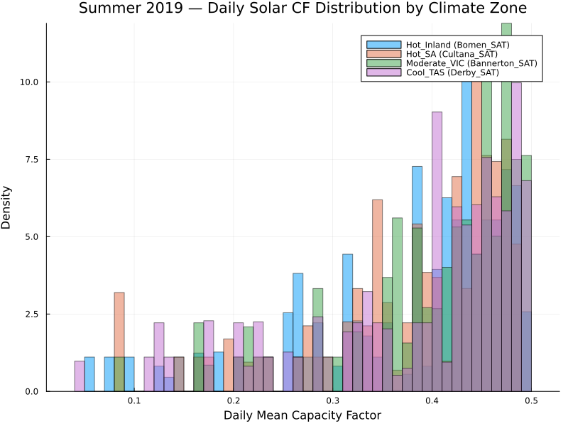
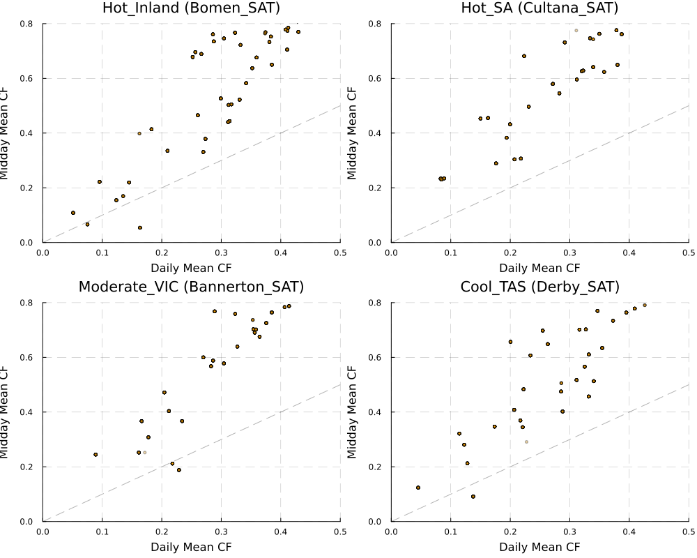

```@meta
EditURL = "../../../literate/eda/05_temperature_analysis.jl"
```

# Assessing temperature-related information and climate-zone variation

Temperature can affect demand, renewable output, thermal ratings, and equipment reliability, but those effects are not automatically represented by a planning dataset. This page loads the ISP assumptions workbook, PISP's own output files, and summer solar traces for selected climate-zone proxies, then builds the tables and figures that describe what temperature-related material is (and is not) present.

No observed temperature time series is loaded, and no causal temperature-response model is estimated. Climate-zone comparisons are descriptive solar-trace comparisons, not direct measurements of thermal derating.

```@raw html
<details class="source-code"><summary>Show source code</summary>
```

````julia
ENV["GKSwstype"] = "100"

using CSV
using DataFrames
using XLSX
using Printf
using Statistics
using Plots

gr();

const REPO_ROOT = normpath(get(
    ENV,
    "PISP_DOCS_REPO_ROOT",
    joinpath(@__DIR__, "..", "..", ".."),
))

include(joinpath(REPO_ROOT, "eda", "eda_support.jl"))
using .EdaSupport

EdaSupport.snapshot_metadata_line(
    REPO_ROOT;
    context = "2024 ISP inputs and assumptions workbook, 2024 ISP PISP output files (out-ref4006-poe10 schedule), and 2019 climate-zone summer solar traces",
)

const SCRIPT_STEM = "05_temperature_analysis"
const TRACES = joinpath("data", "2024", "pisp-downloads", "Traces")  # kept relative: this is the path form recorded in the tables below
const DOWNLOADS = joinpath("data", "2024", "pisp-downloads")  # kept relative, same reason as TRACES

abs_path(relative_path) = joinpath(REPO_ROOT, relative_path)  # resolves a relative path above to an absolute file location for reading

const TEMP_KEYWORDS = ["temp", "heat", "thermal", "derate", "pv", "solar", "wind", "rooftop", "inverter"]
const HH_COLS_SOL = string.(1:48)
const CLIMATE_ZONES = [
    ("Hot_Inland", "Bomen_SAT"),
    ("Hot_SA", "Cultana_SAT"),
    ("Moderate_VIC", "Bannerton_SAT"),
    ("Cool_TAS", "Derby_SAT"),
]

is_keyword_match(name) = any(kw -> occursin(kw, lowercase(name)), TEMP_KEYWORDS)
is_rooftop_match(name) = occursin("rooftop", lowercase(name)) || occursin("rtpv", lowercase(name))
function is_reliability_match(name)
    lname = lowercase(name)
    return occursin("reliability", lname) || occursin("outage", lname) || occursin("generator", lname)
end
````

```@raw html
</details>
```

````
Snapshot: PISP.jl commit 0d31fb4+dirty, generated 2026-07-16 — 2024 ISP inputs and assumptions workbook, 2024 ISP PISP output files (out-ref4006-poe10 schedule), and 2019 climate-zone summer solar traces

````

Trim a raw XLSX matrix down to the bounding box of non-missing cells. A
worksheet's declared dimension (and hence XLSX.jl's `sheet[:]`) can report
extra trailing all-empty rows/columns beyond the sheet's real content, so
this drops trailing rows/columns that hold no value before reporting a
sheet's shape. Verified against this workbook: e.g. "Rooftop PV" has a raw
shape of (64, 35) but a trimmed shape of (62, 33) — rows 63-64 and columns
34-35 are entirely `missing`.

```@raw html
<details class="source-code"><summary>Show source code</summary>
```

````julia
function trim_sheet(matrix)
    nrows, ncols = size(matrix)
    last_row = 0
    for r in 1:nrows
        if any(x -> x !== missing, view(matrix, r, :))
            last_row = r
        end
    end
    last_col = 0
    for c in 1:ncols
        if any(x -> x !== missing, view(matrix, :, c))
            last_col = c
        end
    end
    (last_row == 0 || last_col == 0) && return Matrix{Any}(undef, 0, 0)
    return matrix[1:last_row, 1:last_col]
end
````

```@raw html
</details>
```

A blank header cell gets a placeholder name using its 0-based column index.

```@raw html
<details class="source-code"><summary>Show source code</summary>
```

````julia
function header_names(row)
    return [ismissing(v) ? "Unnamed: $(j - 1)" : string(v) for (j, v) in enumerate(row)]
end

function empty_df(schema::Vector{Pair{Symbol, DataType}})
    return DataFrame([name => Type[] for (name, Type) in schema]...)
end
````

```@raw html
</details>
```

## Step 1 — inventory the ISP assumptions workbook's sheets

The workbook lists all its worksheets; a keyword match identifies material for review, it does not by itself prove that a sheet contains a usable temperature dependency.

```@raw html
<details class="source-code"><summary>Show source code</summary>
```

````julia
workbook_path = joinpath(DOWNLOADS, "2024-isp-inputs-and-assumptions-workbook.xlsx")
println("Workbook exists: ", isfile(abs_path(workbook_path)))

sheet_inventory_rows = NamedTuple[]
relevant_shape_rows = NamedTuple[]
rooftop_rows = NamedTuple[]
reliability_shape_rows = NamedTuple[]

if isfile(abs_path(workbook_path))
    XLSX.openxlsx(abs_path(workbook_path)) do xf
        sheet_names = XLSX.sheetnames(xf)
        println("\n=== ISP Assumptions Workbook Sheets ($(length(sheet_names))) ===")
        for (i, name) in enumerate(sheet_names)
            println(@sprintf("  %2d. %s", i, name))
        end

        println("\n=== Potentially Relevant Sheets ===")
        for name in sheet_names
            is_keyword_match(name) && println("  - ", name)
        end

        for (i, name) in enumerate(sheet_names)
            push!(
                sheet_inventory_rows,
                (
                    sheet_index = i,
                    sheet_name = name,
                    is_keyword_match = is_keyword_match(name) ? 1 : 0,
                    is_rooftop_match = is_rooftop_match(name) ? 1 : 0,
                    is_reliability_match = is_reliability_match(name) ? 1 : 0,
                ),
            )
        end

        relevant_sheets = [name for name in sheet_names if is_keyword_match(name)]

        for sheet in first(relevant_sheets, min(10, length(relevant_sheets)))
            m = trim_sheet(xf[sheet][:])
            n_rows, n_cols = size(m)
            println("\n--- Sheet: $sheet (shape: ($n_rows, $n_cols)) ---")
            push!(relevant_shape_rows, (sheet_name = sheet, n_rows = n_rows, n_cols = n_cols, read_ok = 1))
        end

        for sheet in sheet_names
            if is_rooftop_match(sheet)
                m = trim_sheet(xf[sheet][:])
                total_rows, n_cols = size(m)
                n_rows = max(total_rows - 1, 0)
                cols = total_rows > 0 ? header_names(m[1, :]) : String[]
                println("\n=== Rooftop PV Sheet ($sheet) ===")
                println("Columns: ", cols)
                push!(
                    rooftop_rows,
                    (
                        sheet_name = sheet,
                        n_rows = n_rows,
                        n_cols = n_cols,
                        columns_preview = join(cols[1:min(5, length(cols))], "|"),
                    ),
                )
            end
        end

        for sheet in sheet_names
            if is_reliability_match(sheet)
                m = trim_sheet(xf[sheet][:])
                n_rows, n_cols = size(m)
                println("\n=== Reliability Sheet: $sheet (shape: ($n_rows, $n_cols)) ===")
                push!(reliability_shape_rows, (sheet_name = sheet, n_rows = n_rows, n_cols = n_cols))
            end
        end
    end
end

workbook_sheet_inventory = isempty(sheet_inventory_rows) ?
    empty_df([:sheet_index => Int, :sheet_name => String, :is_keyword_match => Int, :is_rooftop_match => Int, :is_reliability_match => Int]) :
    DataFrame(sheet_inventory_rows)
write_table(workbook_sheet_inventory, SCRIPT_STEM, "workbook_sheet_inventory")
workbook_sheet_inventory
````

```@raw html
</details>
```

```@raw html
<div><div style = "float: left;"><span>76×5 DataFrame</span></div><div style = "clear: both;"></div></div><div class = "data-frame" style = "overflow-x: scroll;"><table class = "data-frame" style = "margin-bottom: 6px;"><thead><tr class = "columnLabelRow"><th class = "stubheadLabel" style = "font-weight: bold; text-align: right;">Row</th><th style = "text-align: left;">sheet_index</th><th style = "text-align: left;">sheet_name</th><th style = "text-align: left;">is_keyword_match</th><th style = "text-align: left;">is_rooftop_match</th><th style = "text-align: left;">is_reliability_match</th></tr><tr class = "columnLabelRow"><th class = "stubheadLabel" style = "font-weight: bold; text-align: right;"></th><th title = "Int64" style = "text-align: left;">Int64</th><th title = "String" style = "text-align: left;">String</th><th title = "Int64" style = "text-align: left;">Int64</th><th title = "Int64" style = "text-align: left;">Int64</th><th title = "Int64" style = "text-align: left;">Int64</th></tr></thead><tbody><tr class = "dataRow"><td class = "rowLabel" style = "font-weight: bold; text-align: right;">1</td><td style = "text-align: right;">1</td><td style = "text-align: left;">Disclaimer</td><td style = "text-align: right;">0</td><td style = "text-align: right;">0</td><td style = "text-align: right;">0</td></tr><tr class = "dataRow"><td class = "rowLabel" style = "font-weight: bold; text-align: right;">2</td><td style = "text-align: right;">2</td><td style = "text-align: left;">Change Log</td><td style = "text-align: right;">0</td><td style = "text-align: right;">0</td><td style = "text-align: right;">0</td></tr><tr class = "dataRow"><td class = "rowLabel" style = "font-weight: bold; text-align: right;">3</td><td style = "text-align: right;">3</td><td style = "text-align: left;">Assumptions Summary</td><td style = "text-align: right;">0</td><td style = "text-align: right;">0</td><td style = "text-align: right;">0</td></tr><tr class = "dataRow"><td class = "rowLabel" style = "font-weight: bold; text-align: right;">4</td><td style = "text-align: right;">4</td><td style = "text-align: left;">Scenarios</td><td style = "text-align: right;">0</td><td style = "text-align: right;">0</td><td style = "text-align: right;">0</td></tr><tr class = "dataRow"><td class = "rowLabel" style = "font-weight: bold; text-align: right;">5</td><td style = "text-align: right;">5</td><td style = "text-align: left;">Renewable Energy Zones</td><td style = "text-align: right;">0</td><td style = "text-align: right;">0</td><td style = "text-align: right;">0</td></tr><tr class = "dataRow"><td class = "rowLabel" style = "font-weight: bold; text-align: right;">6</td><td style = "text-align: right;">6</td><td style = "text-align: left;">New Entrant Data Summary</td><td style = "text-align: right;">0</td><td style = "text-align: right;">0</td><td style = "text-align: right;">0</td></tr><tr class = "dataRow"><td class = "rowLabel" style = "font-weight: bold; text-align: right;">7</td><td style = "text-align: right;">7</td><td style = "text-align: left;">Existing Gen Data Summary</td><td style = "text-align: right;">0</td><td style = "text-align: right;">0</td><td style = "text-align: right;">0</td></tr><tr class = "dataRow"><td class = "rowLabel" style = "font-weight: bold; text-align: right;">8</td><td style = "text-align: right;">8</td><td style = "text-align: left;">Fuel Price Summary</td><td style = "text-align: right;">0</td><td style = "text-align: right;">0</td><td style = "text-align: right;">0</td></tr><tr class = "dataRow"><td class = "rowLabel" style = "font-weight: bold; text-align: right;">9</td><td style = "text-align: right;">9</td><td style = "text-align: left;">Regional Build Costs Summary</td><td style = "text-align: right;">0</td><td style = "text-align: right;">0</td><td style = "text-align: right;">0</td></tr><tr class = "dataRow"><td class = "rowLabel" style = "font-weight: bold; text-align: right;">10</td><td style = "text-align: right;">10</td><td style = "text-align: left;">Energy Policy Targets</td><td style = "text-align: right;">0</td><td style = "text-align: right;">0</td><td style = "text-align: right;">0</td></tr><tr class = "dataRow"><td class = "rowLabel" style = "font-weight: bold; text-align: right;">11</td><td style = "text-align: right;">11</td><td style = "text-align: left;">Carbon Budgets</td><td style = "text-align: right;">0</td><td style = "text-align: right;">0</td><td style = "text-align: right;">0</td></tr><tr class = "dataRow"><td class = "rowLabel" style = "font-weight: bold; text-align: right;">12</td><td style = "text-align: right;">12</td><td style = "text-align: left;">Demand and Energy Forecasts</td><td style = "text-align: right;">0</td><td style = "text-align: right;">0</td><td style = "text-align: right;">0</td></tr><tr class = "dataRow"><td class = "rowLabel" style = "font-weight: bold; text-align: right;">13</td><td style = "text-align: right;">13</td><td style = "text-align: left;">DSP</td><td style = "text-align: right;">0</td><td style = "text-align: right;">0</td><td style = "text-align: right;">0</td></tr><tr class = "dataRow"><td class = "rowLabel" style = "font-weight: bold; text-align: right;">14</td><td style = "text-align: right;">14</td><td style = "text-align: left;">Economic Growth Forecasts</td><td style = "text-align: right;">0</td><td style = "text-align: right;">0</td><td style = "text-align: right;">0</td></tr><tr class = "dataRow"><td class = "rowLabel" style = "font-weight: bold; text-align: right;">15</td><td style = "text-align: right;">15</td><td style = "text-align: left;">Energy Efficiency</td><td style = "text-align: right;">0</td><td style = "text-align: right;">0</td><td style = "text-align: right;">0</td></tr><tr class = "dataRow"><td class = "rowLabel" style = "font-weight: bold; text-align: right;">16</td><td style = "text-align: right;">16</td><td style = "text-align: left;">Rooftop PV</td><td style = "text-align: right;">1</td><td style = "text-align: right;">1</td><td style = "text-align: right;">0</td></tr><tr class = "dataRow"><td class = "rowLabel" style = "font-weight: bold; text-align: right;">17</td><td style = "text-align: right;">17</td><td style = "text-align: left;">PVNSG</td><td style = "text-align: right;">1</td><td style = "text-align: right;">0</td><td style = "text-align: right;">0</td></tr><tr class = "dataRow"><td class = "rowLabel" style = "font-weight: bold; text-align: right;">18</td><td style = "text-align: right;">18</td><td style = "text-align: left;">Battery &amp; Plug-in EVs</td><td style = "text-align: right;">0</td><td style = "text-align: right;">0</td><td style = "text-align: right;">0</td></tr><tr class = "dataRow"><td class = "rowLabel" style = "font-weight: bold; text-align: right;">19</td><td style = "text-align: right;">19</td><td style = "text-align: left;">Fuel cell EVs</td><td style = "text-align: right;">0</td><td style = "text-align: right;">0</td><td style = "text-align: right;">0</td></tr><tr class = "dataRow"><td class = "rowLabel" style = "font-weight: bold; text-align: right;">20</td><td style = "text-align: right;">20</td><td style = "text-align: left;">EV V2G</td><td style = "text-align: right;">0</td><td style = "text-align: right;">0</td><td style = "text-align: right;">0</td></tr><tr class = "dataRow"><td class = "rowLabel" style = "font-weight: bold; text-align: right;">21</td><td style = "text-align: right;">21</td><td style = "text-align: left;">Electrification</td><td style = "text-align: right;">0</td><td style = "text-align: right;">0</td><td style = "text-align: right;">0</td></tr><tr class = "dataRow"><td class = "rowLabel" style = "font-weight: bold; text-align: right;">22</td><td style = "text-align: right;">22</td><td style = "text-align: left;">Embedded energy storages</td><td style = "text-align: right;">0</td><td style = "text-align: right;">0</td><td style = "text-align: right;">0</td></tr><tr class = "dataRow"><td class = "rowLabel" style = "font-weight: bold; text-align: right;">23</td><td style = "text-align: right;">23</td><td style = "text-align: left;">Aggregated energy storages</td><td style = "text-align: right;">0</td><td style = "text-align: right;">0</td><td style = "text-align: right;">0</td></tr><tr class = "dataRow"><td class = "rowLabel" style = "font-weight: bold; text-align: right;">24</td><td style = "text-align: right;">24</td><td style = "text-align: left;">Sub-regional demand allocation</td><td style = "text-align: right;">0</td><td style = "text-align: right;">0</td><td style = "text-align: right;">0</td></tr><tr class = "dataRow"><td class = "rowLabel" style = "font-weight: bold; text-align: right;">25</td><td style = "text-align: right;">25</td><td style = "text-align: left;">Network representation</td><td style = "text-align: right;">0</td><td style = "text-align: right;">0</td><td style = "text-align: right;">0</td></tr><tr class = "dataRow"><td class = "rowLabel" style = "font-weight: bold; text-align: right;">26</td><td style = "text-align: right;">26</td><td style = "text-align: left;">Network losses</td><td style = "text-align: right;">0</td><td style = "text-align: right;">0</td><td style = "text-align: right;">0</td></tr><tr class = "dataRow"><td class = "rowLabel" style = "font-weight: bold; text-align: right;">27</td><td style = "text-align: right;">27</td><td style = "text-align: left;">Network Capability</td><td style = "text-align: right;">0</td><td style = "text-align: right;">0</td><td style = "text-align: right;">0</td></tr><tr class = "dataRow"><td class = "rowLabel" style = "font-weight: bold; text-align: right;">28</td><td style = "text-align: right;">28</td><td style = "text-align: left;">Flow Path Augmentation options</td><td style = "text-align: right;">0</td><td style = "text-align: right;">0</td><td style = "text-align: right;">0</td></tr><tr class = "dataRow"><td class = "rowLabel" style = "font-weight: bold; text-align: right;">29</td><td style = "text-align: right;">29</td><td style = "text-align: left;">Flow Path costs forecast</td><td style = "text-align: right;">0</td><td style = "text-align: right;">0</td><td style = "text-align: right;">0</td></tr><tr class = "dataRow"><td class = "rowLabel" style = "font-weight: bold; text-align: right;">30</td><td style = "text-align: right;">30</td><td style = "text-align: left;">Transmission Reliability</td><td style = "text-align: right;">0</td><td style = "text-align: right;">0</td><td style = "text-align: right;">1</td></tr><tr class = "dataRow"><td class = "rowLabel" style = "font-weight: bold; text-align: right;">31</td><td style = "text-align: right;">31</td><td style = "text-align: left;">Maximum capacity</td><td style = "text-align: right;">0</td><td style = "text-align: right;">0</td><td style = "text-align: right;">0</td></tr><tr class = "dataRow"><td class = "rowLabel" style = "font-weight: bold; text-align: right;">32</td><td style = "text-align: right;">32</td><td style = "text-align: left;">Seasonal ratings</td><td style = "text-align: right;">0</td><td style = "text-align: right;">0</td><td style = "text-align: right;">0</td></tr><tr class = "dataRow"><td class = "rowLabel" style = "font-weight: bold; text-align: right;">33</td><td style = "text-align: right;">33</td><td style = "text-align: left;">Reserves</td><td style = "text-align: right;">0</td><td style = "text-align: right;">0</td><td style = "text-align: right;">0</td></tr><tr class = "dataRow"><td class = "rowLabel" style = "font-weight: bold; text-align: right;">34</td><td style = "text-align: right;">34</td><td style = "text-align: left;">Generation limits</td><td style = "text-align: right;">0</td><td style = "text-align: right;">0</td><td style = "text-align: right;">0</td></tr><tr class = "dataRow"><td class = "rowLabel" style = "font-weight: bold; text-align: right;">35</td><td style = "text-align: right;">35</td><td style = "text-align: left;">Maintenance</td><td style = "text-align: right;">0</td><td style = "text-align: right;">0</td><td style = "text-align: right;">0</td></tr><tr class = "dataRow"><td class = "rowLabel" style = "font-weight: bold; text-align: right;">36</td><td style = "text-align: right;">36</td><td style = "text-align: left;">Generator Reliability Settings</td><td style = "text-align: right;">0</td><td style = "text-align: right;">0</td><td style = "text-align: right;">1</td></tr><tr class = "dataRow"><td class = "rowLabel" style = "font-weight: bold; text-align: right;">37</td><td style = "text-align: right;">37</td><td style = "text-align: left;">Hydro Climate Factor</td><td style = "text-align: right;">0</td><td style = "text-align: right;">0</td><td style = "text-align: right;">0</td></tr><tr class = "dataRow"><td class = "rowLabel" style = "font-weight: bold; text-align: right;">38</td><td style = "text-align: right;">38</td><td style = "text-align: left;">Hydro Scheme Inflows</td><td style = "text-align: right;">0</td><td style = "text-align: right;">0</td><td style = "text-align: right;">0</td></tr><tr class = "dataRow"><td class = "rowLabel" style = "font-weight: bold; text-align: right;">39</td><td style = "text-align: right;">39</td><td style = "text-align: left;">Build costs</td><td style = "text-align: right;">0</td><td style = "text-align: right;">0</td><td style = "text-align: right;">0</td></tr><tr class = "dataRow"><td class = "rowLabel" style = "font-weight: bold; text-align: right;">40</td><td style = "text-align: right;">40</td><td style = "text-align: left;">Locational Cost Factors</td><td style = "text-align: right;">0</td><td style = "text-align: right;">0</td><td style = "text-align: right;">0</td></tr><tr class = "dataRow"><td class = "rowLabel" style = "font-weight: bold; text-align: right;">41</td><td style = "text-align: right;">41</td><td style = "text-align: left;">Lead time and project life</td><td style = "text-align: right;">0</td><td style = "text-align: right;">0</td><td style = "text-align: right;">0</td></tr><tr class = "dataRow"><td class = "rowLabel" style = "font-weight: bold; text-align: right;">42</td><td style = "text-align: right;">42</td><td style = "text-align: left;">Financial parameters</td><td style = "text-align: right;">0</td><td style = "text-align: right;">0</td><td style = "text-align: right;">0</td></tr><tr class = "dataRow"><td class = "rowLabel" style = "font-weight: bold; text-align: right;">43</td><td style = "text-align: right;">43</td><td style = "text-align: left;">Capacity Factors </td><td style = "text-align: right;">0</td><td style = "text-align: right;">0</td><td style = "text-align: right;">0</td></tr><tr class = "dataRow"><td class = "rowLabel" style = "font-weight: bold; text-align: right;">44</td><td style = "text-align: right;">44</td><td style = "text-align: left;">Connection cost</td><td style = "text-align: right;">0</td><td style = "text-align: right;">0</td><td style = "text-align: right;">0</td></tr><tr class = "dataRow"><td class = "rowLabel" style = "font-weight: bold; text-align: right;">45</td><td style = "text-align: right;">45</td><td style = "text-align: left;">Connection Costs forecast</td><td style = "text-align: right;">0</td><td style = "text-align: right;">0</td><td style = "text-align: right;">0</td></tr><tr class = "dataRow"><td class = "rowLabel" style = "font-weight: bold; text-align: right;">46</td><td style = "text-align: right;">46</td><td style = "text-align: left;">REZ Augmentations Options</td><td style = "text-align: right;">0</td><td style = "text-align: right;">0</td><td style = "text-align: right;">0</td></tr><tr class = "dataRow"><td class = "rowLabel" style = "font-weight: bold; text-align: right;">47</td><td style = "text-align: right;">47</td><td style = "text-align: left;">REZ Costs forecast</td><td style = "text-align: right;">0</td><td style = "text-align: right;">0</td><td style = "text-align: right;">0</td></tr><tr class = "dataRow"><td class = "rowLabel" style = "font-weight: bold; text-align: right;">48</td><td style = "text-align: right;">48</td><td style = "text-align: left;">Non-REZ Assumptions</td><td style = "text-align: right;">0</td><td style = "text-align: right;">0</td><td style = "text-align: right;">0</td></tr><tr class = "dataRow"><td class = "rowLabel" style = "font-weight: bold; text-align: right;">49</td><td style = "text-align: right;">49</td><td style = "text-align: left;">Build limits - PHES</td><td style = "text-align: right;">0</td><td style = "text-align: right;">0</td><td style = "text-align: right;">0</td></tr><tr class = "dataRow"><td class = "rowLabel" style = "font-weight: bold; text-align: right;">50</td><td style = "text-align: right;">50</td><td style = "text-align: left;">Build limits</td><td style = "text-align: right;">0</td><td style = "text-align: right;">0</td><td style = "text-align: right;">0</td></tr><tr class = "dataRow"><td class = "rowLabel" style = "font-weight: bold; text-align: right;">51</td><td style = "text-align: right;">51</td><td style = "text-align: left;">Power System Constraints</td><td style = "text-align: right;">0</td><td style = "text-align: right;">0</td><td style = "text-align: right;">0</td></tr><tr class = "dataRow"><td class = "rowLabel" style = "font-weight: bold; text-align: right;">52</td><td style = "text-align: right;">52</td><td style = "text-align: left;">Storage properties</td><td style = "text-align: right;">0</td><td style = "text-align: right;">0</td><td style = "text-align: right;">0</td></tr><tr class = "dataRow"><td class = "rowLabel" style = "font-weight: bold; text-align: right;">53</td><td style = "text-align: right;">53</td><td style = "text-align: left;">Coal and Biomass price</td><td style = "text-align: right;">0</td><td style = "text-align: right;">0</td><td style = "text-align: right;">0</td></tr><tr class = "dataRow"><td class = "rowLabel" style = "font-weight: bold; text-align: right;">54</td><td style = "text-align: right;">54</td><td style = "text-align: left;">Gas, Liquid fuel, H2 price</td><td style = "text-align: right;">0</td><td style = "text-align: right;">0</td><td style = "text-align: right;">0</td></tr><tr class = "dataRow"><td class = "rowLabel" style = "font-weight: bold; text-align: right;">55</td><td style = "text-align: right;">55</td><td style = "text-align: left;">Retirement</td><td style = "text-align: right;">0</td><td style = "text-align: right;">0</td><td style = "text-align: right;">0</td></tr><tr class = "dataRow"><td class = "rowLabel" style = "font-weight: bold; text-align: right;">56</td><td style = "text-align: right;">56</td><td style = "text-align: left;">Heat rates</td><td style = "text-align: right;">1</td><td style = "text-align: right;">0</td><td style = "text-align: right;">0</td></tr><tr class = "dataRow"><td class = "rowLabel" style = "font-weight: bold; text-align: right;">57</td><td style = "text-align: right;">57</td><td style = "text-align: left;">Auxiliary</td><td style = "text-align: right;">0</td><td style = "text-align: right;">0</td><td style = "text-align: right;">0</td></tr><tr class = "dataRow"><td class = "rowLabel" style = "font-weight: bold; text-align: right;">58</td><td style = "text-align: right;">58</td><td style = "text-align: left;">Fixed OPEX</td><td style = "text-align: right;">0</td><td style = "text-align: right;">0</td><td style = "text-align: right;">0</td></tr><tr class = "dataRow"><td class = "rowLabel" style = "font-weight: bold; text-align: right;">59</td><td style = "text-align: right;">59</td><td style = "text-align: left;">Variable OPEX</td><td style = "text-align: right;">0</td><td style = "text-align: right;">0</td><td style = "text-align: right;">0</td></tr><tr class = "dataRow"><td class = "rowLabel" style = "font-weight: bold; text-align: right;">60</td><td style = "text-align: right;">60</td><td style = "text-align: left;">Emissions intensity</td><td style = "text-align: right;">0</td><td style = "text-align: right;">0</td><td style = "text-align: right;">0</td></tr><tr class = "dataRow"><td class = "rowLabel" style = "font-weight: bold; text-align: right;">61</td><td style = "text-align: right;">61</td><td style = "text-align: left;">H2 GPG_emissions reduction </td><td style = "text-align: right;">0</td><td style = "text-align: right;">0</td><td style = "text-align: right;">0</td></tr><tr class = "dataRow"><td class = "rowLabel" style = "font-weight: bold; text-align: right;">62</td><td style = "text-align: right;">62</td><td style = "text-align: left;">GPG emissions reduction - BioM</td><td style = "text-align: right;">0</td><td style = "text-align: right;">0</td><td style = "text-align: right;">0</td></tr><tr class = "dataRow"><td class = "rowLabel" style = "font-weight: bold; text-align: right;">63</td><td style = "text-align: right;">63</td><td style = "text-align: left;">Marginal Loss Factors</td><td style = "text-align: right;">0</td><td style = "text-align: right;">0</td><td style = "text-align: right;">0</td></tr><tr class = "dataRow"><td class = "rowLabel" style = "font-weight: bold; text-align: right;">64</td><td style = "text-align: right;">64</td><td style = "text-align: left;">Affine Heat rates</td><td style = "text-align: right;">1</td><td style = "text-align: right;">0</td><td style = "text-align: right;">0</td></tr><tr class = "dataRow"><td class = "rowLabel" style = "font-weight: bold; text-align: right;">65</td><td style = "text-align: right;">65</td><td style = "text-align: left;">Max Ramp Rates</td><td style = "text-align: right;">0</td><td style = "text-align: right;">0</td><td style = "text-align: right;">0</td></tr><tr class = "dataRow"><td class = "rowLabel" style = "font-weight: bold; text-align: right;">66</td><td style = "text-align: right;">66</td><td style = "text-align: left;">CCGT Unit Max Capacity</td><td style = "text-align: right;">0</td><td style = "text-align: right;">0</td><td style = "text-align: right;">0</td></tr><tr class = "dataRow"><td class = "rowLabel" style = "font-weight: bold; text-align: right;">67</td><td style = "text-align: right;">67</td><td style = "text-align: left;">GPG Min Stable Level</td><td style = "text-align: right;">0</td><td style = "text-align: right;">0</td><td style = "text-align: right;">0</td></tr><tr class = "dataRow"><td class = "rowLabel" style = "font-weight: bold; text-align: right;">68</td><td style = "text-align: right;">68</td><td style = "text-align: left;">Min Up&amp;Down Times</td><td style = "text-align: right;">0</td><td style = "text-align: right;">0</td><td style = "text-align: right;">0</td></tr><tr class = "dataRow"><td class = "rowLabel" style = "font-weight: bold; text-align: right;">69</td><td style = "text-align: right;">69</td><td style = "text-align: left;">Costs Summary - PEM</td><td style = "text-align: right;">0</td><td style = "text-align: right;">0</td><td style = "text-align: right;">0</td></tr><tr class = "dataRow"><td class = "rowLabel" style = "font-weight: bold; text-align: right;">70</td><td style = "text-align: right;">70</td><td style = "text-align: left;">Build Costs - PEM</td><td style = "text-align: right;">0</td><td style = "text-align: right;">0</td><td style = "text-align: right;">0</td></tr><tr class = "dataRow"><td class = "rowLabel" style = "font-weight: bold; text-align: right;">71</td><td style = "text-align: right;">71</td><td style = "text-align: left;">Hydrogen demand - Domestic</td><td style = "text-align: right;">0</td><td style = "text-align: right;">0</td><td style = "text-align: right;">0</td></tr><tr class = "dataRow"><td class = "rowLabel" style = "font-weight: bold; text-align: right;">72</td><td style = "text-align: right;">72</td><td style = "text-align: left;">Hydrogen demand_Export&amp;Steel</td><td style = "text-align: right;">0</td><td style = "text-align: right;">0</td><td style = "text-align: right;">0</td></tr><tr class = "dataRow"><td class = "rowLabel" style = "font-weight: bold; text-align: right;">73</td><td style = "text-align: right;">73</td><td style = "text-align: left;">Hydrogen monthly profiles</td><td style = "text-align: right;">0</td><td style = "text-align: right;">0</td><td style = "text-align: right;">0</td></tr><tr class = "dataRow"><td class = "rowLabel" style = "font-weight: bold; text-align: right;">74</td><td style = "text-align: right;">74</td><td style = "text-align: left;">Hydrogen export ports</td><td style = "text-align: right;">0</td><td style = "text-align: right;">0</td><td style = "text-align: right;">0</td></tr><tr class = "dataRow"><td class = "rowLabel" style = "font-weight: bold; text-align: right;">75</td><td style = "text-align: right;">75</td><td style = "text-align: left;">Other hydrogen assumptions</td><td style = "text-align: right;">0</td><td style = "text-align: right;">0</td><td style = "text-align: right;">0</td></tr><tr class = "dataRow"><td class = "rowLabel" style = "font-weight: bold; text-align: right;">76</td><td style = "text-align: right;">76</td><td style = "text-align: left;">Summary Mapping</td><td style = "text-align: right;">0</td><td style = "text-align: right;">0</td><td style = "text-align: right;">0</td></tr></tbody></table></div>
```

```@raw html
<details class="source-code"><summary>Show source code</summary>
```

````julia
workbook_relevant_sheet_shapes = isempty(relevant_shape_rows) ?
    empty_df([:sheet_name => String, :n_rows => Int, :n_cols => Int, :read_ok => Int]) :
    DataFrame(relevant_shape_rows)
write_table(workbook_relevant_sheet_shapes, SCRIPT_STEM, "workbook_relevant_sheet_shapes")
workbook_relevant_sheet_shapes
````

```@raw html
</details>
```

```@raw html
<div><div style = "float: left;"><span>4×4 DataFrame</span></div><div style = "clear: both;"></div></div><div class = "data-frame" style = "overflow-x: scroll;"><table class = "data-frame" style = "margin-bottom: 6px;"><thead><tr class = "columnLabelRow"><th class = "stubheadLabel" style = "font-weight: bold; text-align: right;">Row</th><th style = "text-align: left;">sheet_name</th><th style = "text-align: left;">n_rows</th><th style = "text-align: left;">n_cols</th><th style = "text-align: left;">read_ok</th></tr><tr class = "columnLabelRow"><th class = "stubheadLabel" style = "font-weight: bold; text-align: right;"></th><th title = "String" style = "text-align: left;">String</th><th title = "Int64" style = "text-align: left;">Int64</th><th title = "Int64" style = "text-align: left;">Int64</th><th title = "Int64" style = "text-align: left;">Int64</th></tr></thead><tbody><tr class = "dataRow"><td class = "rowLabel" style = "font-weight: bold; text-align: right;">1</td><td style = "text-align: left;">Rooftop PV</td><td style = "text-align: right;">62</td><td style = "text-align: right;">33</td><td style = "text-align: right;">1</td></tr><tr class = "dataRow"><td class = "rowLabel" style = "font-weight: bold; text-align: right;">2</td><td style = "text-align: left;">PVNSG</td><td style = "text-align: right;">62</td><td style = "text-align: right;">33</td><td style = "text-align: right;">1</td></tr><tr class = "dataRow"><td class = "rowLabel" style = "font-weight: bold; text-align: right;">3</td><td style = "text-align: left;">Heat rates</td><td style = "text-align: right;">70</td><td style = "text-align: right;">7</td><td style = "text-align: right;">1</td></tr><tr class = "dataRow"><td class = "rowLabel" style = "font-weight: bold; text-align: right;">4</td><td style = "text-align: left;">Affine Heat rates</td><td style = "text-align: right;">194</td><td style = "text-align: right;">11</td><td style = "text-align: right;">1</td></tr></tbody></table></div>
```

```@raw html
<details class="source-code"><summary>Show source code</summary>
```

````julia
workbook_rooftop_sheet_summary = isempty(rooftop_rows) ?
    empty_df([:sheet_name => String, :n_rows => Int, :n_cols => Int, :columns_preview => String]) :
    DataFrame(rooftop_rows)
write_table(workbook_rooftop_sheet_summary, SCRIPT_STEM, "workbook_rooftop_sheet_summary")
workbook_rooftop_sheet_summary
````

```@raw html
</details>
```

```@raw html
<div><div style = "float: left;"><span>1×4 DataFrame</span></div><div style = "clear: both;"></div></div><div class = "data-frame" style = "overflow-x: scroll;"><table class = "data-frame" style = "margin-bottom: 6px;"><thead><tr class = "columnLabelRow"><th class = "stubheadLabel" style = "font-weight: bold; text-align: right;">Row</th><th style = "text-align: left;">sheet_name</th><th style = "text-align: left;">n_rows</th><th style = "text-align: left;">n_cols</th><th style = "text-align: left;">columns_preview</th></tr><tr class = "columnLabelRow"><th class = "stubheadLabel" style = "font-weight: bold; text-align: right;"></th><th title = "String" style = "text-align: left;">String</th><th title = "Int64" style = "text-align: left;">Int64</th><th title = "Int64" style = "text-align: left;">Int64</th><th title = "String" style = "text-align: left;">String</th></tr></thead><tbody><tr class = "dataRow"><td class = "rowLabel" style = "font-weight: bold; text-align: right;">1</td><td style = "text-align: left;">Rooftop PV</td><td style = "text-align: right;">61</td><td style = "text-align: right;">33</td><td style = "text-align: left;">Unnamed: 0|Go to Assumptions Summary|Unnamed: 2|Unnamed: 3|Unnamed: 4</td></tr></tbody></table></div>
```

```@raw html
<details class="source-code"><summary>Show source code</summary>
```

````julia
workbook_reliability_sheet_shapes = isempty(reliability_shape_rows) ?
    empty_df([:sheet_name => String, :n_rows => Int, :n_cols => Int]) :
    DataFrame(reliability_shape_rows)
write_table(workbook_reliability_sheet_shapes, SCRIPT_STEM, "workbook_reliability_sheet_shapes")
workbook_reliability_sheet_shapes
````

```@raw html
</details>
```

```@raw html
<div><div style = "float: left;"><span>2×3 DataFrame</span></div><div style = "clear: both;"></div></div><div class = "data-frame" style = "overflow-x: scroll;"><table class = "data-frame" style = "margin-bottom: 6px;"><thead><tr class = "columnLabelRow"><th class = "stubheadLabel" style = "font-weight: bold; text-align: right;">Row</th><th style = "text-align: left;">sheet_name</th><th style = "text-align: left;">n_rows</th><th style = "text-align: left;">n_cols</th></tr><tr class = "columnLabelRow"><th class = "stubheadLabel" style = "font-weight: bold; text-align: right;"></th><th title = "String" style = "text-align: left;">String</th><th title = "Int64" style = "text-align: left;">Int64</th><th title = "Int64" style = "text-align: left;">Int64</th></tr></thead><tbody><tr class = "dataRow"><td class = "rowLabel" style = "font-weight: bold; text-align: right;">1</td><td style = "text-align: left;">Transmission Reliability</td><td style = "text-align: right;">11</td><td style = "text-align: right;">7</td></tr><tr class = "dataRow"><td class = "rowLabel" style = "font-weight: bold; text-align: right;">2</td><td style = "text-align: left;">Generator Reliability Settings</td><td style = "text-align: right;">64</td><td style = "text-align: right;">14</td></tr></tbody></table></div>
```

## Step 2 — which temperature-related fields reach the PISP output dataset?

The output inventory and generator-column table distinguish information present in the downloaded workbook from fields actually exported by PISP.

```@raw html
<details class="source-code"><summary>Show source code</summary>
```

````julia
csv_dir = joinpath("data", "2024", "pisp-datasets", "out-ref4006-poe10", "csv")
sched_dir = joinpath("data", "2024", "pisp-datasets", "out-ref4006-poe10")

output_inventory_rows = NamedTuple[]
println("\n=== PISP Output Files ===")
if isdir(abs_path(csv_dir))
    for name in sort(filter(n -> endswith(lowercase(n), ".csv"), readdir(abs_path(csv_dir))))
        println("  CSV: ", name)
        push!(output_inventory_rows, (kind = "csv", name = name))
    end
end

if isdir(abs_path(sched_dir))
    for name in sort(filter(n -> startswith(n, "schedule-"), readdir(abs_path(sched_dir))))
        if isdir(abs_path(joinpath(sched_dir, name)))
            println("  Schedule: ", name)
            push!(output_inventory_rows, (kind = "schedule", name = name))
        end
    end
end

pisp_output_inventory = isempty(output_inventory_rows) ? empty_df([:kind => String, :name => String]) : DataFrame(output_inventory_rows)
write_table(pisp_output_inventory, SCRIPT_STEM, "pisp_output_inventory")
pisp_output_inventory
````

```@raw html
</details>
```

```@raw html
<div><div style = "float: left;"><span>6×2 DataFrame</span></div><div style = "clear: both;"></div></div><div class = "data-frame" style = "overflow-x: scroll;"><table class = "data-frame" style = "margin-bottom: 6px;"><thead><tr class = "columnLabelRow"><th class = "stubheadLabel" style = "font-weight: bold; text-align: right;">Row</th><th style = "text-align: left;">kind</th><th style = "text-align: left;">name</th></tr><tr class = "columnLabelRow"><th class = "stubheadLabel" style = "font-weight: bold; text-align: right;"></th><th title = "String" style = "text-align: left;">String</th><th title = "String" style = "text-align: left;">String</th></tr></thead><tbody><tr class = "dataRow"><td class = "rowLabel" style = "font-weight: bold; text-align: right;">1</td><td style = "text-align: left;">csv</td><td style = "text-align: left;">Bus.csv</td></tr><tr class = "dataRow"><td class = "rowLabel" style = "font-weight: bold; text-align: right;">2</td><td style = "text-align: left;">csv</td><td style = "text-align: left;">DER.csv</td></tr><tr class = "dataRow"><td class = "rowLabel" style = "font-weight: bold; text-align: right;">3</td><td style = "text-align: left;">csv</td><td style = "text-align: left;">Demand.csv</td></tr><tr class = "dataRow"><td class = "rowLabel" style = "font-weight: bold; text-align: right;">4</td><td style = "text-align: left;">csv</td><td style = "text-align: left;">ESS.csv</td></tr><tr class = "dataRow"><td class = "rowLabel" style = "font-weight: bold; text-align: right;">5</td><td style = "text-align: left;">csv</td><td style = "text-align: left;">Generator.csv</td></tr><tr class = "dataRow"><td class = "rowLabel" style = "font-weight: bold; text-align: right;">6</td><td style = "text-align: left;">csv</td><td style = "text-align: left;">Line.csv</td></tr></tbody></table></div>
```

```@raw html
<details class="source-code"><summary>Show source code</summary>
```

````julia
gen_path = joinpath(csv_dir, "Generator.csv")
generator_details_rows = NamedTuple[]
generator_temp_row = (generator_table_exists = 0, total_columns = missing, n_temp_columns = missing, temp_columns_list = "")

if isfile(abs_path(gen_path))
    gen_df = CSV.read(abs_path(gen_path), DataFrame)
    println("\n=== Generator Table (shape: $(size(gen_df))) ===")
    println("Columns: ", names(gen_df))

    is_solar(tech) = occursin(r"PV|SOLAR|DISTPV"i, tech)
    is_wind(tech) = occursin(r"WIND"i, tech)
    solar_gens = filter(row -> is_solar(row.tech), gen_df)
    wind_gens = filter(row -> is_wind(row.tech), gen_df)

    println("\nSolar generators: ", nrow(solar_gens))
    println("\nWind generators: ", nrow(wind_gens))

    for (category, subset) in (("solar", solar_gens), ("wind", wind_gens))
        for row in eachrow(subset)
            push!(
                generator_details_rows,
                (
                    category = category,
                    id_gen = row.id_gen,
                    name = row.name,
                    tech = row.tech,
                    forate = row.forate,
                    derate = row.derate,
                    pmin = row.pmin,
                    pmax = row.pmax,
                    n = row.n,
                ),
            )
        end
    end

    temp_cols = [col for col in names(gen_df) if any(kw -> occursin(kw, lowercase(col)), ["temp", "heat", "thermal"])]
    println("\nTemperature-related columns in Generator: ", temp_cols)
    generator_temp_row = (
        generator_table_exists = 1,
        total_columns = ncol(gen_df),
        n_temp_columns = length(temp_cols),
        temp_columns_list = join(temp_cols, "|"),
    )
end

generator_solar_wind_details = isempty(generator_details_rows) ?
    empty_df([:category => String, :id_gen => Int, :name => String, :tech => String, :forate => Float64, :derate => Float64, :pmin => Float64, :pmax => Float64, :n => Int]) :
    DataFrame(generator_details_rows)
write_table(generator_solar_wind_details, SCRIPT_STEM, "generator_solar_wind_details")
generator_solar_wind_details
````

```@raw html
</details>
```

```@raw html
<div><div style = "float: left;"><span>33×9 DataFrame</span></div><div style = "clear: both;"></div></div><div class = "data-frame" style = "overflow-x: scroll;"><table class = "data-frame" style = "margin-bottom: 6px;"><thead><tr class = "columnLabelRow"><th class = "stubheadLabel" style = "font-weight: bold; text-align: right;">Row</th><th style = "text-align: left;">category</th><th style = "text-align: left;">id_gen</th><th style = "text-align: left;">name</th><th style = "text-align: left;">tech</th><th style = "text-align: left;">forate</th><th style = "text-align: left;">derate</th><th style = "text-align: left;">pmin</th><th style = "text-align: left;">pmax</th><th style = "text-align: left;">n</th></tr><tr class = "columnLabelRow"><th class = "stubheadLabel" style = "font-weight: bold; text-align: right;"></th><th title = "String" style = "text-align: left;">String</th><th title = "Int64" style = "text-align: left;">Int64</th><th title = "String" style = "text-align: left;">String</th><th title = "InlineStrings.String31" style = "text-align: left;">String31</th><th title = "Float64" style = "text-align: left;">Float64</th><th title = "Float64" style = "text-align: left;">Float64</th><th title = "Float64" style = "text-align: left;">Float64</th><th title = "Float64" style = "text-align: left;">Float64</th><th title = "Int64" style = "text-align: left;">Int64</th></tr></thead><tbody><tr class = "dataRow"><td class = "rowLabel" style = "font-weight: bold; text-align: right;">1</td><td style = "text-align: left;">solar</td><td style = "text-align: right;">92</td><td style = "text-align: left;">RTPV_NQ</td><td style = "text-align: left;">RoofPV</td><td style = "text-align: right;">1.0</td><td style = "text-align: right;">0.0</td><td style = "text-align: right;">0.0</td><td style = "text-align: right;">100.0</td><td style = "text-align: right;">1</td></tr><tr class = "dataRow"><td class = "rowLabel" style = "font-weight: bold; text-align: right;">2</td><td style = "text-align: left;">solar</td><td style = "text-align: right;">93</td><td style = "text-align: left;">RTPV_CQ</td><td style = "text-align: left;">RoofPV</td><td style = "text-align: right;">1.0</td><td style = "text-align: right;">0.0</td><td style = "text-align: right;">0.0</td><td style = "text-align: right;">100.0</td><td style = "text-align: right;">1</td></tr><tr class = "dataRow"><td class = "rowLabel" style = "font-weight: bold; text-align: right;">3</td><td style = "text-align: left;">solar</td><td style = "text-align: right;">94</td><td style = "text-align: left;">RTPV_GG</td><td style = "text-align: left;">RoofPV</td><td style = "text-align: right;">1.0</td><td style = "text-align: right;">0.0</td><td style = "text-align: right;">0.0</td><td style = "text-align: right;">100.0</td><td style = "text-align: right;">1</td></tr><tr class = "dataRow"><td class = "rowLabel" style = "font-weight: bold; text-align: right;">4</td><td style = "text-align: left;">solar</td><td style = "text-align: right;">95</td><td style = "text-align: left;">RTPV_SQ</td><td style = "text-align: left;">RoofPV</td><td style = "text-align: right;">1.0</td><td style = "text-align: right;">0.0</td><td style = "text-align: right;">0.0</td><td style = "text-align: right;">100.0</td><td style = "text-align: right;">1</td></tr><tr class = "dataRow"><td class = "rowLabel" style = "font-weight: bold; text-align: right;">5</td><td style = "text-align: left;">solar</td><td style = "text-align: right;">96</td><td style = "text-align: left;">RTPV_NNSW</td><td style = "text-align: left;">RoofPV</td><td style = "text-align: right;">1.0</td><td style = "text-align: right;">0.0</td><td style = "text-align: right;">0.0</td><td style = "text-align: right;">100.0</td><td style = "text-align: right;">1</td></tr><tr class = "dataRow"><td class = "rowLabel" style = "font-weight: bold; text-align: right;">6</td><td style = "text-align: left;">solar</td><td style = "text-align: right;">97</td><td style = "text-align: left;">RTPV_CNSW</td><td style = "text-align: left;">RoofPV</td><td style = "text-align: right;">1.0</td><td style = "text-align: right;">0.0</td><td style = "text-align: right;">0.0</td><td style = "text-align: right;">100.0</td><td style = "text-align: right;">1</td></tr><tr class = "dataRow"><td class = "rowLabel" style = "font-weight: bold; text-align: right;">7</td><td style = "text-align: left;">solar</td><td style = "text-align: right;">98</td><td style = "text-align: left;">RTPV_SNW</td><td style = "text-align: left;">RoofPV</td><td style = "text-align: right;">1.0</td><td style = "text-align: right;">0.0</td><td style = "text-align: right;">0.0</td><td style = "text-align: right;">100.0</td><td style = "text-align: right;">1</td></tr><tr class = "dataRow"><td class = "rowLabel" style = "font-weight: bold; text-align: right;">8</td><td style = "text-align: left;">solar</td><td style = "text-align: right;">99</td><td style = "text-align: left;">RTPV_SNSW</td><td style = "text-align: left;">RoofPV</td><td style = "text-align: right;">1.0</td><td style = "text-align: right;">0.0</td><td style = "text-align: right;">0.0</td><td style = "text-align: right;">100.0</td><td style = "text-align: right;">1</td></tr><tr class = "dataRow"><td class = "rowLabel" style = "font-weight: bold; text-align: right;">9</td><td style = "text-align: left;">solar</td><td style = "text-align: right;">100</td><td style = "text-align: left;">RTPV_VIC</td><td style = "text-align: left;">RoofPV</td><td style = "text-align: right;">1.0</td><td style = "text-align: right;">0.0</td><td style = "text-align: right;">0.0</td><td style = "text-align: right;">100.0</td><td style = "text-align: right;">1</td></tr><tr class = "dataRow"><td class = "rowLabel" style = "font-weight: bold; text-align: right;">10</td><td style = "text-align: left;">solar</td><td style = "text-align: right;">101</td><td style = "text-align: left;">RTPV_TAS</td><td style = "text-align: left;">RoofPV</td><td style = "text-align: right;">1.0</td><td style = "text-align: right;">0.0</td><td style = "text-align: right;">0.0</td><td style = "text-align: right;">100.0</td><td style = "text-align: right;">1</td></tr><tr class = "dataRow"><td class = "rowLabel" style = "font-weight: bold; text-align: right;">11</td><td style = "text-align: left;">solar</td><td style = "text-align: right;">102</td><td style = "text-align: left;">RTPV_CSA</td><td style = "text-align: left;">RoofPV</td><td style = "text-align: right;">1.0</td><td style = "text-align: right;">0.0</td><td style = "text-align: right;">0.0</td><td style = "text-align: right;">100.0</td><td style = "text-align: right;">1</td></tr><tr class = "dataRow"><td class = "rowLabel" style = "font-weight: bold; text-align: right;">12</td><td style = "text-align: left;">solar</td><td style = "text-align: right;">103</td><td style = "text-align: left;">RTPV_SESA</td><td style = "text-align: left;">RoofPV</td><td style = "text-align: right;">1.0</td><td style = "text-align: right;">0.0</td><td style = "text-align: right;">0.0</td><td style = "text-align: right;">100.0</td><td style = "text-align: right;">1</td></tr><tr class = "dataRow"><td class = "rowLabel" style = "font-weight: bold; text-align: right;">13</td><td style = "text-align: left;">solar</td><td style = "text-align: right;">104</td><td style = "text-align: left;">LSPV_CQ</td><td style = "text-align: left;">LargePV</td><td style = "text-align: right;">1.0</td><td style = "text-align: right;">0.0</td><td style = "text-align: right;">0.0</td><td style = "text-align: right;">869.9</td><td style = "text-align: right;">1</td></tr><tr class = "dataRow"><td class = "rowLabel" style = "font-weight: bold; text-align: right;">14</td><td style = "text-align: left;">solar</td><td style = "text-align: right;">105</td><td style = "text-align: left;">LSPV_VIC</td><td style = "text-align: left;">LargePV</td><td style = "text-align: right;">1.0</td><td style = "text-align: right;">0.0</td><td style = "text-align: right;">0.0</td><td style = "text-align: right;">1313.68</td><td style = "text-align: right;">1</td></tr><tr class = "dataRow"><td class = "rowLabel" style = "font-weight: bold; text-align: right;">15</td><td style = "text-align: left;">solar</td><td style = "text-align: right;">106</td><td style = "text-align: left;">LSPV_NNSW</td><td style = "text-align: left;">LargePV</td><td style = "text-align: right;">1.0</td><td style = "text-align: right;">0.0</td><td style = "text-align: right;">0.0</td><td style = "text-align: right;">721.0</td><td style = "text-align: right;">1</td></tr><tr class = "dataRow"><td class = "rowLabel" style = "font-weight: bold; text-align: right;">16</td><td style = "text-align: left;">solar</td><td style = "text-align: right;">107</td><td style = "text-align: left;">LSPV_SQ</td><td style = "text-align: left;">LargePV</td><td style = "text-align: right;">1.0</td><td style = "text-align: right;">0.0</td><td style = "text-align: right;">0.0</td><td style = "text-align: right;">2042.66</td><td style = "text-align: right;">1</td></tr><tr class = "dataRow"><td class = "rowLabel" style = "font-weight: bold; text-align: right;">17</td><td style = "text-align: left;">solar</td><td style = "text-align: right;">108</td><td style = "text-align: left;">LSPV_CSA</td><td style = "text-align: left;">LargePV</td><td style = "text-align: right;">1.0</td><td style = "text-align: right;">0.0</td><td style = "text-align: right;">0.0</td><td style = "text-align: right;">648.04</td><td style = "text-align: right;">1</td></tr><tr class = "dataRow"><td class = "rowLabel" style = "font-weight: bold; text-align: right;">18</td><td style = "text-align: left;">solar</td><td style = "text-align: right;">109</td><td style = "text-align: left;">LSPV_NQ</td><td style = "text-align: left;">LargePV</td><td style = "text-align: right;">1.0</td><td style = "text-align: right;">0.0</td><td style = "text-align: right;">0.0</td><td style = "text-align: right;">599.97</td><td style = "text-align: right;">1</td></tr><tr class = "dataRow"><td class = "rowLabel" style = "font-weight: bold; text-align: right;">19</td><td style = "text-align: left;">solar</td><td style = "text-align: right;">110</td><td style = "text-align: left;">LSPV_SNSW</td><td style = "text-align: left;">LargePV</td><td style = "text-align: right;">1.0</td><td style = "text-align: right;">0.0</td><td style = "text-align: right;">0.0</td><td style = "text-align: right;">2345.46</td><td style = "text-align: right;">1</td></tr><tr class = "dataRow"><td class = "rowLabel" style = "font-weight: bold; text-align: right;">20</td><td style = "text-align: left;">solar</td><td style = "text-align: right;">111</td><td style = "text-align: left;">LSPV_CNSW</td><td style = "text-align: left;">LargePV</td><td style = "text-align: right;">1.0</td><td style = "text-align: right;">0.0</td><td style = "text-align: right;">0.0</td><td style = "text-align: right;">2053.78</td><td style = "text-align: right;">1</td></tr><tr class = "dataRow"><td class = "rowLabel" style = "font-weight: bold; text-align: right;">21</td><td style = "text-align: left;">solar</td><td style = "text-align: right;">112</td><td style = "text-align: left;">LSPV_TAS</td><td style = "text-align: left;">LargePV</td><td style = "text-align: right;">1.0</td><td style = "text-align: right;">0.0</td><td style = "text-align: right;">0.0</td><td style = "text-align: right;">0.0</td><td style = "text-align: right;">1</td></tr><tr class = "dataRow"><td class = "rowLabel" style = "font-weight: bold; text-align: right;">22</td><td style = "text-align: left;">solar</td><td style = "text-align: right;">113</td><td style = "text-align: left;">LSPV_SESA</td><td style = "text-align: left;">LargePV</td><td style = "text-align: right;">1.0</td><td style = "text-align: right;">0.0</td><td style = "text-align: right;">0.0</td><td style = "text-align: right;">42.9</td><td style = "text-align: right;">1</td></tr><tr class = "dataRow"><td class = "rowLabel" style = "font-weight: bold; text-align: right;">23</td><td style = "text-align: left;">wind</td><td style = "text-align: right;">114</td><td style = "text-align: left;">WIND_CQ</td><td style = "text-align: left;">Wind</td><td style = "text-align: right;">1.0</td><td style = "text-align: right;">0.0</td><td style = "text-align: right;">0.0</td><td style = "text-align: right;">450.0</td><td style = "text-align: right;">1</td></tr><tr class = "dataRow"><td class = "rowLabel" style = "font-weight: bold; text-align: right;">24</td><td style = "text-align: left;">wind</td><td style = "text-align: right;">115</td><td style = "text-align: left;">WIND_VIC</td><td style = "text-align: left;">Wind</td><td style = "text-align: right;">1.0</td><td style = "text-align: right;">0.0</td><td style = "text-align: right;">0.0</td><td style = "text-align: right;">5362.16</td><td style = "text-align: right;">1</td></tr><tr class = "dataRow"><td class = "rowLabel" style = "font-weight: bold; text-align: right;">25</td><td style = "text-align: left;">wind</td><td style = "text-align: right;">116</td><td style = "text-align: left;">WIND_NNSW</td><td style = "text-align: left;">Wind</td><td style = "text-align: right;">1.0</td><td style = "text-align: right;">0.0</td><td style = "text-align: right;">0.0</td><td style = "text-align: right;">442.48</td><td style = "text-align: right;">1</td></tr><tr class = "dataRow"><td class = "rowLabel" style = "font-weight: bold; text-align: right;">26</td><td style = "text-align: left;">wind</td><td style = "text-align: right;">117</td><td style = "text-align: left;">WIND_SQ</td><td style = "text-align: left;">Wind</td><td style = "text-align: right;">1.0</td><td style = "text-align: right;">0.0</td><td style = "text-align: right;">0.0</td><td style = "text-align: right;">877.88</td><td style = "text-align: right;">1</td></tr><tr class = "dataRow"><td class = "rowLabel" style = "font-weight: bold; text-align: right;">27</td><td style = "text-align: left;">wind</td><td style = "text-align: right;">118</td><td style = "text-align: left;">WIND_CSA</td><td style = "text-align: left;">Wind</td><td style = "text-align: right;">1.0</td><td style = "text-align: right;">0.0</td><td style = "text-align: right;">0.0</td><td style = "text-align: right;">2435.99</td><td style = "text-align: right;">1</td></tr><tr class = "dataRow"><td class = "rowLabel" style = "font-weight: bold; text-align: right;">28</td><td style = "text-align: left;">wind</td><td style = "text-align: right;">119</td><td style = "text-align: left;">WIND_NQ</td><td style = "text-align: left;">Wind</td><td style = "text-align: right;">1.0</td><td style = "text-align: right;">0.0</td><td style = "text-align: right;">0.0</td><td style = "text-align: right;">380.52</td><td style = "text-align: right;">1</td></tr><tr class = "dataRow"><td class = "rowLabel" style = "font-weight: bold; text-align: right;">29</td><td style = "text-align: left;">wind</td><td style = "text-align: right;">120</td><td style = "text-align: left;">WIND_SNSW</td><td style = "text-align: left;">Wind</td><td style = "text-align: right;">1.0</td><td style = "text-align: right;">0.0</td><td style = "text-align: right;">0.0</td><td style = "text-align: right;">1873.85</td><td style = "text-align: right;">1</td></tr><tr class = "dataRow"><td class = "rowLabel" style = "font-weight: bold; text-align: right;">30</td><td style = "text-align: left;">wind</td><td style = "text-align: right;">121</td><td style = "text-align: left;">WIND_CNSW</td><td style = "text-align: left;">Wind</td><td style = "text-align: right;">1.0</td><td style = "text-align: right;">0.0</td><td style = "text-align: right;">0.0</td><td style = "text-align: right;">507.24</td><td style = "text-align: right;">1</td></tr><tr class = "dataRow"><td class = "rowLabel" style = "font-weight: bold; text-align: right;">31</td><td style = "text-align: left;">wind</td><td style = "text-align: right;">122</td><td style = "text-align: left;">WIND_TAS</td><td style = "text-align: left;">Wind</td><td style = "text-align: right;">1.0</td><td style = "text-align: right;">0.0</td><td style = "text-align: right;">0.0</td><td style = "text-align: right;">563.35</td><td style = "text-align: right;">1</td></tr><tr class = "dataRow"><td class = "rowLabel" style = "font-weight: bold; text-align: right;">32</td><td style = "text-align: left;">wind</td><td style = "text-align: right;">123</td><td style = "text-align: left;">WIND_SESA</td><td style = "text-align: left;">Wind</td><td style = "text-align: right;">1.0</td><td style = "text-align: right;">0.0</td><td style = "text-align: right;">0.0</td><td style = "text-align: right;">324.5</td><td style = "text-align: right;">1</td></tr><tr class = "dataRow"><td class = "rowLabel" style = "font-weight: bold; text-align: right;">33</td><td style = "text-align: left;">wind</td><td style = "text-align: right;">124</td><td style = "text-align: left;">WIND_SNW</td><td style = "text-align: left;">Wind</td><td style = "text-align: right;">1.0</td><td style = "text-align: right;">0.0</td><td style = "text-align: right;">0.0</td><td style = "text-align: right;">0.0</td><td style = "text-align: right;">1</td></tr></tbody></table></div>
```

```@raw html
<details class="source-code"><summary>Show source code</summary>
```

````julia
generator_temperature_columns = DataFrame([generator_temp_row])
write_table(generator_temperature_columns, SCRIPT_STEM, "generator_temperature_columns")
generator_temperature_columns
````

```@raw html
</details>
```

```@raw html
<div><div style = "float: left;"><span>1×4 DataFrame</span></div><div style = "clear: both;"></div></div><div class = "data-frame" style = "overflow-x: scroll;"><table class = "data-frame" style = "margin-bottom: 6px;"><thead><tr class = "columnLabelRow"><th class = "stubheadLabel" style = "font-weight: bold; text-align: right;">Row</th><th style = "text-align: left;">generator_table_exists</th><th style = "text-align: left;">total_columns</th><th style = "text-align: left;">n_temp_columns</th><th style = "text-align: left;">temp_columns_list</th></tr><tr class = "columnLabelRow"><th class = "stubheadLabel" style = "font-weight: bold; text-align: right;"></th><th title = "Int64" style = "text-align: left;">Int64</th><th title = "Int64" style = "text-align: left;">Int64</th><th title = "Int64" style = "text-align: left;">Int64</th><th title = "String" style = "text-align: left;">String</th></tr></thead><tbody><tr class = "dataRow"><td class = "rowLabel" style = "font-weight: bold; text-align: right;">1</td><td style = "text-align: right;">1</td><td style = "text-align: right;">48</td><td style = "text-align: right;">0</td><td style = "text-align: left;"></td></tr></tbody></table></div>
```

## Step 3 — how do selected climate-zone solar traces differ in summer?

The zone labels are analytical groupings attached to representative sites. The summary describes summer solar capacity-factor distributions and does not isolate temperature from cloud, season, geography, or trace construction.

```@raw html
<details class="source-code"><summary>Show source code</summary>
```

````julia
zone_summary_rows = NamedTuple[]
println("\n=== Solar CF by Climate Zone (Summer 2019) ===")
for (zone, loc) in CLIMATE_ZONES
    f = joinpath(TRACES, "solar_2019", "$(loc)_RefYear2019.csv")
    isfile(abs_path(f)) || continue
    df = CSV.read(abs_path(f), DataFrame)
    summer = filter(row -> row.Month in (12, 1, 2), df)
    nrow(summer) == 0 && continue

    daily = [mean(row[col] for col in HH_COLS_SOL) for row in eachrow(summer)]
    midday_cols = string.(24:35)
    midday = [mean(row[col] for col in midday_cols) for row in eachrow(summer)]

    mean_daily = mean(daily)
    mean_midday = mean(midday)
    min_midday = minimum(midday)
    p5_midday = quantile(midday, 0.05)

    println(
        @sprintf(
            "  %s (%s): mean_daily=%.3f, mean_midday=%.3f, min_midday=%.3f, p5_midday=%.3f",
            zone, loc, mean_daily, mean_midday, min_midday, p5_midday,
        ),
    )

    push!(
        zone_summary_rows,
        (
            zone = zone,
            location = loc,
            n_summer_days = nrow(summer),
            mean_daily_cf = mean_daily,
            mean_midday_cf = mean_midday,
            min_midday_cf = min_midday,
            p5_midday_cf = p5_midday,
        ),
    )
end

climate_zone_summer_cf_summary = isempty(zone_summary_rows) ?
    empty_df([:zone => String, :location => String, :n_summer_days => Int, :mean_daily_cf => Float64, :mean_midday_cf => Float64, :min_midday_cf => Float64, :p5_midday_cf => Float64]) :
    DataFrame(zone_summary_rows)
write_table(climate_zone_summer_cf_summary, SCRIPT_STEM, "climate_zone_summer_cf_summary")
climate_zone_summer_cf_summary
````

```@raw html
</details>
```

```@raw html
<div><div style = "float: left;"><span>4×7 DataFrame</span></div><div style = "clear: both;"></div></div><div class = "data-frame" style = "overflow-x: scroll;"><table class = "data-frame" style = "margin-bottom: 6px;"><thead><tr class = "columnLabelRow"><th class = "stubheadLabel" style = "font-weight: bold; text-align: right;">Row</th><th style = "text-align: left;">zone</th><th style = "text-align: left;">location</th><th style = "text-align: left;">n_summer_days</th><th style = "text-align: left;">mean_daily_cf</th><th style = "text-align: left;">mean_midday_cf</th><th style = "text-align: left;">min_midday_cf</th><th style = "text-align: left;">p5_midday_cf</th></tr><tr class = "columnLabelRow"><th class = "stubheadLabel" style = "font-weight: bold; text-align: right;"></th><th title = "String" style = "text-align: left;">String</th><th title = "String" style = "text-align: left;">String</th><th title = "Int64" style = "text-align: left;">Int64</th><th title = "Float64" style = "text-align: left;">Float64</th><th title = "Float64" style = "text-align: left;">Float64</th><th title = "Float64" style = "text-align: left;">Float64</th><th title = "Float64" style = "text-align: left;">Float64</th></tr></thead><tbody><tr class = "dataRow"><td class = "rowLabel" style = "font-weight: bold; text-align: right;">1</td><td style = "text-align: left;">Hot_Inland</td><td style = "text-align: left;">Bomen_SAT</td><td style = "text-align: right;">3068</td><td style = "text-align: right;">0.379055</td><td style = "text-align: right;">0.771988</td><td style = "text-align: right;">0.054019</td><td style = "text-align: right;">0.219576</td></tr><tr class = "dataRow"><td class = "rowLabel" style = "font-weight: bold; text-align: right;">2</td><td style = "text-align: left;">Hot_SA</td><td style = "text-align: left;">Cultana_SAT</td><td style = "text-align: right;">3068</td><td style = "text-align: right;">0.37932</td><td style = "text-align: right;">0.847259</td><td style = "text-align: right;">0.230202</td><td style = "text-align: right;">0.303985</td></tr><tr class = "dataRow"><td class = "rowLabel" style = "font-weight: bold; text-align: right;">3</td><td style = "text-align: left;">Moderate_VIC</td><td style = "text-align: left;">Bannerton_SAT</td><td style = "text-align: right;">3068</td><td style = "text-align: right;">0.404872</td><td style = "text-align: right;">0.859197</td><td style = "text-align: right;">0.1881</td><td style = "text-align: right;">0.307869</td></tr><tr class = "dataRow"><td class = "rowLabel" style = "font-weight: bold; text-align: right;">4</td><td style = "text-align: left;">Cool_TAS</td><td style = "text-align: left;">Derby_SAT</td><td style = "text-align: right;">3068</td><td style = "text-align: right;">0.387393</td><td style = "text-align: right;">0.810406</td><td style = "text-align: right;">0.0913513</td><td style = "text-align: right;">0.321397</td></tr></tbody></table></div>
```

## Step 4 — plot the summer daily capacity-factor distribution by climate zone

Each climate zone's summer daily-mean capacity factor is drawn as an overlaid density histogram, showing how much the four representative sites overlap or diverge.

```@raw html
<details class="source-code"><summary>Show source code</summary>
```

````julia
p1 = plot(legend=:topright, title="Summer 2019 — Daily Solar CF Distribution by Climate Zone",
          xlabel="Daily Mean Capacity Factor", ylabel="Density", size=(800, 600))
for (zone, loc) in CLIMATE_ZONES
    f = joinpath(TRACES, "solar_2019", "$(loc)_RefYear2019.csv")
    isfile(abs_path(f)) || continue
    df = CSV.read(abs_path(f), DataFrame)
    summer = filter(row -> row.Month in (12, 1, 2), df)
    nrow(summer) == 0 && continue
    daily = [mean(row[col] for col in HH_COLS_SOL) for row in eachrow(summer)]
    histogram!(p1, daily, bins=50, alpha=0.5, label="$(zone) ($(loc))", normalize=:pdf)
end
savefig(p1, figure_path(SCRIPT_STEM, "05_cf_by_climate_zone.png"))
cp(figure_path(SCRIPT_STEM, "05_cf_by_climate_zone.png"), joinpath(normpath(get(ENV, "PISP_LITERATE_OUTPUT_DIR", @__DIR__)), "05_cf_by_climate_zone.png"); force = true)
````

```@raw html
</details>
```



## Step 5 — plot midday capacity factor against daily mean capacity factor

For each climate zone, midday-mean capacity factor is plotted against daily-mean capacity factor for every summer day, with a 1:1 reference line showing how far midday output sits above the daily average.

```@raw html
<details class="source-code"><summary>Show source code</summary>
```

````julia
p2 = plot(layout=(2,2), figsize=(14,10), size=(1000, 800))
for (idx, (zone, loc)) in enumerate(CLIMATE_ZONES)
    f = joinpath(TRACES, "solar_2019", "$(loc)_RefYear2019.csv")
    isfile(abs_path(f)) || continue
    df = CSV.read(abs_path(f), DataFrame)
    summer = filter(row -> row.Month in (12, 1, 2), df)
    nrow(summer) == 0 && continue
    daily = [mean(row[col] for col in HH_COLS_SOL) for row in eachrow(summer)]
    midday = [mean(row[col] for col in string.(24:35)) for row in eachrow(summer)]
    scatter!(p2[idx], daily, midday, markersize=2, alpha=0.3, color=:orange, label="", legend=false)
    plot!(p2[idx], [0, 0.5], [0, 0.5], label="1:1", color=:black, linestyle=:dash, alpha=0.3, linewidth=1)
    plot!(p2[idx], title="$(zone) ($(loc))", xlabel="Daily Mean CF", ylabel="Midday Mean CF",
          xlim=(0, 0.5), ylim=(0, 0.8), grid=true, gridstyle=:dash, gridalpha=0.3)
end
savefig(p2, figure_path(SCRIPT_STEM, "05_midday_vs_daily_scatter.png"))
cp(figure_path(SCRIPT_STEM, "05_midday_vs_daily_scatter.png"), joinpath(normpath(get(ENV, "PISP_LITERATE_OUTPUT_DIR", @__DIR__)), "05_midday_vs_daily_scatter.png"); force = true)
````

```@raw html
</details>
```



## Summary

- The ISP assumptions workbook and PISP's own output files contain some temperature-, derating-, and reliability-adjacent fields, but a keyword match only flags material for review, it does not establish a usable temperature dependency.
- No observed temperature series is loaded here; the climate-zone comparison is a descriptive summer solar-trace comparison across four representative sites, not a measurement of thermal derating.

